# 服务网格入门

> 原文：<https://medium.datadriveninvestor.com/getting-started-with-service-mesh-4c33760fc6e8?source=collection_archive---------9----------------------->

*本文由彭家豪撰写，他在阿里巴巴的昵称是易信。彭是阿里巴巴淘宝技术部的一名开发工程师，也是云计算的狂热爱好者。*

随着计算机软件技术的快速发展，整个软件体系结构世界正在以许多新的方式发展，这使得开发者能够容易且快速地构建大规模且复杂的应用。最初开发容器技术是为了解决运行时环境中的不一致性问题。然而，在容器技术不断发展的过程中，容器技术开辟了越来越多的新的可能性。

近年来，这种发展导致云计算领域出现了许多新的软件架构模型，包括云本机、函数计算、无服务器和服务网格。这篇文章可以作为服务网格的简明易懂的指南。

# 什么是微服务和服务治理

在微服务存在之前的软件开发过程中，所有模块往往都包含在一个应用程序中，并一起编译、打包、部署和维护。因此，一个应用程序通常会包含太多的模块。而且，如果该应用程序中的某个模块出现故障或需要更新，整个应用程序都必须重新部署。所以，你可能已经猜到了，这种方法让开发人员非常头疼，特别是负责的 [DevOps](https://www.atlassian.com/devops?spm=a2c41.14065545.0.0) 人员。当然，随着应用程序变得越来越复杂，它们涉及越来越多的对象。

 [## 信息图:云之旅|数据驱动的投资者

### 聪明的企业领导者了解利用云的价值。随着数据存储需求的增长，他们已经…

www.datadriveninvestor.com](https://www.datadriveninvestor.com/2018/09/22/infographic-journey-to-the-clouds/) 

开发人员在这个过程中发现了许多缺点。为了解决这些问题，开发人员开始对服务进行分组，并将大型应用程序分成许多具有应用程序间调用关系的小型应用程序。不同的开发人员管理、部署和维护不同的小型应用程序。微服务的概念本质上就是这样产生的。

微服务中的应用程序部署在不同的主机上，这意味着您需要为服务找到一种相互通信和协调的方式。这种情况比单个应用程序复杂得多。同一应用程序中不同方法之间的调用是可寻址和快速的，因为它们在代码编译和打包期间链接在同一个内存中。但是，一个微服务中不同服务之间的调用涉及到不同进程或主机之间的通信，一般需要通过第三方中间件进行调解和协调。

出于这些原因，开发了大量面向微服务的中间件，包括服务治理框架。这些服务治理工具可以管理与它们集成的所有应用程序，从而简化和加速服务之间的通信和协调。

# 什么是容器和容器编排

开发容器技术是为了解决应用程序运行时环境中的不一致性问题，避免应用程序可以在本地或测试环境中正常运行，但在生产环境中崩溃的情况。程序及其依赖项通过容器打包成映像，在安装和执行容器服务的任何主机上启动几个容器。

每个容器都是一个应用程序运行时实例。这些实例通常具有相同的运行时环境和参数。因此，应用程序可以在不同的主机上获得一致的性能。这个事实方便了开发、测试和 O&M，不需要为不同的主机构建相同的运行时环境。

可以将图像推送到图像存储库，方便应用程序迁移和部署。在其他技术中， [Docker](https://www.docker.com/?spm=a2c41.14065545.0.0) 是使用最广泛的容器技术之一。目前，许多应用程序是通过使用容器作为微服务来部署的，并且这些开发的数量只会随着时间的推移而增加。所有这些都极大地激励了软件开发。

随着越来越多的应用程序通过使用容器来部署，单个集群中使用的容器数量也随着时间的推移而显著增加。但是，这使得手动管理和维护这些容器变得困难，因此开发了许多编排工具来管理容器之间的关系。这些工具可以管理容器的整个生命周期。比如 Docker 发布的 [Docker Compose](https://docs.docker.com/compose/?spm=a2c41.14065545.0.0) 和 [Docker Swarm](https://docs.docker.com/engine/swarm/?spm=a2c41.14065545.0.0) 可以批量启动和编排容器。但是，它们只提供简单的功能，不能支持大型容器集群。

为了解决这个问题，谷歌基于其在容器管理方面的丰富经验，开发了 Kubernetes 项目。Kubernetes 专为每周拥有数亿个容器的 Google 集群设计，具有强大的容器编排能力和各种功能。Kubernetes 定义了很多资源。这些资源是以声明方式创建的。资源可以用 JSON 或 YAML 文件来表示。Kubernetes 支持多种容器，其中 Docker 容器是最常见的。Kubernetes 提供了容器访问的相关标准，并可以编排任何符合这些标准的容器。Kubernetes 有很多功能。

在将公司的所有应用程序转换为微服务并使用容器进行部署后，您可以在集群中部署 Kubernetes，使用 Kubernetes 提供的功能管理应用程序容器，并在 Kubernetes 上执行 O&M 操作。作为使用最广泛的容器编排工具，Kubernetes 已经成为容器编排的标准。然而，阿里巴巴集团也开发了自己的容器和容器编排工具。此外，在整个行业中，以 Kubernetes 为代表的集装箱管理方法衍生出了一些新技术。

# 什么是云原生

在过去的两年中，原生云已经成为云计算和 IT 领域的热门话题。[云原生计算基金会](https://www.cncf.io/?spm=a2c41.14065545.0.0) (CNCF)给出了云原生的如下定义:

*云原生技术使组织能够在现代动态环境中构建和运行可扩展的应用，如公共云、私有云以及混合云。容器、服务网格、微服务、不可变基础设施和声明式 API 就是这种方法的例子。*

这些技术可以构建具有良好容错性、易于管理和易于观察的松散耦合系统。与强大的自动化相结合，它们允许工程师以最少的努力频繁地、可预测地做出影响深远的改变。

更简单地说，cloud native 本质上是指以下动作:将应用开发为微服务，通过使用容器进行部署，通过使用类似 Kubernetes 的容器编排工具管理容器集群，将开发和 O&M 导向 Kubernetes。Cloud native 很有用，因为它允许您轻松地构建应用程序，全面地监控它们，并根据流量快速扩展和缩减它们。

如下图所示。

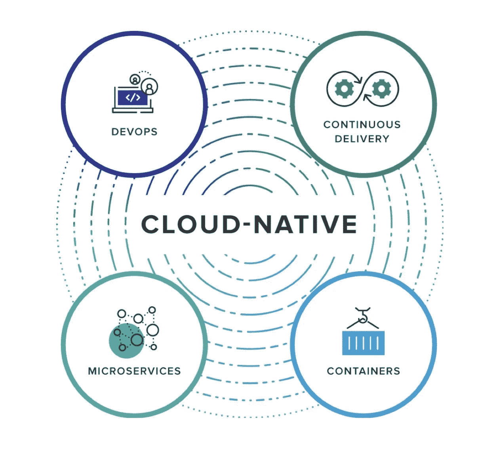

Cloud native 或多或少由四部分组成:微服务、容器、持续集成和交付以及 DevOps。

# 什么是服务网格？

到目前为止，在本文中，我们已经讨论了微服务、容器、容器编排和原生云。所有这些都为本文的主题提供了背景，即服务网格。简而言之，您可以将服务网格广义地定义为云原生微服务治理解决方案。

一旦我们通过使用容器在 Kubernetes 上将应用程序部署为微服务，Service Mesh 就可以为我们和我们的应用程序提供一个新的、透明的服务间调用和治理解决方案。该解决方案可以让我们摆脱对传统微服务治理框架的依赖。

服务网格的工作方式是，它为 pod 中的每个应用程序启动一个 Sidecar，作为应用程序的透明代理。然后，应用程序的所有入站和出站流量都通过它的 Sidecar。服务之间的调用变成了边车之间的调用，服务治理变成了边车治理。

在服务网格中，Sidecar 是透明的，开发人员察觉不到。在过去，我们总是需要引入库和注册服务，这样才能发现和调用应用程序。然而，服务网格中的应用程序对开发人员来说是完全透明的。

这种实现依赖于容器编排工具。在 Kubernetes 上持续集成和交付应用程序的过程中，在应用程序的 pod 启动后，其服务已经在 YAML 文件中向 Kubernetes 注册，并声明了服务之间的关系。Service Mesh 通过与 Kubernetes 通信获取集群中的所有服务信息，并通过 Kubernetes 实现对开发者的透明性。

下图显示了服务网格的基本结构，包括数据平面和控制平面。

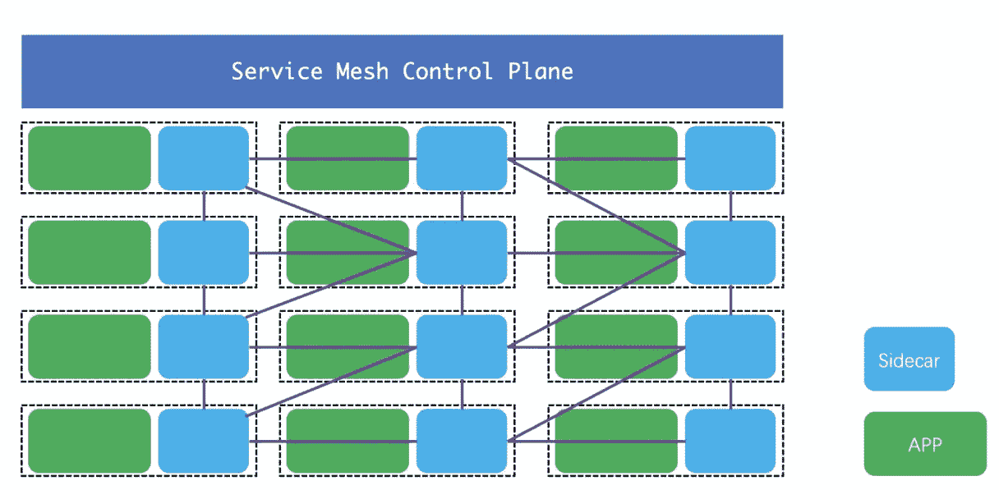

这种模式有很多优点。这种模式中使用的语言不影响服务治理过程。服务网格只关心 pod 或 pod 中的容器实例，而不关心容器中应用程序的实现语言。边车与它管理的集装箱位于同一个箱内。

服务网格可以实现跨语言支持，这是许多传统服务治理框架的一个主要缺点。此外，使用传统的服务治理会引入大量的应用程序依赖性，这会导致依赖性冲突。阿里巴巴集团利用潘多拉隔离应用的依赖性。此外，传统的服务治理很困难，需要开发人员对整个架构有所了解。

在传统的服务治理框架中，很难解决问题。这也导致开发和运营维护之间的界限不清。然而，使用 Service Mesh，开发人员只需交付代码，O&M 人员就可以维护基于 Kubernetes 的整个容器集群。

# 服务网格是如何发展的

服务网格这个术语最早出现在 2016 年，在过去两年里变得非常流行。蚂蚁金服有一套完整的服务网状服务框架，名为 SOFAMesh，阿里巴巴其他很多团队也纷纷效仿。

尽管在过去的几年里发生了很多变化，程序开发正变得越来越简单。例如，在阿里巴巴，由于我们完整的技术系统和强大的技术能力，我们现在可以轻松地建立一个支持每秒大量查询的服务。

那么，让我们来看看应用程序的开发过程。

# 第 1 阶段:主机之间的直接连接

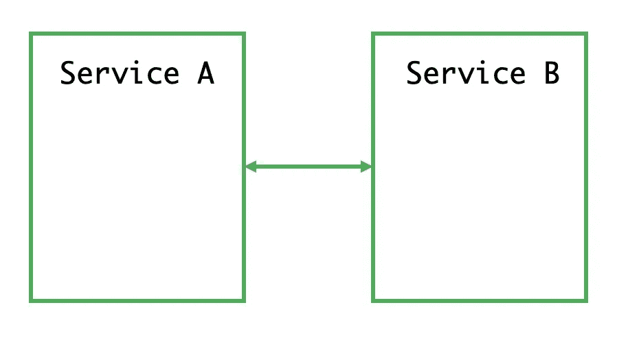

上图显示的是最古老的阶段。在此阶段，两台主机通过网络电缆直接连接，一个应用程序包含所有可能的功能，包括两台主机的连接管理。当时，网络的概念还没有形成。毕竟，只有通过网络电缆直接连接的主机才能相互通信。

# 阶段 2:网络层的出现

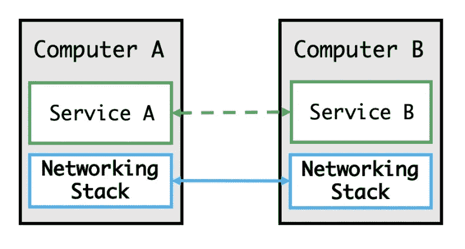

在这个阶段，网络层随着一些新技术的发展而出现。主机可以通过网络与连接到它的所有其它主机通信。

# 阶段 3:应用程序中集成的节流

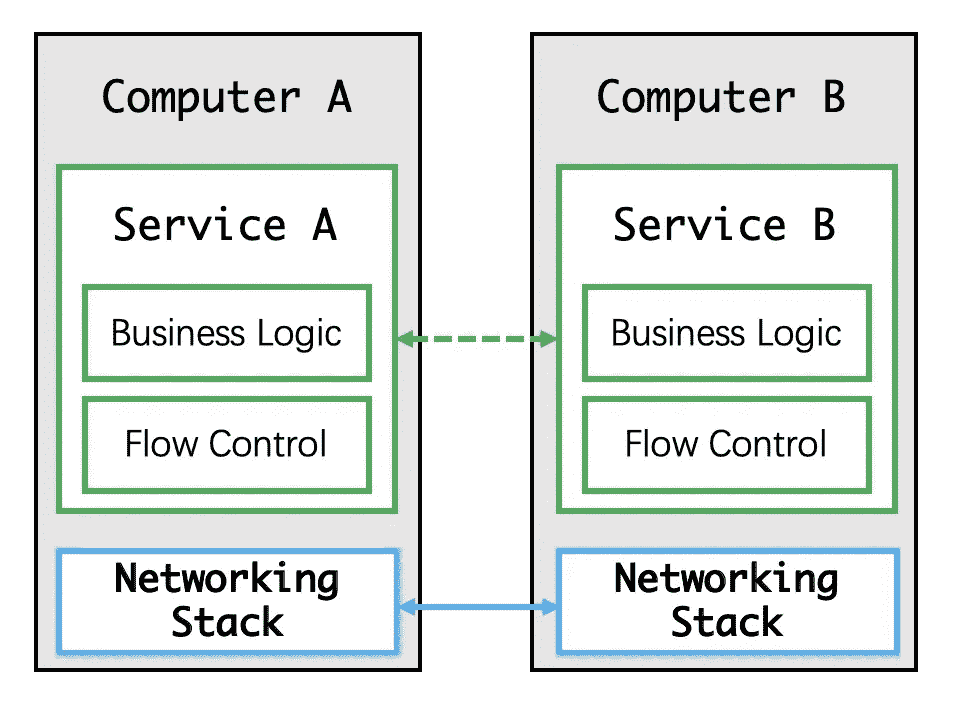

在此阶段，接收流量的能力会因每个应用程序的环境和主机配置而异。例如，当应用程序 A 发送的流量超过应用程序 B 允许的流量时，无法接收的数据包将被丢弃。由于这个问题，需要控制流量。在这个阶段，节流是由应用程序实现的，网络层只接收和传输来自应用程序的数据包。

# 第 4 阶段:由网络层实施节流

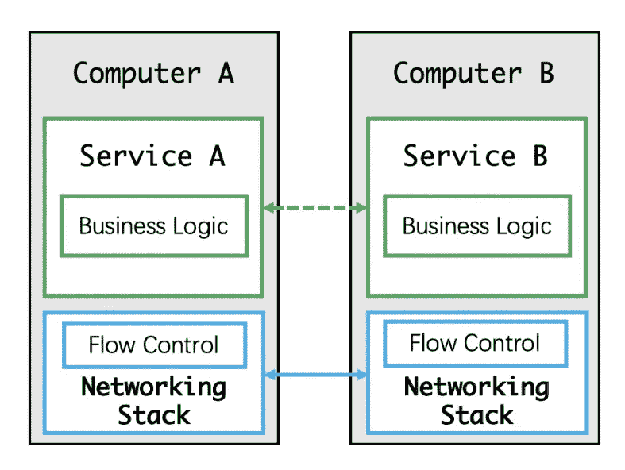

渐渐地，到了这个阶段，我们发现应用中的网络节流可以通过网络层来实现，如上图所示。当然，我们所说的网络层节流是指 TCP 节流，这样做是为了确保可靠的网络通信。

# 阶段 5:服务发现和断路器集成到应用程序中

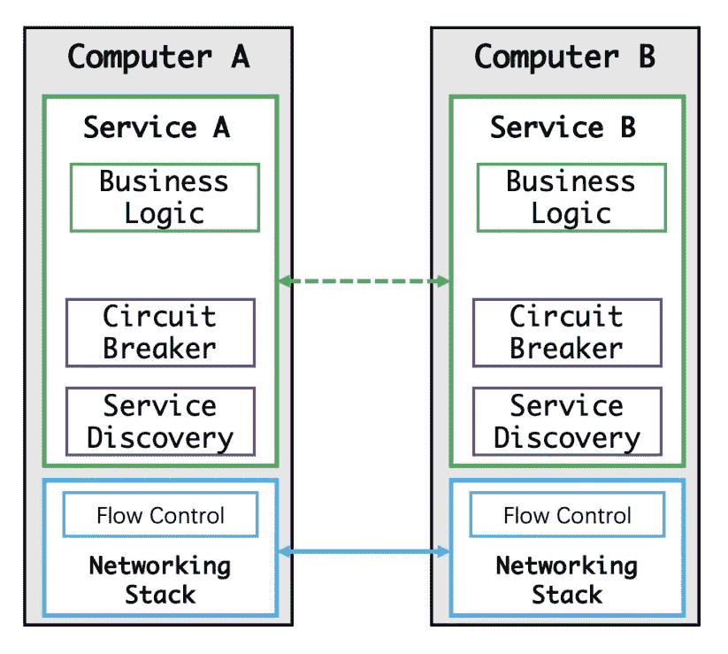

开发人员在这个阶段开始在他们自己的代码模块中实现服务发现和断路器。

# 阶段 6:用于服务发现和断路器的专用软件包和库

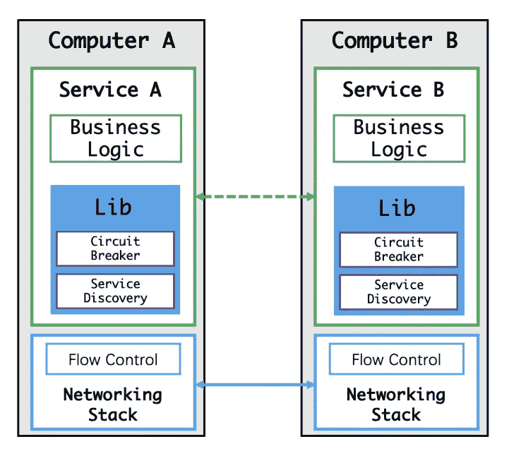

开发人员在这个阶段开始能够通过引用第三方依赖来实现服务发现和断路器。

# 阶段 7:用于服务发现和断路器的专用开源软件

在这个阶段，服务发现和断路器是基于各种中间件实现的。

# 阶段 8:服务网格的出现

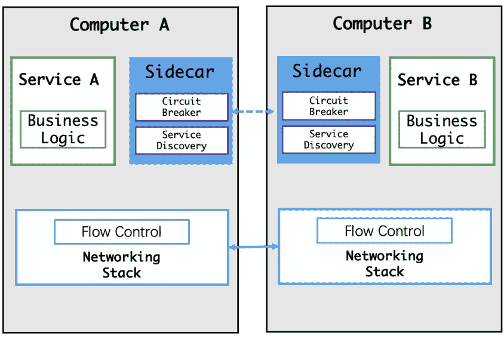

服务网格的出现进一步提高了整个软件生命周期的生产率和效率。

# 市场竞争

直到 2017 年底，服务网格才成为一种流行的解决方案。随着这种流行，微服务市场的竞争开始加剧。但事实是，服务网格早在 2016 年初就出现了。

2016 年 1 月，基础设施工程师威廉·摩根和奥利弗·古尔德在离开 Twitter 后在 GitHub 上发布了 [Linkerd](https://linkerd.io/?spm=a2c41.14065545.0.0) 0.0.7。这标志着业内首个服务网格项目的诞生。基于 Twitter 的 [Finagle](https://twitter.github.io/finagle/?spm=a2c41.14065545.0.0) 开源项目，Linkerd 重用了 Finagle 类库，但实现了通用功能，成为业内第一个服务网格项目。

[特使](https://www.envoyproxy.io/?spm=a2c41.14065545.0.0)是第二个出现的服务网格项目。它与 Linkerd 几乎同时开发，两者都在 2017 年成为 CNCF 项目。

2017 年 5 月 24 日， [Istio](https://istio.io/?spm=a2c41.14065545.0.0) 0.1 发布。Google 和 IBM 高调宣布，社区反响热烈，许多公司表示支持该项目。

Istio 发行后，Linkerd 很快就被 Istio 盖过了。作为业内仅有的两个生产级服务网格实现之一，Linkerd 仍然能够在市场上保持一定的竞争力，当然，直到 Istio 完全成熟。

但随着 Istio 的稳步推进和成熟，Istio 取代 Linkerd 只是时间问题。

与 Linkerd 相反，Envoy 决定从 2016 年开始担任 Istio 的边车。Envoy 不需要很多功能，因为它在数据平面上工作，大部分工作可以在 Istio 的控制平面上完成。这使得支持 Envoy 的团队能够专注于数据平面的详细改进。凭借与 Linkerd 完全不同的性质，Envoy 为自己做了一个利基，使其不再成为主要服务网状市场激烈竞争的对象。

由 Google 和 IBM 联合推出的 Istio 自此一直备受瞩目，并得到了服务网格爱好者的广泛好评。作为下一代服务 Mesh，Istio 相比 Linkerd 优势明显。此外，其项目路线图要求在未来发布各种新功能。我们期待着它。

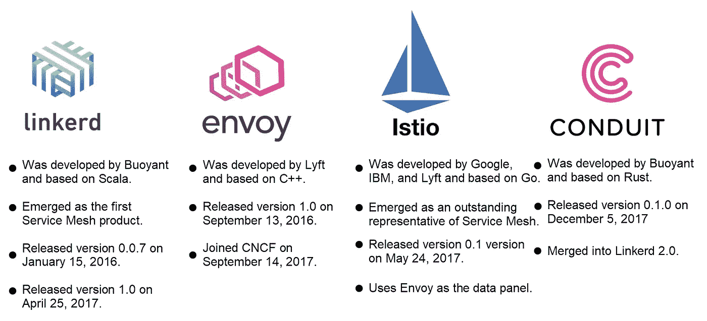

# 什么是 Istio

因此，为了提供更详细的描述，Istio 是最受欢迎的开源服务网格项目。它分为数据平面和控制平面。Istio 实现了云原生微服务治理，还可以实现服务发现、节流和安全监控。Istio 通过在 pod 中启动一个应用程序和一个 Sidecar 来提供透明代理服务。Istio 是一个高度可伸缩的框架，支持 Kubernetes 和其他资源调度器，如 [Mesos](http://mesos.apache.org/?spm=a2c41.14065545.0.0) 。下图显示了 Istio 的架构。

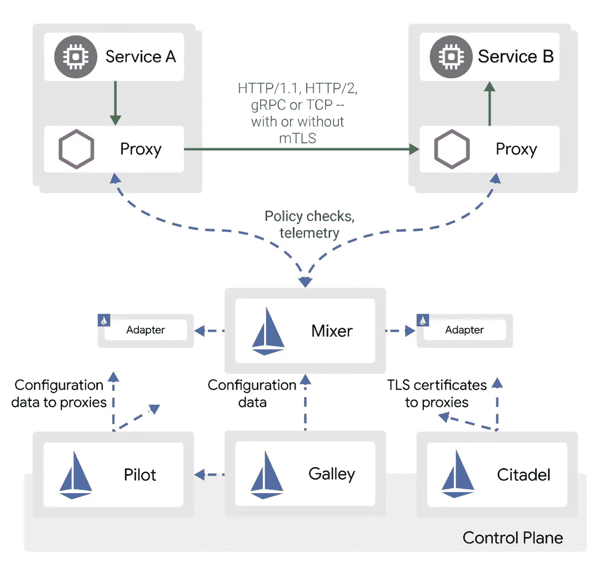

*   Istio 在逻辑上分为数据平面和控制平面，数据平面是图的上半部分，控制平面是图的下半部分。
*   数据平面由一组部署在边车模式下的智能代理(特使)组成。这些代理可以调整和控制微服务和 Mixer 之间的所有网络通信。
*   控制平面管理和配置代理来路由流量。此外，Mixer 配置在控制平面上，用于执行策略和收集遥测数据。
*   Pilot 是架构中的抽象层，它抽象了 Kubernetes 等资源调度器的连接过程，将它们呈现为适配器，并与用户和 Sidecars 进行交互。
*   Galley 验证资源配置。
*   Citadel 生成身份并管理密钥和证书。
*   核心功能包括节流、安全控制、可观察性、多平台支持和定制。

# 什么是混音器

混音器也是 Istio 中的一个可扩展模块。它收集遥感数据，并集成了一些后端即服务(BaaS)模块。Sidecar 不断向 Mixer 报告其流量，然后 Mixer 汇总流量信息并显示出来。Sidecars 可以调用 Mixer 提供的一些 BaaS 功能，例如身份验证、登录和日志记录。Mixer 通过适配器连接到各种 BaaS 模块。

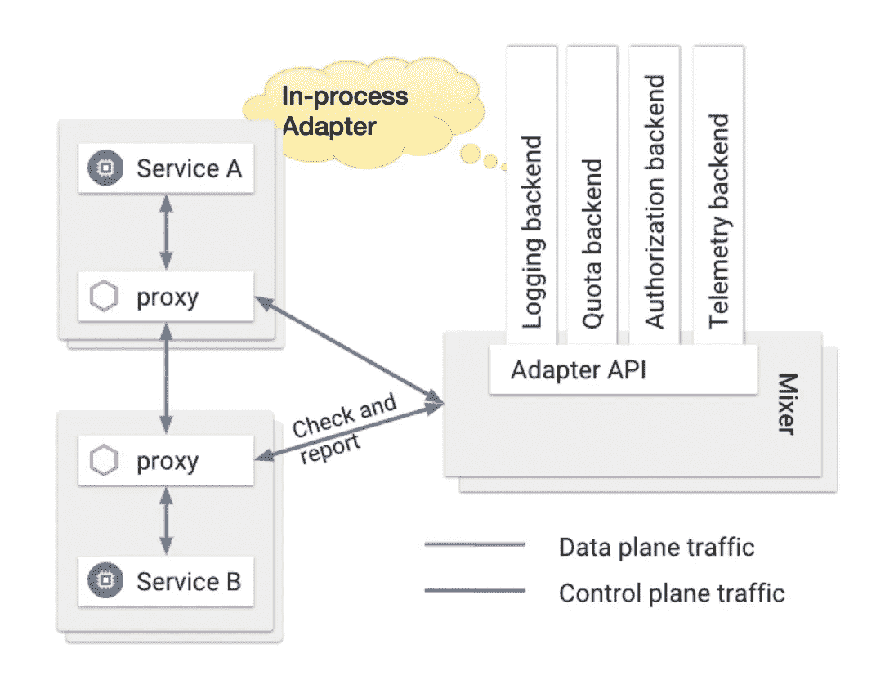

# 什么是进程内适配器

在 Istio 的早期版本中，BaaS 适配器被集成到 Mixer 中。在这种模式下，方法调用在同一个进程中是快速的，但是一个 BaaS 适配器的失败将影响整个混合器。

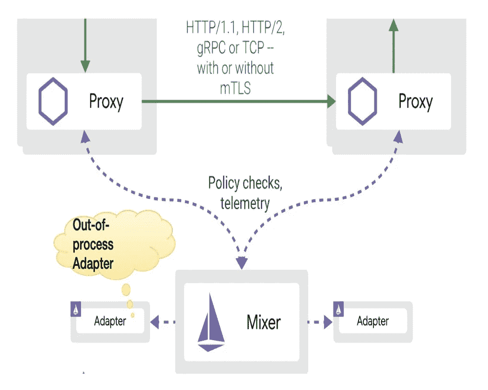

# 什么是进程外适配器

在 Istio 的最新版本中，适配器被移到了 Mixer 之外，这意味着 Mixer 与适配器是分离的。这反过来也意味着任何适配器的故障都不会影响混频器。但是，这样做的一个缺点是适配器和 Mixer 之间的调用是通过远程过程调用(RPC)实现的，这比同一进程中的方法调用要慢得多。因此，性能受到影响。

# 什么是飞行员

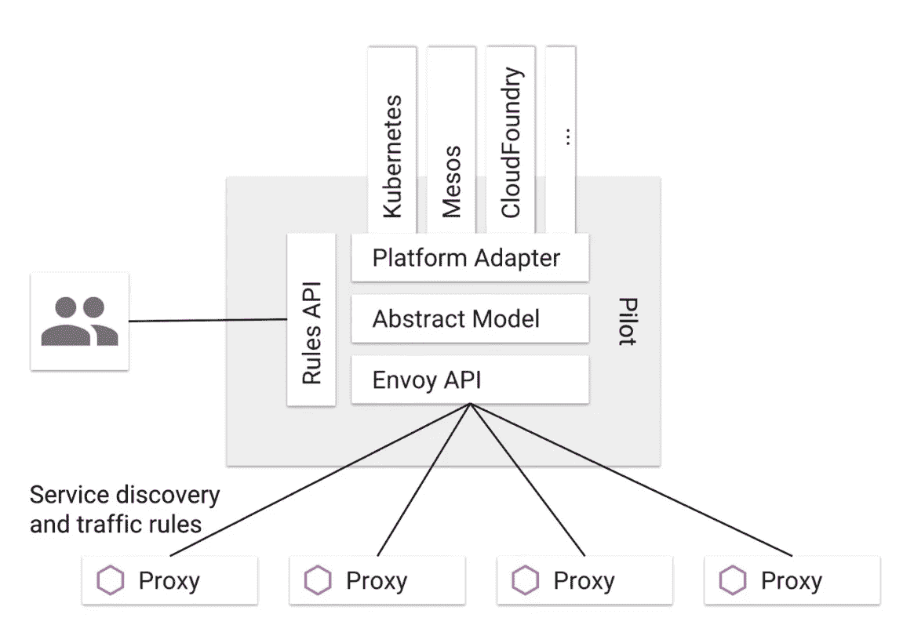

*   特使 API 向特使发送服务发现信息和节流规则。
*   抽象模型由飞行员定义，以分离特定平台细节并提供跨平台支持。
*   平台适配器是这个抽象模型的实现版本，它连接到不同的外部平台，比如 Kubernetes 和 Mesos。
*   提供规则 API 是为了允许外部系统管理 Pilot，包括 Istio CLI (istioctl)和将来可能出现的第三方管理界面。

# 什么是厨房

厨房是 Istio 控制面板的一部分。最初，厨房只验证配置。但是，从 Istio 版本 1.1 开始，Galley 可以作为整个控制平面的配置管理中心，还可以管理和分发配置。Galley 使用网格配置协议与其他组件交换配置。

Istio 有 50 多个自定义资源定义(CRD)。许多人说面向 Kubernetes 的编程类似于面向 YAML 的编程。在早期，Galley 只在运行时验证配置，Istio 控制平面的每个组件都列出或观察相应的配置。然而，不断增加的配置数量和复杂性给 Istio 用户带来了诸多不便:

*   配置不是一起管理的，组件分别进行订阅，并且没有统一的回滚机制。这使得定位配置问题变得困难。
*   此外，配置的可重用性相对较低。例如，在 1.1 版本之前，需要为每个混音器适配器定义一个新的 CRD。
*   配置隔离、访问控制列表(ACL)、一致性、抽象和序列化的性能仍然不能令人满意。

随着 Istio 的进一步发展，Istio CRDs 的数量将继续增加。社区计划加强 Galley，使其成为 Istio 的配置控制层。除了验证配置，Galley 还将提供一个配置管理管道，包括输入、转换、分发和适用于 Istio 控制平面的网格配置协议(MCP)。

# 什么是城堡

现在让我们讨论一下 Istio，Citadel 的安全方面。将服务拆分为微服务带来了各种好处，但也提出了更多的安全要求。毕竟不同功能模块之间的方法调用都改成了微服务之间的远程调用。

*   加密:为了防止信息泄露和防止中间人攻击，服务间的通信需要加密。
*   访问控制:并非所有服务都可以访问。因此，我们需要灵活的访问控制，例如双向传输层安全性(TLS)和细粒度的访问策略。
*   审计:需要审计功能来审计系统中的用户操作。

Citadel 是 Istio 中的安全组件。然而，Citadel 必须与多个其他组件一起工作。

*   Citadel 管理密钥和证书，并将它们交付给负责通信和转发的组件，如 Envoy。
*   Envoy 使用 Citadel 提供的密钥和证书来确保服务间通信的安全性。Localhost 用于应用程序和特使之间，因此不需要加密。
*   Pilot 向 Envoy 发送授权策略和安全命名信息。
*   Mixer 管理授权并执行审计。

Istio 支持以下安全功能:

*   流量加密:Istio 加密服务之间的通信流量。
*   身份认证:Istio 通过内置的身份和凭证管理，包括传输认证和源认证，提供强大的服务间和最终用户身份认证功能。它还支持双向 TLS。
*   授权和认证:Istio 提供基于角色的访问控制(RBAC)以及名称空间、服务和方法级别的访问控制。

# 原始来源:

 [## 服务网格入门

### 阿里巴巴 Clouder 年 2 月 14 日 147 本文由彭家豪撰写，他在阿里巴巴的昵称是易信。彭是一个…

www.alibabacloud.com](https://www.alibabacloud.com/blog/getting-started-with-service-mesh_595829?spm=a2c41.14065545.0.0)