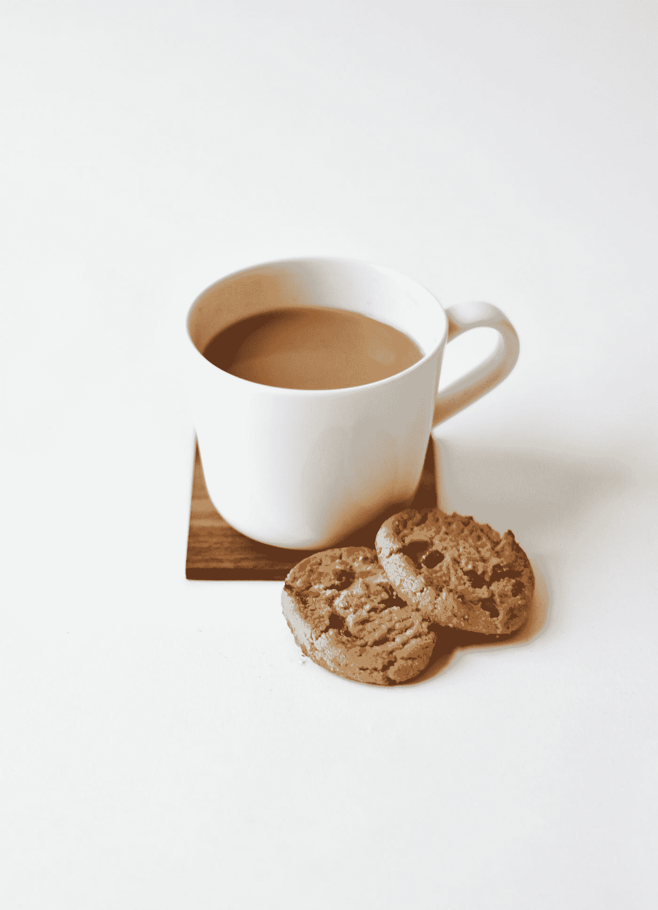

# 独立工作的同时完成工作

> 原文：<https://medium.datadriveninvestor.com/getting-stuff-done-while-working-independently-99e00cfd381a?source=collection_archive---------17----------------------->

独立工作会让人感觉非常自由。你是你自己的老板，你不用对任何人负责。虽然这是一种解放，但**完成工作变得具有挑战性**。

在这篇关于独立工作的**挑战的[文章](https://medium.com/swlh/challenges-of-working-independently-82e8380c8ee4)中，**一个主要挑战是，缺乏外部 **责任**的**如何阻止我们**开始**。虽然五秒规则和五分钟规则减轻了这一点，但工作仍然完成了一半。**

# 良好的开端是成功的一半

希腊哲学家亚里士多德说，良好的开端是成功的一半。虽然这是真的，但是**把事情做完**比开始做更有挑战性。

完成一项任务需要处理不知所措和停滞不前的感觉。

Photo by [Serghei Trofimov](https://unsplash.com/@sergeytrofimov?utm_source=medium&utm_medium=referral) on [Unsplash](https://unsplash.com?utm_source=medium&utm_medium=referral)

# 感到不知所措

被手头的任务压垮是我们遇到的第一个挑战。它通常是由思考任务和计划如何去做引起的。

例如，我最喜欢的饮料是茶，我需要我的茶是完美的。这让泡茶的过程显得势不可挡。

Photo by [Rumman Amin](https://unsplash.com/@rumanamin?utm_source=medium&utm_medium=referral) on [Unsplash](https://unsplash.com?utm_source=medium&utm_medium=referral)

## 不一定要感觉很好

为了让茶变得完美，我觉得有必要完美地遵循每一步，并让这些步骤让人感觉良好。

这是根本的误解所在。不一定要感觉良好。即使是你充满热情的事情也会让你感到不知所措和害怕，这没关系。

Photo by [Aarón Blanco Tejedor](https://unsplash.com/@healing_photographer?utm_source=medium&utm_medium=referral) on [Unsplash](https://unsplash.com?utm_source=medium&utm_medium=referral)

## 你不必第一次就做对

第一次就把事情做好的压力会让你感到无法承受，而事实并非如此。事实上，很少是这样。

Photo by [Daniel Tafjord](https://unsplash.com/@danieltafjord?utm_source=medium&utm_medium=referral) on [Unsplash](https://unsplash.com?utm_source=medium&utm_medium=referral)

除了把事情做好，重点还必须是把事情做好。任务必须在合理的时间内结束，以此作为再次完成的动力。

Photo by [Brad Neathery](https://unsplash.com/@bradneathery?utm_source=medium&utm_medium=referral) on [Unsplash](https://unsplash.com?utm_source=medium&utm_medium=referral)

# 卡住了

即使是最好的开始也常常会有死胡同和路障。这就是**最容易让人放弃**的地方。

Photo by [Aubrey Rose Odom](https://unsplash.com/@octoberroses?utm_source=medium&utm_medium=referral) on [Unsplash](https://unsplash.com?utm_source=medium&utm_medium=referral)

当**独立工作**时，在**没有外部责任**的情况下，更容易放弃任务**而不承担任何后果**。

这个问题可以通过**将任务分成子任务**来缓解。

## 在子任务之间切换

当我们陷入困境时，子任务**允许我们在它们之间切换**。这让我们保持在正确的轨道上，让我们不断进步。

切换允许我们在后台思考。稍后重温有助于摆脱困境。

## 喝茶休息一下

当一个特定的任务开始花费**太多时间**时，喝个茶休息一下会有帮助。切换到一个完全不同的任务也可以提供一个喘息的机会，让我们**以新的能量**重新开始任务。

Photo by [Nathan Dumlao](https://unsplash.com/@nate_dumlao?utm_source=medium&utm_medium=referral) on [Unsplash](https://unsplash.com?utm_source=medium&utm_medium=referral)

只要开关不太频繁，间隔不太长，这种方法就有效。

# 最终结果证明手段是正确的

最后，只要任务按时完成，子任务的数量、休息和切换都无关紧要。

Photo by [Joshua Earle](https://unsplash.com/@joshuaearle?utm_source=medium&utm_medium=referral) on [Unsplash](https://unsplash.com?utm_source=medium&utm_medium=referral)

不管有多痛苦，有多困难，只要完成了就行。

在完成事情的背景下，**最终结果证明了手段**的合理性(前提是手段是道德的)。

 [## 释放结果的简单哲学|数据驱动的投资者

### 这是我们播客中帕迪·布鲁斯南的一段话。帕迪是一个正念和冥想老师，一个…

www.datadriveninvestor.com](https://www.datadriveninvestor.com/2020/03/16/a-simple-philosophy-to-unlock-results/) 

***每一步都不需要完美。随机应变是可以的。***

其实是有必要的。