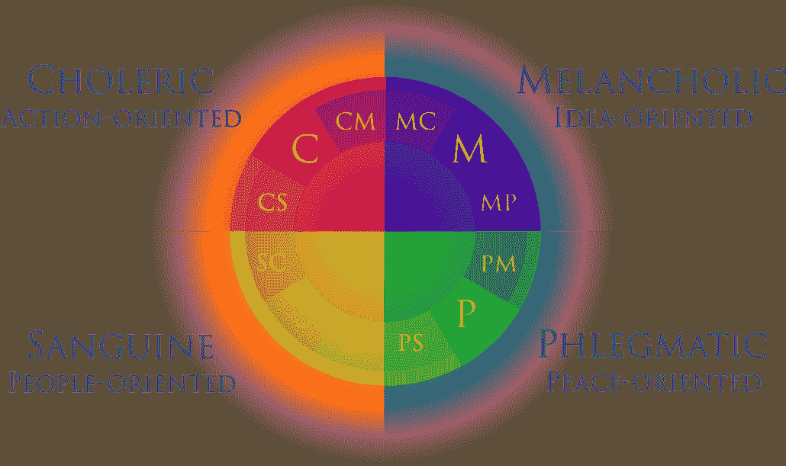

# 了解你自己——这到底意味着什么？

> 原文：<https://medium.datadriveninvestor.com/getting-to-know-yourself-what-does-that-even-mean-533aa23a9018?source=collection_archive---------11----------------------->

在过去两个月的隔离中，父母、老师、朋友、同龄人、导师、教练和媒体都向我重复着同样的话..所以基本上每个人。那句话就是“用这段时间去了解自己”。我听过很多次了，有人可以说‘这次用吧’，我可以自动完成这个句子。然而，尽管听了这么多次，实际上没有人说该怎么做。没有人解释过我应该了解自己什么，我应该努力学习什么。没人说过“了解你自己”是什么意思。因此，本着尝试新事物的精神，我决定学习我需要学习的东西。这一切都从生命体征开始。

Lost in thought

# **生命体征**

缩写 VITALS 代表你应该了解自己的 6 件重要事情。v 是价值观，I 是兴趣，T 是气质，A 是活动，L 是人生使命/目标，S 是长处。了解所有这些事情将会大大增加你对自己的了解，并会帮助你应对生活中的诸多挑战。他们会帮助你认识到你需要什么，什么会让你快乐。

## **值**

首先是你的价值观。这些东西，比如健康、创造力或金钱，对你来说非常重要。它们有助于指导你的行动，并激励你采取措施实现它们。例如，如果你的价值观之一是金钱，那么你就会更有动力去努力工作。如果你的价值观是健康，你可能会更有动力吃得健康，多出去走走，你会采取一些行动来改善你的健康，比如每天跑步。你的价值观对于决定你想要什么和需要什么来获得快乐和成功非常重要。

 [## 良好的生活是习惯的形成|数据驱动的投资者

### 过度思考是过度紧张。仅仅几个简单的习惯就会在一天中产生巨大的影响。那是…

www.datadriveninvestor.com](https://www.datadriveninvestor.com/2020/01/17/a-good-life-is-habit-forming/) 

## **利益**

接下来是你的兴趣。这些是你喜欢做的事情，或者是你非常热爱的事情。对许多人来说，他们的兴趣是绘画、编码或阅读。世界上很多最伟大的人都对学习和创新感兴趣。你的兴趣指导你在空闲时间做什么，并能帮助你选择职业。当你做你感兴趣的事情时，你通常会感到快乐或更加清醒。

The four temperaments

## **气质**

你的气质就是你的天性和内心喜好。气质有四种类型；胆汁质、多血质、忧郁质和粘液质。胆汁质的人更注重行动和外向，这通常使他们成为优秀的领导者。乐观的人也外向，但更以人为本，这意味着他们有很多关系和朋友。忧郁气质的人是观念导向型的，一般都比较内向。最后，粘液质的人以平和为导向，性格内向，使他们更冷静，更有控制力。了解你的气质可以帮助你意识到你是如何做决定的，可以帮助你选择在什么情况下你会感觉良好。

## **活动**

活动包括你做的每一件事和时间。例如，你是一个早上 6 点就能精神焕发、准备好出发的人吗？还是你觉得晚上 11 点做事更好？你能控制你所做的事情吗？或者你会被卷进社交媒体几个小时？了解你的活动和生物钟可以帮助你更有效率，更好地控制你的时间。如果你意识到你的活动包括每天花 3 个小时无所事事或无节制地看电视，那么你可以开始停止这些习惯。

## **人生使命/目标**

你的人生使命和目标就像它们听起来的那样，是你想在一生中完成的事情。它们是你最想要的东西，你会愿意花时间和金钱去实现它们。有些人的人生目标是创建一家公司，而有些人的目标是去某个地方旅行。不管是什么，你的人生使命/目标通常与你的价值观一致，所以如果你重视金钱，你的人生使命可能是成为百万富翁。拥有/实现你的人生使命和目标将有助于指导你的生活，让你做出让你感到成功和满足的决定。

## **强项**

最后，你的优势是你擅长的事情。它不仅包括能力、技能和天赋，还包括诚实、忠诚或责任等性格优势。了解自己的优势有助于你的自尊和自信，并帮助你选择在什么情况下你会茁壮成长。他们也会给你更多的指导，告诉你适合什么样的职业。另一方面，他们会让你看到自己的弱点，这样你就可以克服它们，努力提高自己。

Thinking

# **为什么你应该了解自己**

这里有一个终极问题:你为什么要在乎？认识你自己有什么用？嗯，生命体征的每个部分都将在生活的不同方面帮助你，虽然有些部分在章节中有所概述，但有 4 个一般原因适用于每个部分。

其中一个原因就是你的幸福。了解你自己和你的需求会让你更快乐，因为你会知道什么时候你感觉良好，你可以努力去做让你快乐的事情。你也能够表达自己，让别人知道你是谁，这将增加你的快乐。

其次是自我控制和激励。每个人偶尔都会成为拖延症的牺牲品，把事情拖到“以后”(我们都知道“以后”意味着永远不会)，但没有人希望这种事情发生。没有人喜欢他们事后的感觉，以及他们为了按时完成工作而经历的恐慌。了解自己，了解自己喜欢什么，可以帮助你遏制自己的懒惰和拖延，给你更多的动力和控制力去完成事情。

理解你的情绪、感受和想法会让你对他人更加感同身受。如果你足够了解自己，你可以想象在不同的情况下你会有什么样的感受，从而帮助你意识到别人的感受。这将有助于你向他们提供支持，因为如果你处于这种情况，他们可能和你想要的一样。有更多的同理心会帮助你与他人建立联系，拥有更多的朋友。

最后，做决定会容易得多。意识到你想要什么，什么会让你快乐，可以让你有能力做出决定，选择最适合你的。如果你知道你的价值观，你喜欢什么，以及什么能帮助你实现目标，像关于你的职业和生活伴侣的重大决定，甚至像晚餐吃什么这样的简单决定都会变得更容易。

Learning about yourself

# **行动项目**

既然你已经阅读了所有关于你应该知道什么和为什么知道的内容，是时候采取行动并真正去做了！重要的是要注意，你不可能一次就了解自己的一切。你在不断地成长和改变，所以这将是一个不断自我发现的过程，但是现在你可以采取一些问题和行动来开始这个过程！

首先，至少留出 10 分钟来做这件事。如果你试图让它适应你繁忙的时间表，它不会有什么帮助。实际上，腾出时间来了解你自己。一旦你有时间，拿起纸和笔，找个安静的地方坐下来。写下你所有的答案，这样你就可以回去阅读你的想法。能够看到自己的答案会帮助你更好地了解自己。此外，对于一些问题，你可能有不止一个答案，所以把所有的都写下来。没有其他人必须看到这篇论文，所以只管去做吧！

*   你优先考虑的事情是什么？
*   你希望每天都做的事情是什么？
*   除了看电视或使用社交媒体，你在空闲时间还做些什么？
*   你喜欢和别人在一起还是独自一人？
*   当你有一个想法或想法时，你是立即付诸行动，还是花时间仔细考虑并与他人交谈？
*   你什么时候效率最高？
*   什么事情总是让你感到快乐和满足/富有成效？
*   有没有你一直想要的东西？(家庭，金钱等。)
*   你擅长什么？
*   有没有其他人告诉过你你擅长某件事，或者因为他们知道你擅长而请你帮助他们？那是什么？
*   你最快乐的回忆是什么，为什么你认为它们是最快乐的？

恭喜你完成了所有的问题！这些是专门针对生命体征的 6 个部分选择的，所以希望你能看到两者之间的相关性。提醒一下，这绝对不是一个完整的指南，你可以一直学习，但我希望你现在能更好地了解自己！

# **关键要点**

*   你的价值观、兴趣、气质、活动、人生目标和优势在成就你的过程中非常重要。
*   了解自己的所有这些事情可以帮助你更快乐，并与他人有更深的联系。
*   他们也可以帮助你控制和激励，帮助你做决定。
*   你不可能在一天之内了解自己，因为这是一个持续的过程。
*   开始了解自己永远都不晚！

非常感谢您阅读我的文章！我希望你喜欢它，现在明白为什么人们一直告诉你要了解自己。；)如果你有什么问题，评论，或者只是想打个招呼，就在下面留言评论吧！你也可以在 [LinkedIn](https://www.linkedin.com/in/paige-gugeler-0273a6175/) 上和我联系，或者多看一些我的文章，比如[这一篇](https://medium.com/datadriveninvestor/the-minds-eye-825dfc2e5268)在你心目中。谢谢！