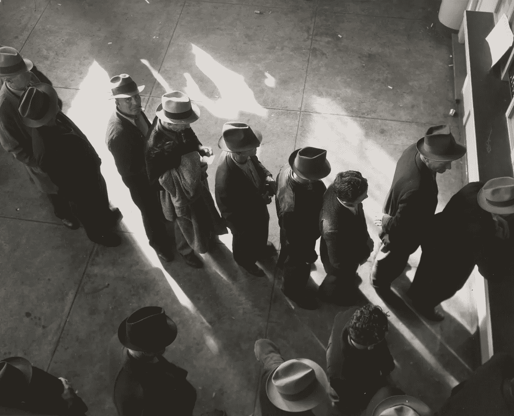
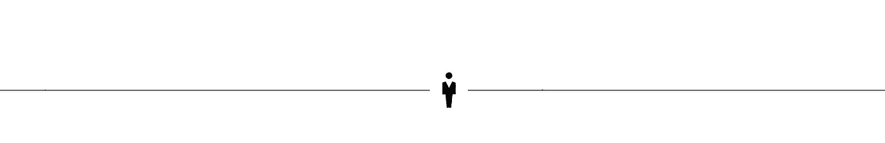
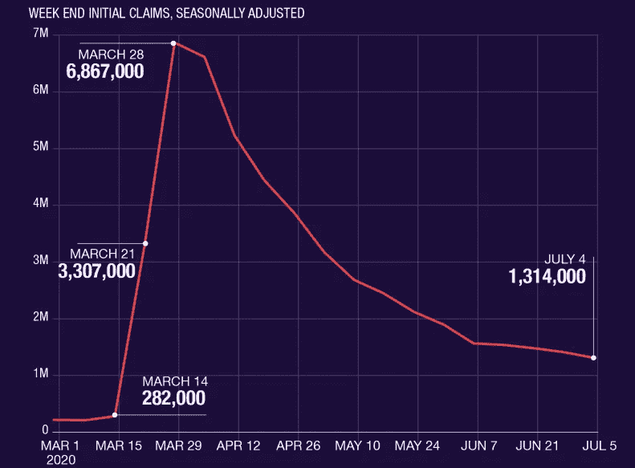
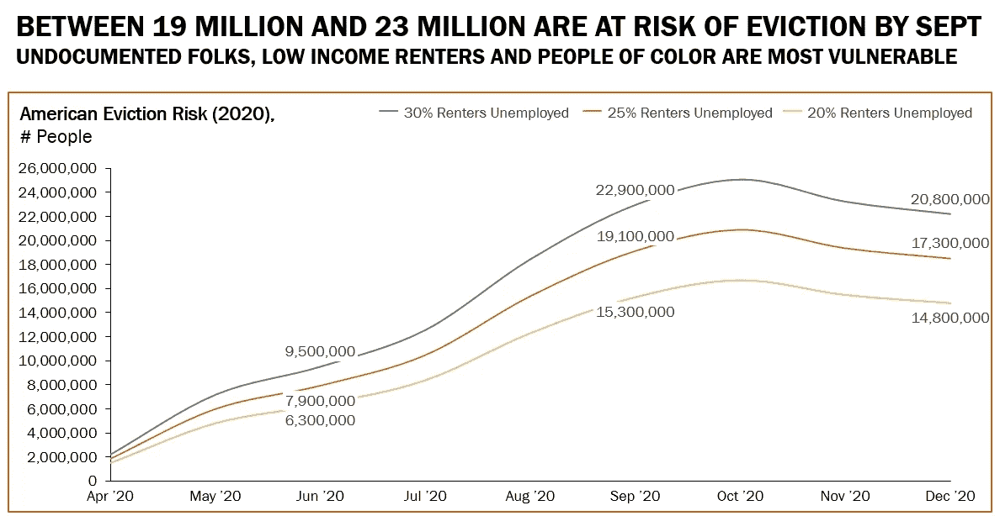

# 各位，准备好，情况会变得更糟

> 原文：<https://medium.datadriveninvestor.com/gird-your-loins-people-its-about-to-get-a-lot-worse-ae1fc054462?source=collection_archive---------19----------------------->

## 《关怀法案》福利的终结和迫在眉睫的驱逐浪潮会让你怀念大萧条时期的平静日子

Photo by [The New York Public Library](https://unsplash.com/@nypl?utm_source=unsplash&utm_medium=referral&utm_content=creditCopyText) on [Unsplash](https://unsplash.com/@msweems/likes?utm_source=unsplash&utm_medium=referral&utm_content=creditCopyText)

和大多数南方黑人妇女一样，我妈妈对几乎每种情况都有自己的说法。当她想阻止我做一些不明智的事情时，她总是用一句俏皮话来总结她的决定。我非常尊敬(也非常害怕)她，所以不想去争论那些朴实的语言的正确性。

当我发现自己使用相同的习语时，我得到了一丝满足，我怀疑当她把这些表达发给我时，她是这样想的。但在她所有的母亲话语中，有一句我很少用:

> "有时发生在你身上的最糟糕的事情对你来说是最好的事情。"

我能回想起从她嘴里说出的那些话令人心碎的结局——不可逆转。一旦我听到他们，我就知道谈话结束了。

如果你有幸在家工作，相信经济正在好转是情有可原的。你仍然有工作。你勤勤恳恳地戴上你的面具，练习几次离家后的社交距离。除了在家教育孩子的不便，你过得还不错。

或者也许你认为整件事是一个骗局。面具生意是自由主义者控制你的阴谋。你生气是因为没有体育赛事，你也不能理个像样的发型。你在疫情冲浪而没有生病。

 [## 回购市场注入对经济有何影响——跟踪面包屑|数据驱动的投资者

### 我们发现人们倾向于忘记(包括我们自己)重要的因素、事件或定义…

www.datadriveninvestor.com](https://www.datadriveninvestor.com/2020/05/13/what-repo-market-injections-say-about-the-economy-follow-the-breadcrumbs/) 

不管怎样，谁能责怪你认为事情已经有所改善呢？毕竟，股市已经反弹。尽管失业率为 11%，但我们上个月增加了近 500 万个工作岗位——创纪录！事情朝着正确的方向发展，对吗？所以你打算等待。等待你被许诺的 V 型复苏。

我不想打断你，但是你度过社会动荡、疫情和萧条(是的，我说的是萧条)这三重难关的策略让我想起了[迈克·泰森说过的话](https://mlb.nbcsports.com/2019/03/28/opening-day-2019-everybody-has-a-plan-until-they-get-punched-in-the-mouth/):

> "每个人都有一个计划，直到他们被打了一拳."

女士们先生们，我们已经被打了一拳，还会再被打一拳。

## “最糟糕的事情”即将发生

首先，这里有一个好消息:随着《关爱法案》的出台，失业救济金增加了 600 美元，让数百万失业的美国人避免了经济灾难的冲击。此外，抵押贷款和租金的延期偿付让人们留在了自己的房子里。与《关爱法案》相关的政府援助阻止了因失业率历史性飙升而预期的贫困率上升。

坏消息呢？我从哪里开始？虽然每周 600 美元的收入让人们得以生存，但大多数州的驱逐禁令在上个月已经结束。现在，租房者面临几个月的未付账单。更糟糕的是，对大多数人来说，失业救济金的增加不是在 7 月 31 日结束，而是在月底之前的**——7 月 25 日。**

** [## 冠状病毒刺激对谁帮助最大？

### 虽然民主党人努力让冠状病毒刺激法案为普通美国人做更多的事情，但共和党人优先考虑…

medium.com](https://medium.com/@marlonweems/who-does-the-coronavirus-stimulus-help-most-b2c55f9ca866) 

自 3 月份以来，将近 5000 万人申请失业。截至 6 月 20 日的一周，通过州和联邦项目领取失业救济金的人数接近 3300 万。有一件事是肯定的:失业水平比大萧条时期还要糟糕几个数量级。

这些数字令人震惊:2008 年 1 月大衰退时，每有一个人申请失业，今年 3 月就有将近 7 人(6.7 人)申请失业。到封锁的第三周，有超过 330 万人申请失业救济——是大衰退时期 40.2 万人的八倍。

[Source: Department of Labor, Yahoo Finance](https://finance.yahoo.com/news/coronavirus-covid-weekly-initial-jobless-claims-july-4-173348831.html)

除了失业之外，多达 540 万的新失业者失去了医疗保险。根据一项新的研究，这是美国历史上最大的医疗保险损失。

除了坏消息之外，还有潜在的驱逐潮。如果不延长 600 美元的失业救济金，再加上 CARES 法案中 120 天的租金延期，1.1 亿租房人口中的 1900 万至 2300 万人将面临 9 月底被驱逐的风险。与新冠肺炎一样，少数民族和穷人是最脆弱的群体。

[Source: The Aspen Institute](https://www.aspeninstitute.org/blog-posts/20-million-renters-are-at-risk-of-eviction/)

尽管事情很糟糕，但也可能有不正常的一面。疫情揭露了我们国家的资本主义中的系统性种族主义和不平等。失业率的突然大幅上升暴露了与就业相关的医疗保健的缺陷，为更进步的政策提供了理由。

我不禁想到，和许多事情一样，妈妈是对的。也许发生在我们身上的最坏的事情对我们来说是最好的事情。

*注册我的时事通讯《熟练工》,涵盖政治、种族和经济的交叉领域。*

 [## 熟练工。

### 一个生活在孤岛上的前华尔街人士对经济、政治和种族交叉的深刻思考。

thejourneyman.substack.com](https://thejourneyman.substack.com/welcome) 

[*在推特上关注我*](https://twitter.com/GeekTrader)

**访问专家视图—** [**订阅 DDI 英特尔**](https://datadriveninvestor.com/ddi-intel)**