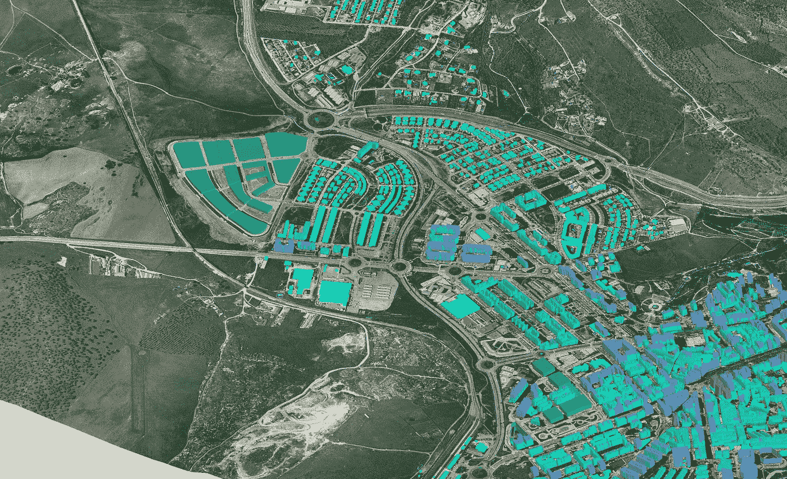

# GIS——让世界认识到地理的力量

> 原文：<https://medium.datadriveninvestor.com/gis-waking-up-the-world-to-the-power-of-geography-8d37e0bd6106?source=collection_archive---------21----------------------->

***骨骼生成数据，传感器生成数据，卫星生成数据，所有这些都有地理空间组件。鉴于它们都有位置参考，将它们放在一起使地理空间技术变得强大，因为它允许你组合所有这些不同的数据源*** 。

空间数据也称为地理空间数据，是标识地球上物理对象的地理位置的信息。它是可以映射的数据，因为它存储为坐标和拓扑。空间数据可以在现代应用程序中扩展，以协助日常任务、执行详细分析或创建交互式用户体验。

随着我们变得更加移动和全球化，数据在我们使用的应用程序中变得更加相关。正如吉米·巴菲特曾经说过的，没有地理，你将一事无成。

什么是空间数据？

我们可以将空间数据定义为关于地理特征的位置和形状以及它们之间关系的信息，通常存储为坐标和拓扑。

空间数据是由什么组成的？

首先，在最基本的层面上，您可以将空间数据视为一系列点和线。所以你可以想象你的办公室是一个点。有一个与此相关的位置。因此，除了与对象相关的常规数据之外，您还会想到坐标之类的东西。例如，你公司的名字，一家餐馆或提供的食物，或者你有什么？如果你把几个点组合在一起，最终你会得到一条线。

大多数人是通过谷歌地图知道地图的。谷歌地图不是一个地理空间分析平台。它只是一个地理空间可视化平台。所以你在任何分析结束时看到的地图都是可视化的。这就是谷歌地图的一个例子。

[地理空间](https://techwave.net/services/engineering-services#appdevelopment)数据有多种不同的形式。你有道路数据；您可能有人口统计、人口数据、关于边界和地点的数据、卫星图像，这些数据如今越来越常用。可能有历史地图，地形图，也可能是天气数据，也可能是实时交通信息。

所以有各种各样的地理空间数据。这些数据集构成了你如何进行分析的关键。但实际上，这里缺少了一个至关重要的数据元素，即业务数据。因此，无论是关于客户资产的数据，还是关于仓库位置、库存、员工的数据，所有这些都构成了地理空间框架的重要组成部分，因为我们之前讨论的所有数据集都是环境数据的宇宙。但这是业务数据，交易数据。当你把两者结合起来，地理空间的力量就来了。

**空间分析&建模:**

空间分析和建模与常规数据科学和建模略有不同，因为我们使用的是在哪里的问题，而不是为什么或如何或什么，这些在地理空间分析中很重要，但本质上是查看空间和时间来创建模式或理解模式。你知道，这可能是一个地区的犯罪模式，或者是某个距离内的识别特征。

因此，如果你知道，比方说一个管道爆裂，你想找到离管道最近的服务工程师，这些都是位置和距离可以回答的问题。如果你有数据和工具，你必须以某种方式呈现，例如，收入，生活方式信息，交通和犯罪模式，以及事故。这些是人们使用地图和图表来交流分析结果的不同方式。

地理空间本质上是获取数据和工具，并从中构建分析和表示。地理空间变得越来越重要，因为它实际上可以组合来自任何来源的数据。毕竟，你今天在商业中使用的几乎所有东西都有一个位置标签。因此，无论是地址还是对城市名称、病房名称或个人识别码等位置的引用，智能设备都会生成大量数据。

简而言之，骨骼生成数据，传感器生成数据，卫星生成数据，所有这些都有地理空间组件。因此，考虑到它们都有位置参考，将它们放在一起会使它非常强大。所以地理空间技术允许你结合所有这些不同的数据源。

因为这些数据在几年前就被数字化了，人们突然可以访问像人口统计数据、收入数据、土地价格数据这样的数据，而且是数字格式的。这使得他们能够使用这样的工具来做决定。然后是数据湖，它提供了对万亿字节数据的访问。

**结论:**

随着数据的可用性，云计算变得无处不在。企业可以在云上存储大量数据，并拥有利用这些数据的计算能力。

这让我们走到了今天。2021.这场地理空间 2.0 革命在过去几年里一直在发生。在过去的几年里，这种趋势一直在加速。