# 测试人员的 GIT 基础

> 原文：<https://medium.datadriveninvestor.com/git-basics-for-testers-7d81a510e145?source=collection_archive---------9----------------------->

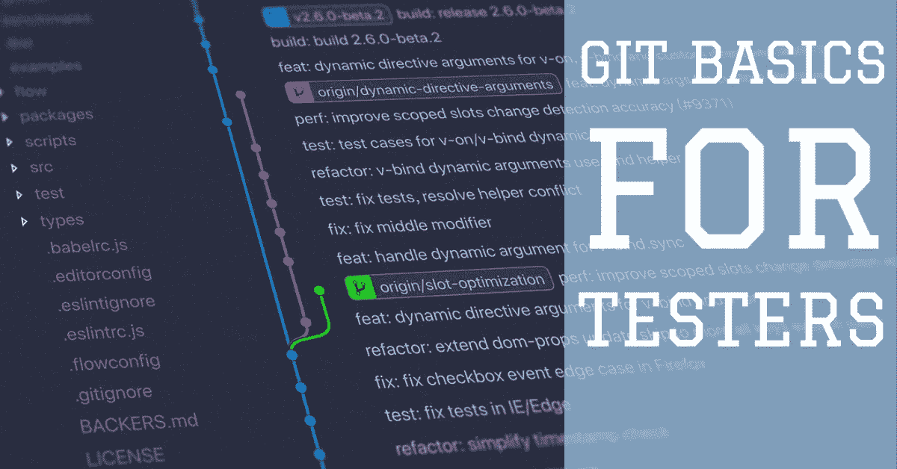

Git 是一个 DVCs(分布式版本控制系统)系统，它是目前最好的开源版本控制工具，可以让程序员分享他们的项目并与其他人合作。它具有早期系统中没有的多种功能，如客户端可用的完整快照。Git 有三种状态，在这三种状态下，它存储文件，并且您执行的每个操作都首先在本地执行，就像提交一样，而早期的系统需要互联网连接。GIT 的主要力量是文件所在的存储状态，例如本地、暂存和存储库。大多数开发人员和自动化测试人员都非常熟悉 GIT，但是手工测试人员对它了解不多，并且对使用它的知识和信心也非常有限。这篇文章将帮助他们了解并获得更多的信心，并从有限的用例开始。

在深入研究 GIT 命令之前，我想分享一些您必须了解的术语，它们将帮助您轻松掌握这些命令:

1.  **Repository** :这个术语在 GIT 中用于一个项目。一个项目是一个由文件和文件夹组成的存储库( **repo)** 。所有 git 操作首先在本地 git repo 中执行，然后我们可以将这些更改推送到远程 repo(git 服务器)。
2.  **提交**:这个术语指的是在一个文件中所做的改变，并且被作者(做改变的人)所接受。这是 git 的基本要素，它跟踪回购的变更记录。在 commit 的帮助下，Git 知道每个文件最后被接受的状态。
3.  **分支:**这个术语指的是包含变更的存储库/项目的逻辑视图。这意味着您可以在不同的分支中对单个文件进行不同的查看/更改。一个分支可以与不同的分支合并，即单个文件将具有两个分支的更改。
    ***注意:GIT 中的每个 repo 都会有一个默认的名为 master 的分支。***
4.  **Staged:** 该术语指的是文件的状态，其中修改准备好被添加到提交中或者准备好被作者接受。
5.  **来源:**该术语指向远程存储库。它只是一个指向您的远程/托管存储库的指针。

有了上面的术语，让我们从命令开始。

# 帐户设置和安装

首先，我们需要在存储库服务器上创建一个账户，我们有不同的免费 git 服务器网站，如 [github](https://github.com/) 、 [gitlab](https://about.gitlab.com/) 、 [bitbucket](https://bitbucket.org/) 等。每个人都有不同的风格和不同的特性，但是它们都支持 git。我建议人们首先在这些网站上注册你的账户。对于这些文章，我使用 bitbucket，选择网站完全取决于你。

要开始，你必须从[这里](https://git-scm.com/)下载 git 并安装在你的本地机器上。

# 创建/克隆 git 存储库

1.  首先，我们应该创建一个空目录。

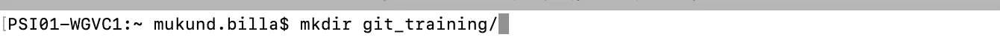

Create an empty directory which will act as a git repository

2.一旦我们进入新创建的目录，我们必须发出" ***git init*** "命令。这个命令告诉 git 我们希望这个目录被称为 git repository。该命令也可以对现有目录执行，该目录包含现有文件/文件夹，并且您希望该目录充当 git repo。一旦执行，您将发现一个名为“ ***的目录正在被创建。git*** ”。这个"**。git** "目录将您执行的所有更改存储在一个目录中，现在这个文件夹可以用作 repo 了。

> ***git init*** —将文件夹初始化为 git 存储库

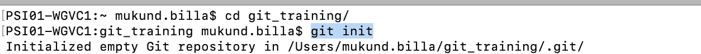

**git init** - Command to initialize the directory as git repository

嘿，但是我们已经有了一个现有的 git 回购协议，我们如何才能将该回购协议直接放入我的本地系统。Git 提供了一种通过" **git clone** "命令将远程 repo 放入本地机器的方法。这个命令可以通过存储您的存储库的 git 服务器直接获得。一旦执行，git 将把 repo 下载到您的本地机器上，您将在当前工作目录中看到一个新文件夹。

> ***git 克隆“git 仓库的远程路径”***

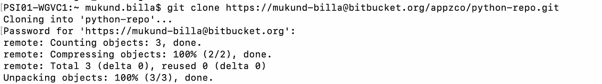

**git clone** — To get the remote repo into local machine

# 您的更改/修改的状态

一旦你得到了你的回购，你可能会工作的变化，修改像添加新的文件或删除文件。Git 总是逐行跟踪这些变化。Git 知道你试图做的所有更改，这有助于我们了解哪些文件发生了更改。为了了解这一点，我们发出另一个命令“ **git status** ”。

> ***git status*** —了解您的回购状态以及被修改/添加/删除的文件。

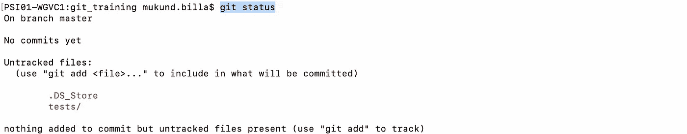

**git status** — To view the changes you have made in your repo

我们来剖析一下上面的输出。

1.  第一行告诉我们当前正在哪个分支工作。正如我前面提到的，每个 git repo 都有一个名为“master”的默认分支。
2.  第二行表示我们没有提交任何更改。这意味着作者仍然在修改文件。

3.然后我们有另一个部分叫做修改的文件，git 用红色显示修改的文件。—此部分现在不可见，因为我们没有做任何更改，但我们添加了一个新文件。

4.未跟踪的文件部分—此部分显示新添加到存储库中的文件和文件夹的列表。如果我们看到输出，有一个新创建的名为 tests 的文件夹。如果仔细观察输出，Git 还建议可以通过另一个命令" **git add** "添加文件进行提交。

# 配置 GIT 变量

Git 变量是 git 在其操作中使用的常量，可以存储在三个不同的级别，即系统(在系统级别可用)、全局(在用户级别可用)和本地(在回购级别可用)。变量可以简单到设置用户名、提交时使用的电子邮件地址、提交消息的默认文本编辑器等。为此，我们将设置用户名和电子邮件，因为这是我们对 git 进行的非常基本的配置级别的更改。


**git config** changes at global level for name and email address

要查看变量的值，可以简单地忽略值部分

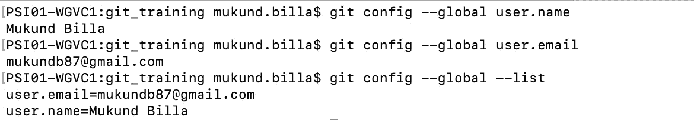

**git config** — To set value, view and to list variables

> 注意:您可以在上面的命令中使用 local、system 而不是 global

# 暂存更改

当我们触发**状态**命令时，Git 显示我们最近修改/添加的文件为未跟踪/修改状态。这意味着我们对 git 正在跟踪的文件做了一些更改，或者添加了 git 不知道的文件。一旦我们完成了文件中您想要的更改，我们可以将它们添加到**暂存区**，这样 git 就可以在我们想要提交文件时包含它们(作者接受的更改)。要添加文件/文件夹，我们可以简单地使用" **git add** "命令。下面显示了将文件包含到暂存区的不同方法。

> ***git 添加文件名 1 文件名 2..*** —添加个人/文件列表到暂存。
> ***git 添加。*** — With ` **.`** git 包括要暂存的回购的所有文件/文件夹更改。
> ***git add folder _ name***—将整个文件夹添加到暂存区
> ***git add * pattern ****—添加名称与给定模式匹配的文件。

**添加文件到暂存:**为此，让我们添加我们新创建的文件夹“**测试**”我们的回购。如果我们在下面的快照中看到，状态现在显示为绿色文本，这仅仅意味着列出的文件已准备好提交。在任何情况下，我们都可以将文件拆分。对于下面的暂存文件，git 建议我们使用" **git rm** 或" **git checkout** "命令来解除文件的暂存。只需使用该命令，就可以使更改不登台，这样您就可以做更多的更改，然后在以后登台它们。

> 注意:“ **git checkout file_name** ”只能用于在我们的 repo 中有早期提交时取消文件的暂存。

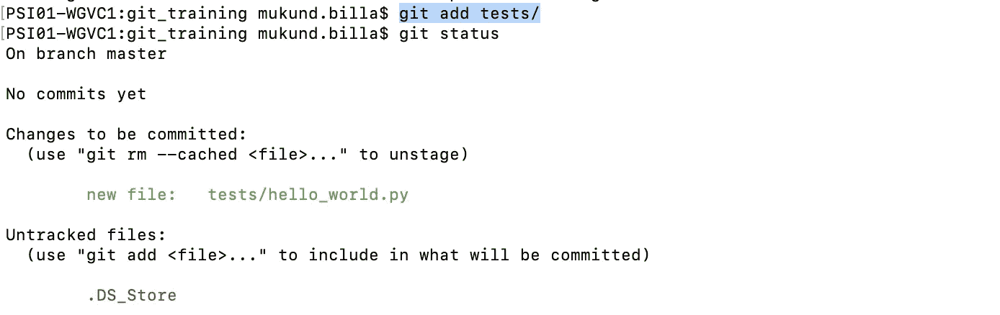

**git add** — To add the whole folder in a git

**删除文件:**要从 repo 中删除文件，我们使用" **git rm file_name** "命令。这将从您的存储库中删除该文件。它采用与“**添加**命令相同的形式。您仍然可以手动删除该文件，git 会记录下来。这也是直接使用 git 做同样事情的方法之一。

**重命名/移动文件:**要将文件从一个地方移动到另一个地方，我们使用" **git mv src_file dest_file** "命令。这将把文件从一个文件夹移动到另一个文件夹，也可以用来重命名文件。同样的情况也适用于此，我们仍然可以手动完成，这只是通过 git 的另一种方式。

# 提交更改

一旦我们准备好了变更，我们就要提交它们，这样 git 就会将它们作为变更记录进行跟踪。提交通常是文件被作者接受并准备好被推送到远程仓库的状态。通常的做法是，只有当您已经完全完成了更改，并且在进行测试之前对其进行了测试，才提交。我们可以进行尽可能多的提交，所有这些都在本地执行，因此不需要互联网连接。

> ***git 提交*** -m“用于提交的消息，说明变更特性”

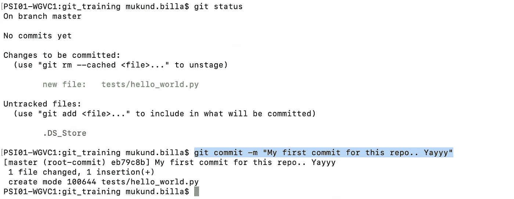

**git commit** — To persist your changes as commit

为了查看提交日志，我们通过下面的命令找到日志。

> **git 日志**

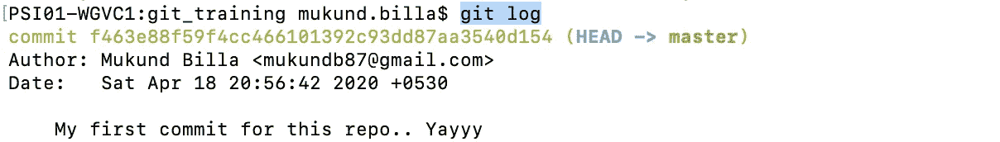

git log — To view the recent commits

# 推动变革

一旦我们在本地回购中提交了我们的更改，我们就可以使用“ **push** ”命令一次提交所有的提交。这通常会将当前分支提交上传到远程回购。

> **git 推送**

如果存储库还没有上传到 git 服务器，我们可能需要在 git 服务器上创建一个 repo 并跟踪它。对于我们的用例，让我们用本地回购跟踪一个远程回购。我在 bit-bucket 创建了一个回购，并触发了回购。

> **git remote add origin " git server remote repo URL "**

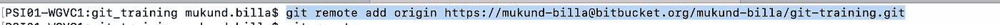

**git remote add origin** — To track the remote repo with local repo

由于当前分支没有指向远程回购，我们需要设置和推送更改。我们需要发出下面的命令。这是每个新本地分支的一次性活动，一旦指向远程回购，我们就可以使用普通的" **git push** "命令进行后续的变更推送。

> **git 推送— —设置——上游原点主控**

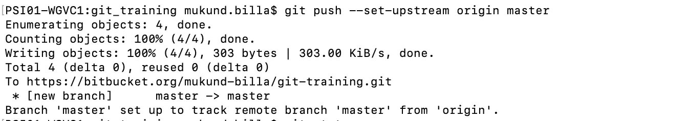

git push — This will push the current branch with the origin’s master branch

# 分支

分支是 git 提供的特性之一。它们是合乎逻辑的，这意味着它们可以在不影响现有代码的情况下进行并行更改。单个文件在不同的分支中可以有不同的更改。因此，如果您想要将一个特性引入到现有的代码中，我们必须创建一个分支，然后在新的分支中执行更改。让我们看看如何在本地回购中创建分支机构。

## 创建分支

在 git 中创建分支有两种方法。第一种是通过“**分支**命令，通常采用以下形式。使用下面的命令，从最近的分支中创建分支，但它不会被切换，我们需要显式地这样做。要查看分支是否被创建，我们可以简单地使用相同的命令**，而不使用** " *branch_name* "。这将列出在回购中创建的所有本地分支。

> **git 分支**“分支 _ 名称”

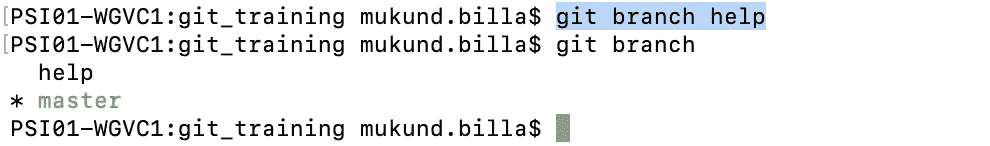

git branch — To create and list local branches

如果我们看到上面的快照，我们首先创建名为“help”的分支，并列出 repo 中可用的分支。带有**"*****"**的分支表示 git 当前正在跟踪该分支的变更。为了签出新创建的分支，我们将执行“签出”命令。****

> ******git 结帐**“分行名称”****

****这将移动 git 来跟踪给定分支名称下的更改。****

****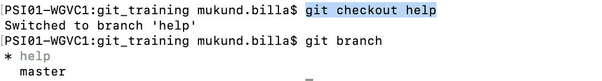****

******git checkout** — To switch git to track the changes in help branch****

****要在单个命令中做到这一点，我们可以使用下面的" **checkout** 命令。带有“-b”选项的 git checkout 将创建并签出到所提供的新分支名称。****

> ******git check out-b*branch _ name*******

****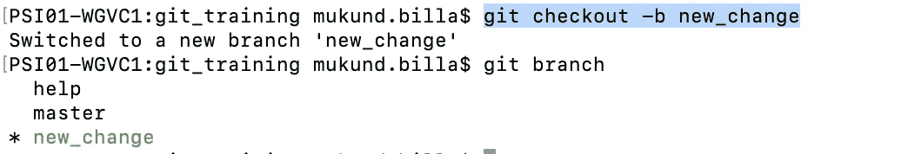****

****git checkout — To create and to switch into the new branch****

## ****删除分支****

****我们可以使用“**分支**命令直接删除本地分支。以下命令可用于删除分支，但前提是它不是当前工作分支。****

> ******git branch-D**branch _ name****

****要从远程 repo 中删除分支，我们必须启动下面的命令。****

> ******git push-d**origin branch _ name****

## ****合并分支****

****实际上，人们在为任何特定功能创建的多个分支中工作，这需要在批准后与主分支合并。但是，您可能希望将其他团队成员在远程分支中从主分支中推出的最新更改带到您的本地分支中，并希望这些更改出现在您的当前功能分支中。这种变化可能会也可能不会产生冲突，如果有任何冲突，那么 git 向我们提供这两种变化，要求我们解决它们，并在您的分支中提交这些变化。****

****为了执行合并，我们使用下面的命令。请确保您当前工作的分支是您希望从其他分支进行更改的分支。****

> ******git 合并** branch_name****

****上面的命令将执行合并，如果没有冲突，将尝试快进，如果有任何冲突，它将向我们提供处于修改状态的文件。该文件将具有发生冲突的标记。视觉标记有:<<<<<<> > > > > >。它们对我们来说是可用的，以区分我们当前分支中可用的变更和来自合并分支的变更。****

```
**here is some content not affected by the conflict 
<<<<<<< feature 
this is conflicted text from feature branch
======= 
this is conflicted text from master
>>>>>>>**
```

****“=======”之前的变更是您当前分支的变更，之后的变更是合并分支的变更。一旦您知道了您想要在您的分支中进行的更改，您就可以根据需要持久化它们。然后，您可以像我们通常做的那样添加它们，执行提交，然后推送到远程存储库。****

> ****这就把我们带到了 Git 基础文章的结尾，这篇文章涵盖了我们在日常自动化任务中遇到的大多数用例。希望，这有助于你理解它，并使你在使用它时更加舒适。****