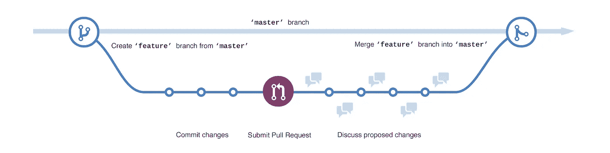
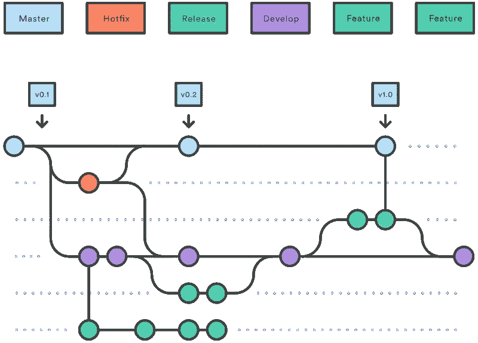

# Git 与 Github 工作流程

> 原文：<https://medium.datadriveninvestor.com/git-vs-github-workflow-971b618b7d94?source=collection_archive---------3----------------------->

成功地管理一个具有持续开发场景的软件项目是很棘手的。第一步是选择协作要遵循的工作流程。最流行的工作流分支策略是 Git Workflow (GitFlow)和 Github Workflow (GithubFlow)。

# Github 流

这个流程很容易适应。该流程中有两种类型的分支，`master`分支和`feaure`分支

**Reference**: [https://docs.versionpress.net/en/developer/development-process/](https://docs.versionpress.net/en/developer/development-process/)

每当一个人必须处理一个特性时，他们简单地从`master`分支分支到一个新的`feature`分支，并处理它(例如，将提交推送到`feature`分支)。

一旦他们开发了特性(完成了工作)并测试了变更。他们创建一个[拉请求](https://docs.github.com/en/github/collaborating-with-issues-and-pull-requests/about-pull-requests) (PR)到`master`分支。在批准 PR 后，`feature`分支被合并回`master`分支。

将以上描述作为简单的上下文指针，下面是使用 [Github 流程](https://docs.github.com/en/github/collaborating-with-issues-and-pull-requests/github-flow)时的工作流程:

*   从存储库`master`分支创建一个分支
*   创建、编辑、重命名、移动或删除分支上的文件
*   从您的分支机构发送一个包含您提议的更改的“拉”请求，以开始讨论
*   根据需要对您的分支进行更改
*   一旦分支准备好合并到`master`分支，就合并拉取请求

# Git 流

这个工作流比 Github 流稍微复杂一点，但是如果我们在存储库中有生产代码，它会更适合。Git 流有三种类型的分支，即`master`、`develop`和`feature`

**Reference**: [http://www.clinicalgenomics.se/development/dev/gitflow/](http://www.clinicalgenomics.se/development/dev/gitflow/)

每当一个人必须处理一个特性时，他们简单地从`develop`分支分出，处理变更，并向`develop`分支请求 PR。一旦特征被批准，这些更改将被合并到`develop`分支。

在合并这个`feature`分支之后，如果对`devleop`分支所做的变更是稳定的，那么可以决定对`master`分支进行稳定的发布。

这样做是为了保护`master`分支的健全，因为许多变更只有在合并后才能被测试。

记住要忠于这句话:

> 主分支中的代码总是稳定的

**热修复分支:**在最坏的情况下，当`master`分支需要修复时。你可以从`master`分支中分出一个`hotfix`分支，用热补丁弄脏手，然后直接推回`master`。

很多时候，试运行或预生产环境被连接到`develop`分支，当一个新特性被合并到`develop`分支时，它的稳定性和健壮性可以很容易地被评估。一旦所有的东西都经过评估，可以投入生产，就可以向`master`分支发布，这可能与产品的生产部署有关。

总结这个工作流程的步骤，可以说:

*   从存储库`develop`分支创建一个分支
*   创建、编辑、重命名、移动或删除分支上的文件
*   从您的分支机构发送一个包含您提议的更改的“拉”请求，以开始讨论
*   根据需要对您的分支进行更改
*   一旦分支准备好合并到`develop`分支，就合并拉取请求
*   一旦评估了`develop`分支中代码的稳定性，就向`master`分支发送 PR
*   将`develop`合并到`master`分支