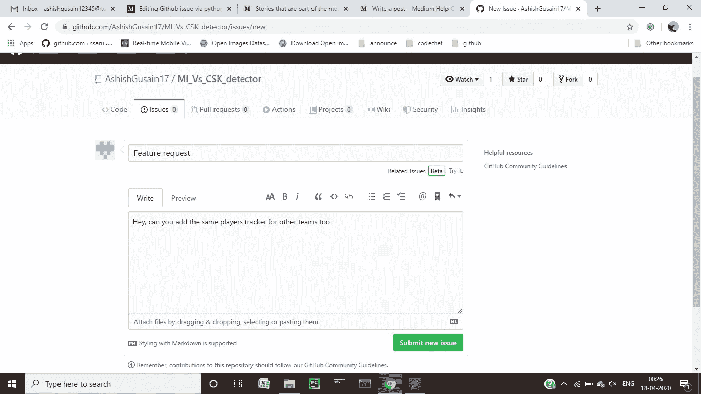
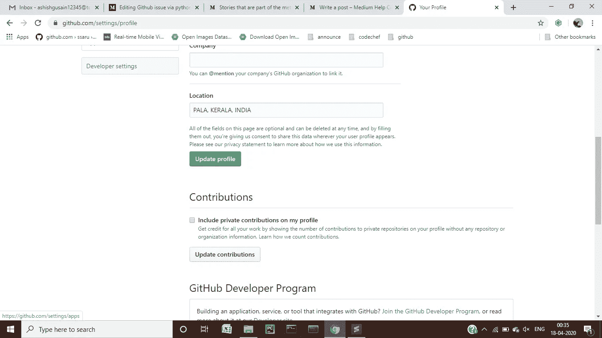
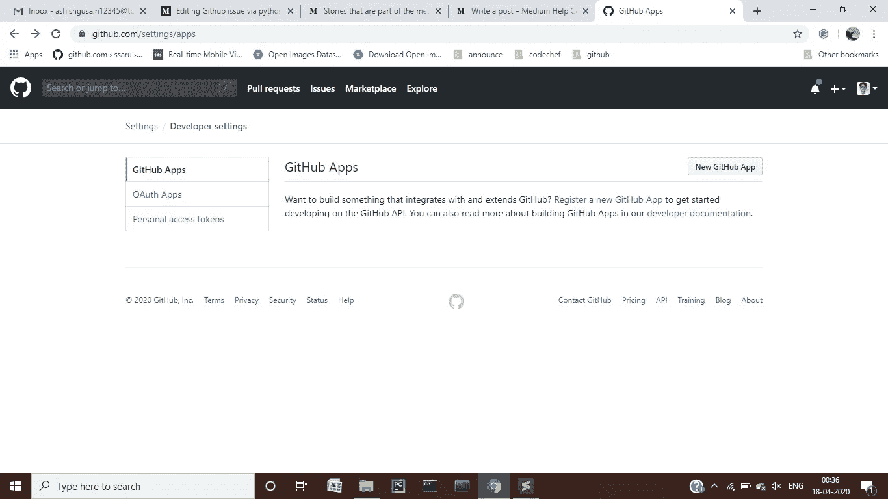
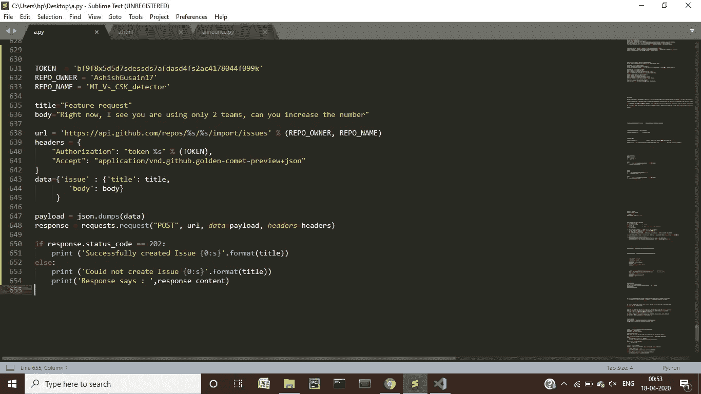
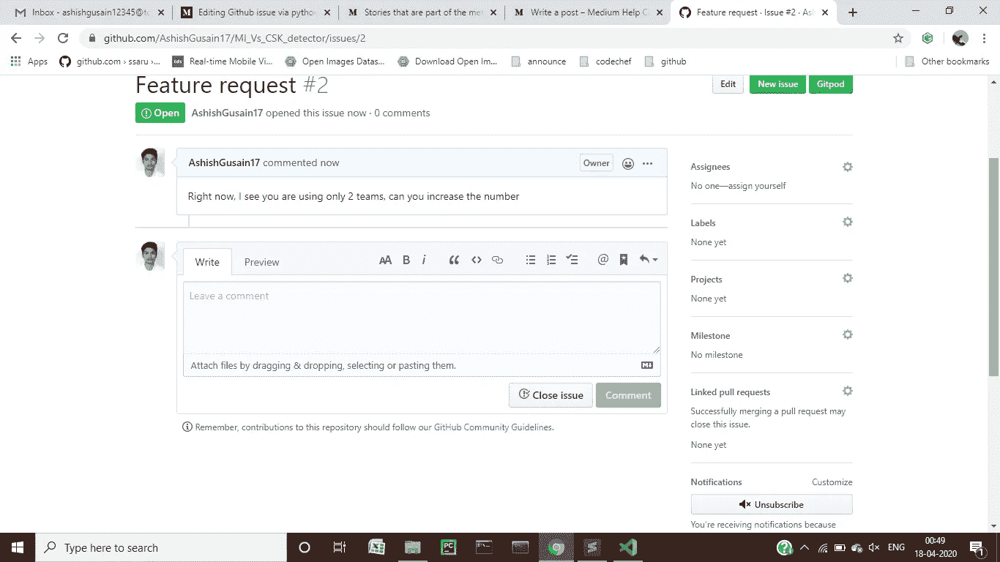

# 通过 python 发布 Github

> 原文：<https://medium.datadriveninvestor.com/github-issue-via-python-171c7fee0629?source=collection_archive---------2----------------------->

如果你长期使用 github，你一定知道你可以在任何公共回购中提出你的问题，或者如果你是私人回购的合作者，其他人可以尝试解决他们的问题。

问题的提出基本上是为了通知存储库所有者任何种类的错误，或者可能是代码中的一个特性请求，同时如果他自己面临一些问题。现在，您可以通过转到特定存储库中的问题部分，然后提出问题来手动完成此操作。

上面的屏幕截图让您了解了如何手动提出问题。现在，如果您在后端运行某种脚本，可以自动将问题添加到存储库中，会怎么样呢？那不是很酷吗…

为此，我们将使用 python 脚本来实现我们的目的。你需要做的第一件事是获得你账户的 **GITHUB_TOKEN** 。你可以通过这些步骤获得你的 **GITHUB_TOKEN** 。

1.)转到您帐户的设置选项卡。

Check settings tab

2.)点击开发者设置路线。

3.)现在，您可以创建自己的个人访问令牌，因此您可以在创建令牌时授予该令牌权限。

**注意:**这个令牌不能和任何人分享。您将在您的 python 脚本中使用它，但是如果您正在开发一些大型应用程序，可能是为一个公司，您必须使用这个令牌作为环境变量。

回到主要部分，python 脚本如下所示:

第 631-633 行:token 是包含 **GITHUB_TOKEN 的同一个变量。REPO_OWNER** 是 github 账户的所有者，而 **REPO_NAME** 是应该发行的回购的名称。

第 636–636 行:现在，我已经自己添加了标题和正文字符串，但是当你在应用程序中使用这些代码时，你可以从用户那里获得这些值。

第 638–647 行:url 告诉我们正在做的请求，它的主要目的是什么。头包含令牌和一些必需品。数据变量包含带有标题的对象和需要转换为 json 并存储在有效负载变量中的主体。

 [## 数据驱动的投资者|微软比 Chrome 有“优势”

### 简史我从来不是浏览器的粉丝，确切地说，我只是一个浏览器的粉丝，Chrome。这是我的…

www.datadriveninvestor.com](https://www.datadriveninvestor.com/2020/03/29/microsoft-having-an-edge-over-chrome/) 

第 648 行:实际的请求是在这里发出的，现在我们将立即得到响应，因为这个 API 太快了。如果状态代码是 202，您可以检查，问题必须已经被添加，否则您将得到一个错误，表明您犯了一些错误。

在我的案例中，添加了问题，您可以在下面看到:

**温馨提示:**

令牌需要用作环境变量，并且现在必须与任何人共享。上面代码中使用的令牌是假的，不会工作。你们必须创造自己的代币。

你也可以在正文中添加更多的项目，比如图片、链接，甚至可以编辑文字，比如粗体、斜体等。我没有在这里展示它，因为这对这个故事来说太多了。

**用法:**

我是在实习的时候接到一个任务才知道这件事的。基本上，我们从应用程序的用户那里获取反馈，并使用这些反馈，我们可以向他询问标签，比如这是一个错误还是仅仅是一个问题或一个功能请求，并将它们添加到我们的问题中以解决它们。

这都是我这边的。您可以通过以下方式联系我:

电子邮件:ashishgusain12345@gmail.com

github:【https://github.com/AshishGusain17 

领英:【https://www.linkedin.com/in/ashish-gusain-257b841a2/ 