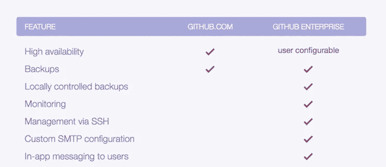

# GitHub vs GitLab

> 原文：<https://medium.datadriveninvestor.com/github-vs-gitlab-524b2ee4dc39?source=collection_archive---------3----------------------->

# 什么是 GitHub？

GitHub 是一个 Git 存储库托管服务，但是它增加了许多特性。Git 是一个命令行工具， **GitHub** 提供了一个基于网络的图形界面。它还提供了访问控制和几个协作功能，例如 wikis 和每个项目的基本任务管理工具。

# GitLab 是什么？

GitLab 是一个基于 web 的 DevOps 生命周期工具，它使用 GitLab Inc .开发的开源许可证，提供一个 Git-repository manager，提供 wiki、问题跟踪和持续集成/持续部署管道功能。

# GitLab 和 GitHub 的主要区别

*   数据的导入和导出。虽然 GitLab 提供了更多的导入来源，但 GitHub 是最佳选择。它有一个专用的导入工具，可以导出整个维基、问题、项目上传等等。
*   认证。这两个平台以不同的方式处理权限。GitLab 有一个角色系统，根据这个系统授予不同类型的访问权限。在 GitHub 中，团队成员可以对不同的存储库授予读或写权限。
*   内部来源。在一个组织内部采用开源文化的实践。这是 GitLab 具有优势的另一个领域，因为它本身支持内部资源。
*   保密。GitLab 有一个模块可以创建需要高权限级别才能访问的机密问题。

# 认证级别

使用 GitLab，您可以根据人们的角色设置和修改他们的权限。在 GitHub 中，您可以决定某人是否拥有对存储库的读写权限。

 [## 认知计算——一套被广泛认为是……

### 作为它的用户，我们已经习惯了科技。这些天几乎没有什么是司空见惯的…

www.datadriveninvestor.com](https://www.datadriveninvestor.com/2020/02/19/cognitive-computing-a-skill-set-widely-considered-to-be-the-most-vital-manifestation-of-artificial-intelligence/) 

例如，使用 GitLab，您可以在不允许源代码的情况下提供对问题跟踪器的访问。这对于拥有基于角色的贡献者的大型团队和企业来说非常好。

# 应用程序

## 开源代码库

GitHub 应用程序非常棒。很久以来我见过的最好的应用之一。

## GitLab

等等？有 App？**遗憾的是没有。**我希望很快会有一款与 GitHub 相当的 GitLab 应用。

# 它们之间的其他关键特征

# 结论

我曾经使用 GitHub 很长一段时间，我学会了如何使用 Git，所以这是我的初恋。但是 GitLab 比 GitHub 更神奇的是它的惊人的特性，以及它在部署和工作流程上的易用性。