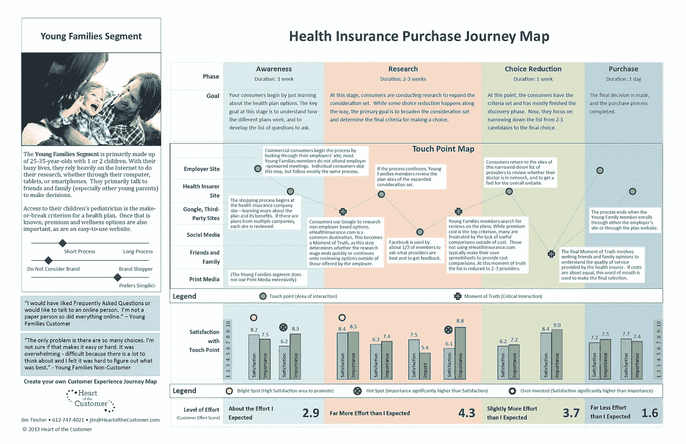

# 当你的顾客需要时，给他们想要的东西

> 原文：<https://medium.datadriveninvestor.com/give-your-customers-what-they-want-when-they-want-it-52dff2341358?source=collection_archive---------14----------------------->

## 如何准确地知道何时将相关内容交付给你的受众，以便你可以将他们转化为满意的客户

Photo by [Annie Spratt](https://unsplash.com/@anniespratt?utm_source=medium&utm_medium=referral) on [Unsplash](https://unsplash.com?utm_source=medium&utm_medium=referral)

你做了调查，你的内容很中肯。

但是你没有参与度。

人们似乎故意忽视你。

不用担心；没人讨厌你。

我来跟大家分享一下是怎么回事。

无论你的信息多么正确，如果它在错误的时间出现，没有人会听。

人们看电视时接受商业广告作为体验的一部分的时代已经一去不复返了。如今，很难知道你的客户会在何时何地消费你的内容。

 [## 影响者在聚光灯下表演|数据驱动的投资者

### 影响者营销是一个脱颖而出的游戏。结果是一个令人难忘的-和可信的-连接到一个产品或…

www.datadriveninvestor.com](https://www.datadriveninvestor.com/2020/01/15/influencers-perform-in-the-spotlight/) 

与此同时，客户会被不相关的内容轰炸，因此开始忽略大部分内容。

那么，如何确保在最佳时间交付相关内容呢？

# 你在为谁制作内容？

第一步，确定你想把你的内容传达给谁是很重要的。通过精心制作一个人物角色，你可以根据她的需要来定制你的内容。角色是一组客户的代表。理想情况下，她是你现有客户和理想客户的混合体。

如果你知道你的内容要传达给谁，那么在你的内容中注入同理心就容易多了。这将导致更好的参与和更有意义的关系。

点击此处阅读所有关于塑造人物角色的信息:

 [## 吸引更多顾客你应该做的一件事

### 如何通过比客户的配偶更好地了解客户来推动你的内容营销

medium.com](https://medium.com/datadriveninvestor/the-one-thing-you-should-do-to-attract-more-customers-ae339a3f00b5) 

# 我们的接触点在哪里？

接触点是你的客户和你的品牌之间的接触点。这些接触点可以发生在你的网站、社交媒体、广告等。

潜在客户需要与你的品牌进行多次接触，直到他决定加深关系并最终购买你的产品或服务，这很正常。但并非所有的接触点都是平等的。

你的品牌最有机会影响客户决策、观点和行动的时刻被称为关键时刻(MOT)。这些通常是你的客户第一次接触、购买或使用你的产品的时候。

今天，所谓的关键时刻(ZMOT)比以往任何时候都更加重要。ZMOT 描述了潜在客户在线决定购买产品的时刻。它介于网上搜索和购买之间。

如果我们能在关键时刻提供相关内容，我们就有机会积极影响与客户的关系。

你的顾客从第一次接触到与你的品牌建立持久关系的过程就是我们所说的顾客之旅。

# 顾客旅程的各个阶段

你可以将顾客之旅分为不同的阶段。你必须决定你想要放大到什么程度。我建议您从销售周期的五个主要步骤开始。

**1。意识**

你的潜在客户意识到他有问题。在这个阶段，他在寻找与他的问题相关的信息。他开始在谷歌上搜索，发现了你的内容。

**2。考虑事项**

在这个阶段，你的潜在客户寻找信息来解决他的问题。他开始比较不同的选择，试图找出最适合他的。

**3。转换**

潜在客户为他的问题找到解决方案，决定购买产品，成为你的客户。

**4。保持力**

目标是与您的客户建立关系，并与他们建立长期关系。理想情况下，你可以通过交叉销售和追加销售来提升客户的价值。

**5。建议**

你的目标应该永远是让你的客户满意，这样他们才会向他们的网络推荐你的品牌。

Source: [Heart of the Customer](https://heartofthecustomer.com/customer-experience-journey-map-the-top-10-requirements/?utm_source=December+Newsletter&utm_campaign=November+Newsletter&utm_medium=email)

# 旅行地图

客户之旅的核心是客户之旅地图。

它是你想向客户提供什么和客户想从你那里得到什么的直观表示。这是一个非常好的工具，可以直观地看到期望的客户体验和实际体验之间的差距在哪里，以及您可以在哪里对您的内容产生最大的影响。

您可以为销售周期的各个阶段分配接触点，并为每个接触点添加情绪等附加信息。

此外，您还可以获得以下问题的详细答案:

*   客户在哪里与我的业务互动？
*   在不同阶段，客户有哪些特殊需求？
*   你的网站有多大吸引力？
*   用户能毫不费力地浏览网站吗？
*   你的 CTA 在正确的地方吗？
*   用户了解你的网站卖的是什么，如何购买吗？

# 创建客户旅程时需要考虑的要点

*   从顾客的角度，而不是从你的角度来看待这个过程，这一点至关重要。
*   为不同的产品或流程打造不同的顾客旅程。
*   你的客户不在乎接触点。他们希望与你的品牌顺畅互动，无论他们在哪里遇到它。
*   你的最终目标是提高投资回报率，如果你专注于可衡量的目标，即使在复杂的旅程中也要保持专注。

# 外卖

当内容与他们相关并且出现在正确的时间时，客户对内容的反应最好。客户之旅对于你了解何时交付相关内容非常有价值。

# **准备变得无限？**

如果你想变得无限并大大加快你的学习速度，看看我的小抄:

[点击此处立即获取备忘单！](https://roadtolimitless.com/cheatsheet/)