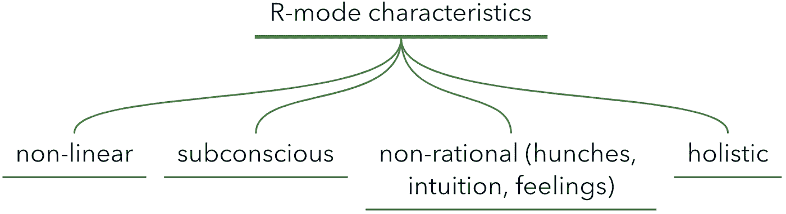
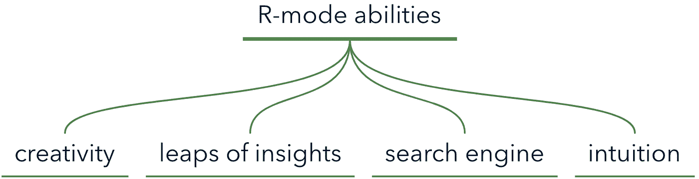

# 大脑的两种模式:功能性和创造性

> 原文：<https://medium.datadriveninvestor.com/glimpse-into-brain-operating-modes-126f6e818c03?source=collection_archive---------8----------------------->

Andy Hunt 的思维导图博客，灵感来自实用主义思维和学习。

当你积极尝试时，想出创造性的想法是困难的——你注意到这种现象了吗？或者在最意想不到的时候——比如洗澡的时候——伟大的解决方案或有趣的想法突然出现在我们的大脑中，这有多奇怪？

背后的原因是我们的大脑以不同的模式运作。每一种模式都以自己的方式塑造了我们的思维和心态。

虽然关于这些模式的研究正在积极进行，但很明显我们的大脑有两种不同的工作模式:让我们称它们为 **L 模式**和 **R 模式**。

# l 模式

l 模式是‘让它发生’，‘看透’，‘肉和土豆’一类的处理模式。

l 模式是我们有意识的操作方式，与 R 模式相比，它相当慢，特别是在记忆方面(有没有试过在讲故事时记住那些你刚刚忘记的微小细节？).它是高度理性的，首先遵循逻辑。

我们通过这种模式形成连续的、链接的思维，并得出基于原因、事实和逻辑的结论。它允许我们使用语言和符号来命名、描述、定义和表示事物和思想，并进行数字运算。L 模式是我们的时间导航器，它记录时间并在我们的意识中一件接一件地排列事情。它也帮助我们通过把它分解成更小的部分来描述一个整体。

L 型模式使我们能够进行日常操作，并赋予我们处理细节、使用语言和算术、感知逻辑和做出理性决定的能力。

 [## 在家工作如何提高我的工作效率|数据驱动型投资者

### 在家工作确实激发了我最大的潜能，让我更有效率。因为在家工作给了我…

www.datadriveninvestor.com](https://www.datadriveninvestor.com/2020/07/29/how-working-from-home-increased-my-productivity/) 

# r 模式

r 模式是“我只是要做我的事情”，“当我准备好了，我就准备好了”，“这是一个随机的想法——可能是黄金，可能是粪便”一类的处理模式。与 L-mode 相比，它采用了完全不同的方法。

R 模式是一种自由的精神，在我们良知的背景下自由运行。它来自我们的经验、知识、根深蒂固的记忆、感觉和预感。R 模式是下意识的，它工作非常快。这是一个比 L-mode 好得多的内存搜索引擎。它对我们的关注点和心态很敏感，会试图想出办法来解决困扰我们的问题。

> R-mode 会在交谈 4 小时后给出机智的回答。

R 模式增强了我们的直觉，让我们能够基于零散的知识、预感、感觉和图像做出顿悟。它能激发我们的创造力，产生想法，让我们的创造力流动起来。它强调整体观和综合学习——把碎片拼凑成一个整体。

R 模式负责我们的直觉(还记得[上一篇文章](https://medium.com/@luka_giorgadze/from-novice-to-expert-rating-your-skills-c7dd78f85ca8)的专业直觉吗？)、创造力和非正统的问题解决方法。

> r 模式看到的是森林，L 模式看到的是树木。

# L 模式和 R 模式之间的相互作用

这两种处理模式之间没有直接联系。我把他们想象成 R-mode，一个不断在 L-mode 的邮箱里随意留言的家伙，然后 L-mode 试图理解 R-mode 的意思。然而，如果 R-mode 看到他的笔记被当作广告垃圾扔掉，他会伤心，陷入抑郁，并停止留下笔记。然后，L-mode 的邮箱里只剩下无聊的普通邮件，几乎没有创意可言。我当然对过多关注普通邮件感到内疚，我相信许多人会习惯于线性思考，忽视我们想到的想法，只是让我们的大脑被一些问题占据。

这两种处理模式之间没有直接联系。我想象他们的互动是这样的:R-mode 是一个把随机的(创造性的)笔记放入 L-mode 的邮箱的家伙，然后 L-mode 阅读笔记并试图理解它们。然而，如果 R-mode 看到他的随机笔记被当作一些不想要的垃圾扔掉，他会感到悲伤和沮丧，并最终停止留下任何随机笔记。L-mode 就失去了随机笔记的创造力，只有常规的、无聊的邮件放在他的邮箱里。

我确实有责任把太多精力放在普通邮件上。我相信，我们中的许多人都习惯于线性思考，忽视我们意想不到的想法，只是让我们的大脑被日常问题占据。

[安迪·亨特的书](https://www.amazon.com/Pragmatic-Thinking-Learning-Refactor-Programmers/dp/1934356050)让我意识到，在我醒着的大部分时间里，我主要以 L 模式运作，这让我失去了多少脑力。为了充分利用我们的大脑，我们需要学习如何激活和利用我们的 R 模式处理。

幸运的是，有一些方法可以帮助我们启动 R 模式思维，这正是我们将在未来的文章中关注的。

**访问专家视图—** [**订阅 DDI 英特尔**](https://datadriveninvestor.com/ddi-intel)