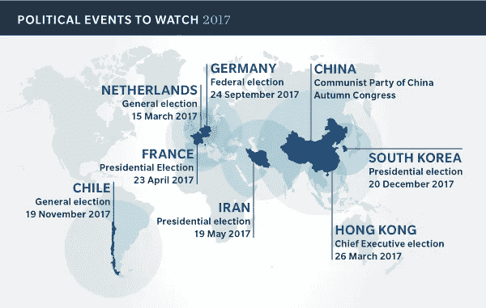

# 全球化的未来比我们知道的更加脆弱！

> 原文：<https://medium.datadriveninvestor.com/globalizations-future-is-more-fragile-than-we-know-5546a0dd0ac4?source=collection_archive---------20----------------------->

现在和过去的危机说明了一切，但乐观的是，这些都会过去的！

Photo by [Isaac Smith](https://unsplash.com/@isaacmsmith?utm_source=medium&utm_medium=referral) on [Unsplash](https://unsplash.com?utm_source=medium&utm_medium=referral)

NYU 斯特恩商学院和巴塞罗纳 IESE 商学院的教授 Pankaj Ghemawat。他在《外交政策》杂志上说:

> *尽管人们谈论着一个新的互联世界，在这个世界上，信息、思想、资金和人员可以比以往任何时候都更快地在地球上流动，但我们所认为的全球化实际上只存在一小部分。通过仔细观察公司、人民和国家之间的互动方式，我们看到的是一个刚刚开始意识到真正全球一体化潜力的世界。这些趋势的支持者不会告诉你的是，全球化的未来比你想象的更加脆弱。*

***金融危机，2008 年***

2008 年的全球危机支持了上述说法，因为贸易下降到远低于预期的水平。2008 年，全球贸易急剧下降。世贸组织预测全球出口将下降 9%。此外，从 2008 年 12 月到 2009 年 2 月，世界贸易量下降了 14%。在这三个月内，日本的出口下降到 29%。根据 CPB 世界贸易监测，2009 年 4 月 21 日，欧盟 15 国的出口在 12 月和 1 月分别下降 2.3%和 5.3%后，在 2 月比 1 月增长了 0.3%。

***英国(UK)退出欧盟(EU)，2016***

英国退出欧盟，对全球化的又一次强烈反对，对世界经济模式的明确拒绝，以及欧洲一体化思想的衰落。

外国直接投资尚未从 2008 年的金融危机中恢复过来。2016 年[*仅 G20 国家就出台了 350 项针对外贸的自由裁量措施*](https://voxeu.org/article/investment-and-protectionism-pre-g20-summit-briefing) ，而只有 100 项贸易自由化措施。这进一步阻碍了自由贸易的发展。

 [## 危机？风投适应的 3 种方式|数据驱动的投资者

### 当我写这篇文章的时候，一场全球性的危机正在发生。这不是第一次，也不会是最后一次。很多事情已经…

www.datadriveninvestor.com](https://www.datadriveninvestor.com/2020/03/22/crisis-3-ways-vcs-adapt/) 

***重大政治突发事件，2016***

最近引发民族主义和民粹主义的政治事件给全球化模式制造了一个漏洞。例如，唐纳德·特朗普(Donald Trump)在 2016 年赢得美国总统大选，但迄今为止，他只是在关注民族主义议程的情况下赢得了大选。更倾向于民族主义和保护主义的国家还有中国、印度、日本、俄罗斯和土耳其。这些下降的经济前景部分是由于增长疲软，可能是由全球贸易放缓和民族主义措施增加造成的。

[Marsh’s Political Risk Map 2017](https://www.marsh.com/jp/en/campaigns/political-risk-map-2017.html)

***2019 年新冠肺炎疫情火山爆发***

现在的疫情已经使大多数经济体走上了自力更生模式的生存模式。在微观层面上，这种疫情的影响是不可想象的，在宏观层面上，这种情况加速了“去全球化”。

目前的估计表明，2020 年，贸易将下降 13-32%，外国直接投资将下降 30-40%，国际航空乘客将大幅减少 44-80%。

根据世贸组织的预测，2020 年全球出口贸易将降至 2000 年代末的水平。

***乐观的看法***

尽管过去和现在的重大危机经历了重大挫折，但我们不能正确地说全球化正处于衰退阶段，但最好是说全球化似乎处于停顿状态。它经受住了过去的危机，所以我们预计在这次危机中也会如此。

全球一体化的纽带被粘合到了不可分割的程度！

**访问专家视图—** [**订阅 DDI 英特尔**](https://datadriveninvestor.com/ddi-intel)