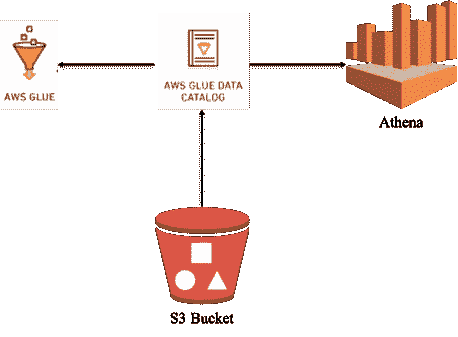

# 粘合爬虫优化/替代| Athena 用例

> 原文：<https://medium.datadriveninvestor.com/glue-crawler-optimization-alternative-athena-use-case-15cc5bdd94d6?source=collection_archive---------2----------------------->

这篇博客的目的是看看 Glue Crawler 的不同替代方案，以便使用 AWS Athena 查询来自 S3 的数据。在这里，我们将讨论一些可以避免爬虫的替代方案，但是这些可以根据用例进行调整。



Photo By [Ali Atakan](https://medium.com/@aliatakan) on [Medium](https://medium.com/)

“Amazon Athena 是一项查询服务，用于查询驻留在 AWS S3 上的数据。Athena 允许您运行标准 SQL 查询来查询来自 S3 的数据。”

“AWS **Glue crawler** 用于连接到数据存储，通过用于提取数据模式和其他统计数据的分类器的优先级列表进行处理，然后在元数据的帮助下填充 **Glue** 数据目录。”

需要爬虫来分析指定 S3 位置的数据，并生成/更新**胶合数据目录**，该目录基本上是实际数据的元存储(类似于 [Hive metastore](https://cwiki.apache.org/confluence/display/Hive/Design#Design-Metastore) )。换句话说，它保存了关于数据的物理位置、模式、格式和分区的信息，这使得通过 Athena 查询实际数据或在 Glue 作业中加载数据成为可能。

因此，除了这些好处，它还有一个成本因素:
* **$0.44 每 DPU 小时，**每秒计费，每次爬虫运行最少 10 分钟。
有关定价的更多信息，请访问此[链接](https://aws.amazon.com/glue/pricing/)。

**示例:**
考虑一个大数据项目，当管道按要求调度或运行，大量数据驻留在 S3 时，大量使用爬虫。对于每一次流水线运行，都会形成新的数据分区，这些信息需要在 Glue 数据目录中更新，以便使用 Athena 查询这些分区上的数据。

我们知道 AWS 为以上用例推荐的方式是运行
**胶水爬虫，还有哪些方式？**

Athena DDL 语句，可以避开爬虫而创建外部表:
`create external table Student(col1 string, col2 string) partitioned by (dept string) location 'ANY_S3_LOCATION';`

**例如对于 CSV 文件:**

```
CREATE EXTERNAL TABLE `student`(
 `code` string, 
 `state` string)
PARTITIONED BY ( 
 `process` string)
ROW FORMAT DELIMITED 
 FIELDS TERMINATED BY ‘,’ 
STORED AS INPUTFORMAT 
 ‘org.apache.hadoop.mapred.TextInputFormat’ 
OUTPUTFORMAT 
 ‘org.apache.hadoop.hive.ql.io.HiveIgnoreKeyTextOutputFormat’
LOCATION
 ‘s3://bucket/tablefolder/’
TBLPROPERTIES ( 
 ‘classification’=’csv’, 
 ‘columnsOrdered’=’true’, 
 ‘compressionType’=’none’, 
 ‘delimiter’=’,’, 
 ‘typeOfData’=’file’)
```

假设当前它包含两个分区:

```
1) s3://bucket/student/process=1/2) s3://bucket/student/process=2/
```

要添加新分区，只需运行 alter table 命令:

```
ALTER TABLE student ADD PARTITION (process = ‘3’) LOCATION ‘s3://bucket/student/process=3/’
```

更新分区信息的另一种方法是简单地加载分区，使用:

```
MSCK REPAIR TABLE student;
```

上面给出的命令也可以在支持的编程环境中执行，例如 python:

```
*athena = boto3.client(‘athena’)
response = athena.start_query_execution(
 QueryString = “MSCK REPAIR TABLE* student*”,
 QueryExecutionContext={
 ‘Database’: ‘somedb’
 },
 ResultConfiguration = {
 ‘OutputLocation’: “s3://bucket/*student*/”
 })*
```

或者，对于 Alter Table 操作，您可以获取分区列表并为新分区运行 create _ partition/batch _ create _ partition。

```
response = glue_client.get_partitions(
 DatabaseName=’hira-glue-database’,
 TableName=’glue_testa’
)
partition_list = response[‘Partitions’]
```

创建新分区:

```
create_partition_response = client.batch_create_partition(
        DatabaseName=l_database,
        TableName=l_table,
        PartitionInputList=each_input
    )There is a limit of 100 partitions in a single api call Or for other queries like alter table.params = {‘region’: ‘eu-central-1’,‘database’: ‘databasename’,‘bucket’: ‘your-bucket-name’,‘path’: ‘temp/athena/output’,‘query’: ‘SELECT * FROM tablename LIMIT 100’}response = client.start_query_execution(QueryString=params[“query”],QueryExecutionContext={ ‘Database’: params[‘database’] },ResultConfiguration={ ‘OutputLocation’: ‘s3://’ + params[‘bucket’] + ‘/’ + params[‘path’] })
```

**注:**

" DDL 查询或分区检测是免费的."

“雅典娜并没有为这些请求单独向你收费，但 S3 得到的收费确实适用。此外，MSCK 将扫描所有的分区。如果您正在同步分区，最好使用 Alter Table 命令。

“一旦你有很多分区，MSCK 修复表就会变得非常慢。慢到你可能无法再运行它，因为你的查询被限制在 30 分钟内。”

**结论:**

> 简而言之，在我们有静态或不频繁变化的模式的用例中，为了成本效率，我们可以选择 Athena DDL 来代替 Glue Crawlers，但是对于频繁变化的模式，Crawler 在架构上将是更好的选择。