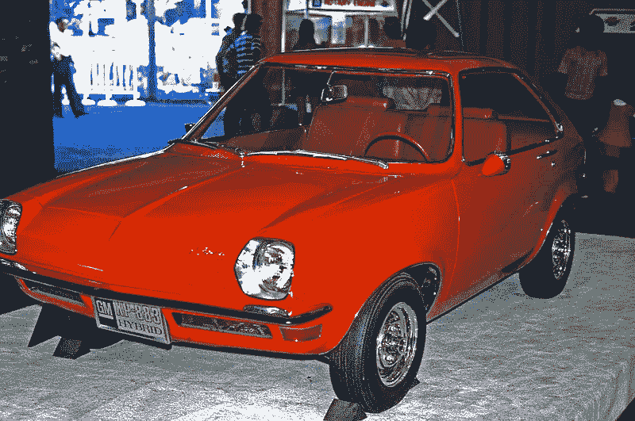

# 通用汽车在 1969 年制造了一款混合动力车，但没有理会它

> 原文：<https://medium.datadriveninvestor.com/gm-created-a-hybrid-in-1969-and-ignored-it-11d78e59b010?source=collection_archive---------5----------------------->

## 知道何时杀死你的摇钱树

General Motors XP-883 — [FredAParks](https://commons.wikimedia.org/wiki/File:GM_XP-883_Hybrid_Car.jpg) / CC BY-SA ([https://creativecommons.org/licenses/by-sa/3.0](https://creativecommons.org/licenses/by-sa/3.0))

> “如果有一辆汽车从在城镇周围使用的电力驱动变成了在高速公路上行驶的汽油驱动，那岂不是很棒？不可能？不切实际？不——通用汽车已经造了一辆，这很有意义，我们觉得如果他们不把它投入生产，他们就错过了一个机会。”
> 
> 简·p·诺比和吉姆·邓恩，《大众科学》，1969 年 7 月

在你的脑海中重温 1969 年发生的所有事情。

*   甲壳虫乐队将在苹果唱片公司的屋顶上举行他们的最后一场演出。
*   伍德斯托克音乐节吸引了 30 多万人来到纽约的一个泥坑。
*   尼尔·阿姆斯特朗会在月球上行走。
*   波音标志性的 747 将会推出。
*   通用汽车将制造一款实用的混合动力车。

等等，什么？那群人里的某些东西似乎不合适。通用汽车在 1969 年制造了混合动力汽车？

*那是现代技术，由丰田在 90 年代末首次发布。*

这一点你就错了。

从技术上来说，如果你是一个历史迷，第一辆混合动力汽车将由费迪南德·保时捷在 20 世纪初创造，并被称为 [Elektromobil](https://auto.howstuffworks.com/fuel-efficiency/hybrid-technology/history-of-hybrid-cars1.htm) 。但是，这些汽车相对较快地从历史中消失，取而代之的是我们今天更熟悉的标准汽车。

然而，通用的混合动力车看起来很像你今天熟悉的标准车。庞蒂亚克 XP-883 将仅依靠电动马达运行，速度高达每小时 10 英里，之后燃气发动机将启动并接管工作。当燃气发动机推动汽车时，它也会通过飞轮驱动的交流发电机给电池充电。

如果有必要，你还可以将汽车连接到外部 110 伏电源插座上给电池充电。谈到电池，其中 6 个被放置在后地板下。由于独立后悬架，他们可以坐在后轮轴通常做的地方。

这辆车几乎和高尔夫球车一样快，最高时速只有 60 英里，日历速度为 28 秒。然而，它并不是为赛车而设计的。它的用途是城市通勤车。如果你把除司机座位之外的所有座位都折叠起来，这个小框架还包含了一个令人惊讶的 84 英寸的货物空间。

显然，这不是我们今天驾驶的梦想中的机器，但想法是存在的，而且是可行的。通用汽车公司拥有一辆可以颠覆整个汽车工业并改变运输方式的汽车原型。

发生了什么事？即使在《大众科学》的文章中，通用高层也表示他们对这个项目并不完全确定。

所以，你知道发生了什么。通用汽车的高管们选择了一条简单的道路，继续做他们知道会奏效的事情——像其他人一样制造大型耗油汽车。最终这将让丰田有空间攻击他们，剩下的就是历史了。

# 神圣的摇钱树

Photo by [Rob Hampson](https://unsplash.com/@robman?utm_source=medium&utm_medium=referral) on [Unsplash](https://unsplash.com?utm_source=medium&utm_medium=referral)

> “关于移动技术，我们都记得没有手机之前的世界，但我们大多数人可能不记得手机的基本概念是 1945 年在《周六晚邮报》的一篇文章中首次向公众介绍的。正如前 FCC 首席经济学家托马斯·黑兹利特(Thomas Hazlett)在他的书《政治光谱》(The Political Spectrum)中讲述的故事，时任 FCC 主席杰特(J.K. Jett)预测，数百万美国人很快就会使用“手持通话器”，而且发放使用这项新技术的许可证的过程“不会很困难”“—[FCC 总委员会 Thomas m . Johnson Jr .在佛罗里达州经济俱乐部的演讲](https://docs.fcc.gov/public/attachments/DOC-355127A1.pdf)，2018 年 11 月

在这种情况下，通用汽车的想法并不独特。许多公司倾向于牺牲新技术来崇拜他们神圣的摇钱树。这样做才有意义。今天你为什么不做更多能让你赚钱的事情呢？它目前确实能填补收入报表，但它往往明天就能杀死你。

例如，美国电话电报公司[实际上在 20 世纪 40 年代中后期发明了](https://medium.com/datadriveninvestor/cell-phone-technology-should-have-been-introduced-after-wwii-e3adcc4f79e4)蜂窝技术。尽管他们开发了这项技术并向 FCC 申请了使用部分可用带宽的许可，但他们在 1947 年被否决了。完整的故事并不完全是政府的阻挠。

美国电话电报公司从未真正推动这个问题。他们垄断了固定电话通信。发展手机有什么意义，它只会蚕食他们的摇钱树？通用汽车的想法大致相同。

人们也可以在柯达看到这种现象——他们实际上在 1975 年开发了数码摄影。他们搁置了这个想法，以保持他们的电影摇钱树喂养和快乐。

我敢肯定，你可能还能举出许多其他公司，它们错过了创新技术，拥抱了当前商业模式产生的摇钱树。在我的脑海中，我可以想到 [Blockbuster Video](https://www.businessinsider.com/blockbuster-ceo-passed-up-chance-to-buy-netflix-for-50-million-2015-7) 放弃购买网飞的机会。雅虎也放弃了收购谷歌和脸书。

今天的吸引力和利润掩盖了未来通过新方法和利润流取得成功的可能性。

# 从今天获利的同时发展明天

如今，我们很容易指出这种灾难性的想法。我们有先见之明。我们可以看到他们当时错过的创新，并知道它今天会做什么。在通用制造混合动力汽车的同时，他们还开发了一种以蒸汽为动力的汽车——这在 1969 年的同一期《大众科学》杂志上发表过。

虽然听起来很荒谬，但通用汽车的高管们可能会像看待蒸汽汽车一样看待混合动力车——这是一种奇怪的好奇心，可能不会有任何结果。那么我们应该如何看待这些错过呢？我认为我们应该把它们看作是对我们现在的一次警告。

我们很可能是忽视下一个突破性技术的公司的一部分。在未来的商业教科书中，我们可能会成为反面教材的一部分。那么，我们该怎么办？

Photo by [Bryan Angelo](https://unsplash.com/@bryanangelo?utm_source=medium&utm_medium=referral) on [Unsplash](https://unsplash.com?utm_source=medium&utm_medium=referral)

我们可以从亚马逊身上学到一个积极的教训。不管你对杰夫·贝索斯的感觉如何，作为亚马逊的队长，他已经做出了一些出色的举动。

*   当电子书开始出现时，他没有忽视它们，也没有像美国电话电报公司或通用汽车那样试图埋葬它们。亚马逊开发 Kindle 就是为了从中获利。
*   亚马逊最初是一家图书销售商，但后来扩张成了一个销售一切的在线市场。
*   亚马逊也挤入了有声读物类别，超越了数字和印刷媒体。
*   当送货服务跟不上他们的数量时，他们发展了自己的运输部门。

也许他们所有的创新中最好的东西是提前思考，而不是过分关注今天。贝佐斯在与投资者的电话会议上发表了 T2 的评论。

> “如果你经常发明，并愿意失败，那么你永远不会达到真的需要赌上整个公司的地步。”

同样，谷歌创建了他们的“ [X 公司](https://x.company/)”，在那里他们“创造了突破性的新技术来解决一些世界上最困难的问题”。这些想法中最成功的都变成了自己的公司。

创意部门并不新鲜。美国电话电报公司有著名的贝尔实验室，他们创造了后来被忽视的蜂窝技术。

然而，谷歌和亚马逊所做的并不是忽视可能扼杀他们主要摇钱树的技术，而是开发它。这应该是我们从通用汽车的失误中吸取的最大教训。你仍然可以在从今天获利的同时为明天生产产品。

# 想象一个不同的世界

> “你必须愿意长时间被误解。如果你以一种新的方式做某事，我不在乎它是什么，相对于传统的方式，人们最初会误解它。会有善意的批评者，他们通常想要最好的结果，但他们担心这种新的方式。当然也会有自私的批评家，他们对传统的[方式]有既得利益。他们有一些与传统方式相关的利润流。”—杰夫·贝索斯，2012 年 re:发明会议通过[尼尔·帕特尔](https://neilpatel.com/blog/lessons-from-jeff-bezos/)

我要你好好想想这件事。想象一下，如果通用汽车在 1970 年或 70 年代中期推出大规模生产的混合动力车，今天的世界会发生多大的变化？通用汽车的全球地位会发生多大变化？

想象一下，如果美国电话电报公司在 20 世纪 50 年代早期大力推进蜂窝技术，今天的电信会是什么样子？他们的公司会是什么样子？

所有这些现在都是局限于历史的“如果”。然而，我们的未来不一定是错过。我们可以从这些错过的机会中学习，在从今天获利的同时发展未来。

当一项杀手级技术即将出现时，我们必须学会牺牲我们的摇钱树。否则，我们可能会被认为是放弃蜂窝技术或忽视混合技术的高管。