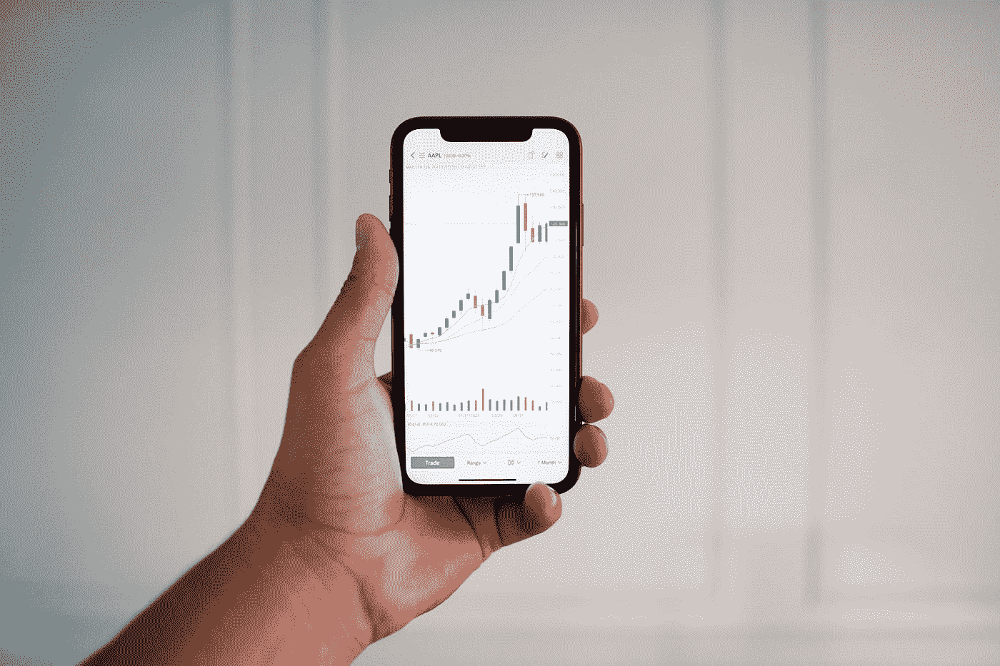

# GME，AMC，BB！WTF？斯通克斯上去了！

> 原文：<https://medium.datadriveninvestor.com/gme-amc-bb-wtf-stonks-go-up-faf711f6ef1?source=collection_archive---------13----------------------->

Photo by [MayoFi](https://unsplash.com/@mayofi?utm_source=medium&utm_medium=referral) on [Unsplash](https://unsplash.com?utm_source=medium&utm_medium=referral)

## 咆哮的 20 年代回来了吗？

当罗宾汉开始时，市场发生了根本性的转变，这种转变最终向全世界展示了出来。像[特斯拉](https://stocktwits.com/symbol/TSLA)、 [Gamestop](https://stocktwits.com/symbol/GME) 、 [AMC](https://stocktwits.com/symbol/AMC) ，甚至[黑莓](https://stocktwits.com/symbol/BB)这样的股票的融化是所谓的**迷因股市经济**的结果。

我说，来吧！

这是投资者行动主义的一部分，它将志同道合的散户投资者聚集在一起，买入(出价)卖空的股票，并在这个过程中摧毁对冲基金。曾经被认为是对冲基金“榨取利润”的弱者，现在已经变成了强者。

Big Fish, Little Fish

这些散户投资者都很年轻，他们经历过 2008 年甚至 2000 年的市场调整，那次调整彻底摧毁了主街。他们可能看到他们的父母在丧失抵押品赎回权或其他灾难中失去了他们的房子。他们现在想分一杯羹，他们正在利用技术和组织来实现这一目标。

这是操纵市场吗？我不这么认为。这是言论自由，就像一个愚蠢的特朗普集会。你只是召集了一群疯狂的散户投资者，他们高呼，“**我们喜欢这只股票！我们喜欢股票！**

堆成一个股票，然后购买蘸。这被亲切地称为 BTFD(买他妈的蘸酱)。

看看这些动作。GME 对我来说是一生一次的事件，但现在可能会成为常态。赚钱太简单了，即使是我在过去几天也是如此。

GME, Stonks go up!

Reddit 上有传言说要把 GME 的身价提高到 1000 美元。我认为这不太可能，但你永远不知道这些“孩子”的情况。

BB, Stonks go up!

黑莓是另一个引起他们注意的宠儿，你可以看到它在昨天市场下跌时大幅上涨并强势收盘。

AMC, Stonks go up!

如果你看一下 AMC(上图)，你可以看到卖空者试图把它推回下跌，但 r/WSB 的人留住了 BTFD，把它推高到收盘。如果我见过的话，这是一个巨大的“绞刑人”图表模式。

## 这次不一样！

这一次，关于 2000 年市场的说法有所不同，我们都知道结果如何。我相信我们现在看到的是一个新的“咆哮的 20 岁的 T21”的开始，我预计在它最终崩溃后会有一场大规模的萧条。我可能是错的，我经常是错的，但我相信历史会重演。

我们就是控制不住自己。

咆哮的 20 人队回来了，但这次不同。资金已经观望了太长时间，现在特朗普走了，它将开始涌入。特朗普和拜登领导下的所有刺激(汽油)都在四处晃荡，渴望成为阿尔法，它正在到来，这些 Redditors 是众所周知的“火柴棍”。'

这一次，将由散户投资者(如果他们能抓住不放的话)说了算。

财富将被重新分配给模因制造者。我知道这很疯狂，但这些年来我在交易和投资中学到的一件事是，你要“看到什么就交易什么”。

**石头上去了！**

*关注我的* [*股票 Twits*](https://stocktwits.com/neuralmarket) *或者阅读访问我的博客* [*神经市场趋势*](https://neuralmarkettrends.com/) *。*