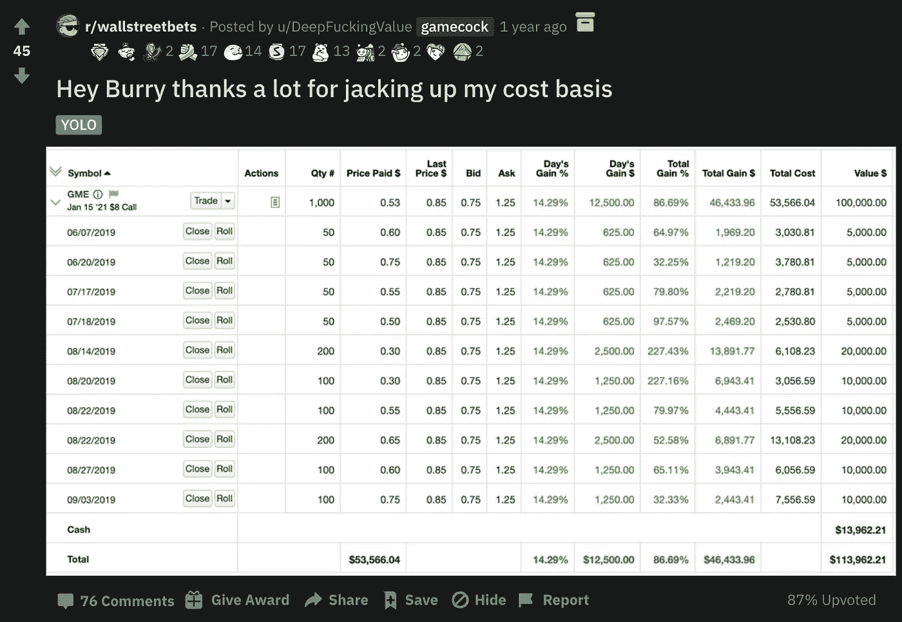
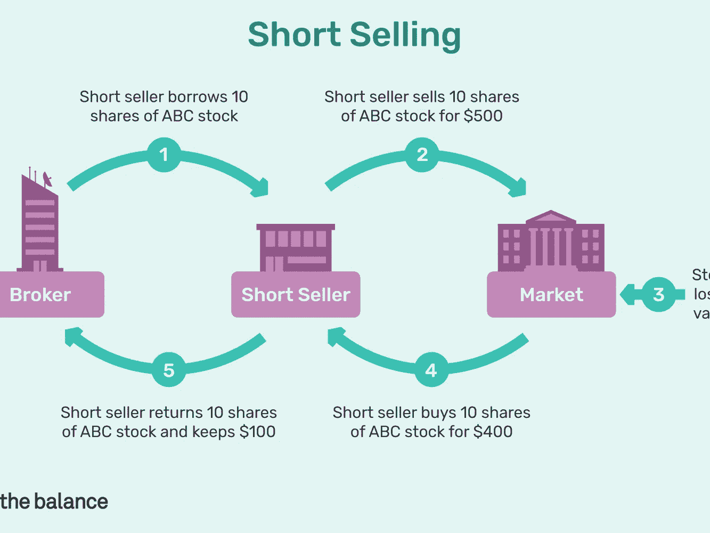
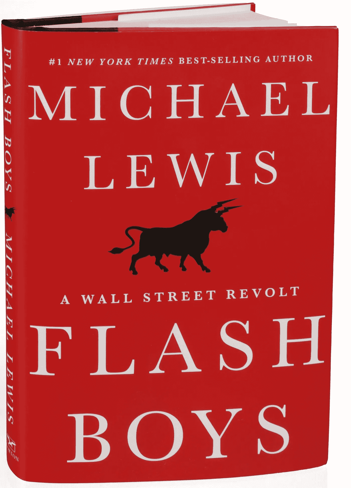

# GME 和华尔街赌注——需要打破不公正的金融科技轨道

> 原文：<https://medium.datadriveninvestor.com/gme-wallstreetbets-the-need-to-bust-the-unjust-fintech-rails-33a1b04071ea?source=collection_archive---------11----------------------->

## 一名前对冲基金工程师解释了 GME 和华尔街投资者如何证明金融科技行业的恶化及其运行的过时轨道。2008 年的崩盘、2010 年的快闪男孩反抗，以及现在 2021 年的罗宾汉/Reddit/GME 起义，都指向一个明确的结论——游戏被操纵了。我们要么成长，要么冒永远重复这一过程的风险

Original Image from a scene in [The Big Short](https://www.imdb.com/title/tt1596363/)

## 介绍

我们的生活质量就像生活运行的轨道一样好。我们生活的每个方面都有自己的基础设施。我们的交流在互联网上进行。我们的交通工具在公路上行驶。每年都有新技术进入市场，并在其影响的领域开创了一个高度繁荣的新时代。

我们的货币和市场体系上一次升级是什么时候？有些人会说，那是我们脱离金本位制的时候。无论如何，我们的货币体系和市场运作方式的升级至少已经过时了 50 年，它吸干了我们生活在一个公平、自由和诚实的世界中的任何情绪。游戏被操纵了，但不一定如此。

# 在本文中，我们将介绍

## 1.发生了什么

华尔街赌注，GME 和对冲基金

## 2.这些问题

被公之于众

## 3.下一步是什么

我们需要从这件事和过去中学到什么

这篇文章最精彩的部分是:

> **此时，什么真相都无所谓了**

如果你已经知道发生了什么，你可以跳到下一节的**，我会在那里解释我的意思。**

# 发生了什么

我在一家对冲基金工作了两年，担任支持工程师/投资分析师。所以，不，我不知道幕后发生的一切，我在投资策略/阿尔法生产方面看到了更多——这本身可能是另一场对话。这其中有些可能是错误的，因为故事仍在展开，但无论如何，这是我们*认为*正在发生的事情，光是这一部分就足以让我们抓狂， ***在当前的金融格局中，信任为零。这不可能每 10 年发生一次。***

## 1.背景

华尔街赌注(wall street bets)(WSB)是一个在线论坛，在这里“正常人”玩股票市场的游戏，然后就此发帖。但与 [r/investing](https://www.reddit.com/r/investing/) 不同的是，他们自称为“degens”(堕落者的简称)。他们解释自己的一句话是“4chan 发现了一个彭博终端”。如果没有我的解释，你还不知道“德根斯”是什么意思，那么在你理解这种文化之前有很多步骤要做，这种文化源于同样精彩和恐怖的 [4chan](https://www.4chan.org/) 。

有了互联网和像 Robinhood 这样的免佣金交易平台，任何人进入股票市场并开始交易都比以往任何时候都容易。罗宾汉尤其是这一群体最喜欢的方式，因为他们的整个平台是“金融民主化”和“让人们交易”。他们的目标受众是散户，确切地说是华尔街的人。

Image from [Robinhood](https://robinhood.com/)

## 1.5 了解激励措施

Robinhood 可以提供一个免费的平台，因为他们实际上是通过订单路由或“[订单流支付](https://www.investopedia.com/terms/p/paymentoforderflow.asp)”来赚钱的。这是指经纪人将订单卖给“做市商”或进行交易的人。他们想要这些交易可能有很多原因，但最简单的是:

*   用户以 26 美元的价格订购股票
*   订单被发送给做市商
*   经纪人以 25 美元获得股份
*   经纪人将 1 美元的差价收入囊中

从长远来看，他们这样做可以赚很多钱。值得注意的是，经纪人受法律约束，以获得“[最佳执行](https://www.investopedia.com/terms/b/bestexecution.asp)价格，并诚实地进行这些交易。与我共事的交易员告诉我，他们更担心的是如何做到最佳执行，而不是内幕交易。最佳执行是这样一条法律:经纪人必须尽其所能让客户以最优惠的价格购买。这看起来像是一个非常简单的*游戏来“提高”应用程序的价格，这样他们就可以多赚几美元。像这样:*

*   一只股票的价格是 26 美元，但是 Robinhood 列出的做市商价格是 26.10 美元
*   订单被发送给做市商
*   经纪人以 25 美元的价格获得股份
*   经纪人多赚了 0.10 美元

如果 Robinhood 知道其做市商在这么做，他们需要将订单发送给更公平的经纪商。Robinhood 过去曾因未能为客户争取到最佳价格而陷入麻烦，并违反了这一“最佳执行”原则。 Citadel (Robhinhood 最大的客户)[也面临同样的违规](https://www.sec.gov/news/pressrelease/2017-11.html)。据说 citadel[给了 Robinhood 40%的业务](https://www.thestreet.com/phildavis/news/robinhood-is-said-to-get-40-revenue-from-hft-firms-like-citadel)。

这很重要，因为这似乎存在巨大的利益冲突……因为确实存在。这并不一定意味着任何邪恶的事情正在发生——但这无关紧要。这已经是一个大问题，因为执行你的交易的同样的人也是同样一群可以打赌你的交易是错的人！

## 2.火山爆发了

1 这样的 r/wallstreetbets 用户名为 u/DeepF***ingValue 开始发帖讲述自己是如何长 GameStop 的，因为#YOLO。

Image from [Reddit](https://www.reddit.com/r/wallstreetbets/comments/d1g7x0/hey_burry_thanks_a_lot_for_jacking_up_my_cost/)

该论坛最初基本上拒绝了他，说 subreddit 以这类东西闻名。

Comment from [Reddit](https://www.reddit.com/r/wallstreetbets/comments/d1g7x0/hey_burry_thanks_a_lot_for_jacking_up_my_cost/eznvqru?utm_source=share&utm_medium=web2x&context=3)

但事实上，他已经看到 Gamestop [被大量对冲基金做空超过 140%](https://www.thestreet.com/mishtalk/economics/naked-shorting-is-illegal-so-how-was-gamestop-140-short) 。他还注意到，GME 仍然拥有大量资产，尽管它只是疫情的一个实体。不仅仅是 GME，其他公司如 AMC、维珍银河和黑莓也有很多空头。

现在你可能会想，“等等什么做空”，怎么可能是 140%？Wtf？

## 2.5 了解短裤

[做空](https://www.investopedia.com/terms/s/shortselling.asp)(卖空)就是你从某人那里借一只股票，卖出，以后再还回来。这个想法是你在赌股票会贬值。如果我以 100 美元做空 1 股 APPL 股票，这意味着我向弗兰克借了 1 股，以 100 美元卖出，然后承诺归还 APPL 的股票。如果价格跌至 50 美元，我以 50 美元买入，将股票归还给我的朋友，我刚刚赚了 50 美元。通常情况下，弗兰克也会向我收取溢价，借他的股票。“是的，你当然可以借，但每一天，它是你的，我会收取你 5%的价格”。

现在，这是很多财务压力发生的地方。你拖得越久，你付给弗兰克的钱就越多。如果价格继续上涨，你可能不得不以越来越高的价格购买股票。

Original Image from [TheBalance](https://www.thebalance.com/the-basics-of-shorting-stock-356327)

所以最终，你不得不妥协，购买股票，或者破产。这就是所谓的[短挤压](https://en.wikipedia.org/wiki/Short_squeeze)。这里的另一件事是，如果你持有大量空头头寸，为了弥补这些头寸，你必须买入大量你做空的东西。供应和需求将导致价格进一步上涨，因为很多人购买来弥补他们的空头。

这里的潜在风险是不封顶的。

现在怎么可能 140%做空？空头百分比是现有股票中有多少处于空头头寸，这可以超过 100%。如果我借入一股股票，然后卖出，而我卖给的人又借出，那么这一股股票就被借出了两次，基本上是一股股票卖空额的两倍。

这是帕特里克的一贯作风

## 3.事情升温了

所以这个叫 DeepF***ingValue (DFV)的家伙已经做了一年多的钻石交易了，华尔街的其他人开始注意到了。[耐嚼的创始人瑞安·科恩](https://en.wikipedia.org/wiki/Ryan_Cohen)开始购买 GameStop 的股票，数字开始上升。他计划让公司扭亏为盈。华尔街的赌注开始增加。GME 的数量开始上升，这个几个月来一直受到评论攻击的家伙(DFV)开始获得数字支持。他们开始意识到大挤压会把价格推得更高，他们有机会赚很多钱。

此外，“吃掉富人”和“坚持给他们”的叙事开始出现。经济阶层之间一直存在摩擦，这基本上是永恒的，21 世纪也不例外。

## 4.嘘，击中风扇

到目前为止，所有这些都是公平的游戏。没有串通，这并不违法，但它开始迅速升温。Gamestop 从$15 -> $300。这些对冲基金开始亏损，损失惨重。Melvin Captial 管理的资产总额为 120 亿美元，[,如今已跌至区区 50 亿美元。](https://www.cnbc.com/2021/01/31/melvin-capital-lost-more-than-50percent-after-betting-against-gamestop-wsj.html)

随着数字开始越来越多，可疑的事情开始发生，华尔街 bets discord 被关闭，Reddit 线程被禁用一段时间，新闻频道称 WSB 集团为种族主义怪物。美国消费者新闻与商业频道为赞助内容付费，以表明对冲基金已经平仓。

梅尔文资本和朋友们正在输掉这场游戏，工人们花了数年和数千美元接受教育，所有这些都是因为“股票上涨”而陷入亏损状态。Reddit 喜欢它，对冲基金讨厌它。如果你曾经见过有人在某项运动上练习多年，并被认为是他们领域的专家，拿一个职业篮球队来说，他们出现在一个 tounament 面前，让他面对那些做愚蠢的特技投篮的球员，把他们都榨干——同时大笑。基本就是这么回事。

梅尔文资本尤其有一些有趣的联系。他们的业务父亲是 Citadel，这是一家做市商，罗宾汉在这里进行大部分交易，并获得大部分利润。

## 5.爆炸

突然之间，世界意识到他们正在玩一场游戏，而传统玩家不想让他们参与其中。他们觉得自己脚下的地毯被拉开了，因为当那些大家伙欺负你的时候，那是因为你笨，但是当你欺负他们的时候，你就完了。

Robinhood 和许多其他券商不再允许在 GME、AMC、黑莓和其他 Reddit 热门股票上买入。你只被允许出售。大量报道称，人们被迫卖掉他们在 GME 的头寸。市场停顿了一段时间——这一切都是因为一群 Redditors 似乎已经破解了这个系统。

Image from [Twitter](https://twitter.com/joemccann/status/1354859879337320452)

人们失去了理智。每个人都开始认为这是一次有针对性的打击，以保持对冲基金的健康，并操散户投资者，因为他们走得太远了。只允许卖出是操纵市场的一种明确方式，如果你只允许卖出，那么价格就会下跌。如果价格下跌，大玩家可以开始补仓。

[Trump 开始发推特，AOC 开始发推特，特德·克鲁兹，马克·库班，加里·维，](https://www.politico.com/news/2021/01/28/gamestop-stock-aoc-trump-jr-cruz-463539)世界开始关注似乎是对冲基金在改变人们的规则，就在这一切的顶峰。

互联网爆炸了。

我爆炸了。

看起来很糟糕。

它 ***看起来*** 像梅尔文资本和其他对冲基金所谓的 daddy Citadel 告诉罗宾汉停止让人们购买 GME，因为这伤害了他们。人们甚至怀疑这一事实已经表明了两个重大问题:

**1。力量悬殊有多疯狂**

**2。信任的制度性缺失**

弗拉德出来，说了一些非常奇怪的神秘的废话。

Who prepared you for this call?

他要么是个糟糕的演说家，要么是个骗子，要么是个白痴。他谈到没有足够的钱支付交易(清算所有很多事实，你必须拿出自己的抵押品)，但他也说这不是钱的问题…那到底是哪个？

我可以解释所有的技术细节，我已经研究过了，是的，他所说的背后有很多优点。交易所需要提供抵押品来处理交易，而在 GME，所需的抵押品已经达到了顶点，但仍然很难判断这是否是全部情况，或者为什么这些是规则的一部分。我也不是说这些邪恶的行为都是真的，我想说的是这是否真的只是一个大误会并不重要。在这一点上，系统的问题已经暴露无遗。

# 这些问题

这就是为什么这么多人心烦意乱。他们感觉发生了以下事情。

> 2008 年，金融部门因贪婪于平民百姓的游戏而毁了他们。没有一个高管进了监狱，而[你和我不得不用我们的税收保释他们。](https://en.wikipedia.org/wiki/Emergency_Economic_Stabilization_Act_of_2008)
> 
> 2021 年，当普通人摧毁了金融部门(或至少是一小部分)时，他们改变了游戏规则。

现在，这是真是假已经不重要了，而且*看起来*好像事情开始稳定，这确实是一个巨大的流动性问题。

我见过很多资产管理行业的人(对冲基金是资产管理公司的一种)。有些人很棒，当他们早上起床去工作时，他们明白他们的客户是希望在他们出来后退休的教师、警察、养老基金、在同一份工作上工作了 50 年的辛勤工作者。他们中的一些人，没有赚到很多主流媒体今天描绘的数十亿，有些甚至没有赚到 6 位数。

我也遇到过像他们说的那么坏的人。他们不在乎和谁一起工作，只想从系统中榨出每一分钱。

这篇文章不是要讨论上层阶级和中下层阶级的斗争——那完全是另一个话题，我不在乎你是追逐阿尔法还是憎恨富人。

不管这种情况的结果如何，几十年来，整个行业都看到了这些问题。至少从近 10 年前开始，我们还没有解决导致 2008 年金融危机的问题。

## 1.透明度

谁在查这些公司？为什么市场停止了？

## 2.市场平等

我们有一个可以被玩这个游戏的人人为关闭的自由市场吗？

这可能是整个系统中最令人震惊的冒犯。当市场可以关闭时，我们怎么能说我们生活在一个自由市场中。

## 3.结算期和清算所效率低下

这只是一个旧系统。给你的银行账户加 3 个 0，再从交易对手那里减去，需要多长时间？

## 4.交易所、经纪商和市场监管者之间的利益冲突

合同上的利益冲突？狂野。

## 5.对系统的信任

没有信任。

不仅是普通人，对冲基金也不喜欢这个系统。

Image from [NYTimes](https://www.nytimes.com/2014/04/01/books/flash-boys-by-michael-lewis-a-tale-of-high-speed-trading.html)

2014 年， [Flash Boys](https://www.amazon.com/Flash-Boys-Wall-Street-Revolt/dp/0393351599) 这本书发行了，它讲述了华尔街对[高频交易员](https://www.investopedia.com/terms/h/high-frequency-trading.asp)的反抗，以及*他们*如何操纵传统资产管理公司和对冲基金的市场。事实上，我去年在一篇文章中写过[同样的主题，这也是我当初为什么转行的主要原因。](https://medium.com/@patrick.collins_58673/actually-fair-stock-markets-why-you-need-to-be-bought-in-on-decentralized-exchanges-now-b98b325282d5)

# 下一步是什么

> 无论是交流、言论自由还是公平参与市场，“品牌型”平台永远会把自己的垄断利益放在普通用户之前。随着每个人越来越意识到这一点，“基于数学/密码的”平台将成为所有用户为了安全而蜂拥而至的地方。
> 
> 说到底，这整件事的最终结果是什么并不重要。似乎有一件事非常清楚。
> 
> [**谢尔盖·纳扎罗夫**](https://twitter.com/SergeyNazarov/status/1354990887604899843)**—**[**chain link**](http://chain.link/)联合创始人

> 当前的系统被打破了

对冲基金认为这个系统已经崩溃。人们认为这个系统已经崩溃了。没有人知道关起的门后发生了什么，谁在和谁说话，谁控制着什么，哪个集中的实体真正掌握着主动权。

而且这个系统不仅破了， ***还老了。***

我们正在 30 年前运行的同一条金融轨道上工作。我们有相同的主要参与者和相同的问题，但在这个世界上，一切都快了 10 倍。

想象一下，你试图用 30 年前的方式和一个朋友联系。或者租一部电影。或者只是买些家具。我还没有踏进目标商店，因为我可以直接[增强现实](https://en.wikipedia.org/wiki/Augmented_reality)我想看看它是否适合我的房间，然后直接订购到我的门口。现在的世界比以前先进多了。

> 为什么我们的货币体系和市场不是呢？

这是我换行业做现在工作的一个主要原因。我们正处于人生中一个疯狂的转折点，在这里我们可以看到整个鸟类产业的重新崛起。我们有一项技术，可以让我们运行一个分散的市场，没有人可以关闭它。所有的选择都是**透明的**，我们可以通过检查公共数据库或分类账来验证自己。比起等待 2-3 个工作日，我们有**更快、更便宜、**的方式让我的银行账户转账 20 美元。我们需要我们的货币系统像我们的信息系统一样前进。

区块链有所有这些的答案。特别是针对 whole 罗宾汉事件。

*   我们有[以太坊](https://ethereum.org/en/)建筑[分散金融(DeFi)](https://www.coindesk.com/what-is-defi) ，在那里市场不属于任何人，并且不能被关闭。
*   我们有像 Synthetix 这样的协议来解决这个问题，即一个公平分散的股票交易所不受大玩家控制，而且永远也不可能。
*   我们有比特币作为更快的货币系统，当随机的量化宽松货币贬值时，它不会膨胀到疯狂的百分比。
*   我们有一个允许人们借和卖而不会被贪婪的拇指挤压的手段。
*   我们有[链节](https://chain.link/)带来了链上的诚实和确定的真理，没有潜在的偏见。
*   Set 协议允许资产管理公司在与其他人相同的基础上进行投资组合。
*   Uniswap 是最简单也是最神奇的资产“交换”协议。

Original image from [Coinmonks](https://medium.com/coinmonks/6-reasons-why-you-should-become-a-blockchain-engineer-9954e26105dd)

当然，总会有问题，但一个向你出售股票的人不押注股票会暴跌的世界是我渴望生活的世界。我知道很多人也是。这就是我换行业的原因。这就是我涉足加密货币的原因。帮助我们到达一个人人平等的地方。这项技术仍然是新的，还在研究中，但是随着它的进步，我们越来越接近一个可以解决这些问题的世界。

每次你感到疼痛，那就是尖叫着要出去的改善。我们感受到了巨大的痛苦。让我们找到机会，否则，再过 10 年，这种事还会发生。

我对这个话题的意识流视频。