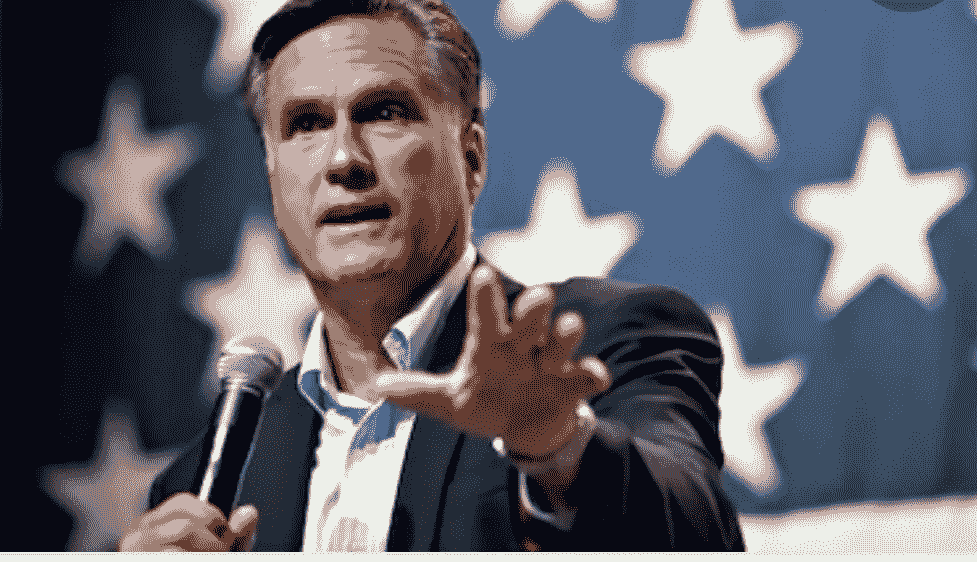

# 不管是不是上帝，米特罗姆尼仍然是一名共和党人。

> 原文：<https://medium.datadriveninvestor.com/god-or-no-god-mitt-romney-is-still-a-republican-1944fd7bad9d?source=collection_archive---------17----------------------->

## 民主党能从反对党学到什么？

Photo courtesy of Shutterstock.com

几乎要哭了的参议员罗姆尼回忆起他在上帝面前的庄严宣誓，这是他必须投票给川普总统定罪的原因。

不要问我怎么解释逻辑。根据罗姆尼的说法，总统既应该被弹劾，又有权任命终身最高法院法官。

这些共和党人与众不同。他们不再理会[甚至是民主的幌子](https://www.theatlantic.com/ideas/archive/2018/12/how-did-republican-party-get-so-corrupt/578095/)。

不过，他们在川普还在任的时候推动参议院进行确认[投票](https://www.npr.org/sections/death-of-ruth-bader-ginsburg/2020/09/21/915383957/mcconnell-reiterates-pledge-to-vote-on-trumps-supreme-court-nominee-this-year)，让我想起了一个重要的教训，我希望民主党领导层能够吸取这个教训:强硬*不*的力量。

这是很多年前一个非常糟糕的治疗师教给我的一课。我们必须离开参议员一会儿，做一次小小的时间旅行。

现在是 90 年代初，我需要找人谈谈。我的生活一团糟。

我回到了我的家乡，在纽约度过了我的成年生活。我没有很多钱。我找到一个按滑动比例收费的治疗师。

这位治疗师是一位特别认真的年轻女士，穿着 20 世纪 60 年代公社风格的衣服，告诉我她在进行认知行为疗法。我不知道那是什么，但是好吧。在我们谈话的早期，她给了我一些文件。

*这些*是什么，我问。

这是你的家庭作业，她微笑着回答。

我讨厌她。我打赌她会自己做格兰诺拉麦片。我能闻到角豆树的味道。

我向下瞥了一眼。她给了我工作表。

这不是中学。我是治疗师办公室里的成年人。我看着她，感觉就像汉尼拔·莱克特告诉 T2，克拉丽斯·史达琳告诉 T4，有一次人口调查员试图测试他。

 [## 卡玛拉·哈里斯的经济政策到底有多有限？数据驱动的投资者

### 大多数人多少知道唐纳德·特朗普的企业减税、反全球主义贸易政策和保护主义…

www.datadriveninvestor.com](https://www.datadriveninvestor.com/2020/08/28/just-how-limited-are-kamala-harriss-economic-policies/) 

我说，你一定是在开玩笑。

她不是。糟糕的治疗师坚持要我做工作表。

事实上，接下来会变得非常奇怪。

我让她哭了。每次说话，眼泪都流下来。她尽量不这样做；她还是会哭。我问她这件事；她没有任何解释，除了我说的话让她难过。

这让我振作起来。我开始期待治疗，看看我是否能让她每次都哭。[移情](https://www.psychologytoday.com/us/basics/transference)是婊子。

很明显，这不是一个适合我们俩的治疗环境。我开始试图找出如何退出这种不匹配的伙伴关系；突然，她说了些很过分的话。一些有趣的事情。

我注意到她看起来更自信了。她没有那么温柔。

她说*忘记工作表*。这就是我要你做的:在接下来的一周里，每天，我要你对某人说 ***不*** *用* ***不*** *解释。只是，* ***号***

我困惑地看着她。

我不明白，我说。

事实就是如此。她说的话似乎极其粗鲁。我知道，在我的一生中，没有一次我说*不*时没有一个冗长的解释。我做梦也想不到会这样做。

第*号*号中的练习非常痛苦。我还是做了，因为我不明白为什么我觉得这么难。

令人难以置信的是，世界并没有终结。我幸存下来，每天告诉别人*不*并且只告诉别人*不*。我拒绝道歉、辩解或理由。

她哭了那么久，她比我聪明。学会说不改变我的生活。

我从糟糕的治疗师那里发现了另一个无价的真理:

*我可以向我无法忍受的人学习。*

向我们当中的白痴学习需要纪律。它要求生活在灰色地带。它要求给最应该受到道德谴责的人偶尔保持正确的空间。

前述的自以为是是值得的，尤其是当一个复杂的问题可以解决的时候。这是我非常想给民主党领导层上的一课。

民主党人:观察和学习。米奇·麦康奈尔是一个可怕的人，也是一个优秀的政治家。他总是给一个硬*不***。**

***不*** *奥巴马总统，我要剥夺* [*美国宪法*](https://en.wikipedia.org/wiki/Merrick_Garland_Supreme_Court_nomination) *赋予你的权力。因为我喜欢，这就是原因。* ***没有*** *，你得不到梅里克的加兰。* ***没有*** *，你就无法让你的提名人进入参议院。*

***不*** *，美国纳税人，你不能在疫情期间每周有 600 美元。* [*你们这些农民不会想回去工作的*](https://www.cnbc.com/2020/07/17/why-republicans-dont-want-to-extend-the-600-unemployment-payments.html) *。* ***没有*** *，没关系* [*我给企业什么税收优惠。*](https://www.politico.com/story/2017/12/02/how-mcconnell-got-tax-win-276015)

***不*** *，我不在乎* [*我在一个选举年对一个斯科茨提名人*](https://www.cbsnews.com/news/mitch-mcconnell-supreme-court-vacancy-election-year-senate/) *说了什么。* ***没有*** *。我们正在让特朗普的提名人通过。*

*没错*，管起[林赛格雷厄姆](https://www.npr.org/sections/death-of-ruth-bader-ginsburg/2020/09/19/914774433/use-my-words-against-me-lindsey-graham-s-shifting-position-on-court-vacancies)和[查克·格拉斯利](https://www.desmoinesregister.com/story/opinion/editorials/2020/09/21/grassley-should-own-his-2016-philosophy-supreme-court-nominees-editorial/5855651002/)， ***不不不*** *！我们也不在乎说过什么。*

也许南希·里根给了他们这个主意。

自从金斯伯格大法官去世后，共和党领导层的虚伪就不足为奇了。他们胆大妄为。他们太过分了。

它们也是快速学习。他们不再关心诸如守信之类的细节。川普在一个[非道德、](https://www.cnbc.com/2017/08/15/donald-trumps-morality-he-doesnt-believe-in-it.html) [不诚实](https://www.washingtonpost.com/)的州茁壮成长；这对他们也适用。他们只是向前冲，道德见鬼去吧。

他们不必是好美国人。米奇·麦康奈尔是公民身份的一个可怕例子，也是一个彻底腐败的领导人。我曾经读到过[他所关心的就是赢](https://www.washingtonpost.com/)。这是他的首要任务。

他给野心一个坏名声。在美国人面前，他显然是一名共和党人，他还不如对着特朗普的旗帜宣誓效忠。

麦康奈尔知道，在美国政治中，目的证明手段是正当的。

确实如此。不管喜欢与否，我们都在那里。

这对民主党人来说是个问题，他们仍然在 1972 年的规则下比赛。我不禁想象一些孩子的地下室，林赛·格雷厄姆和米奇·麦康奈尔在一场弹珠游戏中偷走了每个人的钱。

米特·罗姆尼不参加比赛，因为这违背了他的宗教信仰。

民主党是站在一边向母亲哭诉的孩子，

*这不公平！他作弊了！*

除了没人的母亲会谴责米奇·麦康奈尔。就算这个想象中的妈妈出现，他也不会在意。民主党人必须自己振作起来。

民主党人含糊其辞。民主党犹豫不决。民主党人担心得罪人。

如果我们需要成功，我们就必须停止犹豫不决。我们必须从令人厌恶的事情中吸取教训，把困难的事情落实到我们自己身上。

做出一个决定，然后无论如何都坚持下去的行为，会让其他事情井井有条。如果我们有一个目标，并且只有一个目标，我们就不会关心这个决定带来的所有的碎片。我们继续前进，一直到白宫。

这是民主党人不明白的。我们不会因为担心如何以“正确”的方式处理斯科特提名人而赢得白宫。我们在史考特提名人的问题上划清界限，从而赢得白宫。

我们甚至可以拿下参议院。

关键是做出决定。只有当我们确切知道自己在做什么时，解决方案才会出现。

成功人士很少担心别人的想法。共和党人不在乎选民怎么想。为什么民主党人？

这是一场没有规则的综合格斗比赛。我们不能担心选民的反应。不过，如果让我来猜的话，我敢打赌，无党派人士会非常高兴我们有了主心骨，他们会成群结队地投票给我们。

我们需要停止哭泣，回到比赛中去，开始进攻。我们需要夺回格雷厄姆和麦康奈尔在我们父母的地下室从我们这里偷走的钱。我们需要利用附近的任何东西。

他们是恶霸。如果我们需要用父母最好的灯来打破他们的隐喻，我们会去做。我们不担心打碎灯。

如果我们让自己被谋杀，这盏灯对任何人都没有好处。

真的，在[之后，梅里克·加兰](https://en.wikipedia.org/wiki/Merrick_Garland)？这是一个 ***地狱没有*** 。

**访问专家视图—** [**订阅 DDI 英特尔**](https://datadriveninvestor.com/ddi-intel)