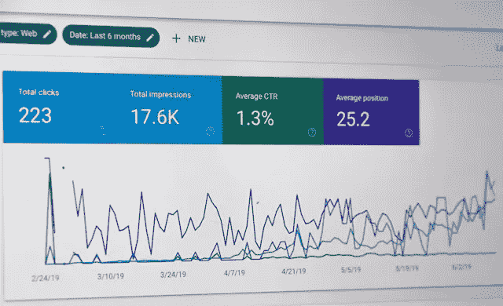

# 超越虚荣心，实现真正的社交媒体参与

> 原文：<https://medium.datadriveninvestor.com/going-beyond-vanity-to-true-social-media-engagement-683599c6ff31?source=collection_archive---------8----------------------->

有多少次，你对自己社交媒体帖子上的赞数感到兴奋？你有没有想过——这太好了，我们会卖出很多东西，但这从来没有发生过？

虽然看起来很刺激，但不要让数字欺骗了你。表面的衡量标准并不总能说明全部情况，也不会带来真正的社交媒体参与度。

等等。什么？一个受欢迎的帖子并不意味着人们喜欢我的品牌或组织？

抱歉。没有。

在社交媒体的早期，许多人都专注于关注者和帖子赞的数量。大量关注者=强大的社交媒体参与度。但随后社交媒体变得更加拥挤，数百万个商业页面竞相吸引注意力。

抱着关注数字的心态，企业寻找新的方法来增加他们的追随者——竞赛，广告活动，任何增长的东西。许多人这样做了(现在仍然这样做),但没有弄清楚他们想要联系的世卫组织(理想的客户或目标受众)以及他们想要在网上与他们进行什么样的互动。

 [## 社交媒体收听让您随时了解|数据驱动型投资者

### 虽然社交媒体倾听是一种顶级趋势，但它应该是每个现代营销策略的一部分。保持和谐…

www.datadriveninvestor.com](https://www.datadriveninvestor.com/2019/02/26/social-media-listening-keeps-you-plugged-in/) 

结果就是我所说的虚荣心对真实的社交媒体参与。

# 超越数字

虽然这种方法可能看起来很好(表面上)，但它很难转化为与您的企业或组织的真正互动。

事情是这样的。关注你的人也在关注其他几十个页面。只有 3%的关注者有机地看到了你的帖子(出现在他们的新闻源中，但没有赞助帖子)，很有可能你的大部分关注者在上个月没有看到你的任何帖子。甚至是一年。

社交媒体算法使得联系你的追随者变得更加困难——那是在不花钱的情况下。

让我们看看脸书。一般用户喜欢 70 个页面，有 338 个好友。这意味着你的内容正在与其他 408 个页面的内容争夺注意力，更不用说赞助商的帖子了。

如果这还不够难的话，你的内容需要与你的追随者在脸书的经历相匹配，才能出现在他们的新闻源中。举个例子——你是一个社区娱乐中心，发布了一个关于瑜伽课程的帖子。那些从未在新闻订阅上发表过瑜伽帖子的粉丝不会看到你的帖子，因为这不符合他们的用户体验。

当然，他们会关注你的页面，但当脸书浏览他们的用户体验，决定哪些帖子最符合他们的兴趣时，你的帖子可能不会被删除。

这就是为什么专注于虚荣指标——为了追随者而获得追随者——是行不通的。真正的成功来自于真正的社交媒体参与。

# 建立关系

采取建立关系的方法，少担心数字，多关心发展和培养与你的追随者的吸引人的和真实的关系。

那么在社交媒体上怎么做呢？首先弄清楚谁是你的理想客户/目标受众。如果你是一家企业，谁最有可能向你购买产品或服务？尽可能弄清楚。

一旦你清楚了这一点，就为这些人创造内容，而且只为这些人。没错——你不是在为每个登录社交媒体的人创造内容。相反，你需要[专注于开发让你的理想受众或客户](https://howtocommunications.com/4-social-media-tips-to-create-engaging-content/)感兴趣的内容。

如果你还在质疑这是如何工作的，想想你的离线世界。你在现实生活中的人际关系。你会和你的孩子、配偶、最好的朋友、同事或邻居说同样的话吗？不太可能。你根据他们的需求或兴趣来调整对话。

同样的方法也适用于网络。通过将你的理想客户/受众视为真实的人，你将开始思考如何以一种引起共鸣的方式与他们联系。

这是质量和数量的问题。[优质内容](https://howtocommunications.com/4-social-media-tips-to-create-engaging-content/)，优质追随者，优质参与。

是的，这种方法可能没有虚荣心指标(为了数字而增加关注者)那么令人惊叹，但如果你的目标是创造销售或让人们看到你的帖子并与之互动，感觉自己是你社区的一部分，那么你就必须专注于关系建设。

这种方法也需要更多的时间和承诺，因为你不能只是运行一个竞赛(像我们的网页和输入赢得一个奖项)来衡量成功。相反，就像任何关系一样，你需要提出问题，倾听并回应与你的追随者相关的内容，而不仅仅是你自己。

# 诚实

从虚荣心到真正的社交媒体参与的第一步是对你目前的方法保持诚实。你根据喜欢和追随者来判断成功吗？或者你是在看你的帖子的评论质量和你的追随者的重复参与度吗？你的内容会引发讨论，还是会失败？

我鼓励你不要再用关注者和帖子点赞的数量来衡量成功。我知道有些企业在一个帖子上有数百万个赞，但销售额却零增长。人们喜欢你的照片和拿出信用卡购买你的产品之间有很大的不同。

相反，用你能发展的人际关系的质量来衡量你的成功。将你的追随者视为真正有兴趣、关注和渴望的人。为他们创造内容，你将从虚荣走向真正的社交媒体参与。

让我们继续谈话。[注册接收我的更多见解](https://howtocommunications.us12.list-manage.com/subscribe/post?u=8aa255cf5d4d731f5831d6f30&id=336d5dc0dd)。

这篇文章也作为一篇博客文章出现在[如何沟通](http://www.howtocommunications.com)。