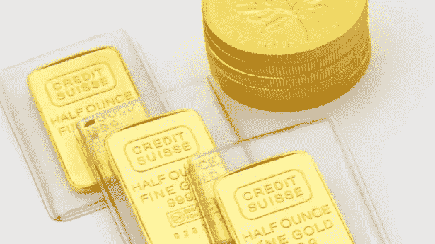

# 黄金！！！

> 原文：<https://medium.datadriveninvestor.com/gold-126648b51d9d?source=collection_archive---------25----------------------->

## 黄金是抵御通货膨胀的好工具吗？

Via unsplash

# 金色的

啊啊。黄金。美丽闪亮的黄色金属。怎么也看不够？迈达斯国王有太多黄金的问题。还记得在《权力的游戏》中，韦赛里斯(丹妮莉丝的兄弟)发现了如果你拥有太多黄金会发生什么。他得到了“国王的王冠”，并被熔化的黄金烧死。

# 金本位制

多年来，世界一直实行金本位制。这意味着一个国家的货币(纸币)与黄金直接挂钩。各国同意将纸币兑换成固定数量的黄金。因此，如果一个国家想发行更多的货币，它必须在其储备中储存更多的黄金。该理论认为，这将阻止一个国家印刷过多的货币来解决其经济问题。

1933 年，为了把钱交到被大萧条弄得一贫如洗的公民手中，美国部分放弃了金本位。国会禁止黄金出口，并禁止财政部将货币和存款兑换成金币和金锭。这使得政府可以大量印刷货币，试图缓解萧条。

随后，美国政府(在尼克松总统领导下)在 1971 年通过取消美元与黄金的直接国际兑换，切断了与黄金的所有联系。

今天，如果你手里拿着货币去美联储，想把它换成黄金，那是不可能的。那么是什么支撑着你手中的美元呢？你对政府的信任。不要笑。美国政府拥有世界上最好的信用评级。它从未不按时偿还任何债务和所有到期利息。今天，世界上没有一个国家实行金本位制。

# 非常乖的

一些专家建议将黄金或黄金股票作为投资组合的一部分。为什么？黄金被广泛认为是一种通胀对冲工具，因为它以美元计价的价格是可变的。黄金的拥有者受到美元贬值的保护，因为随着价格的上升和每美元价值的下降，每盎司黄金的成本将会上升。(当然，糖也是如此，但黄金更有活力，故事也更精彩。)

如果你真的想拥有金元宝，那么你就有储存金元宝或者花钱请人替你储存金元宝的问题。四处走动也很困难；它很重。但如果你觉得想要黄金作为通胀对冲，你可以随时购买黄金股票，甚至黄金共同基金。

# 黄金的历史记录

最近，许多投资顾问指出，统计数据显示黄金并不是很好的通胀对冲工具。他们认为它的名声被夸大了。

例如，1980 年初，随着美国消费者通胀飙升近 15%，黄金价格大幅上涨，达到当时创纪录的每盎司 666.75 美元(今天约为每盎司 1800 美元)。然而，当通货膨胀在 20 世纪 80 年代后期再次上升时，从 1986 年底的 1%上升到 1990 年底的 6%以上，黄金价格下跌。

专业人士认为，如果投资者想抵御通胀，他们有很多黄金的好替代品。有通胀挂钩债券和通胀指数期权。一些投资者喜欢房地产。但是，不管有没有其他选择，甚至不管黄金是否真的起到了对冲通胀的作用，如果有足够多的人相信会发生这种情况，价格上涨可能会抬高黄金价格。从众心理在起作用。

对黄金与通胀关系的进一步研究表明，尽管黄金在极长时间内保持其价值——以黄金表示的罗马士兵的工资与现代美国军人的工资相似——寻求保护的短期投资者可能会失望。投资者应该意识到长期表现和短期表现是两种不同的动物。

虽然最近的数据表明美国的通胀压力正在上升，但如果价格开始大幅上涨，主要是通过加息，各国央行将会出手干预。对于黄金来说，这是个坏消息。利率上升提高了持有黄金的成本——当你持有现金可以得到报酬时，为什么还要持有黄金？只有当通货膨胀严重失控时，黄金才会明显受益。即便如此，也许在上面提到的其他投资中可以找到更好的对冲。