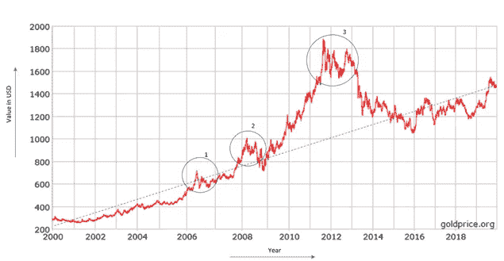
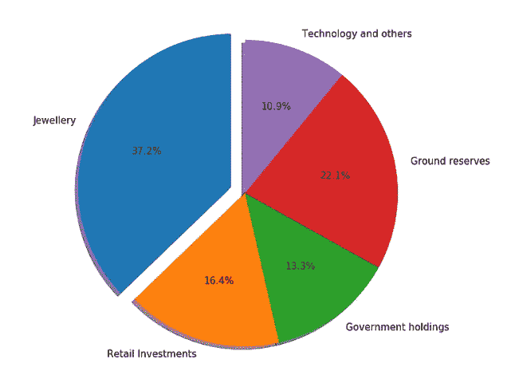
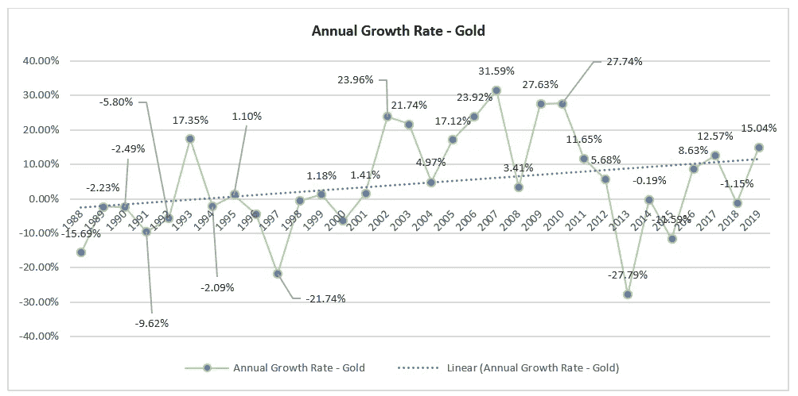
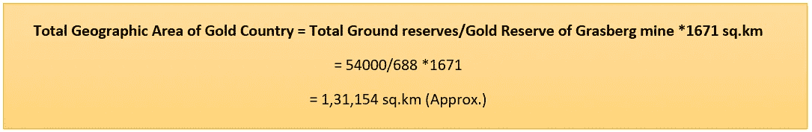
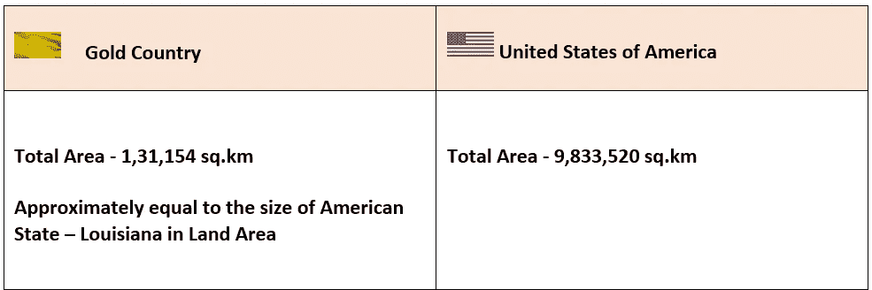
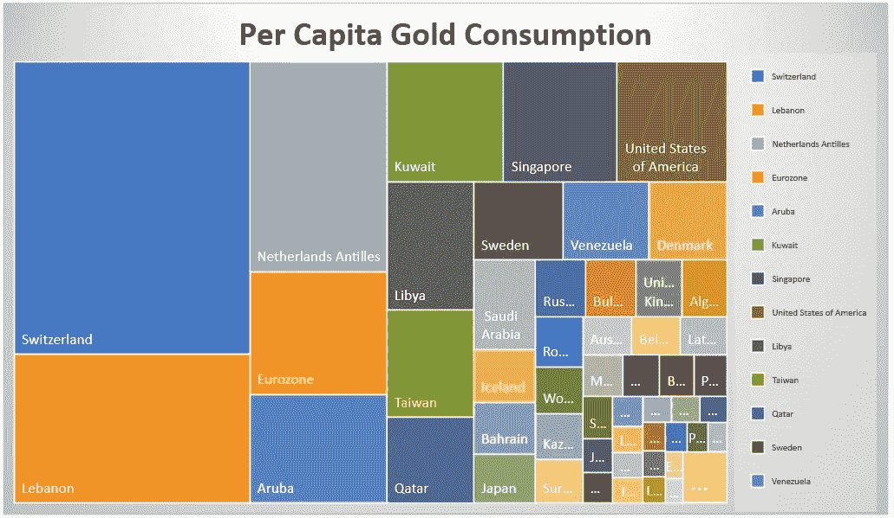
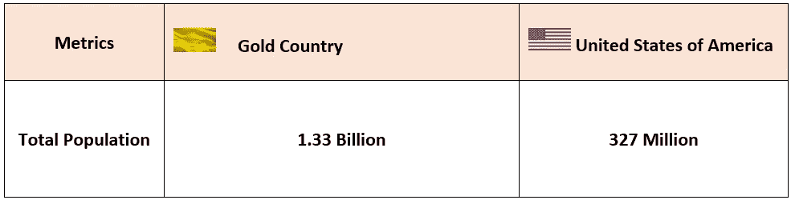
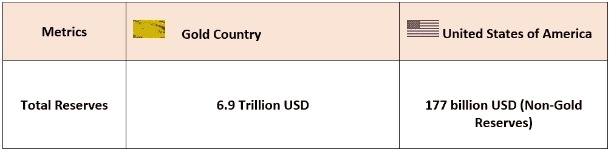
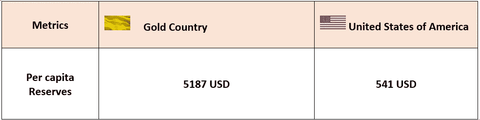
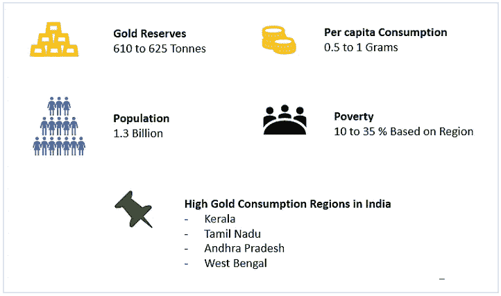

# 作为主权国家的黄金——一个假设的分析

> 原文：<https://medium.datadriveninvestor.com/gold-as-a-sovereign-country-a-hypothetical-analysis-db0b7c66cb01?source=collection_archive---------10----------------------->

Photo by [twinsfisch](https://unsplash.com/@twinsfisch?utm_source=unsplash&utm_medium=referral&utm_content=creditCopyText) on [Unsplash](https://unsplash.com/s/photos/gold?utm_source=unsplash&utm_medium=referral&utm_content=creditCopyText)

**黄金的内在价值和经济属性**

黄金自古以来就是贸易的媒介，主要是基于其价值被认为是不可或缺的资源和贸易体系的灵丹妙药。黄金也有某些内在属性，这促使它被贵族和平民接受为一种珍贵的财产，在交换中价值巨大。虽然在古代世界有许多金属，但相比之下，黄金显得与众不同，因为它具有一些特性，如耐腐蚀性、高温下的延展性和可锻性，这有助于它重新形成各种形状和大小。最重要的是，给人以丰富感的因素是由于光吸收的特性而产生的闪亮的黄色。所有这些因素提供了一种内在价值的认知，这使得黄金成为整个行业中极具价值的投资。

除了金属属性，还有什么金融属性使黄金成为稳定的投资

与法定货币相比，黄金价值的稳定性。

**1-ounce Gold to Dollar Value — Historical Data (goldprice.org)**

正如我们从图表中看到的，黄金多年来呈上升趋势，并作为对冲货币疲软，经济衰退和经济低迷。图表中突出显示的趋势表明，当经济放缓时，投资者转向黄金，随着黄金需求的增加，每盎司黄金的价格飙升。在 20 年的时间里，黄金价格的增长率保持稳定。仅这一经济属性就为黄金提供了大部分的内在价值。

 [## 将定义 2020 年就业前景的五大数据科学和机器学习趋势|数据驱动…

### 数据科学和 ML 是 2019 年最受关注的趋势之一，毫无疑问，它们将继续发展…

www.datadriveninvestor.com](https://www.datadriveninvestor.com/2020/02/19/five-data-science-and-machine-learning-trends-that-will-define-job-prospects-in-2020/) 

**稀而不稀**

根据世界黄金协会的估计，大约有 19 万吨黄金作为地上库存。这些资产被分为珠宝、零售投资、政府控股、土地储备、科技和其他资产。

**Gold ground Stocks Distribution**

与钯或铂等其他贵金属相比，黄金并不是一种非常稀缺的金属，它在世界各地不断轮换，可以作为政府持有和地面储备。

 [## 如果比特币是一个主权国家会怎样——比较分析

### 介绍

medium.com](https://medium.com/datadriveninvestor/what-if-bitcoin-is-a-sovereign-country-a-comparative-analysis-51264163e302) 

**黄金可以充当通胀对冲**

黄金可以作为通货膨胀的对冲，因为黄金价格的增长率可以击败全球通货膨胀的增长率。从图表中，我们可以观察到黄金的年增长率呈上升趋势，从 1988 年到 2019 年平均增长率约为 4.6 %。与 3.5%至 4%的通胀率相比，黄金可以有效地作为散户投资者和主权政府的长期通胀对冲投资。

Annual Growth Rate — Gold

**黄金作为一个国家与其他主权国家的对比分析**

在本节中，将黄金作为一个主权国家与其他真正的主权国家进行假设性比较，以确定黄金对各种参数的全球影响。

各国的黄金投资者被认为是黄金国家的人口

它在以下参数上与美国进行了比较

**地理区域**

在此参数中，黄金储备的实际面积被视为黄金国家的一部分。这包括已探明储量和目前的黄金开采矿山。从这个参数，我们将了解与一个真实的国家相比，黄金储备的土地覆盖率。

其中最大的金矿位于印度尼西亚的巴布亚岛(Grasberg mine ),总勘探面积为 1671 平方公里，黄金储量为 688 吨。

根据世界黄金协会的数据，全球地下总储量为 54000 吨。

忽视死亡或枯竭的矿井

**人口**

在此参数中，黄金投资者的总人数被视为黄金国家的人口。这一参数为我们提供了诸如黄金投资者与其他人的比率、年增长率和其他宏观经济指标等信息。

Per Capita Gold Consumption by Countries

**基于每个国家数据的人均水平——人均 98.97 克**

对于人均平均数的计算，数量少人口多的国家是正常的

仅考虑细分市场——珠宝:92，043 吨，占 47.6%，私人投资:41，279 吨，占 21.3%，得出黄金国家的总人口。

总人口=私人投资者持有的黄金数量/人均

= (92043 + 41279)吨/ 98.97 *1000

= 1,33,42,20,000

**总储量:黄金与非黄金储量对比**

在此参数中，比较了黄金国家的黄金总储备与美国的总储备，包括特别提款权、在国际货币基金组织的储备头寸和外币(不包括黄金)。这个参数有助于我们衡量黄金总价值与一个国家的非黄金储备相比如何。

**人均资产比率**

人均资产比率是一个国家的总资产值与该国总人口的比率

**黄金作为当今世界的交易媒介**

商品的可用性因地区而异，如个人装饰品、电子产品和其他。在南亚和东南亚的大部分地区，人们在节日购买黄金用于珠宝和个人饰品。它给这个地区的人们带来了繁荣和财富的感觉。由于金的导电性和无腐蚀性，西方世界集中使用金作为电子技术的一部分。

**印度**

印度是一个黄金消费非常高的国家，随着国家人均收入的增加而增长。印度 2019 年的黄金消费量为 750 至 850 吨，低于去年的 760.4 吨和 10 年平均 838 吨——WGC。大部分黄金都是进口的，因为国内产量仅占总消费量的不到 5%。

印度人的黄金消费基本上属于装饰用途，并作为家庭储备世代相传。节日期间，不管家庭收入如何，人们都努力为家人购买黄金。这有两个目的，一个是作为节日的礼物或纪念品，另一个是作为家庭财产储备，用于下一代的活动和婚姻，或者用于任何紧急需求，如购买其他财产，如土地、商业费用或医疗费用。

由于当地法定货币卢比经历了各种波动，并在 30 年期间对美元贬值，印度人必须找到一种对冲投资，以保护他们的血汗钱免受货币疲软、通货膨胀、政府不稳定和不确定的经济政策的影响。因此，印度家庭平均将其年收入的 15%至 25 %用于黄金投资。

根据世界黄金协会的数据，我们可以确定，尽管印度拥有最高的黄金储备，但其人均黄金消费量非常低，约为 0.5 至 1 克。

**非洲**

由于许多非洲国家面临政治动荡，它们的经济状况是这些不稳定的直接受害者。一些非洲国家的货币已经变得非常疲软，以至于与该货币毫无关联，例如津巴布韦元。在这里，美元是贸易机制的重要组成部分。像南非和其他南部非洲国家有大量的黄金储备，赞比亚是世界第二大钴生产国和第七大铜生产国。据报道，它也富含铂和黄金。同样，加纳是非洲最大的黄金生产国之一。这些国家正在与其他国家进行易货交易，例如赞比亚、加纳和卢旺达等国家已经向印度提出出口矿产以换取基础设施项目的建议。可能成为易货交易一部分的商品包括铜和黄金

这些国家的当地人也是如此。这主要是由于黄金价值的稳定性以及当地人可以从矿场获得黄金。在这些国家，非官方的物物交换体系已经存在，贵重金属如金、银和其他物品如钻石被用来交换货物、服务和财产。与印度人不同，非洲人不太注重购买黄金作为装饰品或珠宝，而是将其作为重要的贸易商品资源。

**总结**

从分析中，我们可以推断，在可预见的未来，黄金需求将保持稳定的增长率。世界上大多数人将黄金作为对冲投资，因为黄金具有各种有益的经济属性。黄金作为一个主权国家，在准备金率、资产价值、投资者数量等参数上可以与美国等发达国家相媲美。这些参数可以提供一些重要的信息，如全球范围内黄金的实际内在价值以及它对供求关系的影响。由于世界上有近 13 亿人投资不同数量的黄金，因此黄金价格的稳定是有保证的。由于一些国家正在与黄金进行直接的易货交易，以支付其他国家的服务，未来几天黄金可能会成为国际贸易中直接和活跃的贸易媒介。我们还可以预计黄金将进入加密货币市场，在这里，不仅稳定的硬币与法定货币挂钩，黄金也可以挂钩，这增加了这些硬币的稳定性和价值增值。

 [## 面向数据驱动的洞察和预测的数据科学—简介

### 在这篇博客中，我们将讲述数据科学的基础知识。数据科学是一个相互关联和综合的实践…

medium.com](https://medium.com/analytics-vidhya/data-science-for-data-driven-insights-and-predictions-an-introduction-89850e279cc4) 

**参考文献**

[https://www . investopedia . com/news/top-10-国家-最高需求-黄金-珠宝/](https://www.investopedia.com/news/top-10-countries-highest-demand-gold-jewelry/)

[https://www.federalreserve.gov/data/intlsumm/current.htm](https://www.federalreserve.gov/data/intlsumm/current.htm)

[https://www . business-standard . com/article/international/four-Muslim-nations-consider-gold-barter-trade-to-beat-future-sanctions-119122100390 _ 1 . html](https://www.business-standard.com/article/international/four-muslim-nations-consider-gold-barter-trade-to-beat-future-sanctions-119122100390_1.html)

[https://www.gold.org/goldhub/data/above-ground-stocks](https://www.gold.org/goldhub/data/above-ground-stocks)

[https://goldprice.org/gold-price.html](https://goldprice.org/gold-price.html)

[https://www . provident metals . com/knowledge-center/precious-metals-resources/world-gold-production-consume . html #](https://www.providentmetals.com/knowledge-center/precious-metals-resources/world-gold-production-consumption.html)