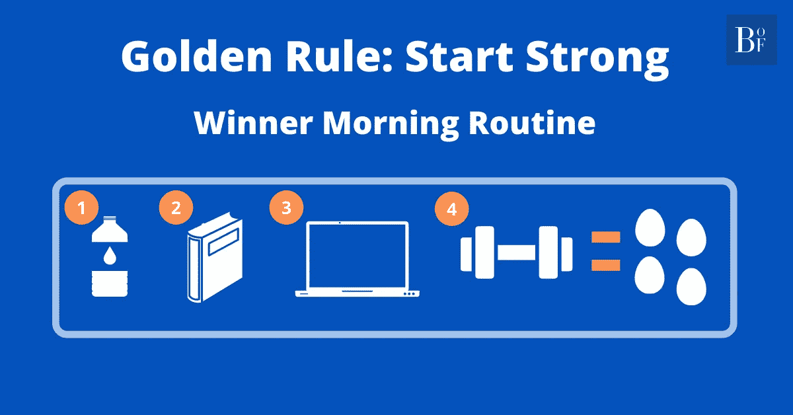

# 赢家早晨例行公事的 4 个要素

> 原文：<https://medium.datadriveninvestor.com/golden-principle-start-strong-5a4531332989?source=collection_archive---------6----------------------->

# 黄金原则:强势开始

强大而精心设计的晨间作息是无价的。按照惯例，在一天的早些时候，**你要响亮清晰地定下基调**。凭借你展现出的自律和毅力，你正在发出一个坚实的信号，告诉你身体的每一部分你将如何去做，从我的角度来看，这是成为最好的自己并推动自己进入极限以看到自己真正潜力的必要条件。

我非常相信创业的 T2 力量。经验证明，以强势的方式开始任何任务或旅程**会让剩下的部分比**之前更容易。

和你遇到一个人的第一印象的影响很像。**你所描绘的** **个性将会塑造其余的互动**，同样的机制在这里也起作用。

***早早定下基调！***

每天的第一项任务是饮用 750 毫升 1L 水，向身体发出强烈的唤醒信号。

小心不要吃一些零食或尽可能燃烧脂肪的营养品，直到一天的第一餐，那将是一顿固体早餐！

但是在早餐之前，有很多事情要做。就像生活中的其他事情一样，首先，我们需要赢得它。

在唤醒了身体之后，现在是时候打开思想了；一些书籍阅读。我更喜欢阅读有影响力的、与商业相关的书籍，让我的头脑与他们领域中最伟大的时代同步。有一天可能是大发明家和“无限先生”埃隆·马斯克，第二天可能是最大的执行者之一杰夫·贝索斯，另一天可能是传奇运动员迈克尔·乔丹。

想象一下被这些名字指导是多么令人惊奇。此外，我们对待书籍的方式不应该像一种一次性使用的风格。我们需要定期给他们建议，并通过查看我们在阅读课上记下的笔记来更新我们的知识。

全速前进，现在是时候在一天的日程安排变得拥挤之前关注我们的长期愿景了。要么是你想通过参加 GMAT 考试来实现你的 MBA 目标，要么是你的被动收入来源的电子商务业务，要么是你想从零开始建立的公司。

让我们全力以赴，持之以恒，时刻牢记你的“总体规划”和宏观愿景，找到你一整天的内在动力。

> 喜欢或讨厌你正在过的生活完全在于你反复的自我对话――埃德蒙·姆比亚卡

然后，早餐前还有最后一件事。完成这项活动后，你将完全值得你的一餐。现在，是时候增加血液循环和身体力量了，更重要的是让我们的思想和身体的每个细胞为即将到来的艰难时刻做好准备，白天的战争。

男孩们，该做俯卧撑了！听起来很容易？

好吧，那我们就来点刺激的。7-8 组，每组 12-15 次，交替进行菱形俯卧撑和下降俯卧撑。此外，在两局之间，我们都在挤我们的胸部，以捕捉更多的泵！

你的身体会在最后一组的最后几个动作中尖叫。但是，一旦你完成了，内啡肽的过度释放和完成一项严肃而艰巨的任务的感觉将会增强你的信心、能量、动力和一切。

尝起来是什么感觉！此外，这样一个学科它需要…

*   现在，该吃早饭了。你 100%值得拥有！ *(* ***)生产力黑客:*** ***一边准备早餐，一边听一些关于你激情的励志播客。你肯定会惊讶于你一天中那些小小的富有成效的时刻会在长期内创造出不同。*在你得到你的燃料后，你准备好征服一天中剩下的冒险。**

**走吧！！**

> ***“成功是几个简单的纪律，每天练习；而失败只是一些判断上的错误，每天都在重复。”***
> 
> ***—吉米·罗恩***