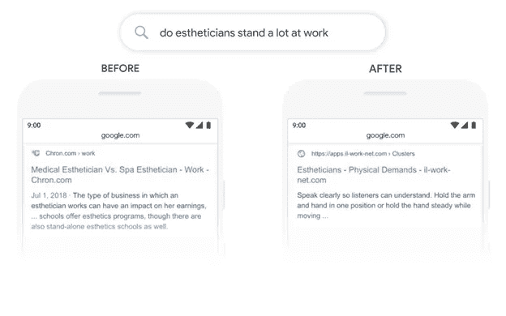
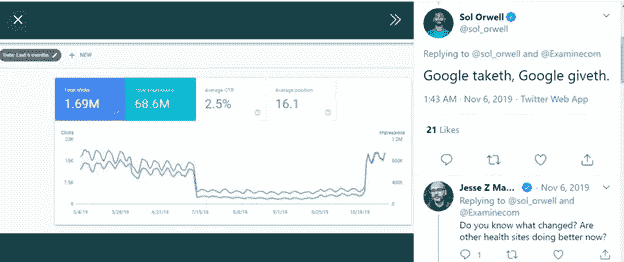

# 谷歌算法更新你需要知道什么

> 原文：<https://medium.datadriveninvestor.com/google-algorithm-update-what-you-need-to-know-c30e38c4748?source=collection_archive---------4----------------------->

## 数据科学

## 与谷歌保持同步可以帮助你获得更高的流量。

Photo by [Mitchell Luo](https://unsplash.com/@mitchel3uo?utm_source=medium&utm_medium=referral) on [Unsplash](https://unsplash.com?utm_source=medium&utm_medium=referral)

> 关于谷歌算法更新，你需要了解什么？
> 
> 你好伯特
> 
> 去年，2019 年 10 月 25 日，谷歌推出了其过去五年来最重要的算法更新 Google BERT。在解开谷歌最新算法更新背后的谜团之前，让我们先粗略地看一下谷歌的历程。

> “在过去，人们不是去问老师，而是看字典来了解老师的完整定义。现在，谷歌成了我们的老师，为了了解谷歌，人们搜索它。”穆尼亚·可汗

## 谷歌的搜索引擎是如何进化的？

随着 20 世纪 90 年代互联网的商业化，互联网营销人员和 SEO 专家一直积极参与一场永无止境的战斗——旨在为搜索引擎网站的第一页排名的网站竞争。(SERPs)。

在雅虎做出了有史以来最昂贵的[商业决定之一——未能收购谷歌之后，后者在 2005 年后成为了领先的搜索引擎。](https://www.wired.com/2007/02/yahoo-3/)

谷歌登顶意味着所有现有的营销策略都被修改，互联网营销人员试图“博弈”搜索引擎。通过这些技术，在谷歌上产生良好的流量为他们赢得了高额利润。随着时间的推移，糟糕的 SEO 实践导致了 SERPs 质量的大幅下降。

因此，谷歌认识到了眼前的问题，采取了自己的方式，并对其搜索引擎算法进行了一定的调整。谷歌的目标非常明确:当用户输入搜索查询时，显示可能的最佳结果，即显示解决他们问题的链接，无论他们是在寻找产品、服务还是一条信息。以下是这家科技巨头在 2000 年后的一些有趣转变。

 [## 谷歌最近的想法是将一个城市地区运作的几乎每一个方面都转移到服务器上，这是一个…

### 直到现在，几乎每次致力于智能城市的会议都会提供智能大都市的例子，它…

www.datadriveninvestor.com](https://www.datadriveninvestor.com/2020/04/04/googles-recent-idea-to-move-nearly-every-aspect-of-a-city-districts-operation-to-a-server-is-a-whole-new-quality-in-terms-of-smartcity-development/) 

2003 年:谷歌通过将“好”链接与“坏”链接分开来打击垃圾链接。

2010 年:谷歌拥抱社交媒体。最新的谷歌算法更新纳入了社交媒体信号。

2011 年:谷歌发布了[熊猫](https://www.tmprod.com/blog/2012/what-is-google-panda-and-what-do-the-updates-mean-for-seo/)更新，以惩罚包含单薄内容和过多广告的网站。

2012 年:谷歌推出了[企鹅](https://www.growthmanifesto.com/google-penguin-algorithm-update)更新，并对关键词填充采取了行动。

2015 年:谷歌宣布在其算法中实现[机器学习](https://www.forbes.com/sites/miketempleman/2015/10/27/google-rankbrain-what-does-it-mean-for-seo/)。

从 2015 年开始，这种情况就出现在墙上。谷歌正在优先考虑强调语义搜索的长期战略。语义搜索通过计算上下文来确定搜索者的意图，这提高了搜索的准确性。去年的更新，谷歌伯特是科技巨头未来野心的前兆。

## 谷歌 BERT 是什么？

通俗地说，Google BERT 会帮助 Google 理解一个句子中的单词(用户查询)。但是，以前的谷歌算法也是这样做的，那么有什么显著的变化呢？这里的不同之处在于，伯特破译了一个句子中内容的所有细微差别。

BERT 是谷歌在人工智能领域密集的 R&D 努力的产物。谷歌研究人员在 2018 年奠定了伯特的[基金会](https://arxiv.org/pdf/1810.04805.pdf)。

早些时候，谷歌搜索算法通过从左到右处理单词来计算搜索查询，而谷歌 BERT 应用双向处理来确定短语之间的联系。

考虑上面这张来自谷歌[博客](https://blog.google/products/search/search-language-understanding-bert)的图片。在最新的谷歌更新出现之前，术语“*单机*”与短语“*站*”相匹配。然而，单词“*stand”*在两个查询中表示不同的用户意图。观察 Google BERT 如何理解这个上下文并显示适当的响应。

它指出，谷歌 BERT 对介词有更好的理解，比如搜索查询中的“to”。

## Google BERT 的更深入概述

BERT 是一个首字母缩写词，代表变压器的双向编码器表示。这是一种开源的神经网络技术，属于人工智能学科:NLP。BERT 是以前训练前上下文表征的扩展，如 [ULMFit](http://nlp.fast.ai/classification/2018/05/15/introducting-ulmfit.html) 和 [ELMo](https://allennlp.org/elmo) 。让它脱颖而出的是伯特符合以下标准:

④深度双向无监督语言表示

ü通过文本语料库进行预训练

这些标准是有分量的，因为预先训练的表示要么是上下文相关的，要么是上下文无关的。此外，上下文术语分裂成双向或单向模型。

上下文无关模型为所有单词提供来自词汇表的单个单词嵌入表示。例如，考虑用户搜索包含以下单词/短语的查询:

*银行账户*

*河岸*

作为人类，我们知道这两个词看起来很相似，但实际意义却大相径庭。然而，机器仍然离天网级别的能力很远，因此使用上下文无关的模型，例如[手套](https://nlp.stanford.edu/projects/glove/),*银行*的定义在*银行账户*和*银行中是相同的。*

上下文模型是一种改进，因为它们通过将每个单词与句子中的其他单词进行比较来确定每个单词的表示。现在，如果一个句子说，“*我开了一个银行账户*，一个单向上下文模型根据它之前的注释评估单词 *bank* ，即“*我开了一个”.*，然而，仍然不评估“ *bank”、“account”、*之后的名称。这是单向上下文模型的局限性。

进入最新的谷歌算法更新，BERT，它通过使用“深度双向”方法评估句子而更进一步。这样做从两边遍历整个短语，即“我开了一个银行账户”，并预测准确的结果。

这就回避了一个重要的问题:如果双向模型如此有效，为什么计算机科学家在这上面睡了这么长时间？

为此，让我们回到单向模型。训练他们根据一个句子之前的评论来预测一个单词是相当简单的。另一方面，类似的方法对于双向模型是不可行的。这是因为目标单词(必须被预测)最终将间接地在从两个方面比较单词的多层模型中找到自己。

掩蔽技术旨在解决这一难题。它屏蔽输入中的特定单词，然后使用双向方法来预测该单词。例如，考虑下面的句子。

约翰去了一家[面具#1]。他学习了《面具 2 》,开始了他的网络开发生涯。

这里的蒙面词是“*大学*”和“*计算机科学*”Google BERT 通过对两个句子之间的关系建模来预测它们，使用完整的上下文来猜测正确的单词。在某种程度上，它类似于人类思考和猜测的方式，这就是神经网络的全部内容——模仿人脑。

从历史上看，专家确实在更早的时候开发了这些解决方案，但将它们转化为工作解决方案的是云 TPU 的开发。T2 变压器模型架构是另一个重要的难题。不出所料，谷歌在 2015 年后开发了这两种产品。

## Google BERT 是如何影响实时 SEO 的？

BERT 的推出引发了搜索引擎优化分析的突然波动，影响了网站流量、页面排名和关键词性能等指标。这是一个营养和补充品评论网站的分析视图，该网站在后 BERT 时期获得了更高的流量。

来源:[推特](https://twitter.com/sol_orwell/status/1191818401980784646/photo/1)

如果你的位置在棍子的另一边，你的网站流量受到了负面影响，也许这就是问题所在:

你的关键词研究很好，但是你的内容质量很低，没有和你的目标受众产生共鸣。

竞争对手用更有效的关键词策略打败了你。

您的内容不太可能在信息搜索中显示。

有可能你的网站在搜索引擎上优化得很好，但是它并没有很好地与你的受众保持一致。

## 如何针对 Google BERT 优化你的网站？

根据谷歌，BERT 和信息搜索之间有很强的相关性。因此，从现在开始，更好的策略是为人类优化你的网站。如果你浏览一下谷歌算法更新的历史，很明显谷歌打算消除过去二十年中泛滥的搜索引擎优化快捷方式。在所有这些变化中，谷歌从未惩罚在内容质量上投资的品牌。相反，它一直在努力推广原创和丰富的内容。

对于 SEO 专家来说，是时候深入研究基于实体的 SEO 了。谷歌对实体的定义是:

ü单数

ü独特

ü定义明确

ü可区分

基于实体的 SEO 工作基于单词、短语和句子之间的上下文关联。例如，在语句“ *Java 死了*”中，*“Java”*和“*死了”*都是实体，其中关系将它们绑定在一起。

## 最后的想法

当试图与谷歌“博弈”时，许多在线营销者并没有达成一个批判性的理解；没必要走捷径。接受最近谷歌算法更新的变化最终会帮助你改善用户体验，提高转化率。

> “追逐你的梦想。设计你的生活，让人们可以在谷歌而不是社交媒体上搜索你。”尼基·弗德

## 访问专家视图— [订阅 DDI 英特尔](https://datadriveninvestor.com/ddi-intel)