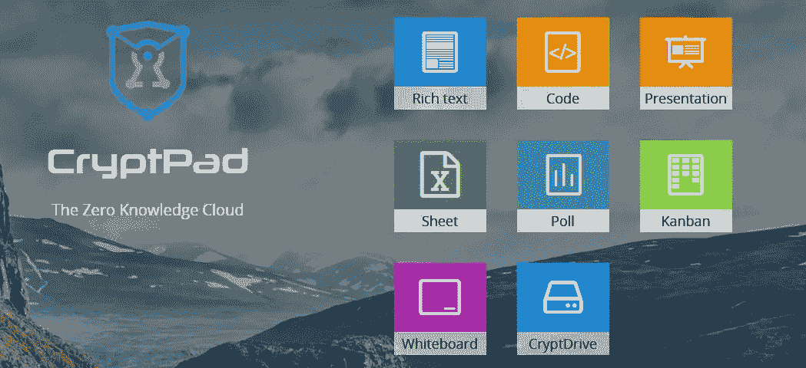
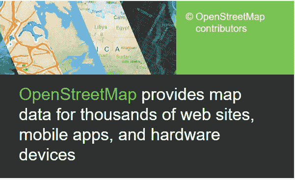
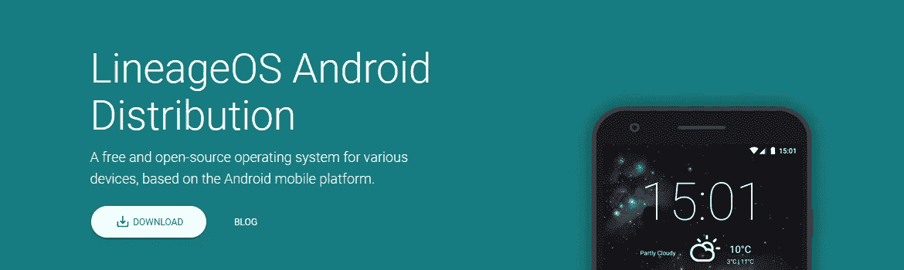

# 谷歌替代应用:轰轰烈烈的 2021！

> 原文：<https://medium.datadriveninvestor.com/google-alternative-apps-2021-with-a-bang-73a9fcb26a3d?source=collection_archive---------19----------------------->

## 开始做一些改变，每一点都很重要，安全应该仍然是优先事项。

image by PhotoMix Company from Pexels

你难道不喜欢谷歌吗？

我:“*是的！我是说，不。你知道这有多复杂。*
难道每一段感情都不是吗？也许你的不是，但我的谷歌不是在公园散步，我保证。

让我们面对这个转变并不容易，但是，没有人说它应该在一夜之间发生。想象一下从 Windows 到 Mac，或 IOS 到 android，甚至 Windows mobile… Lumia 如果可用？底线是，这并不容易，需要时间、理解和练习。

一步一步来，不要急于求成，但是当你准备好探索不同的、开源的、安全的东西时，试一试应该不会有什么坏处。通常不会。

**谷歌搜索-备选方案**

我敢说，一般来说，谷歌是最好的搜索引擎，但不擅长安全和隐私，这不是他们菜单的一部分。作为一种选择，我个人最喜欢的尝试是 [*Duckduckgo*](http://duckduckgo.com) 一个基于美国的隐私聚焦搜索引擎。我会详细介绍这一点，更多的搜索引擎你可以试试[这里](https://samwritessecurity.medium.com/six-google-alternative-search-engines-4e430e86e0cb)。

**Gmail-备选方案**

您的网上购物使用收据进行跟踪，其他类型的数据也用于营销目的。如果你想分享一个秘密，可以考虑使用 Gmail 以外的任何东西。你可以选择 pronton mail，这很棒，没有日志或跟踪器。Pronton 也有付费计划和更多的服务，但免费版本是一个好的开始。

**谷歌浏览器**

火狐！简单用火狐。你可以根据自己的喜好做出改变，比如添加扩展、改变搜索引擎等等，或者你可以下载一个为某些在线活动准备的 firefox 版本，比如 Waterfox 或 icecat。

**谷歌驱动**

Dropbox？不错的选择，但在安全方面不是你的最佳选择，所以你可以选择自有云。这和 Dropbox 的主要区别在于 Own-cloud 是开源的。

如果 Owncloud 做不到，也许 Nextcloud 可以做到，这也是开源的，都是在德国开发的。

**谷歌日历**

[闪电日历](https://www.thunderbird.net/en-US/calendar/)简单易用。雷鸟是开源的，所有这一切都由 Mozilla 支持，也就是火狐背后的那些人。

**谷歌文档**

这就是 Docs 的意思吧？
我承认离开谷歌文档并不容易，我是一个普通用户，但嘿，我们最终还是要前进，对吗？向您介绍…

cryptpad official website

以加密为重点的隐私，必须尝试。是的，这是免费使用的。要了解更多信息，请访问他们的[网站](https://cryptpad.fr/)。

除了 Cryptpad 之外，你还可以使用 Libreoffice，不幸的是它是离线的，更像是微软 office 的免费开源版本，但仍然可以完成工作。适用于 Windows，预装在与 MacOS、android、IOS 和 chromebooks 兼容的一些 Linux 发行版上。

 [## 擅长谷歌是一种技能|数据驱动的投资者

### 擅长‘谷歌’是一种技能。是的，你听到了。知道什么和如何谷歌或搜索的东西是一个…

www.datadriveninvestor.com](https://www.datadriveninvestor.com/2020/08/11/being-good-at-google-is-a-skill/) 

**谷歌翻译**

[Deepl](https://www.deepl.com/translator) 翻译，自带内置词典。

linguie 也是一个很好的选择，它是一个词典和翻译器，是短语和单词的理想选择。

**谷歌分析**

在使用了一两种选择之后，你最终会意识到你可能获得了太多的信息，或者与你的目标无关。保护观众的 IP 地址似乎是一个梦想，但事实并非如此。

[马托莫！](https://matomo.org/)安全是 Matomo 的必备条件，您的私人数据是隐私。如果你不喜欢 Matomo，你可以很容易地使用 [Clicky](https://clicky.com/) 来代替，默认情况下匿名访问者 IP 地址，轻量级，易于使用。

**谷歌地图**

你听说过 [OpenStreetMap 吗？](https://www.openstreetmap.org)

OpenStreetMap [https://www.openstreetmap.org](https://www.openstreetmap.org)

你最好的谷歌地图替代免费且易于使用。OpenStreetMap 预装在一些 Linux 发行版上，比如 PureOS。对于手机(Android & IOS) [OsmAnd](https://osmand.net/) 是在线、离线手机地图和导航的绝佳选择。

**安卓操作系统**

改变这一点，肯定会完成一些事情，但什么比改变整个操作系统更有效呢？如果你准备好了，这里有一些选择；

为基于 android 的设备提供免费、开源的发行版。开源操作系统上的开源应用，你还能要求什么呢？这个项目已经存在至少 4 年了，而且看起来不会很快有任何进展。

image by LineageOS

[*Ubuntu Touch*](https://ubuntu-touch.io/)

你喜欢在电脑上使用 Ubuntu 吗？然后在你的手机上使用它，无论你去哪里都带着 ubuntu。免费，开源的力量给你。

[复制体](https://www.replicant.us/)

强调隐私和安全的 Android 操作系统。在各种三星移动设备上进行了测试，它可能正是您想要的。

这将结束我们的列表，并开始您的安全之旅。让每一天都成为网络安全意识日。

## 访问专家视图— [订阅 DDI 英特尔](https://datadriveninvestor.com/ddi-intel)