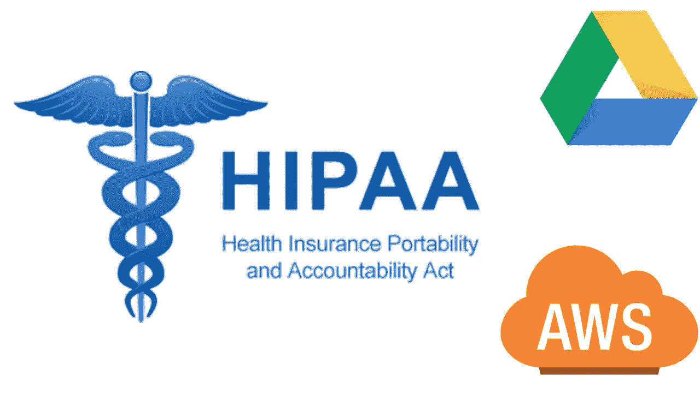

# 谷歌、亚马逊和受保护健康信息的合规性

> 原文：<https://medium.datadriveninvestor.com/google-amazon-and-compliance-on-protected-health-information-11fb15dfb1a4?source=collection_archive---------12----------------------->

健康保险流通和责任法案(HIPAA)是 1966 年的一部法律，由时任美国总统比尔·克林顿颁布，旨在通过为受保护健康信息(PHI)的隐私和安全制定标准来保护健康信息的流动；该立法由国家法规组成，涉及“覆盖实体”的医疗保健、支付和交易。因此，这些实体可能会在没有患者明确书面同意的情况下向某些方披露 PHI，以促进他们的治疗、支付或医疗保健操作，但一般而言，任何其他披露都需要个人的书面同意，并尽合理努力将信息限制在严格必要的范围内。

PHI 或受保护的健康信息是个人数据，如姓名、出生日期、治疗史、财务信息。在医疗保健行业工作的组织选择使用哪种技术之前，他们必须确保该技术符合 HIPAA。

 [## 医疗保健的未来正在被一场大型技术入侵所塑造|数据驱动型投资者

### 过去十年，全球经济的所有部门都经历了大规模的数字颠覆，而卫生部门现在…

www.datadriveninvestor.com](https://www.datadriveninvestor.com/2018/11/02/the-future-of-healthcare-is-being-shaped-by-a-big-tech-invasion/) 

医疗保健组织选择哪种方法适合共享这些收集的信息，这是基于两个巨头 BigTech: Google Drive 和 AWS。然而，在这一点上，有一个问题成为优先考虑的问题:这两个服务符合 HIPAA 吗？甚至在卫生当局可以将受保护的健康信息传输给供应商或合作伙伴之前，它必须签署相关的商业协议，该协议在 BAA 首字母缩写词中定义为“商业相关协议”。根据美国卫生与公众服务部(HHS)的规定，学士学位(商务助理)是指:

“代表相关实体履行职能或开展活动或向相关实体提供某些服务的个人或实体，不包括相关实体的员工，这些职能或活动涉及业务伙伴对受保护健康信息的访问。[BA]也是代表另一个[BA]创建、接收、维护或传输受保护健康信息的分包商。”

这意味着，如果一个组织受雇管理、使用、分发或访问受保护的健康信息(PHI)，它必须首先符合 HIPAA 法规下的 BA 资格。

Google Drive 符合 HIPAA，但由于它也是一项与第三方应用程序同步的服务，由于这些应用程序可能不在 BAA 的覆盖范围内，因此可能会有“不符合”的问题；此外，虽然谷歌在服务器上加密数据，但如果我将数据下载到我的设备或笔记本电脑上，我就有可能将这些数据暴露给黑客或盗窃。

因此，有必要加强和整合谷歌服务，通过完成某些强制性步骤使 BAA 更加安全:

-实施出入控制；

-启用双因素身份验证；

-停用链接共享和文件同步，以及第三方应用程序或加载项；

-限制域外的文件共享；

-设置独特的密码；

-持续监控活动和访问日志；

-切勿输入 PHI 作为文件标题。

AWS 也是一个 BA:作为商业合作伙伴，在医疗机构使用 AWS 之前，它必须首先验证是否存在商业协议(BAA ),以及供应商是否有适当的措施来保证 PHI。

因此，亚马逊也对其服务进行了更改，以提高医疗保健客户的用户友好性，并将签署一份贸易协会协议，以符合 HIPAA。

就云服务而言，HIPAA 合规性取决于它的使用方式。要被认为符合 HIPAA，AWS 必须被组织内的所有用户正确使用。能够向其他用户授予数据访问权限的管理员在授予此类访问权限时有责任特别小心，不包括可能招致行政处罚的第三方。

因此，在卫生部门工作的组织有责任遵守 HIPAA。在实施新软件或技术之前，组织了解需要做些什么来使其符合 HIPAA 标准是很重要的。

版权所有

***拉斐尔·阿格莫，律师***