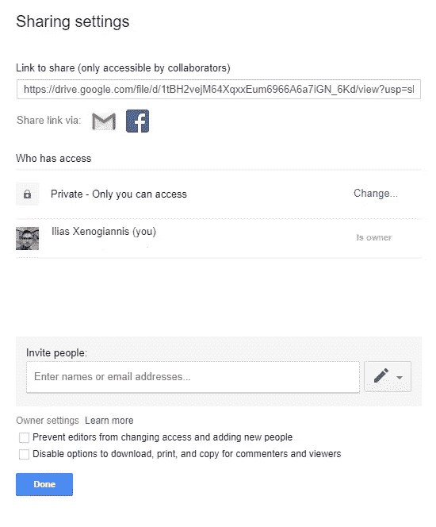
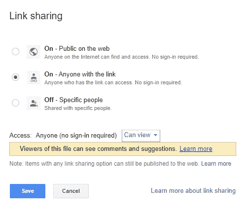

# 谷歌直接驱动数据到你的笔记本电脑，无需认证

> 原文：<https://medium.datadriveninvestor.com/google-drive-data-directly-to-your-jupyter-otebook-without-authenticating-5a95e271bc89?source=collection_archive---------1----------------------->

## 每次运行时重启后，无需认证即可访问您的数据


Photo by [Carlos Muza](https://unsplash.com/@kmuza?utm_source=medium&utm_medium=referral) on [Unsplash](https://unsplash.com?utm_source=medium&utm_medium=referral)

当你在做一个 ML 项目时，你会用到很多数据集。这些数据集大多数时候都存储在云中。特别是如果你正在使用 Google Colab，但真的是任何云(或非云)笔记本进行实验，在 Google Drive 上存储数据是一个合适的解决方案。但是我应该注意一些事情，如果你的工作是在生产中，有许多更合适的数据存储解决方案，老实说，我将要介绍的**不应该是你的**解决方案。您应该使用适当的身份验证，并且永远不要暴露您的数据。

假设你不在生产部门工作，也不使用敏感数据，有一种简单的方法可以将数据从 Google Drive 加载到你的笔记本电脑会话中。

如果你在谷歌实验室[工作，有很多方法可以正确地加载数据](https://towardsdatascience.com/downloading-datasets-into-google-drive-via-google-colab-bcb1b30b0166)，你可以直接在你的环境中上传数据，甚至在谷歌实验室中安装你的谷歌驱动器，让你可以访问你所有的文件，并允许你在那里保存新文件。

[](https://www.datadriveninvestor.com/2020/02/19/five-data-science-and-machine-learning-trends-that-will-define-job-prospects-in-2020/) [## 将定义 2020 年就业前景的五大数据科学和机器学习趋势|数据驱动…

### 数据科学和 ML 是 2019 年最受关注的趋势之一，毫无疑问，它们将继续发展…

www.datadriveninvestor.com](https://www.datadriveninvestor.com/2020/02/19/five-data-science-and-machine-learning-trends-that-will-define-job-prospects-in-2020/) 

但是有时候你想开得快一点，然后刹车。而打破东西甚至可能意味着杀死运行时并重新开始。你在试验，所以你想快速加载数据，调整一些东西，再试一次，也许重复！你不要每次都把整个授权再做一遍！这就是我的解决方案派上用场的地方。您可以给文件链接一次，只要运行时重新启动，数据就会立即加载。

但是让我们把手弄脏吧！

假设我们的驱动器中有一个 json 文件，我们想将它导入到笔记本中。

首先，我们应该改变它的驱动器共享设置。您必须获得一个共享链接，并将设置更改为 ***，任何拥有该链接的人都可以查看*** 。



Drive share settings



Access Level: “Anyone with the link” is recommended

您将获得以下格式的链接:

```
[https://drive.google.com/file/d/**1tBH2vejM64XqxxEum6966A6a7iGN_6Kd**/view?usp=sharing](https://drive.google.com/file/d/1tBH2vejM64XqxxEum6966A6a7iGN_6Kd/view?usp=sharing)
```

粗体部分是文件 ID。您可以使用此文件 ID 创建一个链接来直接下载文件。

直接下载链接的格式如下:

```
https://drive.google.com/uc?export=download&id=**YOUR_FILE_ID**
```

您可以使用下面的代码来利用这个链接

使用上面的代码，您可以在脚本中硬编码链接，并在原型制作期间更快地移动。尤其重要的是，不要在生产中或处理敏感数据时使用这种技术，否则它会帮助您快速构建原型。

感谢你阅读我的文章，我希望它能对你的实验有所帮助。