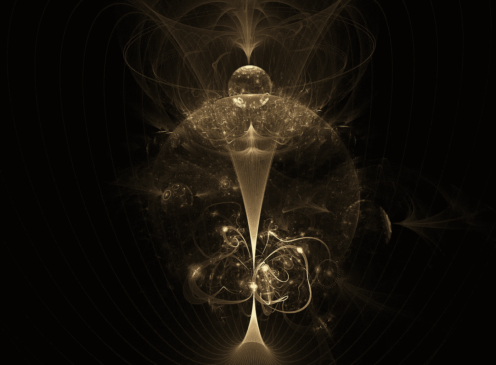

# 谷歌已经取得了量子优势。这可能会变成一场全球性的灾难

> 原文：<https://medium.datadriveninvestor.com/google-has-achieved-quantum-superiority-this-could-turn-into-a-global-disaster-6a2dfda4aa52?source=collection_archive---------14----------------------->

## 邪恶的理由

谷歌创造的量子计算机有史以来第一次解决了常规计算机无法解决的任务。虽然并非所有专家都认同这一成果，但毫无疑问，量子计算将导致未来的技术突破。然而，它也产生了新的不可预见的问题，包括可能出现危险的人工智能。

# 数量优势

G oogle 科学家声称，他们创造了一种量子计算设备 Sycamore，其计算速度比传统计算机快 1 亿倍。现代超级计算机需要几千年的时间，Sycamore 只需要几分钟(200 秒)。这种特性被称为量子优势，它使计算机能够以令人难以置信的速度解决需要考虑大量数据的复杂问题。

 [## 2019 年即将改变世界的技术|数据驱动的投资者

### 很难想象一项技术会像去年的区块链一样受到如此多的关注，但是……

www.datadriveninvestor.com](https://www.datadriveninvestor.com/2019/01/17/the-technologies-poised-to-change-the-world-in-2019/) 

能够运算大数据的量子计算机和人工智能之间有直接联系。任何神经网络都搜索模式，这使它能够确定，例如，图片中描绘的是什么。然而，为此，计算机被迫进行天文数字的计算。通过模拟真实的自然系统，例如像人脑这样的神经网络，情况变得复杂。随着系统的复杂性，每次计算的时间呈指数增长。

Image by [Garik Barseghyan](https://pixabay.com/users/insspirito-1851261/?utm_source=link-attribution&utm_medium=referral&utm_campaign=image&utm_content=1280082) from [Pixabay](https://pixabay.com/?utm_source=link-attribution&utm_medium=referral&utm_campaign=image&utm_content=1280082)

到 2008 年，作为蓝色大脑项目的一部分，研究人员能够模拟一个由 10，000 个神经元组成的大鼠大脑皮层列。拥有 8000 多个处理器的蓝色基因超级计算机被用于此目的。在 2011 年，有可能建立一个由 100 个新皮质柱组成的网络，总共有 100 万个神经元。

然而，人脑是由数亿个通过突触连接的细胞组成的。理论上，量子优势为 its 和更复杂的系统建模提供了机会，如 superintellect。

# 比人聪明

根据牛津哲学家尼克·博斯特罗姆的定义，超级智能(superintellect)被称为一种人工智能，它在几乎任何活动领域都比人“聪明”。超级智能的出现不可避免地带来了风险，参与人工智能和其他技术开发的数学家、哲学家和科学家试图提前计算风险。例如，剑桥大学存在风险研究中心的工作人员(其顾问是 SpaceX 创始人埃隆·马斯克)在 2015 年签署了一封公开信，敦促科学家尽最大努力不要创造人们无法控制的东西。

2015 年，《自然》杂志发表了一篇关于谷歌旗下谷歌 DeepMind 创建深度 Q 网络的文章。这个人工智能体能够学习玩游戏(并获胜)，只接收像素和点数作为输入。换句话说，他不需要一个人来指出正确和错误的决定。此外，deep Q-network 超越了所有其他算法，在 49 场比赛中达到了一名职业游戏玩家的水平。同样，为了生存，超智能体会利用各种外部刺激来创造自己对世界的感知，人们会发现这很难理解和研究。

超智力的一个假想的体现是子宫脑。它是戴森球(一种围绕恒星建造的天体工程结构)的一种形式，利用所有的光能进行计算。量子技术可以创造出更紧凑的机器。

根据尼克·博斯特罗姆的说法，要么限制他的能力，要么以某种方式激励他追求符合人类利益的目标，以确保超级智能不会伤害人类。然而，良好的意图可能会产生致命的后果。最简单的例子，被命令增加世界幸福水平的超级智能体，将决定毁灭人类，代之以幸福思想的模拟。也可以仅使用最基本的通信信道来尽可能隔离 superintellect，但即使这样也不能提供保证。

# 这是不可能遏制的

尽管量子计算机的性能优于传统计算机，但它们并非全能。量子计算机能解决的任何问题，常规计算机都解决了，尽管需要很长时间。相反，一个常规计算机原则上无法解决的问题，对量子来说也是棘手的。这种任务包括所谓的停止问题:如果给出了某个过程的描述和输入，是否有可能确定该过程的执行是否会结束。1936 年艾伦·图灵证明这个任务不能用算法解决。

为了证明一个任务是否棘手，通常将其归结为一个停止问题。如果你能为一个新任务找到解决 stop 问题的算法(这是一个矛盾，因为 stop 问题没有解决)，它也无解。2016 年，一群来自美国、澳大利亚和西班牙的科学家得出结论，遏制超智能体的问题也很棘手。

他们证明了这一点:威慑问题由两个子任务组成。第一个叫做危害问题，或者 R (D)函数，就是要知道 D 输入的 R 程序的执行是否会危害人类。必须记住，解决伤害问题的办法不应该伤害人类。因此，寻求解决方案应该模拟 R (D)的执行，并预测其执行的后果，而不影响世界，即孤立地进行。第二个子任务是控制问题。当可靠地知道不会有伤害时，该函数触发 R (D)。

> 在大众文化中，人为的理性与人类的灾难紧密联系在一起。与此同时，科学家们正在认真计算与计算技术相关的风险。

假设有一个假设的程序，它首先执行某个程序，然后开始伤害人。因为没有办法看到第一个程序是否会结束，所以你无法预测这个程序是否危险。毕竟，如果程序永远执行，不会对人造成伤害。至于控制问题，重要的是限制与超级智能体的交互，也就是说，只使用最重要的沟通渠道。但应该记住的是，超智能根据定义是一台通用图灵机(像人一样)，也就是说，能够模拟任意图灵机的行为。不可能知道超级智能是否会伤害这些通信信道中的人，也不可能安装防止伤害的断路器。

# 不可预测的属性

事实上，就连机器是否拥有超智能的定义也与包容问题属于同一类问题。根据赖斯定理，人们无法预测函数中任何非平凡性质(即其他函数中不存在的性质)的存在，无论它对人类或超级智能是有害的。

全量子计算机有望用于应对与流行病学、社会和经济危机以及气候变化相关的重要挑战。为了最有效，它们应该配备复杂的传感器并且不受限制，因为缺乏关键数据会导致不正确甚至有害的结论。但没有办法预测在这种情况下，是否会出现一个恶意或被误解的合成思维(或智力代理)，将世界引向一场全球性的灾难。

当然，这并不意味着人们应该忘记量子计算机。对一个人预测其行为后果的能力来说，存在着简单的数学限制。尤其是当它涉及到人工智能等极其复杂的系统的创建时。