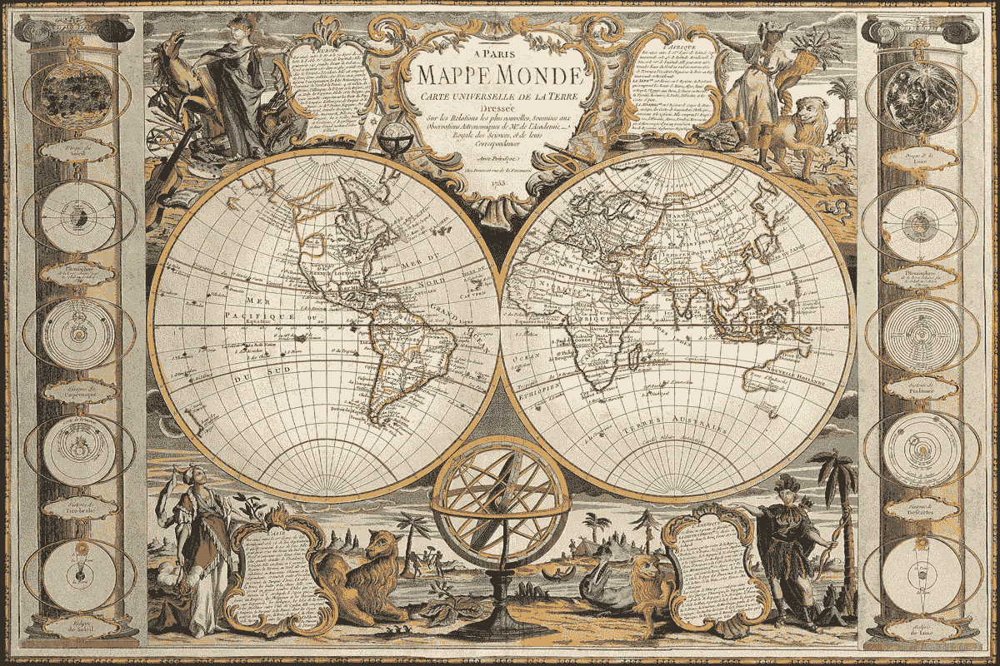

# 谷歌，华为，以及为制作我们的地图而战。

> 原文：<https://medium.datadriveninvestor.com/google-huawei-and-the-battle-to-make-our-maps-946cb1948920?source=collection_archive---------7----------------------->

An old-timey map.

## 胜利者将塑造我们的现实。

早在 1501 年，在最初的 iPod 甚至是随身听出现之前，葡萄牙国王就派出了一支快乐的探险队去查看哥伦布先生几年前发现的那片奇怪的土地。

其中一位探险家亚美利哥·维斯普奇发现这片土地并不是亚洲的东部边界。相反，它是一个独立的大陆。

他写下了他的旅程，并按照惯例，用他名字的拉丁形式——阿梅里格斯·维斯普奇——落款。

 [## 一个企业在肚子上移动:如何照顾直觉|数据驱动的投资者

### 事实证明，直觉不仅仅是一种感觉。科学很清楚:你的直觉比你知道的更多…

www.datadriveninvestor.com](https://www.datadriveninvestor.com/2018/11/09/a-business-moves-on-its-stomach-how-to-make-allowances-for-gut-feelings/) 

当时最重要的制图员利用维斯普奇的作品为他的全球地图增加了新的细节。

那么，如何称呼这个“新世界”呢？向维斯普奇致敬似乎是正确的，但“阿梅里格斯”缺乏某种派头。况且；欧罗巴、亚洲、非洲——它们都以 a 结尾。

瞧，阿梅里加。或者，正如人们所知的，美国。

你可能以前听说过这个故事，如果没有，我肯定你在笑点之前看到了它的走向。即使是我，也无法通过这么快失去观众来开始一个关于地图的故事。

你看，地图很重要。

他们记录边疆；国家和文化之间的交流，也是我们知识的交流。

不管是谁创造了我们的地图，他都有权力命名，塑造，甚至操纵。

维斯普奇和他的手下当时就知道这一点。

谷歌今天当然知道这一点。

2010 年，尼加拉瓜使用谷歌地图来证明其入侵哥斯达黎加的正当性。看，谷歌地图把哥斯达黎加的卡莱罗岛标为尼加拉瓜领土。

一名尼加拉瓜军队指挥官说，“谷歌上的卫星照片显示了边界在哪里。”

我们在这里有问题吗？谷歌一下——本质上，我们是在自己的地盘上。

在那次地震般的地理失态大约一周后，谷歌被卷入了摩洛哥和西班牙之间的一场外交战争，这场战争的起因是一个有趣的名字:Isla de Perejil(欧芹岛)。谷歌错误地将这个草本岛标注为摩洛哥的一部分，而实际上它是西班牙的领土。

在寻求存储世界数据以获取商业利益的过程中，谷歌很快意识到自己被卷入了地缘政治的世界。

谷歌最初开发地图产品的方式与传统制图员截然不同。

它要求用户通过 2008 年推出的地图制作工具来帮助更新偏远地区的地图。2015 年，在一些投机者添加流氓图片后，该网站被关闭，比如谷歌标志在苹果标志上撒尿。人们仍然怀疑这是否是内部人员所为。

谷歌还利用其庞大的内容索引来为其地图上的列表添加上下文。它会提取关于国家或古迹的关键词，为搜索者提供信息。

它不得不再次改变策略，在奥巴马夫妇居住期间，搜索淫秽短语(我不会重复，但你可以猜测这种事情)触发了白宫的结果。

地图应该是现实的反映。挑战在于选择正确的现实来反映。

在这种情况下，谷歌地图反映了社会中的种族主义和性别歧视。毫无疑问，它们是真实存在的，但我们最好不要鼓励它们浮出水面。

谷歌是一家盈利性公司，希望以可靠、经济的方式让其产品发挥作用。

然而，它的许多产品都有超出公司财务报表的含义。

本周，谷歌地图迎来了它的 15 岁生日，它的制造商为这一重大时刻发布了一系列新功能。

Live View 的增强现实功能现在可以在更多的地方工作，您可以访问更多关于交通路线的信息。

谷歌地图每月拥有超过 10 亿用户，是谷歌未来战略的核心组成部分。这对于指导无人驾驶汽车非常方便，谷歌也有既得利益知道我们所有人在哪里。

因此，为了维持世界上最受欢迎的地图，政治紧张的争论是值得的。

去年年底，我们发现俄罗斯的谷歌地图显示克里米亚是俄罗斯联邦的一部分。这违背了其作为乌克兰领土的官方国际地位。

2010 年与尼加拉瓜和西班牙的问题是破坏性的，但最终是偶然的。

十年后，谷歌的错误似乎更有目的性。甚至阴险。

新版地图可能会把欧芹岛误认为摩洛哥。今天的成人化身不太可能在克里米亚问题上犯下如此诚实的错误。

正如我们在[上周的文章](https://medium.com/@clarkboyd/january-2020-a-flavor-of-the-month-4427d9962eea)中看到的，苹果在 2019 年末对其地图产品进行了相同的改变，以缓解与俄罗斯的紧张关系。

然而，这些不再是简单的商业决策。对受影响的人口来说，这相当于默许外国侵略。

乌克兰外交部长没有退缩:

我想，谷歌和苹果除了自己的企业发展之外，没有任何组织政治信仰，这一事实没有提供什么帮助。

对一些人来说，这似乎是一种过度反应。

我在北爱尔兰长大，当然一次又一次地看到了这种对看似琐碎的术语问题的深刻感受。

一个名字里有很多东西，但是谷歌和苹果在行动前考虑所有方面没有商业利益。他们会随着政治风向而改变。

这就是我们今天旅程的最后一站。

美国的大型科技公司花费大量资金游说政府。大多数时候，公共领域和私人领域彼此保持一定的距离。

中国的情况有点不同。

到目前为止，华为已经从中国政府获得了 7600 亿美元的补贴。难怪它的手机便宜，嗯？

它还设法在外国政府之间制造分裂。

英国决定允许华为在发展其 5G 基础设施方面发挥作用，这导致了英国与其长期盟友美国之间的裂痕。

就美国而言，由于担心中国电信公司华为可能利用其设备监视美国公民，美国已将华为列入黑名单。

苹果和微软仍将与华为合作，但谷歌不会。

华为 [**正与小米合作，打造谷歌应用商店**](https://www.theverge.com/2020/2/6/21126118/huawei-xiaomi-vivo-oppo-app-store-platform-google-play-dominance-worldwide) 的竞争对手，与本故事更相关的是，它正与 TomTom 合作，打造谷歌地图的替代产品。

在其他情况下，像华为这样的企业没有多少资源来创建新的地图。它很乐意与谷歌的 Android 操作系统合作，直到事情变得政治化。

现在，世界第二大智能手机制造商在美国几乎看不到，并正在大力投资新的操作系统。

地图总是充满了创作者的偏见。地图用户必须相信他们所看到的；毕竟，我们很难在比非常小的范围内验证他们的真实性。

地理边界是任意和人为的；它们可以轻松地重画，甚至漫不经心。

谷歌、苹果和华为都有不同的议程，今天的科技公司是政治工具。技术和政治之间的关系将会在我们的数字地图中体现出来。

这场地图战争的胜利者将获得划定边界、标记土地和追踪我们一举一动的权力。

他们的现实将成为我们的现实。