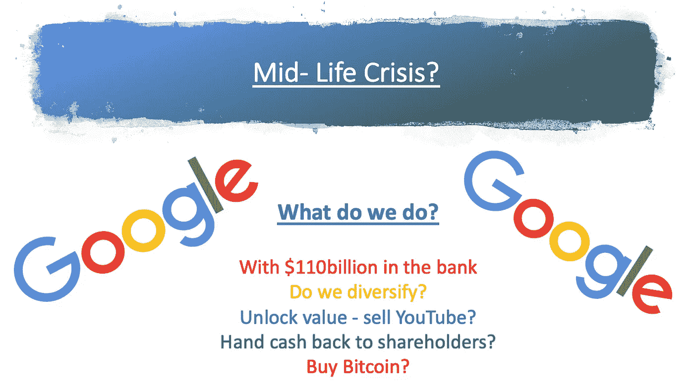

# 谷歌——中年危机？

> 原文：<https://medium.datadriveninvestor.com/google-mid-life-crisis-e08bc118d55f?source=collection_archive---------17----------------------->

2 [分钟。视频](https://youtu.be/tQzW7d9Ca48)考虑谷歌的下一步行动

正如 Economist.com 的[最近所说，也许 21 岁的谷歌需要“听取经历中年危机的人的建议，瘦身，专注于你擅长的事情”，因为谷歌的价值可能比其各个部分的总和少 1000 亿美元](https://podcasts.apple.com/gb/podcast/editors-picks-from-the-economist/id313848583)

Youtube 的价值可能超过网飞(目前价值 2120 亿美元)。如果没有别的东西，卖掉它会增加网上竞争。无论如何，2006 年 T4 只花了 16 亿美元收购了 YouTube，如果出售的话，谷歌的股东将获得巨大的回报。

如果谷歌真的卖掉了它的一些子公司，可能不是坏事，从而避免了 1911 年标准石油公司(Standard oil)被迫解散的潜在命运，它会怎么做？

当然，著名作家乔治·吉尔德在他的书《谷歌之后的生活》中认为谷歌的黄金时代已经过去。随着广告商将数据货币化的日子越来越短，我们进入了一个加密微支付的世界。

谷歌可以偿还一部分 140 亿美元的长期债务，或者进行更多的股票回购，或者效仿纳斯达克上市的另外 10 亿美元的商业策略，购买大量的密码。

 [## 稳定币会危及比特币在加密领域的地位吗？数据驱动的投资者

### Stablecoin 是一种加密货币，主要用于维持稳定的市场价值。它可以通过…

www.datadriveninvestor.com](https://www.datadriveninvestor.com/2020/06/08/can-a-stablecoin-jeopardize-the-position-of-bitcoin-in-the-crypto-space/) 

[MicroStrategy](https://www.businesswire.com/news/home/20200811005331/en/MicroStrategy-Adopts-Bitcoin-Primary-Treasury-Reserve-Asset) 最近同意进行 2.5 亿美元的股票回购，并向比特币投资 2.5 亿美元，因为它对美元的前景感到严重担忧

从长远来看，谷歌依赖其摇钱树广告业务是明智的吗？还是它需要表现得像一个成熟的企业集团，不再像过去那样随心所欲、无忧无虑？

这可能是它关注银行和金融服务的原因吗？谁知道呢，我们会不会很快看到谷歌币成为其业务及其他领域的全球支付方式？

给你带来的数字字节，如果你想收到你的每周版有更多的文章，像这封电子邮件 info@teamblockchain.net

**#谷歌# YouTube #支付#经济学家#网飞#标准石油#比特币#Midlifecrisis**

**访问专家视图—** [**订阅 DDI 英特尔**](https://datadriveninvestor.com/ddi-intel)