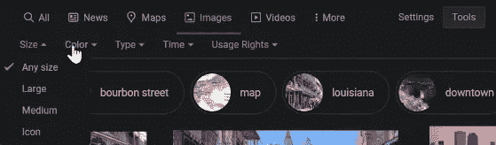
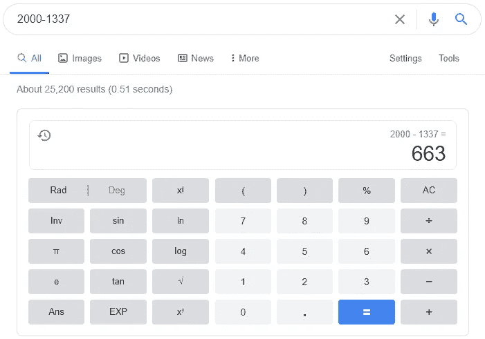
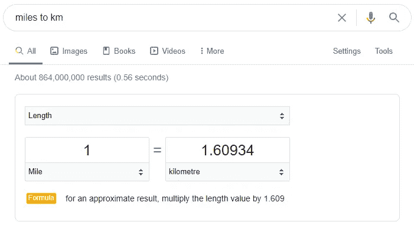
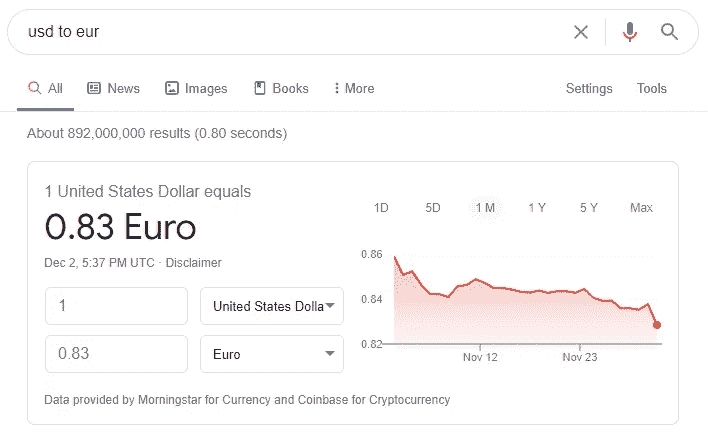

# 谷歌搜索技巧和窍门

> 原文：<https://medium.datadriveninvestor.com/google-search-tips-tricks-d662f2cee421?source=collection_archive---------38----------------------->

用这些提示和技巧提升你的搜索和研究水平。请确保阅读整篇文章，因为我保证你会学到关于这个世界上最强大的搜索引擎的新东西。

# 为什么重要？

嗯，谷歌是世界上使用最多的搜索引擎，有 40 亿用户，而互联网本身只有 43 亿多一点。这意味着几乎每个上网的人都至少使用过一次他们的服务。更重要的是，谷歌有一个强大的搜索引擎，可以帮助你找到几乎任何你想要的东西。

当你在为你的家庭作业或工作做研究时，甚至当你想了解世界上任何一门学科时，这真的很重要。精通研究是一项从长远来看会让你受益的技能，所以为什么不通过学习我遵循的这些技巧和诀窍来超越其他人呢？

# 话越少越好

如果你脑子里有一个特定的问题，想把它全部打出来，当然，你可以这样做，但你不会得到最好的结果。这就是为什么你要知道有时候只写关键词会更好。例如，您的查询中可能有 10 个单词，为了获得更好的结果，只需找出 3 个关键字并进行搜索。

举例:如何学习计算机语言 javascript？
已编辑:Javascript 教程

如果只有两个关键词不能给你最好的结果，你必须一个接一个地添加关键词，直到你找到你想要的。请记住，用词精确总是比尽可能多地输入要好。

# 工具

为了得到最好的结果，也就是与你的搜索查询最相关的结果，试着调整时间框架。你可以按下 tools 按钮，然后你会看到两个新的选项出现。

正如你在上面的图片中看到的，有一个下拉菜单，显示任何时候，你都可以改变它，这样它就可以显示过去一周、一个月或者任何你需要的结果。你甚至可以选择你所选择的自定义时间范围。

在另一个下拉菜单中，如果您想查看只有精确拼写的结果，可以选择逐字选项。

## 图像搜索

搜索图片有时会有点困难，因为人们有很多方法可以操纵 SEO 来使他们的图片看起来更高。这就是为什么当你按下工具按钮进行图片搜索时，你会有不同的选择。

从上图中可以看出，您可以选择图像的大小、颜色方向、图像类型、发布时间和使用权。如果你打算在任何文章或产品中使用这些图片，最后一个是非常重要的。

# 你知道吗？

即使一个网站暂时关闭，你也可以通过谷歌搜索看到它最近的缓存快照。这是你可以做到的。当你搜索一个网站后，你会在列表中看到它，在域名的右边，你会找到一个下拉按钮。

正如你可以从左边的图片中清楚地看到，当你按下按钮，你会看到两个选项，缓存和类似的。

Cached 向您显示 Google bot 抓取的网站的最新快照，Similar 向您显示与该网站相关的类似搜索。

# 获取定义

谷歌真的很有帮助，甚至对那些正在学习英语或者只是想扩大知识面的人也是如此。只需在一个单词前加上 **define** 就可以得到它的定义。

你也可以在你想搜索的单词后面加上单词**，意思是**。这是一个非常简单的功能，可以帮助你学习各种新单词。

如果你想了解一个特定单词的来源，只需在单词前添加**词源**，然后点击搜索。

正如我之前简单提到的，你也可以通过使用谷歌来学习英语。在单词前加上**发音**，你会得到这个单词的正确发音和很多有用的信息。

 [## 擅长谷歌是一种技能|数据驱动的投资者

### 擅长‘谷歌’是一种技能。是的，你听到了。知道什么和如何谷歌或搜索的东西是一个…

www.datadriveninvestor.com](https://www.datadriveninvestor.com/2020/08/11/being-good-at-google-is-a-skill/) 

# 谷歌做数学

使用谷歌搜索执行数学计算真的很快。当你在网上工作和浏览互联网时，这可能会很方便，所以在搜索栏中键入数学方程可能比打开计算器更方便。

无论哪种方式，它都是对平台的一个很好的补充，可以方便很多人。

然而，你可以有一些计算器，如抵押计算器和小费计算器都可以从一个简单的搜索。

## 转换策略

通过简单的谷歌搜索，你可以轻松地将英尺转换成米，将英里转换成公里，甚至转换成两种货币之间的汇率。执行任何操作都非常简单，您可以通过键入以下简单查询来实现:

里程转换为公里-这将帮助您将里程转换为公里

美元对欧元——这将显示两种货币的实时汇率。

# 结束语

谷歌搜索是一个强大的搜索工具，完全免费，不利用它是不明智的。使用我在本文中为您提供的提示和技巧将帮助您在互联网上找到任何东西。

## 访问专家视图— [订阅 DDI 英特尔](https://datadriveninvestor.com/ddi-intel)