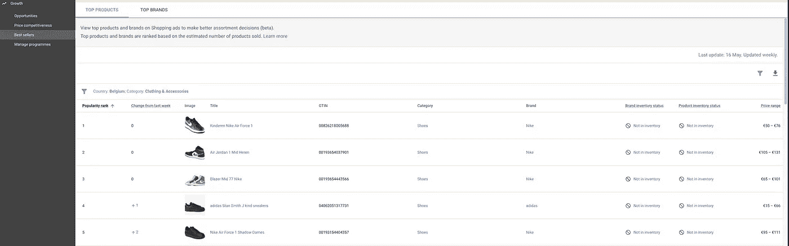
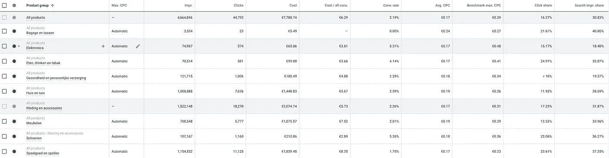

# 谷歌购物是获得新买家的一块宝石

> 原文：<https://medium.datadriveninvestor.com/google-shopping-is-a-gem-for-acquiring-new-buyers-5008f7bfbe31?source=collection_archive---------23----------------------->

## 不仅仅是因为它目前是免费的

Photo by [Brooke Lark](https://unsplash.com/@brookelark?utm_source=medium&utm_medium=referral) on [Unsplash](https://unsplash.com/?utm_source=medium&utm_medium=referral)

当人们想到谷歌广告时，他们通常会想到 Adwords 程序，该程序在搜索引擎结果页面的顶部、侧面和底部显示基于文本的广告。

然而，早在 2002 年，谷歌就推出了购物计划，允许企业对消费者(B2C)组织展示其产品的广告活动，包括评论、细节和从供应商处购买的能力。

该平台比以往任何时候都更受欢迎，Hubspot 最近发布了谷歌购物的[终极 2020 指南。](https://blog.hubspot.com/marketing/google-shopping)

虽然看起来谷歌购物是一个在线市场，与易贝、亚马逊、Etsy 和其他公司竞争，但它实际上是一个广告平台，因此是一个更强大的营销工具。

因此，如果你能够制作一个产品提要，并愿意花几个小时为商业中心[优化你的产品组合，那么现在](https://blog.google/products/shopping/its-now-free-to-sell-on-google/)将是把这个渠道纳入你的分销组合的绝佳时机。

# 什么是谷歌购物？

它的前身是谷歌产品搜索和 Froogle，在 2020 年是搜索巨头的主要产品之一，并已多次更新，为零售商提供了更多功能，包括在一个广告中展示多种产品的能力，包括送货细节和当地产品。

他们继续增强和改进产品，2019 年来自[搜索引擎 Land](https://searchengineland.com/google-shopping-actions-vs-google-shopping-a-real-world-case-study-313688) 的一项研究得出结论，谷歌购物广告享有更高的转化率，篮子价值增加，新客户增加。

# 为什么它与今天相关？

首先，作为对危机的回应(我有把握地认为广告支出会整体下降)，他们让它免费了！

因此，没有比现在更好的时机了。

我目前使用它(预算非常有限)主要是为了获得新的买家或帮助保持对现有客户群的关注。25%的购买来自“冷潜在客户”，其余的主要是来自我们在 CRM 中认为“被搅动”的细分市场的增量收入。

使用谷歌购物的另一个好处是可以洞察当地市场。下面是谷歌的截图，告诉我在我们活跃的国家之一，哪些鞋目前通过谷歌购物卖得最好。

screenshot by author

# 谷歌购物的好处:

谷歌购物享有一系列你在其他地方找不到的好处，包括:

*   通过谷歌商业中心连接到谷歌显示网络(如 YouTube)
*   地理人口统计学层面的强大目标
*   强大的分析功能可以优化您的广告
*   针对移动设备优化
*   简单的设置
*   广告创意和描述的灵活性
*   综合促销活动
*   自动投标策略，包括一个旨在提供积极投资回报的策略
*   一旦你打开它，几乎即时的结果
*   为您的客户提供改进的、简化的购物体验
*   资深在线商家使用更高级策略的能力

# 你应该使用谷歌购物吗？

因为谷歌购物广告允许你将你的产品展示在与搜索者特定产品查询直接相关的有机搜索结果的正上方，这些广告享有更高的点击率和转换率。

最终，谷歌购物将以高针对性和高参与度的网络浏览器的形式向你的网站发送非常热情的信息，让你购买。这对任何在线零售商来说都绝对是一笔不错的投资。

使用谷歌购物还有其他各种各样的间接好处，比如品牌知名度和提高在线知名度和竞争力。

简而言之，如果你不使用它，你就错过了。

从个人经验来看，我们看到谷歌购物的转化结果通常只能通过会员获取会员活动来实现，这需要推动最忠诚的客户群，因此只有当你有一个可行的客户群规模，并彻底了解你的 CLTV 触发器时，才是可扩展的。

获取新客户的成本似乎相当高(5 月份平均为 12 欧元)，但每个新买家的成本(平均为 47 欧元)目前是其他付费媒体渠道无法比拟的。当然，我们不认为谷歌购物是一个纯粹的客户获取渠道，而是一个重新定位的工具。因此，为了正确看待纯粹的“新客户”观点，我们可以将成本除以 4(在我们的设置中，重新定位大约占预算使用的 75%)，这意味着新会员的费用为 3 欧元，新买家的费用大约为 12 欧元。

下面是特定活动及其本月至今视图的屏幕截图。根据这些指标，我们会不断优化每个类别的预算，并根据我们自己的内部信息(库存深度/可用性)优化我们的搜索印象份额

screenshot by author

鉴于目前的免费曝光，即使只利用很少的预算也可以给你很好的结果来验证这个渠道是否应该成为你新的营销分销组合的一部分。