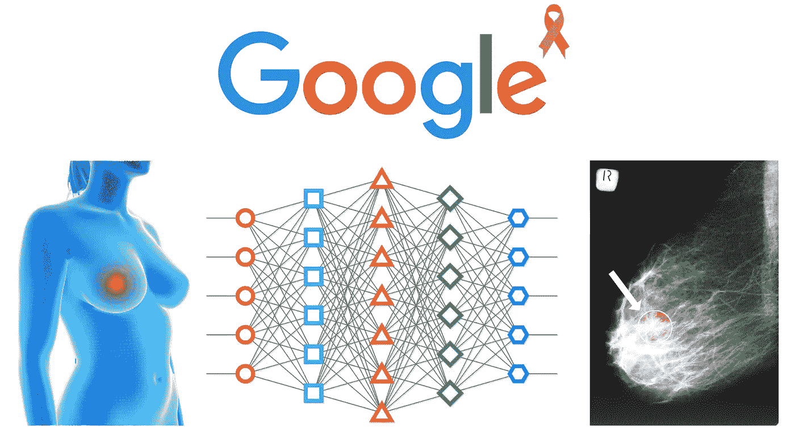
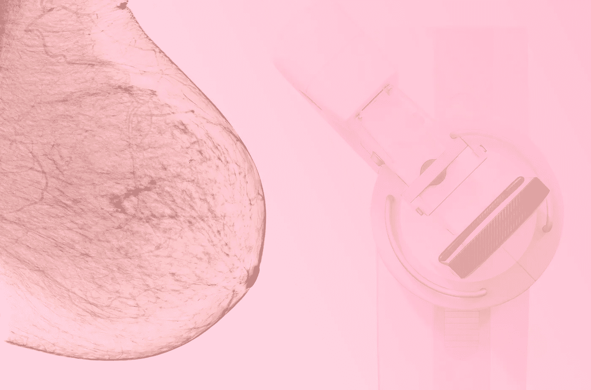
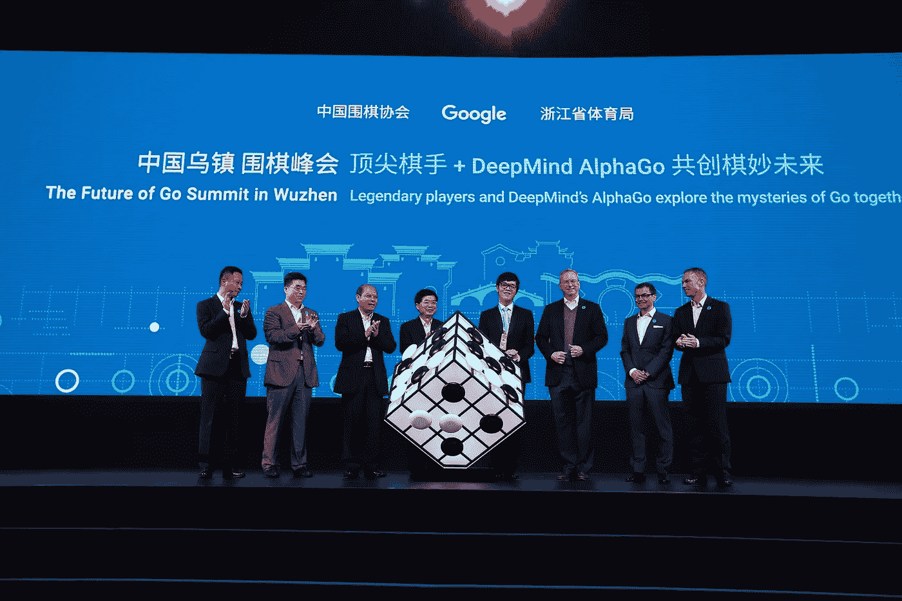

# 谷歌的人工智能系统在检测乳腺癌方面胜过放射科医生

> 原文：<https://medium.datadriveninvestor.com/googles-ai-system-bests-radiologists-at-detecting-breast-cancer-21befded8106?source=collection_archive---------6----------------------->

## 超越乳腺癌筛查的旧限制，谷歌的人工智能与放射科医生竞争，以设定新的基准。

Source: [Ingridat](https://depositphotos.com/portfolio-2064111.html) / [Дмитрий Королев](https://depositphotos.com/portfolio-6457890.html) / [Micut](https://depositphotos.com/portfolio-1678926.html) / [DepositPhotos.com](http://www.depositphotos.com)

# 背景

一个由来自英国和美国的研究人员组成的团队[最近发布了信息](https://www.nature.com/articles/s41586-019-1799-6)，强调由谷歌设计的人工智能系统在通过乳房 x 光筛查检测乳腺癌方面比人类放射科医生更好。新的机制可以增强治疗效果；它消除了癌症诊断中的许多常见错误。

> ***“…由于假阴性和假阳性，放射科医生在乳房 x 光检查中漏掉了大约 20%的乳腺癌。”***

美国癌症协会报告称，由于假阴性和假阳性，放射学家在乳房 x 光检查中漏掉了大约 20%的乳腺癌。几十年来，乳房 x 线照相术在乳腺癌的筛查和检测中一直是至关重要的。尽管如此，多年来的技术进步仍未能弥补高误差率。

将人工智能加入等式似乎是解决方案。

这里，我们必须注意到，在乳房 x 光检查中大约 80%的癌症是可见的，但要么没有被注意到，要么被错误地认为是良性的。前面提到的国际研究小组走到一起，为这种古老的情况提供了一个解决办法。

Source: [Samunella](https://depositphotos.com/portfolio-31111340.html) / [Depositphotos.com](http://www.depositphotos.com)

# 人工智能和乳房 x 光检查——这项研究

为了评估人工智能系统在临床环境中的有效性，他们分析了来自英国的大型代表性数据集和来自美国的大型丰富数据集。发现该系统使假阳性的绝对减少了 5.7%和 1.2%，假阴性的绝对减少了 9.4%和 2.7%(分别在美国和英国的数据集)。研究人员独立研究了六名放射科医生，他们都表现出色。因此，他们得出结论，谷歌的系统可以提供更好的结果。令人惊讶的是，该机制的受试者工作特征曲线下面积(AUC-ROC)比普通放射科医师的 AUC-ROC 大 11.5%。此外，将人工智能应用于双重阅读过程保持了不劣的性能，同时将第二个读者的工作量减少了 88%。

 [## 人工智能与创造力:梦想成真|数据驱动的投资者

### 人工智能总是让我着迷。不仅作为一套有用的工具，不断发展，而且作为一个…

www.datadriveninvestor.com](https://www.datadriveninvestor.com/2019/01/28/ai-creativity-deep-dream-comes-true/) 

[Alphabet 的 DeepMind AI 部门于 2019 年 9 月与谷歌健康合并](https://deepmind.com/blog/announcements/deepmind-health-joins-google-health)，该部门被用于这项研究。在开展研究工作之前，Alphabet DeepMind 在创建高性能人工智能系统方面有着良好的记录，这些系统擅长在视频游戏中不断超越人类。它的第一个医疗应用专注于协助医生对匿名化的眼部扫描进行实时分析，这种扫描可以寻找可能导致患者未来失明的疾病的早期迹象。

Source: [ChinaImages](https://depositphotos.com/portfolio-21607914.html) / [Depositphotos.com](http://www.depositphotos.com)

Alphabet DeepMind 开发的大多数应用程序都依赖于人工神经网络、深度强化学习和机器学习，因为它们会反复分析结果以实现最佳性能。筛选研究中使用的深度学习模型经过训练，可以在数万张乳房 x 光照片中识别乳腺癌。事实上，这些数据是在 2012 年至 2015 年期间从英国的 25，856 名女性中收集的，在 2001 年至 2018 年期间从美国的 3，097 名女性中收集的。

# 符合和证实调查结果

在谈到研究结果的准确性时，马萨诸塞州总医院乳腺成像部门的负责人康妮·雷曼证实，这些发现与其他几个试图使用人工智能改善癌症检测的小组的发现直接一致，包括那些[在她的作品](https://www.dfhcc.harvard.edu/insider/member-detail/member/connie-lehman-md-phd/)中发表的那些。雷曼专注于使用深度学习模型来将一部分乳房 x 光片分类为无癌，从而提高性能和工作流程效率。她对该应用程序的使用揭示了放射科医师工作量的潜在减少和特异性的显著提高，而没有牺牲任何灵敏度。

雷曼确实承认，计算机辅助检测(CAD)程序在医疗诊断方面没有多大作用。这是因为大多数程序只是被训练来识别人类放射科医师可以看到的东西。然而，人工智能计算机可以更有效地发现癌症，因为它们可以从成千上万张乳房 x 光照片的实际结果中消化和学习。因此，这些系统有更多的能力来识别人眼和大脑可能错过的线索。

Source: [Baramee2017](https://depositphotos.com/portfolio-13803402.html) / [Depositphotos.com](http://www.depositphotos.com)

# 结论

人工智能的发展令人难以置信。现在它承担了主要的角色，如疾病的诊断和个性化治疗的决定和计划。这项研究工作的发现表明，如果设计和维护得当，人工智能系统在捕捉癌症方面比人类更熟练。随着某些基于人工智能的系统在诊断中的越来越多的采用，更多的生命将被拯救。

这篇文章对我来说是切中要害的，因为我家有乳腺癌。我把这篇博文献给所有勇敢对抗或勇敢对抗乳腺癌的坚强女性。我祈祷这一领域的进展迅速到来，以便我们能够减少并最终结束它的长篇大论。

*如果你想看到更多这样的帖子或亲自与我联系，你可以在* [*LinkedIn*](https://www.linkedin.com/in/sohail-merchant-370aaa59/) *，*[*Twitter*](https://twitter.com/smerchantMD)*上添加我，或在下面发表评论。也可以在* [*中等*](https://medium.com/@smerchant40k) *上查看我的帖子。*

*原载于 2020 年 5 月 21 日*[*https://www . aim blog . io*](https://www.aimblog.io/2020/05/21/googles-ai-system-deepmind-bests-radiologists-at-detecting-breast-cancer/)*。*