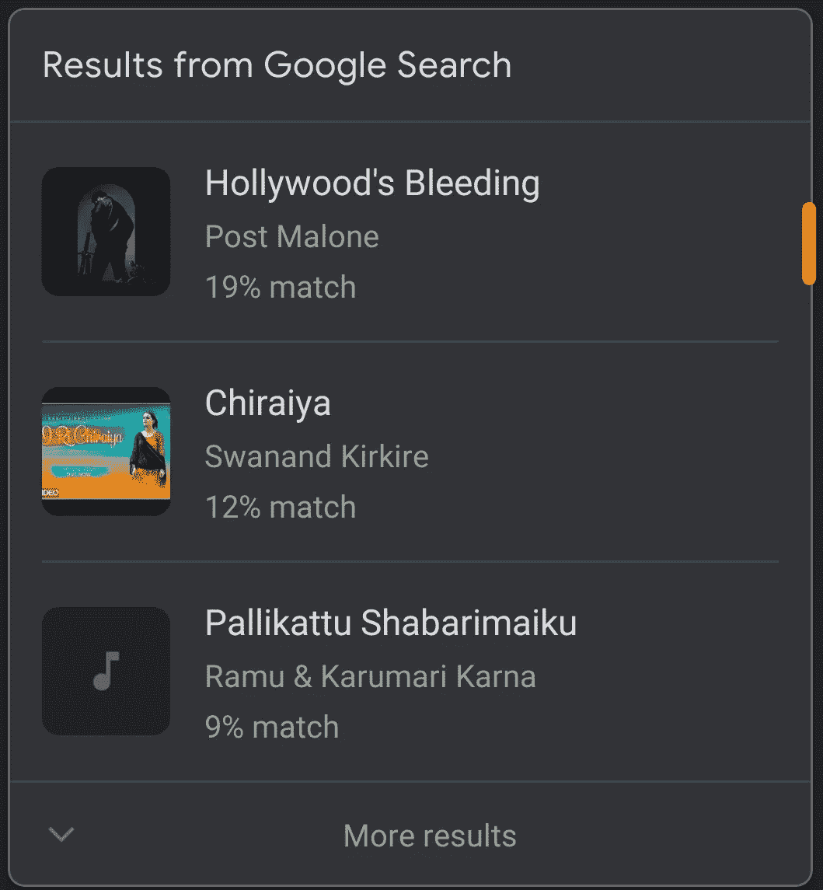

# 谷歌新推出的“哼声搜索”功能非常出色

> 原文：<https://medium.datadriveninvestor.com/googles-new-hum-to-search-feature-is-remarkable-ac5d1220e8fe?source=collection_archive---------13----------------------->

## 哼唱是你了解这首歌所需要的一切

Photo by [Spencer Imbrock](https://unsplash.com/@spencerimbrockphoto?utm_source=unsplash&utm_medium=referral&utm_content=creditCopyText) on [Unsplash](https://unsplash.com/s/photos/music?utm_source=unsplash&utm_medium=referral&utm_content=creditCopyText)

嘿，你能帮我想出我脑海里的那首歌吗？事情是这样的-

*'拿拿拿拿拿拿拿拿拿拿拿拿拿拿拿拿拿拿拿拿拿拿'*

我就是想不通。可以吗？

嗯……没关系，听着曲子然后识别歌曲已经够难的了，更不用说仅仅用一些文本来解释了。

我们都经历过这种情况。这种现象被称为[耳虫](https://www.ncbi.nlm.nih.gov/pmc/articles/PMC4723199/#:~:text=disorder%20(OCD).-,Earworms%20or%20stuck%20song%20syndrome,population%20has%20experienced%20these%20earworms.&text=Usually%2C%20stuck%20songs%20are%20catchy,or%20by%20hearing%20the%20melody.):一首曲子一直困扰着我们，在我们脑海中回响，直到我们找到它的名字。许多人即使知道这首歌的名字也无法摆脱它，但对我来说，这个名字就是[《逃避》](https://www.mentalfloss.com/article/558659/ways-get-rid-earworms-according-science)。

 [## 擅长谷歌是一种技能|数据驱动的投资者

### 擅长‘谷歌’是一种技能。是的，你听到了。知道什么和如何谷歌或搜索的东西是一个…

www.datadriveninvestor.com](https://www.datadriveninvestor.com/2020/08/11/being-good-at-google-is-a-skill/) 

这种综合症会破坏生产力和注意力，并会让你无限分心。我知道你经历过，这是很普遍的现象。

> 最近芬兰的一项民意调查显示，将近 92%的人每周至少经历一次不由自主的音乐想象。

# 谷歌前来救援

谷歌最近在谷歌搜索中发布了一项名为“哼声搜索”的功能。当我了解到这一点时，我认为这将是有限的，对大多数歌曲都不起作用。

> 我大错特错了。

有两种方法可以使用该功能。一种方法是打开谷歌助手，说“*这是什么歌*”，然后像你通常向朋友询问这首歌时那样哼唱这首歌——持续 10-15 秒。另一种方法是点击“*搜索歌曲*”按钮，进行同样的操作。

一个弹出窗口会出现几首它认为匹配的歌曲。它会按照可能性从高到低的顺序显示结果。

Results from ‘hum to search’

我用英语和印地语的许多不同的歌曲尝试了这个功能。它全都猜对了，除了一次——我想那一次我没哼好——我震惊地看到它工作得这么好。

这些功能在 IOS 上使用英语，在 Android 设备上使用 20 多种语言。此外，您不需要以完美的音高或音调哼唱，它仍然会显示合理的结果，尽管匹配率可能会降低。

自从卷积神经网络出现以来，人工智能在短时间内变得异常出色。

> [哼唱搜索](https://blog.google/products/search/hum-to-search)功能使用机器学习模型将音频转换成代表歌曲旋律的基于数字的序列

2017 年，谷歌在 Pixel 2 上推出了' [Now Playing](https://support.google.com/pixelphone/answer/7535326?hl=en) ，这使得 Pixel 可以识别你附近播放的任何歌曲；2018 年，他们增强了相同的技术，使其适用于数百万首歌曲，并保留了“[声音搜索](https://support.google.com/googleplaymusic/answer/2913276?hl=en)”的功能。

Shazam 更擅长检测附近播放的更多歌曲，但哼唱不起作用。凭借“哼声搜索”功能，谷歌击败了 Shazam。

近日， [GPT-3 by Open AI](https://openai.com/blog/openai-api/) 发布。它可以使用文本描述对网页进行编码，写文章、歌曲、技术手册等等。谷歌的[音乐识别技术](https://ai.googleblog.com/)发展如此迅速，让我有点害怕。

> *哦！还有一点，那首歌是波斯特·马龙的《好莱坞的流血》。*

## 访问专家视图— [订阅 DDI 英特尔](https://datadriveninvestor.com/ddi-intel)