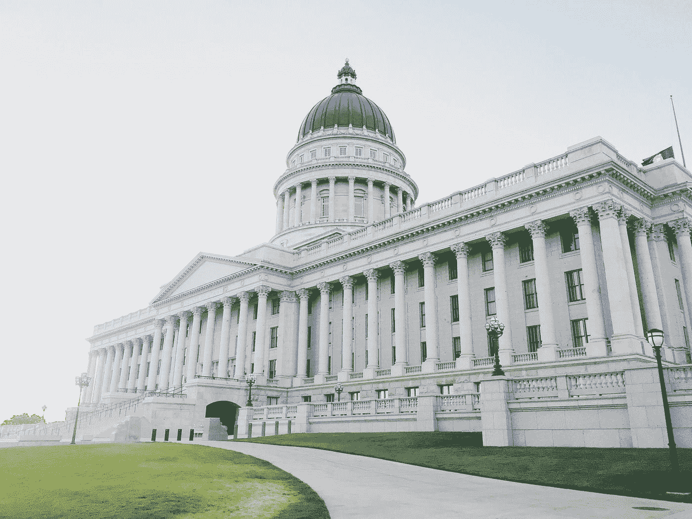

# 政府官员不想承认这两件事

> 原文：<https://medium.datadriveninvestor.com/government-officials-dont-want-to-admit-these-two-things-f1f62726ad51?source=collection_archive---------7----------------------->

Photo by [Zac Nielson](https://unsplash.com/@zacherynielson?utm_source=medium&utm_medium=referral) on [Unsplash](https://unsplash.com?utm_source=medium&utm_medium=referral)

随着 4 月进入 5 月，冠状病毒危机将继续困扰美国，主导着广播和家庭对话。

但有理由乐观:传奇曲线已经成功变平，表明美国人不情愿地习惯的封闭和封闭生活方式即将结束。

一个月前，我们还在学习如何应对“隔离”这一新奇而又怪异过时的概念，而现在，我们正在目睹一场针对这些扩大隔离措施的反抗，其形式是全国各地的公民抗议。

病毒在美国早期阶段的泡沫恐慌现已在很大程度上让位于关于继续关闭与解除关闭孰优孰劣的政治争议。

 [## 现金为王，比我们想象的更强大|数据驱动的投资者

### 2020 年 3 月 12 日，在川普总统宣布新冠肺炎进入国家紧急状态的前夕，纽约时报报道…

www.datadriveninvestor.com](https://www.datadriveninvestor.com/2020/03/26/cash-is-king-more-potent-than-we-think/) 

对感染未知疾病的恐惧可能是第一阶段的特征，但目前阶段发现这些担忧正在消退，一种新的担忧正在取代它们。衰退的乌云笼罩着地平线，小企业、大企业、个人和政府机构都警惕地注意到了这一事实。

冠状病毒的历史篇章并不是一个杂乱无章的故事。它分阶段显现。我们美国公民所处的当前阶段是一个不太专注于自我保护的避难所，相反，现在更专注于恢复正常的棘手任务(？)生活。

我们目前的有利位置是一个关键实现的时刻。我们必须抛开无节制的恐惧和道德主义，摒弃仅仅为了政治正确价值而鹦鹉学舌的言论。

**毫无疑问:冠状病毒已经破坏了我们的世界，但我们可以通过应对它来破坏它。虽然我们对前者缺乏控制，但我们对后者却有极大的自由。**

最终，我们需要一个根据现有数据进行调整的理性回应，而不是一个永久性的在家订单一揽子政策。从长远来看，未能优先考虑经济影响变化的游戏计划将是有害的。

政府制造了一大堆这类问题，我想在这里探讨其中的两个:1)不愿重开美国企业；2)创纪录的失业率带来的前所未有的影响。让我们从第一个问题开始:

# 所有业务都是必不可少的

在冠状病毒诉讼的早期，那些被视为“必要”的业务和那些被贴上“非必要”标签的业务是有区别的。

根据这一新的逻辑，在三月中旬全国范围内展开，杂货店和五金店亮着灯，而许多餐馆、商场、健身房、发廊等都关了灯。

因此，一种奇怪的僵硬的、强制性的黑白分类被应用于美国阳光下的所有企业。这是一项史无前例的措施，对美国工商业来说是一种新的体验。更重要的是，这种“本质”的新语言隐约带有反资本主义的意味。

平心而论，这些措施是在大规模不确定性时期采取的，并起到了拉平曲线的作用。他们在抑制冠状病毒病例潜在流入方面发挥的作用不应被低估。

也就是说，本质的语言进入了我们的话语，停留在那里，甚至可能不受欢迎。

冠状病毒关闭的持续痛苦揭示了*所有*业务都是必不可少的。更重要的是，它们不能无限期地燃烧。

在大多数州，对医疗机构激增的担忧已经过去。尽管如此，许多官员和媒体人士坚持认为，在这些困难时期考虑那些所谓的非必要企业的生存能力，无异于道德上的不可思议。

令人尴尬的是，事实仍然是，鉴于曲线变平，没有什么理由保持激进的关闭措施，特别是当这些关闭最初是为了避免医疗系统不堪重负的明确目的而实施的时候。

但事实证明很难转变方向:从死亡作为主要危险转变为现在经济灾难作为主要危险。承认这两种威胁的存在——重要的是，两者都应该得到重视——对于一些公职人员来说是一个难以消化的现实。(以纽约州州长安德鲁·科莫(Andrew Cuomo)为例，他在本周的一次新闻发布会上猛烈抨击了那些表达对经济致命性合理担忧的问题，称其在伦理上令人反感。)

被如此小心翼翼地提及的事实是，即使是现在，那些推动避免死亡的军国主义、狭隘战略的人(应该注意到，这种危险已经大大减少了)是那些与游戏无关的人。在这些人中，采取措施拯救美国企业免于跌落悬崖的动机相当微弱。

所有业务都是必不可少的。无论他们的商品或服务是什么，他们都为社会的显著生产目的服务。它们提供收入，促进实体经济增长，共同让世界保持运转。

**他们是自由市场社会的必要支柱。应该对那些仅仅是试图与死亡抗争的企业给予一些同情。**

然而，那些一提到资本主义就感到一丝厌恶的人，习惯于在这个前所未有的时期将商业问题视为肮脏和自私。

但这是一种短视的行为:经济是社会跳动的心脏。它是市场，是生计的主要提供者，也是人类目的的贡献者。

也就是说，质疑政府继续关门的明智性在道德上并没有错。**公民的抵制实际上应该是一种安慰:展示“美国人的战斗本能”比冷漠的民众放弃要好，不是吗？**

毕竟，这种担忧并非毫无根据。为什么？政府采取了美国历史上最激进的失业措施。这就引出了我的第二点…

# 工作的性质可能正在改变

迄今为止，美国历史上最激进的失业措施是有代价的。创纪录的数百万人一直从政府领取薪水，而且数额经常超过他们平时的工资。

这是一个危险的先例，不利于古老的“找工作”的必要性。如果你可以靠政府的钱生活——而且相当舒适，那么工作的紧迫性何在？

哦，别忘了考虑一下，如果联邦就业机构在屋檐下等着照顾他们的孤儿，企业可能不太关心重新收集他们被解雇的员工。

**这正是我们发现自己所处的困境:被困在扭曲的激励之地。这从来都不是一个好地方。**

如果你认为政府可能会考虑通过撕掉创可贴和减少失业支出来进行报复，从而免除这种激励，那么请三思。给某人一些东西很容易，但要拿走却非常困难。(禀赋效应，有人吗？)

毕竟，这是一种众所周知的行为冲动:允许人们培养对自己失业津贴的主人翁意识(同样，这是一种危险的高水平)，如果你试图从他们的手指中窥探，你会感觉到他们的愤怒。(人们不喜欢自己的平衡受到影响。)

也就是说，改变路线在政治上非常不得人心。这正是为什么在危机时期采取的措施应该得到谨慎的审视:因为它们几乎总是能熬过暂时缓解的困难时期。

请记住:当涉及到新的现状时，政府依赖是最有害的因素之一——扭曲了自由市场的激励机制，膨胀了官僚机构。

当然，有些人希望找到生产性工作的出路，并乐意放弃失业的缓冲，不管这有什么好处。毕竟，对许多人来说，工作是实现目标的强大引擎。如果没有它，许多人会抑郁和自杀。

事实仍然是:大规模失业的新标准正在被设定，这对我们国家的经济前景和精神健康前景都没有好处。

现在，我们发现自己处于创纪录的百万失业困境是可以理解的。不知道他们面对的是什么，州政府和联邦政府迅速做出反应，用各种各样的货币支出和担保来阻止他们担心的正在下沉的泰坦尼克号。

政府资金很快被筹集来解决任何问题。当然，这种策略在短期内是令人放心的，但从历史上看，长期来看是糟糕的。

有问题的是，就政府方面而言，关于失业的崩溃，没有真正的行动计划，也没有起草撤退的方法。(怎么从被吐槽的网里走出来？谁知道呢？)这是一种不幸的缺乏远见的行为，尽管这在一种病毒正席卷全球的情况下是可以理解的。

因此，未来的问题之一将是膨胀的失业名册的新常态，以及对个人和企业的一系列扭曲的财务激励，肯定会为后代调整工作的性质。

# 最后的话

在每一次危机中，你都要与一些旧的恶魔和一些新的恶魔战斗。你当然不会毫发无伤地从火中出来。因此，我们的国家不会像以前那样了。

在危机中，重要的是做出理性计算的能力，这种能力既依赖于可用数据，又负责任地考虑到长期观点。

我在这里强调了源于冠状病毒报复的两个样本问题，希望它们能说明在国家危机时期理性政府解决方案的巨大必要性。