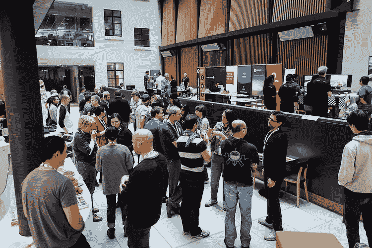
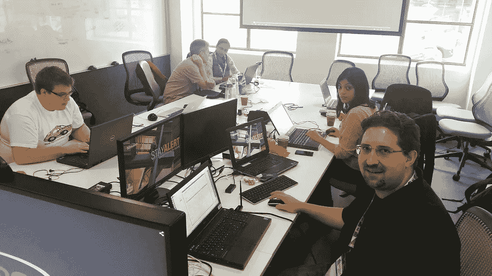
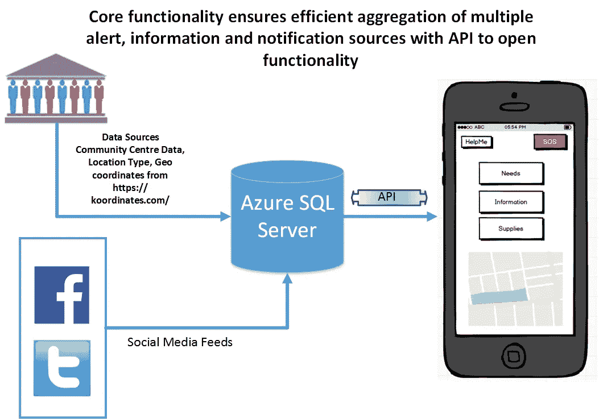
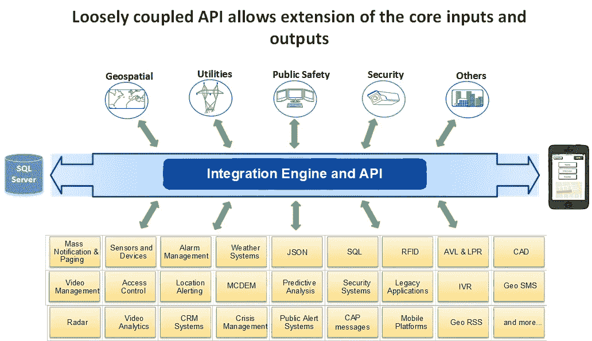
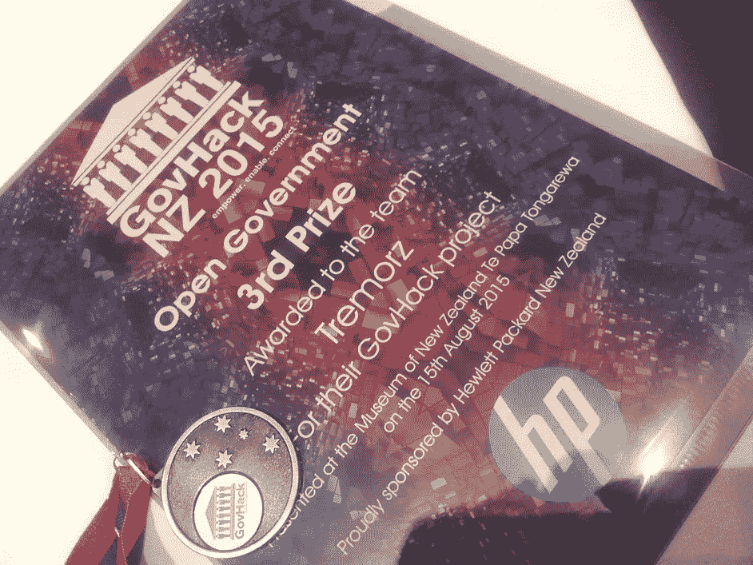

# 黑客马拉松的故事——46 小时内从想法到行动！

> 原文：<https://medium.datadriveninvestor.com/govhack-from-conception-to-implementation-in-46-hours-1e41d24fc7b8?source=collection_archive---------23----------------------->

“你必须从客户体验开始，然后回到技术上来，而不是反过来。”—史蒂夫·乔布斯。

一个周末，我和我的同事一起参加了名为 [GovHack](http://www.govhack.org.nz/) 的黑客马拉松。不，等等；我们没有黑任何人。但是和 1200 名不同的参与者一起，我们确实帮助新西兰政府用开放数据解决了真正的社会问题。开放数据是任何人都可以自由使用、修改和共享的任何数据或内容。一些例子是政府公布的数据，如人口统计、天气数据、犯罪数据等。

# 挑战

在 46 小时内，我们必须确定问题，构思解决方案，确定技术，建立基础设施，构建解决方案，最后，在[视频](https://youtu.be/QOcS49iTDx0)中展示。

经过一些激烈的头脑风暴和导师的建议，我们达成了共识，我们希望在民事紧急情况下帮助人们。我们将我们的团队命名为 Tremorz，就像我们在任何项目开始时所做的那样，定义一个问题陈述。

 [## 数据启示录后期|数据驱动的投资者

### 思考一个不可知的未来并在其中运作是很困难的。但是数据驱动确实有助于解决这个问题。数据是…

www.datadriveninvestor.com](https://www.datadriveninvestor.com/2020/09/21/data-apocalypse-later/) 

# 我们的问题陈述

在民事紧急情况下:

1)没有一个人们可以寻找信息的单一平台
2)缺乏社区协作和人们互相帮助

# 我们的解决方案

我们构建了一个移动应用程序，它结合了来自社交媒体(脸书、Twitter)等来源的数据和公开可用的数据，即社区中心的位置、水资源、交通和天气信息。该应用程序允许用户输入他们的需求以及他们愿意与社区共享的任何供应。它还允许用户注册他们自己和他们的家人，这样他们可以在紧急情况下更新彼此的安全信息。

# 人物角色和场景

我们在构建解决方案时考虑到了一个名叫 Sally 的虚构用户。萨莉是一位单身母亲，有一个 10 岁的儿子丹。莎莉在家，刚刚经历了一场地震，而丹还在学校。莎莉是做什么的？

莎莉有一个名为 iHelp 的新应用，她在上面注册了自己和丹。现在，她可以使用应用程序跟踪丹和他的位置。丹也可以把自己标记为“安全”，这样他的妈妈就知道他没事了。莎莉也可以使用交通和天气资讯来寻找最快最安全的路线去丹的学校。她去学校接丹，他们找到了回家的路。

几天后，仍然处于紧急状态，莎莉的水越来越少，而水是饮用、洗涤和清洁所必需的。她使用该应用程序联系她的社区，并登记她的需求。她也想帮助社区，所以列出了她愿意分享的物资，包括罐头食品和毯子。

另一个使用 iHelp 的幸存者 Sam 在他的后院有一口自流井，住的地方离 Sally 只有几分钟的路程。他在应用程序上列出了他的供应品。Sally 被定向到 Sam，并使用私人消息传递功能联系他。山姆和莎莉聚在一起互相帮助。

# 未来愿景

民防和应急管理部可将该网络作为向公众广播信息的单一来源。数据库和应用程序之间使用的集成平台和 API 允许插入其他信息源和警报。它可以进一步发展，以促进任何事件中的社区协作，如洪水、火灾、山体滑坡，甚至是僵尸末日。

非常感谢活动组织者将人们聚集在一起，给了我们创新的机会。也因为我们在[最佳公开政府数据黑客](http://govhack.org.nz/)类别中名列第三。

我们组成了一个快乐的团队，看看我们的笑脸:-)

## 获得专家视图— [订阅 DDI 英特尔](https://datadriveninvestor.com/ddi-intel)