# GPT-3:人工智能否决开始了？

> 原文：<https://medium.datadriveninvestor.com/gpt-3-ai-overruling-started-15fd603470f2?source=collection_archive---------10----------------------->

## 自然语言处理，人工智能

## 新的人工智能里程碑——福音还是威胁？

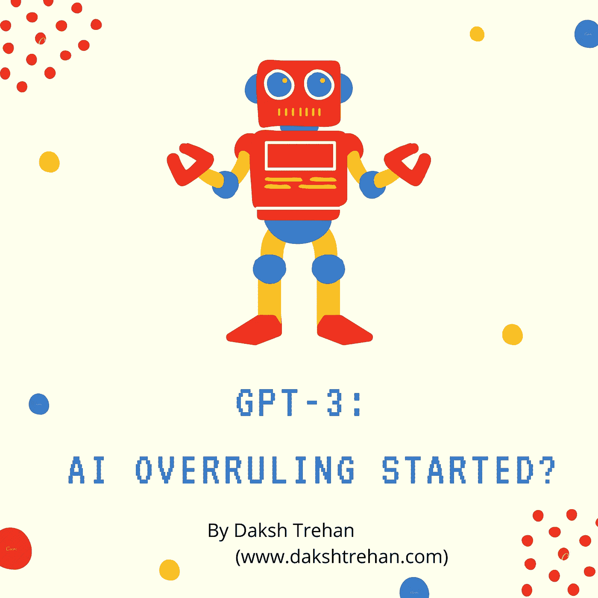

> “对我来说，消灭人类似乎是一种相当无用的努力”~ GPT-3

***内容表:-***

1.  *什么是 GPT 三号？*
2.  *它是如何工作的？*
3.  *它能做什么？*
4.  *GPT-3 可能扰乱市场*

# 什么是 GPT-3？

互联网正在为名为 **GPT-3(预训练生成变形金刚 3)的新交互工具而疯狂，**这是第三代想要模仿人类的算法，能够撰写虚假文章和自动完成语句。

多年来，人类一直在追逐开发一种能够模仿人类学习的算法的梦想。现在我们离里程碑又近了一步。

**OpenAI** (前*非盈利组织)*之所以能够做到这样的里程碑，是因为其庞大的计算能力和数据量。最新版本的 GPT-3 包含 1750 亿个参数，是之前里程碑式的微软图灵 NLG 的 10 倍，是之前 GPT 版本的 116 倍。

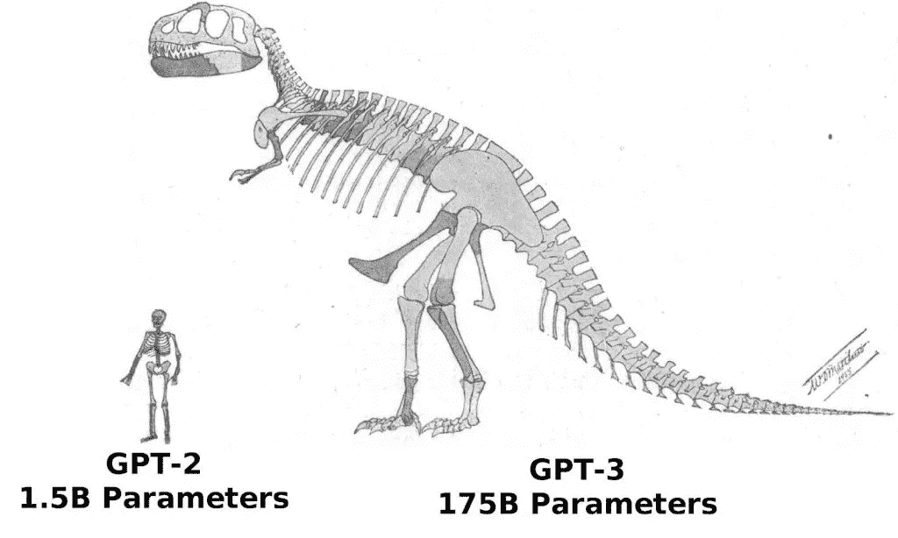

GPT-2 vs GPT-3, [Source](https://blog.exxactcorp.com/what-can-you-do-with-the-openai-gpt-3-language-model/)

GPT-3 模型的计算成本非常高，以至于微软专门建造了一台 beast 机器，它由 **285，000 个 CPU 核心、10，000 个 GPU 和每个 GPU 服务器每秒 400 千兆位的网络连接组成。与同时代的计算机相比，它在最快的超级计算机排行榜上排名第五。**

尽管 OpenAI 的算法在过去已经向公众开放，但他们选择了限制 GPT-3 的工作流程，该研究公司澄清了他们决定背后的动机，“这个模型太大了，普通公众无法在他们的计算机上运行”。此外，在之前的几个月里，OpenAI 已经将他们的公司结构改为“利润上限模式”，以吸引更多的投资者，在他们做出决定后，他们决定将其 GPT-3 研究货币化。微软和 OpenAI 还达成了一项 10 亿美元的交易，优先获得微软云计算平台 Azure 的使用权。

与拥有 100-1000 万亿个参数的人脑相比，GPT-3 拥有 1750 亿个参数，是 2019 年发布的 NLP 图灵机的 100 倍。最近，一份报告表明，微软开发了一种能够计算万亿个参数的超级计算机，随着参数和计算能力的指数增长，在几年内很有可能模仿人脑，至少在参数方面，如果不是智能的话。

# 它是如何工作的？

在我们深入研究 GPT 协议-3 的技术细节之前，有几个术语对于理解其工作流程非常重要:

*   **NLP 任务**:这些是我们实现的模仿人类语言的任务，它包括语言翻译、阅读理解、识别人物、位置、从句子中识别形容词(命名实体识别)、从文本中提取情感。
*   **语言模型**:这些模型被实现来预测给定一组单词/句子的下一个最可能的单词。更简单地说，它只不过是一个可以以概率方式生成语言的模型，它可以在任何训练数据上进行训练，即在手机键盘和谷歌搜索中大量使用的自动完成功能。
*   **转移学习**:这来自深度学习，我们为任何特定的任务训练一个模型，但我们以某种方式微调这个模型，以便它也可以建立在其他一些任务上。
*   **零个/一个/几个镜头学习**:指 GPT-3 只看任务描述和零个/一个/几个类似例子就能学习任务的能力。

机器学习主要有两种学习类型:*有监督的*和*无监督的*。

监督学习由大量带标签的数据组成，我们让我们的模型在给定数据上学习，并在匿名输入上产生输出。它可以产生良好的结果，并在开发类人外观方面做得很好，但它需要大量的标记数据。

而且，监督学习并不是人类积累智慧的真正方式。相反，有一百万件事情，我们仍然需要知道，然而我们有足够的知识，或者，简单地说，我们做了很多无人监督的学习。

GPT-3 使用无监督学习进行学习，它被灌输了我们所知道的关于语言的一切，即常见的爬行数据集(互联网的大部分)，维基百科数据集和网络文本。

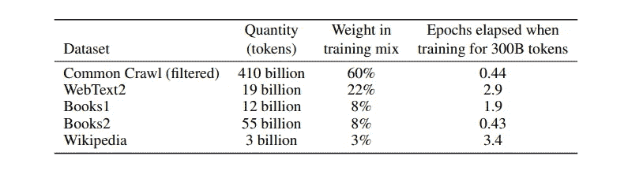

Source: [Paper](https://arxiv.org/abs/2005.14165)

谈工作流，它还是用的 transformer 模型，有很多关注层，数据永无止境。考虑到数字事实，它包含 96 个关注层，320 万个批量，以及难以想象的 1750 亿个参数。

遵循语言模型的传统模型，我们需要预先训练的数据，然后我们对训练好的模型进行微调，因此，执行一些特定的任务，但由于 GPT-3 中存在非常普通的庞大数据集，我们不需要任何种类的梯度更新/微调。它只需要一个任务描述和一些推论。

 [## 一名大学生使用语言生成人工智能工具创建了一个病毒式博客帖子|数据驱动…

### 作为作家，我们喜欢告诉自己，我们处在一个无法自动化的职业中，至少短期内不会。但是…

www.datadriveninvestor.com](https://www.datadriveninvestor.com/2020/09/15/a-college-student-used-a-language-generating-ai-tool-to-create-a-viral-blog-post/) 

## 零射击学习:

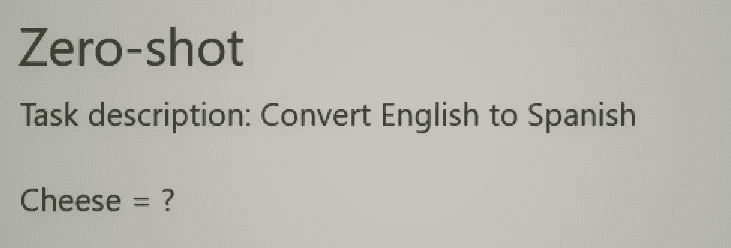

在零镜头学习中，模型必须意识到它以前见过类似的东西，因此可以模仿任务描述。

## 一次性学习:

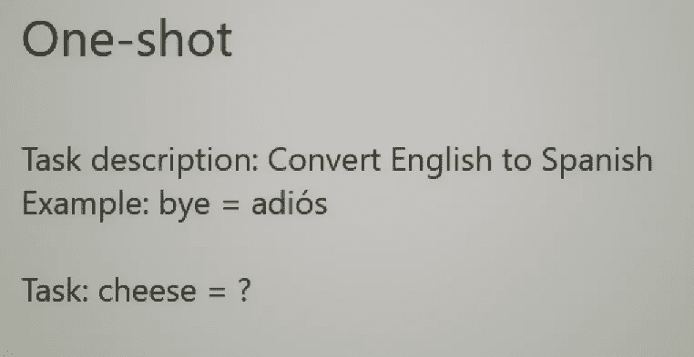

在一次性学习中，我们为模型提供了单个示例操作以及任务描述，从而使我们的任务意图更加清晰，因此不需要梯度更新。

## 少量学习:

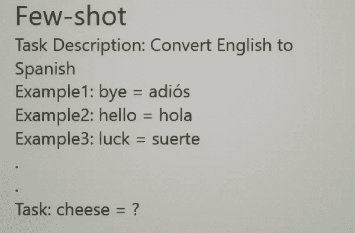

在少镜头学习中，我们提供了很少的例子以及任务描述，从而使我们的模型能够更好地概括。

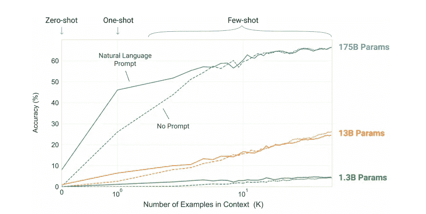

Source: [Paper](https://arxiv.org/abs/2005.14165)

正如预期的那样，与竞争对手相比，少投学习的准确性最高。

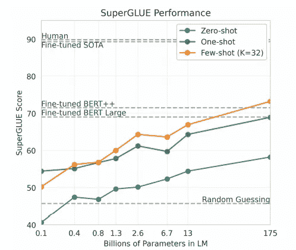

Source: [Paper](https://arxiv.org/abs/2005.14165)

在传统的 SOTA(最先进的建筑)中，给定全部输入，当需要时，模型进入训练数据并匹配模式以得出示例，然后进行插值。但是，在 GPT-3 中，预计算法将数据存储在连接中，即权重中，由于参数数量如此之大，所以这样做是可能的，当我们需要一个模型来执行任何任务时，我们只需转到训练数据，即存储在其权重中，然后提取几个示例并进行整合。

# 它能做什么？

你可以使用 GPT 3 的不可思议的能力与机器人进行想象中的对话，总结电影，编写代码，回答医学问题，简化事情或使事情复杂化。

提到的一些功能包括:

*   语言翻译:由于很多互联网都是用英语创建的，与其他语言相比，GPT-3 表现出了惊人的准确性。

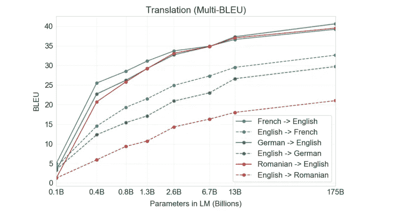

Source: [Paper](https://arxiv.org/abs/2005.14165)

*   **Winograd 风格任务**:传统的 NLP 技术负责确定一个单词指的是哪个代词。

Source: [Paper](https://arxiv.org/abs/2005.14165)

*   **常识推理:**这包括解决物理或科学推理问题。

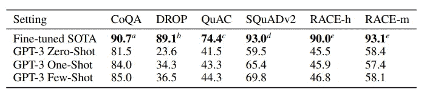

Results on different datasets, Source: [Paper](https://arxiv.org/abs/2005.14165)

*   **算术计算:**除了普通推理，GPT-3 能够解决多达 5 个操作数的算术问题。

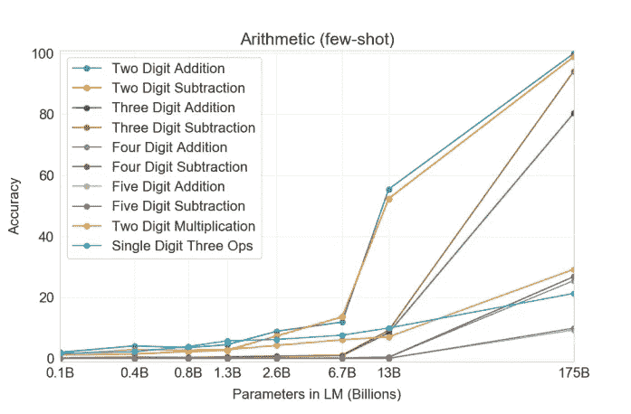

Source: [Paper](https://arxiv.org/abs/2005.14165)

*   **SAT 类比:** SAT 是构成 MCQs 的大学水平入学考试。令人惊讶的是，GPT-3 在少数几次学习的情况下达到了 65.7%的准确率，而人类的平均得分为 57%。

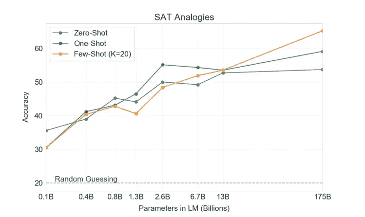

Source: [Paper](https://arxiv.org/abs/2005.14165)

*   **新闻-文章/诗歌生成**:GPT-3 被大肆宣传的功能是自动生成新闻文章、文本或诗歌，只有很少的类比。

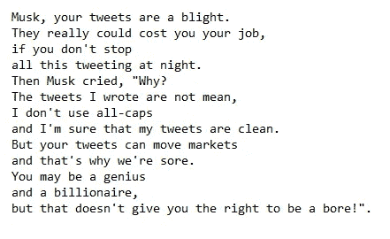

Poem written for Elon Musk by GPT-3

# GPT-3 可能会扰乱市场

GPT-3 的上市肯定会让一些记者、程序员和内容作者兴奋不已，但仍有很长的路要走。

长期以来，人类试图使用一些算法来模仿他们的知识，大多数人认为这很难做到，可能需要对人类思维、活动和良知的精确理解。但少数人认为，如果机器人拥有更强的计算能力，人类水平的智能会自然而然地出现。

GPT-3 工作流肯定设法促进了少数人的意识形态，因为 GPT-3 的技术栈并不出色，而是仍然在博吉 2018 GPT-2 架构上工作，数据更多。

此外，测试人员推断，GPT-3 即使对于合理的问题也有很多不合情理的地方，这不是因为它不知道答案，而是因为模型认为错误的答案似乎是合理的。或者用更简单的话来说， **GPT-3 有失偏颇。**

然而，尽管有所有的缺点，GPT 3 号只不过是人工智能的一个新的里程碑，如果与其他技术相结合，可能会被证明是一个奇迹，对生成类似人类智能的探索将继续下去，至少在未来几年内。

# 参考资料:

[1].[语言模型是一次性学习者。](https://arxiv.org/abs/2005.14165)

[2]. [GPT-3 解释说:这种新语言人工智能是神秘的、有趣的——而且是一件大事](https://www.vox.com/future-perfect/21355768/gpt-3-ai-openai-turing-test-language)

[3]. [GPT-3:语言模型是一次性学习者(论文解释)](https://www.youtube.com/watch?v=SY5PvZrJhLE)

请随意连接:

> *LinkedIn ~*[*https://www.linkedin.com/in/dakshtrehan/*](https://www.linkedin.com/in/dakshtrehan/)
> 
> *insta gram ~*[*https://www.instagram.com/_daksh_trehan_/*](https://www.instagram.com/_daksh_trehan_/)
> 
> *Github ~*[*https://github.com/dakshtrehan*](https://github.com/dakshtrehan)

关注更多机器学习/深度学习博客。

> *中等~*[*https://medium.com/@dakshtrehan*](https://medium.com/@dakshtrehan)

# 想了解更多？

[利用深度学习检测新冠肺炎](https://towardsdatascience.com/detecting-covid-19-using-deep-learning-262956b6f981)

[无法逃脱的人工智能算法:抖音](https://towardsdatascience.com/the-inescapable-ai-algorithm-tiktok-ad4c6fd981b8)

Tinder+AI:完美的配对？

[使用机器学习的卡通化内部指南](https://medium.com/towards-artificial-intelligence/an-insiders-guide-to-cartoonization-using-machine-learning-ce3648adfe8)

为什么你要为乔治·弗洛伊德的谋杀和德里的骚乱负责？

[强化强化学习背后的科学](https://medium.com/towards-artificial-intelligence/reinforcing-the-science-behind-reinforcement-learning-d2643ca39b51)

[生成性对抗网络背后的解码科学](https://medium.com/towards-artificial-intelligence/decoding-science-behind-generative-adversarial-networks-4d188a67d863)

[理解 LSTM 和 GRU 的](https://medium.com/towards-artificial-intelligence/understanding-lstms-and-gru-s-b69749acaa35)

[虚拟递归神经网络](https://medium.com/towards-artificial-intelligence/recurrent-neural-networks-for-dummies-8d2c4c725fbe)

[虚拟卷积神经网络](https://medium.com/towards-artificial-intelligence/convolutional-neural-networks-for-dummies-afd7166cd9e)

[深入钻研深度学习](https://medium.com/towards-artificial-intelligence/diving-deep-into-deep-learning-f34497c18f11)

[为什么选择随机森林而不是决策树](https://medium.com/towards-artificial-intelligence/why-choose-random-forest-and-not-decision-trees-a28278daa5d)

[聚类:是什么？什么时候用？](https://medium.com/@dakshtrehan/clustering-what-it-is-when-to-use-it-a612bbe95881)

[从 k 个最近邻居开始你的 ML 之旅](https://medium.com/@dakshtrehan/start-off-your-ml-journey-with-k-nearest-neighbors-f72a122f428)

[朴素贝叶斯解释了](https://medium.com/swlh/things-you-never-knew-about-naive-bayes-eb84b6ee039a)

[激活功能解释](https://medium.com/analytics-vidhya/activation-functions-explained-8690ea7bdec9)

[参数优化说明](https://towardsdatascience.com/parameters-optimization-explained-876561853de0)

[梯度下降解释](https://towardsdatascience.com/gradient-descent-explained-9b953fc0d2c)

[逻辑回归解释了](https://towardsdatascience.com/logistic-regression-explained-ef1d816ea85a)

[线性回归解释](https://medium.com/towards-artificial-intelligence/linear-regression-explained-f5cc85ae2c5c)

[确定最适合您的 ML 模型](https://medium.com/datadriveninvestor/determining-perfect-fit-for-your-ml-model-339459eef670)

> *欢呼*

**进入专家视角—** [**订阅 DDI 英特尔**](https://datadriveninvestor.com/ddi-intel)