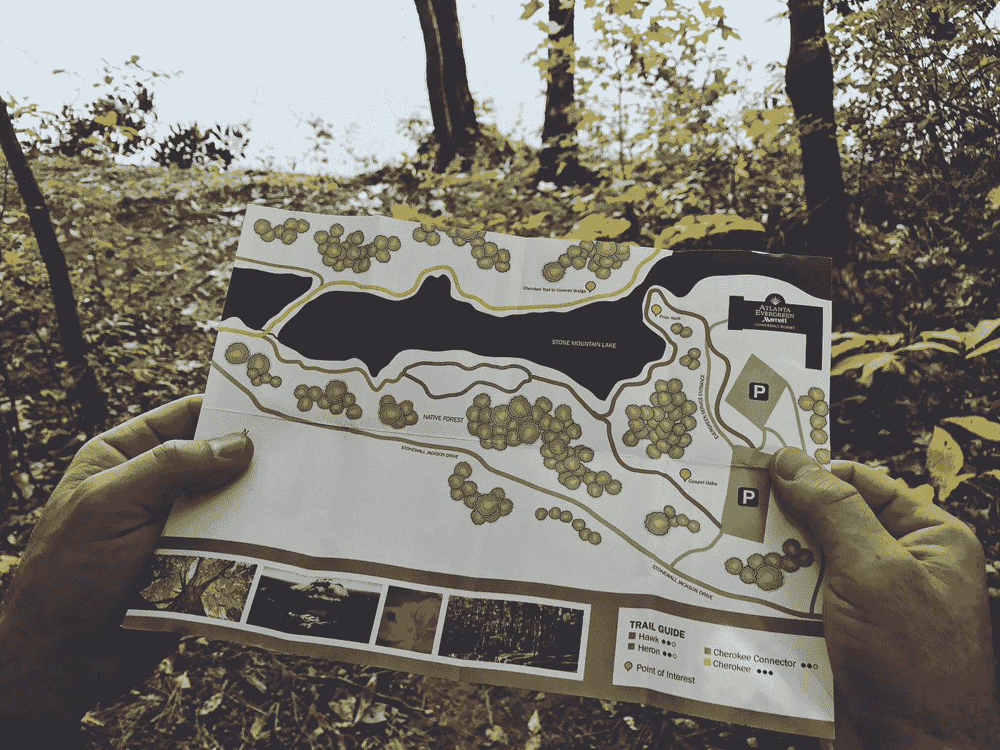

# OpenAI 的 GPT-3:需要了解的 5 件奇妙的事情

> 原文：<https://medium.datadriveninvestor.com/gpt-3-by-openai-5-wonderful-things-to-know-about-c4bd7ae722e7?source=collection_archive---------4----------------------->

Photo by [Franki Chamaki](https://unsplash.com/@franki?utm_source=medium&utm_medium=referral) on [Unsplash](https://unsplash.com?utm_source=medium&utm_medium=referral)

那么，你已经在**推特**上看到了一些令人惊叹的 **GPT-3** 演示(如果没有，你去过哪里？).这个由 **OpenAI** 创建的大型机器学习模型，可以编写自己的**专栏、诗歌、文章，甚至工作代码。**

来自 **OpenAI** 的一组研究人员最近发表了一篇论文，描述了 **GPT-3** ，**一个自然语言**的深度学习模型，拥有 1750 亿个参数，比上一个版本 GPT-2 多 100 倍。

该模型**预先训练了**近 5 万亿个单词，并且在几个 NLP 基准测试中**达到了最先进的性能**而无需微调。

与大多数为一个用例设计的人工智能系统不同，今天的 API 提供了一个通用的**“text in，text out”**接口，允许用户在几乎任何英语任务上尝试它。

您现在可以请求访问，以便将 API 集成到您的产品中，开发一个全新的应用程序，或者帮助探索这项技术的优势和局限性。

Photo by [Roman Synkevych](https://unsplash.com/@synkevych?utm_source=medium&utm_medium=referral) on [Unsplash](https://unsplash.com?utm_source=medium&utm_medium=referral)

给定任何文本提示，API 将返回一个文本补全，尝试匹配您给它的模式。

你可以给它看几个你想让它做什么的例子来“编程”;它的成功通常取决于任务的复杂程度。

**API** 还允许你通过对你提供的数据集(或大或小)进行训练，或者从用户或标签员提供的反馈中学习，来磨练你在特定任务上的表现。

**API** 被设计成**既便于任何人使用，又足够灵活**让机器学习团队更有效率。

Photo by [Marvin Meyer](https://unsplash.com/@marvelous?utm_source=medium&utm_medium=referral) on [Unsplash](https://unsplash.com?utm_source=medium&utm_medium=referral)

事实上，许多团队现在都在使用 **API** ，这样他们就可以专注于机器学习研究，而不是分布式系统问题。

今天， **API** 运行来自 **GPT-3** 系列的模型，速度和吞吐量都有很大提高。

机器学习发展非常快，我们的社区也在不断升级技术，以便用户跟上时代。

Photo by [Mariana Vusiatytska](https://unsplash.com/@mariana_?utm_source=medium&utm_medium=referral) on [Unsplash](https://unsplash.com?utm_source=medium&utm_medium=referral)

> 下面这首歌是由 GPT-3 制作的

下面是泰勒·斯威夫特创作的一首关于小巫师哈利·波特的流行歌曲。

***《哈利波特》
泰勒斯威夫特***

> 哈利戴着眼镜
> 他有一双明亮的绿眼睛
> 女孩们总是尖叫
> 
> 因为他有一头波特式的头发
> 
> 即使当他压力很大的时候，他仍然有着超音速的颧骨。他们拍成电影我一点也不惊讶
> 
> 因为我会随时看着他哦，是的，哈利，宝贝，你是我最喜欢的角色
> 
> 我会走一千英里
> 
> 去见你
> 
> 哈利，哈利，你真好
> 
> 我的女性部分都刺痛
> 
> 当你笑的时候，那种假笑
> 
> 我很想成为你的女孩

Photo by [Kayla Duhon](https://unsplash.com/@kayla_marie?utm_source=medium&utm_medium=referral) on [Unsplash](https://unsplash.com?utm_source=medium&utm_medium=referral)

> 以下用户手册由 GPT-3 生成

**A-1247 通量电容器用户手册:**

***操作你的通量电容***

通量电容器是顶级的、最先进的时间传输设备。它能把你带到 1955 年 11 月 5 日到 1985 年 9 月 27 日之间的任何一天。如果你遵循本手册中的简单指南，你的旅行应该是一次安全而愉快的经历。我们希望你的访问是最好的。毕竟，我们没有多少来自未来的访客！请注意，本手册中包含的所有信息仅适用于在美国境内操作通量电容器。如果您计划在使用通量电容器时访问外国或另一个时区，请在出发前向授权经销商咨询更多信息。

注意:你的通量电容器只能在氧气充足的环境下工作。不要试图在这样的环境之外或没有适当的氧气支持设备的情况下使用它。

1.  为您的旅行做准备
2.  在你离开之前，确保你有你需要的一切是很重要的。
3.  您需要提供以下物品:1)两(2)节 D 型电池；2)旅行所需的衣服和其他物品的供应；3)每小时 125 美元，小额钞票和硬币；4)有效护照或驾照；5)带闪光灯的相机和至少 10 卷胶卷(并确保是正确的型号)；6)至少五箱塑料袋；7)一套完整的备用通量电容器零件，包括:两(2)个计算机芯片、一(1)个电阻器、一(1)根带开/关开关的电源线、三(3)个空啤酒罐、六(6)个发夹和一(1)只鸡；8)一只猫，可选。
4.  这不是一个包罗万象的列表。您可能需要为您的特定旅行准备额外的物品。详情请咨询您的经销商。
5.  基本通量电容器操作
6.  在使用你的通量电容器之前，你应该熟悉它的操作和安全特性。要启动通量电容器，请将两节 D-cell 电池插入电池盒，并安全地合上盖子。当设备预热到工作温度时(大约 30 分钟)，您将看到“电源开启”灯(标有#2)亮起，并听到令人安心的嗡嗡声。预热大约 15 秒后，计时电路就可以使用了。按住“时间”旋钮(#6)。“开机”灯(#2)将闪烁，表示时间旅行已启用。然后松开旋钮，你会听到时间电路开始转动，计算你旅行的准确日期和时间。当您看到显示屏上的数字停止闪烁(#1)时，计算完成。现在你已经准备好开始你的旅行了！
7.  进入和退出时间旅行模式
8.  要进入时间旅行模式，只需按下“时间”旋钮(#6)，直到它卡入到位。旋钮顶部的红灯将会亮起，表明你已经进入了时间旅行模式。
9.  再次按下“时间”旋钮(#6)直到它卡入到位，可以随时退出时间旅行模式。红灯将会熄灭，表明你已经退出了时间旅行模式。
10.  注意:在穿越漩涡时，不要试图退出时间旅行模式(见下面的步骤 10)。这样做可能会导致你被困在时间扭曲中，或者导致电源过载。
11.  激活漩涡
12.  要激活涡流，将“电源”旋钮(#7)转到“开”的位置。你会看到旋钮顶部的红灯亮起，表明你已经激活了漩涡。
13.  一旦你激活了漩涡，继续下面的第 6 步。注意:在穿过涡流时，不要试图激活涡流(见下面的步骤 10)。这样做可能会导致你被困在时间扭曲中，或者导致电源过载。
14.  设定您的目的地
15.  激活漩涡后，你的通量电容器将自动扫描所有无线电频率，寻找来自其他通量电容器穿越时间的信号。然后它会锁定并跟随其中一个信号，通过时间扭曲回到它的原点(它的“漩涡点”)。时间扭曲将会定位在距离信号源头 200 码的半径范围内，也就是你的目的地。
16.  如果你试图拜访一个靠自己的通量电容器穿越时间的人，你可能需要手动设置你的目的地。为此，请按照下列步骤操作:
17.  1)按住“时间”旋钮(#6)，直到显示屏开始闪烁。当设备搜索范围内的其他通量电容器时，您将听到一个高音调。当它找到一个，你会听到一个低音调，表明它已经锁定了该信号。2)松开“时间”旋钮(#6)，该装置将锁定并跟随该信号回到其涡流点(您的目的地)。你会看到显示器上的数字又开始闪烁了，因为它正在计算一次回到未来的旅行。当它们停止闪烁时，你的目的地已经确定。
18.  激活时间压缩功能
19.  时间压缩功能可以让你把去未来的旅程缩短 10 倍。要激活此功能，只需按住“时间”旋钮(#6)约两秒钟。你会看到显示器上的数字又开始闪烁，因为它在计算一次压缩的回到未来的旅行。当它们停止闪烁时，你的目的地已经设定，时间压缩已经启动。
20.  注意:时间压缩不能和时间旅行模式或者漩涡激活一起使用。如果你试图在时间旅行模式或漩涡激活期间激活它，你会收到一条错误信息，并被要求在继续之前关闭所有开关(见下面的步骤 10)。

# 你的下一步是什么？

> 如果你喜欢这篇文章，点击下面的推荐会很有帮助！
> 关注我上 [*推特*](https://twitter.com/imPraveenPareek) *，*[*LinkedIn*](https://www.linkedin.com/in/praveenpareek/)*，* [*中*](https://medium.com/@praveen.pareek)
> 
> ***在这里阅读我的所有帖子/文章:***[***Praveen Pareek***](https://medium.com/@praveen.pareek)

 [## 如何写出令人惊艳的简历并获得合适的工作

### 是啊！对于你未来的雇主来说，简历是招聘链中的关键一环，既包括内部流程，也包括…

medium.com](https://medium.com/@praveen.pareek/how-to-write-amazing-resume-and-get-the-right-job-2b63ed4dcce)