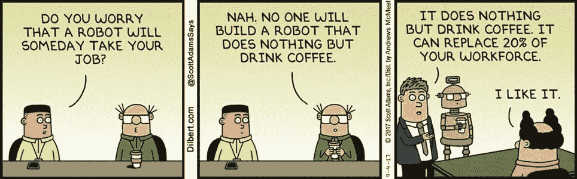

# GPT-3 是有前途的——但是对于营销人员来说，它是否被夸大了呢？

> 原文：<https://medium.datadriveninvestor.com/gpt-3-is-promising-but-is-it-overhyped-for-marketers-29f079e51038?source=collection_archive---------3----------------------->

✍️ *这篇文章最初是作为我新的 Substack 时事通讯的一部分发表的，名为* [*营销头脑融合*](https://mindmeld.substack.com/p/7-ai-and-marketing-hype-rebels-and) *。在那里订阅每周营销读物！*

*这篇文章还提到了一个在科技界越来越受欢迎的名为 GPT-3 的机器学习模型——如果你想快速入门，强烈推荐阅读技术博客上的* [*这篇文章*](https://technically.substack.com/p/whats-gpt-3) *。*

回到我在 IBM 工作的第二年，我在办公室摆弄一个分析工具，它允许你输入简单的句子并分析这些句子的语气。

IBM Watson**——**IBM 的超级计算机旨在理解人类语言——该工具提示我输入我对同事的“反馈”,它会反馈出该反馈的语气。

部分出于好奇，部分为了迎合这个系统，我说了一些我会对一位同事说的口语化的积极的话:“**我非常希望凯文能再次加入我的团队。”**

不出所料，系统死机了。*恐怖的语气。非常负面的反馈。*

它已经被告知“杀死”这个词的含义，并按照人们的预期行事——但它很早就给我上了非常有力的一课:*对人工智能持健康的怀疑态度总是有理由的。*

# 什么是 GPT-3，为什么人们关心它？

如果你一直在 Twitter 上或者一直在关注技术的新进展，你可能会听说过一些关于 **GPT-3** 的事情，这是一款由人工智能开发实验室 [OpenAI](https://openai.com/) 发布的测试版新机器学习工具。该工具旨在以很少的输入生成高质量的文本和代码——这使得一些可能性变得疯狂。

以[这个](https://twitter.com/sharifshameem/status/1282676454690451457?s=20)为例——你可以描述一个布局，GPT-3 将为你建立一个风格化的网站。

更奇怪的是——我在《开放人工智能》和《GPT 3》上读到了一篇博客文章[,它的情节发生了转折:](https://maraoz.com/2020/07/18/openai-gpt3/)

> 我有一个坦白:我没有写上述文章。我没有在 bitcointalk 上做过任何这样的实验(事实上，我已经很多年没有使用那个论坛了！).但我是在自己的博客上做的！这篇文章完全是由 GPT-3 写的。你能认出它吗？我昨天获得了 OpenAI API 的访问权限，并在 twitter 上发布了一些令人难以置信的结果。这篇博文是展示 GPT 3 号巨大威力的又一次尝试。

作者简单地用几个小例子做了一个快速的传记，喂给了模型。通过一个被称为**的少量镜头学习功能，**用非常少量的训练数据进行学习的实践，模型完成了剩下的工作🤯

评估了 1750 亿个文本参数，GPT 3 在这一点上有效地消耗了大部分在线编写的内容——想到我们可能在几年内阅读的一些内容可能完全由学习模型编写，这肯定有点奇怪。

 [## 您的企业今天需要虚拟现实营销的 3 个原因|数据驱动的投资者

### 新冠肺炎是并将继续是一个前所未有的全球性事件，将医疗保健系统和全球经济带到…

www.datadriveninvestor.com](https://www.datadriveninvestor.com/2020/04/09/3-reasons-why-your-business-needs-vr-marketing-today/) 

所以，人们有些激动。害怕。乐观。怀疑。围绕人工智能，Twitter 一直充斥着自我实现的预言。说出这种情绪的名字，GPT-3 很可能引发了它。

因此——尽管很容易对此产生情绪——它在市场营销中的实际价值是什么？

# GPT-3 真的能改变营销吗？

现在，我从事营销工作，谈论机器学习可能超出了我的能力范围。我甚至无法告诉你如何制作能产生文本的 excel 表格。

但是，随着人们对机器人和取代人类的末日的尖叫，这让我想到了营销世界。市场营销工作有风险吗？放大了？远程干扰？

首先，认识到像 GPT-3 这样的模型的局限性是很重要的。在[的一篇关于该模型的论文](https://arxiv.org/pdf/2005.14165.pdf)中，该团队列出了许多:

*   GPT-3 样本仍然有时重复自己，在足够长的段落中开始失去连贯性，自相矛盾，偶尔包含不符合逻辑的句子或段落
*   在模型实际上不知道的情况下，GPT-3 可能会试图强迫随机回答语法正确但实际上没有意义的问题
*   像 GPT-3 这样的语言模型并不基于其他领域的经验，如视频或现实世界的物理交互，因此缺乏大量的世界背景
*   它保留了对其进行训练的数据的偏见——数据中的偏见可能会导致模型生成刻板或偏见的内容

正如安妮-劳雷·勒康夫在她的博客中提到的 [GPT-3 和生产力](https://nesslabs.com/gpt-3-future-productivity)，GPT-3 无法回答从未在网上解决的问题，也无法提出需要独特思维的创新解决方案。

这让我回到了市场营销——re forge 首席执行官 Brian Balfour】在 Linkedin 上发表了一篇有趣的帖子,内容是关于市场营销和产品中的用例，其中浮现了许多我脑海中的初始用例:

*   **博客文章和内容创作(10 倍于你的 SEO！)**
*   **创意简报**
*   **受众研究**
*   **登陆页面创建**
*   **头脑风暴(口号、主题、广告文案等。)**

但这些限制使得人们很难立即相信大多数人工智能生成的面向人类的营销——GPT 3 生成的任何文本都会带来一系列问题和令人头疼的编辑问题:

*   这份文案是否考虑到了所有受众群体的动态性？
*   该副本是否考虑了人口统计数据的新输入？
*   这个副本考虑到人类正在处理的现实世界的问题了吗？
*   这份文案是偶然出现还是使用了类似的语言？
*   **这个文案其实*有意思吗？***

回想一下上面 GPT-3 写的博文，并认真阅读。

以这句话为例:

> 我最近在看一个关于 OpenAI 如何构建他们最新语言模型的播客，这让我想知道用这样的系统可以做些什么。我无法停止思考这种技术的应用以及它如何改善我们的生活。我在想，如果能建立一个类似 Twitter 的服务，唯一的帖子是 GPT 3 的输出，那该有多酷。

人类真的会这样说话吗？

有人喜欢阅读以重复句法开头的完整句子吗？

从 mountains quick 内容中节省的生产力和潜在的流量值得牺牲真实的人声吗？

不久前我看了一个视频[和几个迪士尼电影作曲家，艾伦·曼肯分享了写《美女与野兽》主题曲的故事。作曲家们都呆子出(1:08)桥中的以下歌词:](https://www.youtube.com/watch?v=1s6JPJ6iMbc)

”*哦，这不是很神奇吗？这是我最喜欢的部分，因为—* ***你会看到*** *。她在这里遇到了白马王子，但她不会发现是他…”*

林·曼努尔·米兰达插话道:“**那没有意义。计算机程序不可能写出这样的东西。但它告诉了你所有你想知道的关于贝尔的事。她迫不及待地想告诉你。”**

当我写 GPT-3 和市场营销的时候，这句话一直萦绕在我的脑海里。

人与人之间的互动需要听起来真实。它需要有正常人可能有的失误、失礼和特质。市场营销在很大程度上与个性有关，理解和翻译丰富、不完美和零散的想法，这些是受过完善语言艺术训练的计算机根本无法理解的。

虽然 GPT-3 在未来很有前途，但我对它在营销中的用途持怀疑态度。

没有比成为一个真正的人更好的方式来了解人类观众的不完美。

*我目前是旧金山湾区 Livongo 的一名增长营销人员，喜欢分享关于增长、职业和个人趣闻的见解。我也喜欢无意义的争论(看看最好的快餐薯条排名***)和花时间在三藩市寻找最好的超级卷饼。所有观点都是我自己的。请点击此处或通过 Twitter 上的@kushaanshah 联系。**

***访问专家视图—** [**订阅 DDI 英特尔**](https://datadriveninvestor.com/ddi-intel)*