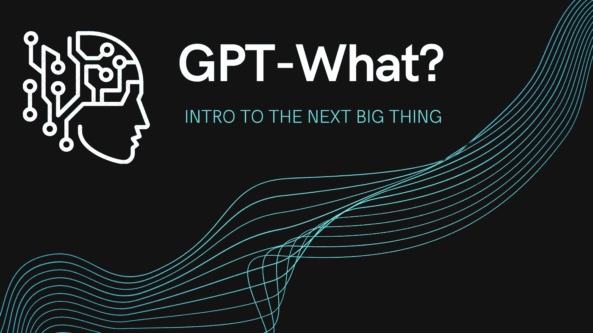
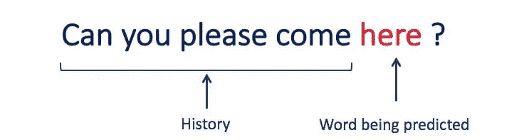
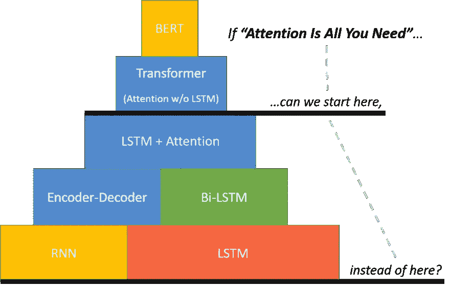
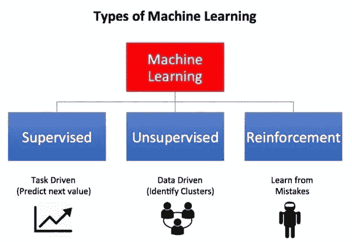

# GPT-什么:介绍下一个大事件

> 原文：<https://medium.datadriveninvestor.com/gpt-what-intro-to-the-next-big-thing-ea1b92c4cbbc?source=collection_archive---------3----------------------->

所以几周前，我偶然发现了一些东西，让我想起了亚瑟·C·克拉克著名的第三定律——任何足够先进的技术都和魔法没什么区别。

这是我从未见过的。在那一刻，我看到一项复杂的技术变得容易被更多的人使用。

当然，我说的是 OpenAI 的生成式预训练变形金刚 3 或俗称的 GPT-3。OpenAI [宣布](https://openai.com/blog/openai-api/)他们正在通过他们的 API 开放对它的访问，目前只有受邀者才能访问。

到目前为止，我已经看到它被描述为自互联网、区块链和两者之间的一切以来最大的事情。这激起了我无尽的兴趣，我想了解更多。这让我陷入了一个兔子洞。以下是我试图从外行人的角度总结我的发现。

# 给我看看魔法！

在我们理解什么是引擎盖下，让我们看看它的行动。

**搜索引擎**

这里有一个演示，其中 GPT-3 作为一个搜索引擎，可以回答你的确切查询

**制表**

好的，它可以给我纯文本的答案，但它能生成结构化数据吗？表示强调）的确，完全同意

**设计**

太好了，所以它知道 Excel。但是它能设计出 UI 吗？显然，是的！

**编写代码**

好吧，所以它产生了一些模仿。它肯定不会写代码，对吗？不，它可以！

**还有更多…**

所以你明白了！唯一的限制是你的想象力。现在让我们来看看幕后发生了什么。

# 这是什么魔法？！

因此，描述你在这些演示中所看到的最简单的方式就是，一个计算机程序被灌输了大量的人类知识。然后，用户会给它一两个问答配对的例子，然后继续问类似的问题，它会给出准确的答案。这就是我们在演示中看到的要点。

现在，让我们用一点术语，把它分解一下。那么技术上是什么呢？**这是一个无监督的 transformer 语言模型，包含 1750 亿个参数，能够进行少量学习**。哇好吧，听起来不错。但这一切意味着什么呢？

**首先，什么是语言模型？**

这是一个知道语言中单词之间关系的程序。它知道单词和句子应该一个接一个出现的概率。这形成了语音识别技术的基础，如 Alexa，Siri 等

Source: [A Comprehensive Guide to Build your own Language Model in Python!](https://www.analyticsvidhya.com/blog/2019/08/comprehensive-guide-language-model-nlp-python-code/)

**它是变形金刚意味着什么？**

再次，用最简单的方式概括这个概念。语言模型的类型告诉我们它是如何被训练的，也就是说，它是如何产生语言中单词和句子之间的关系的。换句话说，它告诉我们这些概率是如何计算出来的。

传统上，基于 [LSTM](https://en.wikipedia.org/wiki/Long_short-term_memory) (长期短期记忆)或 [CNN](https://en.wikipedia.org/wiki/Convolutional_neural_network) (卷积神经网络)的模型一直被使用，但它们有一些明显的缺点。首先，单词和句子之间的关系会随着它们之间的距离越来越远而消失。其次，对这些句子的处理必须一个字一个字地顺序进行，这意味着它很慢。

另一方面，Transformer 是一种新颖的架构，在一篇名为[的论文中介绍过。它基于“注意力”的概念解决了这两个挑战，这使得模型可以直接查看并从句子中较早的点提取状态。](https://arxiv.org/abs/1706.03762)

Source: [BERT Research — Ep. 1 — Key Concepts & Sources](https://mccormickml.com/2019/11/11/bert-research-ep-1-key-concepts-and-sources/)

**是什么让它无人监管？**

无监督学习是包括监督学习和强化学习在内的三种主要机器学习模型之一。

它与其他两个不同之处在于，它不需要结构化和带标签的数据集，也不像游戏中那样，针对特定类型的结果对算法进行激励。

Source: [What are the types of machine learning?](https://towardsdatascience.com/what-are-the-types-of-machine-learning-e2b9e5d1756f)

**那 1750 亿个参数是什么？**

GPT-3 模型获得了一个大型数据集，该数据集由普通爬行、维基百科、网络文本、书籍等来源组成，价值约 45 TB 的文本。

当分析这些数据时，简而言之，该模型能够提取数据集的 1750 亿个不同特征，并建立它们之间的关系。

“深度学习”的教父杰弗里·辛顿(Geoffrey Hinton)表示，参数可以被视为人脑中的一个突触:

> *我的信念是，除非我们拥有与大脑参数数量相同的系统，否则我们无法获得人类水平的能力。所以在大脑中，神经元之间有称为突触的连接，它们可以改变。你所有的知识都储存在这些突触里。你有大约 1000 万亿个突触——10 的 15 次方，这是一个非常大的数字。所以这和我们现在的神经网络很不一样。它们非常非常小，我们现在拥有的最大的有大约十亿个突触。比大脑小一百万倍。*

**最后，什么是少投学习？**

在一篇名为[语言模型是少量学习者](https://arxiv.org/abs/2005.14165)的论文中，研究人员证明了拥有大量参数的语言模型(如 GPT-3)在性能上表现出色，即使它只提供了很少的我们期望的那种结果的例子。换句话说，它的参数越多，你需要提供的例子就越少。

# 并非所有闪光的东西都是金子

众多职业会失业吗？天网会接管吗？不，差远了。GPT-3 虽然令人印象深刻，看起来很神奇，但有几个缺陷。

**数据质量&偏差**

鉴于这个模型是在互联网上的大型数据语料库上训练的，它也包含了随之而来的所有不愉快的事情。例如，以下是一些固有偏见和彻头彻尾的种族主义/性别歧视输出的实例:

这不是什么秘密，OpenAI 自己也在他们的[FAQ](https://openai.com/blog/openai-api/)中警告过这一点:

> OpenAI 将如何减轻 API 所服务的模型的有害偏见和其他负面影响？
> 
> *减轻有害偏见等负面影响是一个非常重要的行业难题。最终，我们的 API 模型确实会表现出偏差(如* [*GPT-3 论文*](https://arxiv.org/abs/2005.14165) *所示)，这些偏差偶尔会出现在生成的文本中。我们的 API 模型也可能以我们还没有想到的方式造成伤害。*

**启动**

所以，这很大程度上取决于你输入给 GPT-3 的输入或例子的质量，这被称为“启动”。如果你准备得不好，你会得到不好的结果。由于模型是在大规模数据集上训练的，如果你给它精心策划的输入，它可能会返回智能输出。你把这个模型做得多好就成了特别的调料。

**缺乏竞争优势**

这就引出了我的下一点。引子是*唯一的*专用酱，否则，每个人都有机会接触到同一个型号。因此，无论你生产什么产品，理论上都可以被竞争对手轻易复制。

像 GPT-3 这样的第三方模型只能是你所提供的产品的增值，而不能是产品，否则你很快就会倒闭。这就是为什么许多公司将继续在私有/专有数据上训练定制模型，并针对他们试图解决的用例对其进行超级优化。这将继续成为任何严肃的商业应用程序的前进方向。

随着 API 的发展和功能的丰富，这种情况在未来很可能会改变。对该模型进行微调的能力几乎肯定会出现在他们的路线图上，以使其对任何严肃的应用程序都有吸引力。

**API 限制/成本**

说到 API，我们仍然不知道这个 API 将如何在生产环境中工作。延迟会是什么样的？相关成本是多少？会有任何速率限制/节流吗？SLA /正常运行时间保证怎么样？数据隐私和输入输出的所有权呢？

# 我们将何去何从？

虽然存在一些限制和挑战，但 OpenAI 已经向我们展示了未来的可能性。

还记得 iPhone 上市的时间吗？在那之前，Moto Razr 是最热门的手机。电话市场正在缓慢但渐进地改善。但是 iPhone 彻底颠覆了市场。它完美地将硬件和软件的一些进步融合到一个产品中，并使其进入前所未有的更广阔的市场。

OpenAI 的 API 可能就是这样一个转折点。它使对人工智能的访问民主化，因此更广泛的用户群可以轻松地利用它并在其上构建应用程序。如果他们添加更多的功能并建立一个丰富的生态系统，它有可能成为建模的 AWS。

在未来几年，我们只能期待这个模型的更新迭代越来越强大。毕竟这只是 [OpenAI 的使命](https://openai.com/charter/)实现[人工通用智能(AGI)](https://en.wikipedia.org/wiki/Artificial_general_intelligence) 的第一步。一个如此强大的人工智能可以理解或学习人类可以完成的任何任务——这是一件既令人兴奋又令人恐惧的事情。

*本帖原载于* [*我的博客*](https://jes.al/2020/07/gpt-what-intro-to-the-next-big-thing/) *。如果你喜欢这篇文章，请在社交媒体上分享，并在 Twitter 上关注我！*