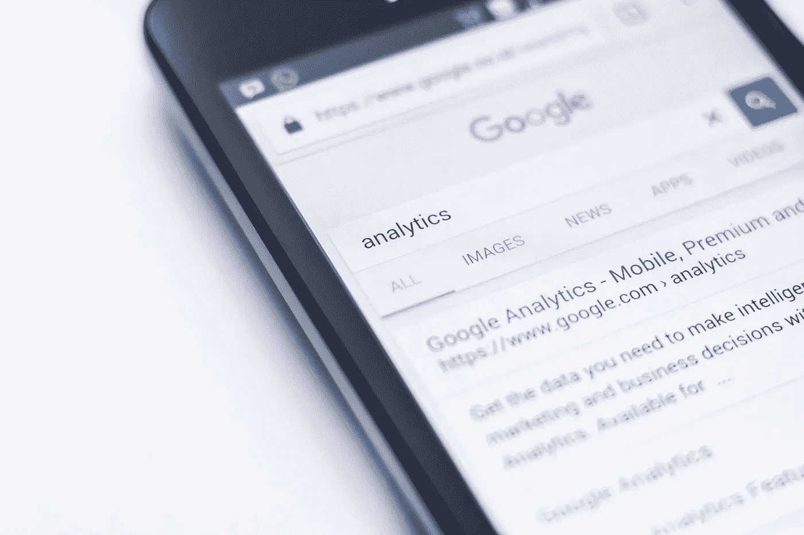

# 抓住智能营销，获得巨大成果

> 原文：<https://medium.datadriveninvestor.com/grab-on-to-intelligent-marketing-for-great-results-1235c0851081?source=collection_archive---------23----------------------->

## 人工智能引领连接消费者的方式

Photo by Edho Pratama on Unsplash

网上每个人都看过。每当人们在谷歌上搜索某样东西，他们最终都会与脸书和 Instagram 上的类似广告互动。巧合吗？不，这就是[人工智能](https://www.datadriveninvestor.com/glossary/artificial-intelligence/)在营销中的力量。

[深度学习](https://www.datadriveninvestor.com/glossary/deep-learning/)是营销[人工智能](https://www.datadriveninvestor.com/glossary/artificial-intelligence/)的核心。它描述了与算法相关的[机器学习](https://www.datadriveninvestor.com/glossary/machine-learning/)领域，灵感来自人脑的神经网络。

Smita Poojary 的人类大脑一直在努力掌握人工智能领域。她是一名数字营销专家，擅长企业对企业的接触。在一次[非洲推特聊天](https://twitter.com/AfricaTweetChat)中，她讨论了人工智能在营销中的聪明与否。

“人工智能是增长最快的营销技术，年同比增长率为 53%，”Poojary 说。“它已经以面部识别的形式出现了。社交媒体使用人工智能来显示你的订阅内容。Gmail 的人工智能会过滤你的邮件。”

此外，Grammarly 使用人工智能进行内容语法和拼写检查。Siri 和 Alexa 等数字语音助手使用神经语言编程来回复人类的声音。网站使用聊天机器人。

“人工智能帮助客户快速找到答案，解决问题，并提供个性化的内容，”Poojary 说。然而，只有真正的人才能为这种互动提供真实的个人接触。它可以从人工智能开始，但在购买过程中需要有一个人。

“你也可以提供灵活的定价，”她说。"更好地预测投资回报和衡量活动效果."

 [## 如何知道你的价格是正确的|数据驱动的投资者

### 你收多少钱？这对初创企业和自由创业者来说都是一个难题。什么是…

www.datadriveninvestor.com](https://www.datadriveninvestor.com/2019/12/05/how-to-know-your-price-is-right/) 

# 用途分类

Poojary 指出了营销人员在营销中使用人工智能的各种方式:

*   内容和产品推荐
*   内容监管
*   数据分析以获得洞察力
*   广告管理和自动定向
*   图像识别
*   社交倾听
*   品牌情感分析
*   销售线索生成和分配

“我们也看到人工智能被广泛用于教育和医疗领域，”Poojary 说。“率先使用人工智能进行营销的公司有[网飞](https://twitter.com/netflix)、 [Spotify](https://twitter.com/Spotify) 、[可口可乐](https://twitter.com/CocaCola)、[谷歌](https://twitter.com/Google)和[脸书](https://twitter.com/Facebook)。要提防的 AI 公司有 [H2O.ai](https://twitter.com/h2oai) 、[叙事科学](https://twitter.com/narrativesci)、 [AlphaSense](https://twitter.com/AlphaSenseInc) 、 [Clarifai](https://twitter.com/clarifai) 和 [Persado](https://twitter.com/Persado) 。

营销人员可以使用人工智能，而不一定让消费者感觉他们在被监视。

Poojary 说:“对你的客户和网络访问者要清楚、公开和透明。”“告诉他们你是否在你的网站上使用了任何人工智能技术，以及它如何帮助他们。利用公司内部已经存在的数据。使用社交媒体和网站的数据分析。”

 [## 人性化战胜数字营销|数据驱动的投资者

### 一个品牌如何避免不断销售的声音，而是以一种人性化的方式呈现让观众和顾客兴奋的东西…

www.datadriveninvestor.com](https://www.datadriveninvestor.com/2019/01/30/humanizing-triumphs-over-digital-marketing/) 

知道什么时候拿出人工智能技术，什么时候成为人类。当客户需要真正的对话时，随时准备好。

Poojary 说:“这是关于找到平衡和理解你要解决什么问题的问题。”“考虑我们希望在客户旅程中的什么地方引入人工智能也将是有用的。”

# 更好的体验

一路走来，人工智能可以提升客户体验。

“你网站上的聊天机器人提供了很好的用户体验，”Poojary 说。“在零售网站上使用人工智能来帮助用户解决尺寸和产品规格方面的问题。电子邮件营销中的 AI 可以测试个性化的主题行和内容。另外，你网站上的 AI 可以显示内容。

“使用人工智能有助于品牌快速回答问题，”她说。“这有助于将游客转化为顾客。在用户喜欢的平台上提供用户想要阅读的定制内容。这为客户节省了寻找合适产品的时间。”

这可能是这个过程中最重要的因素。

“响应时间是关键，因为人们希望一切都更快，”Poojary 说。“能够[解决](https://www.datadriveninvestor.com/glossary/address/)这个问题的品牌就赢了。它还向客户表明，我们全天候为您服务。这对零售和企业对消费者公司非常有效。”

此外，由人工智能驱动的虚拟客户助理可用于通过减少响应时间来改善客户体验。Poojary 列举了诸如[芯片机器人](https://twitter.com/getchipbot)和[屋顶人工智能](https://twitter.com/roof_ai)等工具作为很好的例子。

人工智能可以成为企业家的朋友或敌人。Poojary 列举了优势:

*   节省时间、金钱和人工
*   分析大量数据
*   减少人为错误和假设
*   您公司的数字革命
*   更好地锁定受众

她也给出了缺点:

*   没有你想要解决的特定问题
*   对立竿见影的不切实际的期望
*   团队内部对人工智能的负面感觉
*   缺乏技术专长，导致执行不力

“数据隐私以及客户准备提供多少数据是关键问题，”Poojary 说。"再一次，这一切都归结于透明和清晰."

 [## 寻找人力资源中消失的人|数据驱动的投资者

### 人力资源几乎是一个误称。人们仍然有最终的发言权，但是越来越尊重技术和…

www.datadriveninvestor.com](https://www.datadriveninvestor.com/2020/01/08/in-search-of-the-vanishing-human-in-hr/) 

# 人们保留控制权

尽管人们可能会被吓倒，但他们不应该感到受到威胁。

“人工智能将无法取代人类，”Poojary 说。“这项技术根据现有数据复制人类行为。它将执行重复的任务，这需要时间。创造力永远需要真实、可信、感性和不断发展。

“我们已经看到一些部门，如客户服务，可以取代人类，”她说。"这取决于任务的性质、重复的可能性和公司未来的需求."

成功的企业不会自满。

“就像他们说的，‘适者生存’，”Poojary 说。“我们需要在人工智能之前更快地改变、适应和进化。

“人工智能需要被很好地测试，”她说。“公司可以使用像 [Capterra](https://twitter.com/Capterra) 、 [Gartner](https://twitter.com/Gartner_inc) 、 [G2 大众点评](https://twitter.com/G2CrowdReviews)和 [Forrester](https://twitter.com/forrester) 这样的机构推荐的人工智能工具，以确保你使用的是经过测试的人工智能工具。”

Poojary 将人工智能的发展与以前的技术进步进行了比较。

“这是一项技术创新和工具，将随着时间的推移而发展，”她说。"就像电脑、电话和软件一样，技术是由人类发明和升级的."

 [## 购买影响者，买家小心|数据驱动的投资者

### 影响者营销是社交媒体上最热门、最敏感的话题之一。有影响力的人可以劝…

www.datadriveninvestor.com](https://www.datadriveninvestor.com/2019/07/29/shopping-for-influencers-buyer-beware/) 

与其他领域一样，人工智能将影响影响者营销。

“人工智能将有助于识别品牌的正确影响者，”Poojary 说。“这将为拥有虚假粉丝的有影响力的人敲响警钟。语音识别软件将帮助品牌发现流行话题。神经语言编程和图像搜索将有助于验证影响者的内容。”

# 那些犹豫的人…

营销人员应该现在就开始掌握这项技术，而不是等待人工智能的进步。Poojary 建议他们掌握这些特征:

*   确定使用人工智能的目标和问题
*   优秀的沟通者
*   故事作者
*   好奇学习新技术
*   适应性
*   接受基于人工智能的建议
*   数据隐私意识
*   让所有相关利益方参与进来的团队成员
*   了解部门
*   分析消费者问题
*   数字化转型的倡导者
*   了解如何使用线上和线下沟通渠道

Poojary 说:“仪表板是你的业务绩效指标的数据和统计的可视化表示。“它们可以建立在 Excel 电子表格上。如今，公司使用谷歌数据工作室或其他在线工具来构建它们。

“对不完全理解人工智能的恐惧让我们忘记了它的真正优势，”她说。“节省时间将立竿见影，但投资回报将是一项长期计划，需要正确执行。”

**关于作者**

吉姆·卡扎曼是拉戈金融服务公司的经理，曾在空军和联邦政府的公共事务部门工作。你可以在[推特](https://twitter.com/JKatzaman)、[脸书](https://www.facebook.com/jim.katzaman)和[领英](https://www.linkedin.com/in/jim-katzaman-33641b21/)上和他联系。

*原载于 2020 年 8 月 19 日 https://www.datadriveninvestor.com**的* [*。*](https://www.datadriveninvestor.com/2020/08/19/grab-on-to-intelligent-marketing-for-great-results/)