# 回归的梯度推进

> 原文：<https://medium.datadriveninvestor.com/gradient-boosting-for-regression-539fa8aa4b00?source=collection_archive---------1----------------------->

梯度推进是一种用于回归和分类问题的机器学习集成技术，通过集成几个弱学习器尤其是决策树来产生输出。

梯度推进可以简化为三句话:

1.  要优化的损失函数
2.  预测能力差的学习者
3.  最终模型增加了这些弱学习者，以最小化损失并做出更好的预测

我们的算法看起来如下:

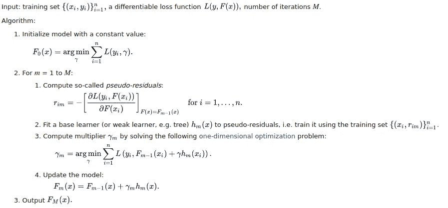

[https://en.wikipedia.org/wiki/Gradient_boosting](https://en.wikipedia.org/wiki/Gradient_boosting)

不要害怕！我会用例子详细解释每一步。

在这篇文章中，我将从回归的角度解释梯度推进。考虑一个简单的回归问题，我们希望在给定身高和性别的情况下预测体重。

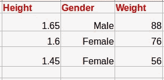

我们选择均方误差作为损失函数。

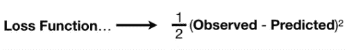

注意:重要的是我们的损失函数是可微的。

**步骤 1:用常数值 F0(x)** 初始化我们的模型

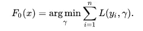

```
F0(x) = argmin  [(1/2)(88-predicted)^2 + (1/2)(76-predicted)^2 +
          γ                          (1/2)(56 - predicted)^2 ]
```

为了解决优化问题，我们将梯度设置为零并求解

```
dL(yi,F0(x))
----------- = 0
F0(x)-(88- predicted) - (76-predicted) - (56-predited) = 0=> predicted = (88+76+56+3)/3 => F0(x) = 73.3
```

**第二步:**


这是一个循环，其中 M 代表树的总数。通常我们考虑 M= 100。因此，对于每棵树，我们做如下。

**2.1 计算 psudo 残差**

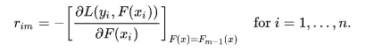

这是损失函数 wrt 预测值的导数。

```
rim = -(observed - predicted)
```

所以我们有，

```
r11 = (88-73.3) = 14.6
r12 = (76-73.3) = 2.7
r13 = (56-73.3) = -17.3
```

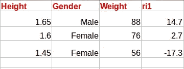

注意:GBDT 算法是以这个等于预测负梯度的 psudo 残差命名的。

2.2 将一个基础学习器(决策树)拟合到这个 psudo 残差中，并将末端叶节点命名为 Rjm，其中 j=1，2…Jm

这里我将创建一个深度为 1 的决策树(stump ),因为我的例子很小。通常对于梯度推进，我们会考虑更深的决策树。我们通常不使用树桩。

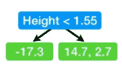

假设这是我们创建的决策树。如果你不知道如何构造决策树，你可以参考我的文章 中的 [***用实例演示构造决策树。现在标记终端区域。这部分非常简单，因为叶子是末端区域。***](https://medium.com/datadriveninvestor/decision-tree-algorithm-with-hands-on-example-e6c2afb40d38)

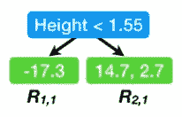

**2.3。对于 j = 1…Jm 计算γjm**

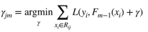

在这一步中，我们将计算每片叶子的输出值。每个叶子的输出值是使损失函数最小化的伽马值。这类似于我们初始化 F0(x)的第一步。但是在这一步中，我们将考虑我们之前的预测(Fm-1(xi))。

Rij 的 xi 元素意味着该特定叶节点中的所有元素。我们将使用拉格朗日乘数来解决这个优化问题。

对于左叶节点 R1，1

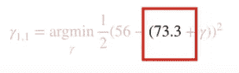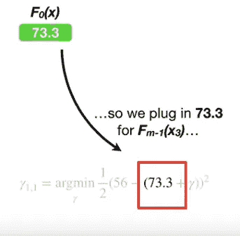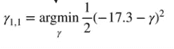

现在我们用链式法则求解伽马。我们有

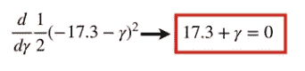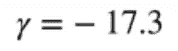

类似地，我们求解叶节点 R1，2

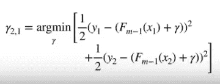

我们有 y1=88，y2=76，Fm-1(x1)和 Fm-1(x2 ) = 73.3 这是我们之前的预测。

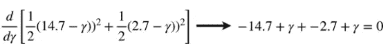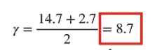

注意:在回归问题中，残差的平均值以 rjm 值结束。

现在我们有了决策树:

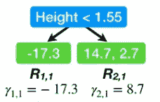

2.4.更新 Fm(x)

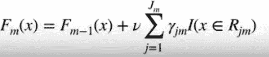

这里，为了得到 F1(x ),我们将先前的预测与叶节点的 rjm 值乘以学习率相乘。这里我们取学习率为 0.1

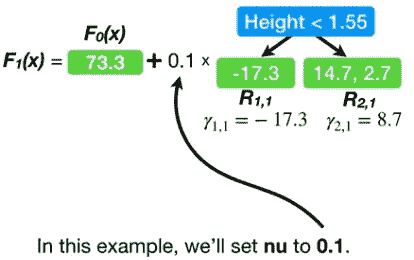

我们的新预测是:

```
For x1, r11 = 73.3 + (0.1*-17.3) = 71.6
For x2, r21 = 73.3 + (0.1*8.7) = 74.2 
For x3, r21 = 73.3 + (0.1*8.7) = 74.2
```

基于这些预测构建下一棵树

# 预测阶段

假设我们的训练结束了，我们想对一个数据进行预测。假设我们构建了两个决策树，即 M=2。实际上，我们通常会有 M = 100。

假设我们要预测体重的人身高 1.3，男性。

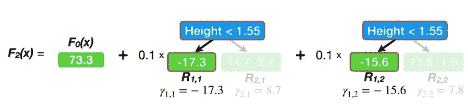

我们已经预测了权重为 73.3+(0.1 *-17.3)+(0.1 *-15.6)= 70。

现在我想你对 GBDT 回归已经有了清晰的直觉。我写这篇文章的灵感来自于 Josh Starmer 的 StatQuest。如果这个概念仍然不清楚，你可以参考他的视频，其中解释了更多的例子。直到那时快乐的机器学习！

## 参考:

【https://www.youtube.com/watch?v=2xudPOBz-vs】T2&list = plblh5 jkooluictaglrohqduf _ 7q 2 gfu JF&index = 45

【https://en.wikipedia.org/wiki/Gradient_boosting 