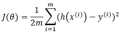
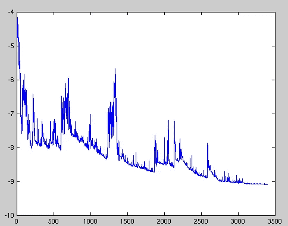

# 梯度下降算法

> 原文：<https://medium.datadriveninvestor.com/gradient-descent-algorithm-b4c5afb4eb98?source=collection_archive---------6----------------------->

## 探索梯度下降算法的三种变体。

在机器学习中，**优化**是最小化**成本(损失)函数**(选择的评估模型的度量)的过程，例如平方误差的和( [SSE](https://en.wikipedia.org/wiki/Residual_sum_of_squares) )和均方误差( [MSE](https://en.wikipedia.org/wiki/Mean_squared_error) )等等。通常，成本函数以 J(θ)的符号给出，其中θ是与目标机器学习模型相关联的 n 维权重向量。

**sum of squared errors**

**mean squared errors**

在我们之前关于[线性回归](https://link.medium.com/FckcOIukW5)的文章中，我们已经讨论了梯度下降算法在优化线性回归的权重和偏差方面的作用。事实上，梯度下降是机器学习问题中最常实现的优化算法之一。[梯度下降](https://en.wikipedia.org/wiki/Gradient_descent)是一种最小化函数的迭代优化算法。参数/权重在每次迭代中通过**步长进行更新，该步长与当前点**处函数梯度的负值成比例。

为了更好地理解算法，让我们考虑一个二次函数，f(x)= 2(x–0.5)+0.1，其图形如下图所示。

**Figure:** Graph of f(x)=2(x–0.5)²+0.1

在算法描述中给出“**步与函数在当前点**的梯度的负值成正比”，实际上函数在一点的梯度是由其一阶导数给出的，因此我们可以将**步**表示为:

Gradient of f(x) is given by its first derivative

Formulation of step

Update x with step of –α(4x – 2) in each iteration

现在让我们选择学习率，α=0.2，并初始化一个起始 x 值。通常，它被初始化为零(x=0)。

**#1 迭代:** x = 0–0.2(4(0)-2)= 0.4
f(x)= 2(0.4–0.5)+0.1 = 0.12

**#2 迭代:** x = 0.4–0.2(4(0.4)-2)= 0.48
f(x)= 2(0.48–0.5)+0.1 = 0.1008

**#3 迭代:** x = 0.48–0.2(4(0.48)-2)= 0.496
f(x)= 2(0.496–0.5)+0.1 = 0.100032

**#4 迭代:** x = 0.496–0.2(4(0.496)-2)= 0.4992
f(x)= 2(0.4992–0.5)+0.1 = 0.10000128

**#5 迭代:** x = 0.4992–0.2(4(0.4992)-2)= 0.49984(≈0.5)
f(x)= 2(0.49984–0.5)+0.1 = 0.1000000512

我们可以观察到 x 值在每次迭代中增加，而 f(x)的值向其最小值(0.1)减少(收敛)。在第 5 次迭代时，x 大约等于 0.5，这是 f(x)的最小值，如上图所示。

> "为什么在更新过程中需要学习率？"

让我们考虑不存在通过简单地设置α=1 而引入的学习率。所以，**步=–(4x–2)**。

类似地，我们初始化 x=0。

**#1 迭代:** x = 0-(4(0)–2)= 2
f(x)= 2(2–0.5)+0.1 = 4.6

**#2 迭代:** x = 2-(4(2)–2)=–4
f(x)= 2(–4–0.5)+0.1 = 40.6

**#3 迭代:** x =–4-(4(–4)-2)= 14
f(x)= 2(14–0.5)+0.1 = 364.6

**#4 迭代:** x = 14-(4(14)-2)=–40
f(x)= 2(–40–0.5)+0.1 = 3280.6

**#5 迭代:** x =–40-(4(–40)-2)= 122
f(x)= 2(122–0.5)+0.1 = 29524.6

在这个例子中你观察到了什么？x 值从负值到正值振荡，并且幅度增加，而 f(x)值显著增加。这是因为在每一次迭代中，x 值的更新需要很大的步长，从而导致 f(x)值发散而不是收敛到最小值。因此，这就是为什么我们需要学习率(α)来重新调整步长以确保 f(x)收敛到最小值的原因。

希望通过这个简单的例子，你对梯度下降算法有了更清晰的了解。注意，我们刚刚研究的例子是单变量函数，然而同样的概念同样适用于多变量函数。这就是梯度下降算法的基本概念。

## 梯度下降算法的三种变体

将均方误差(MSE)视为评估机器学习模型(如线性回归模型)的度量，因此**成本函数**为:

**m is the number of data points**

**Gradient of cost function with respect to θⱼ (where j=0, 1, 2, … , n with n=total number of independent variables)**

> 让我们看看梯度下降算法的三个变体是如何工作的。

**1。批量梯度下降:**

在批次梯度下降算法的每次迭代中，计算梯度时会考虑所有数据示例(行)。

更新等式:

因此，该算法可以总结如下:

Batch gradient descent algorithm for linear regression

优点:

*   这在计算上更有效，因为在考虑所有数据点的每个时期中更新仅发生一次。
*   梯度的估计更精确，因为它在计算中使用了所有的数据点。所以收敛更稳定。

缺点:

*   如果数据集非常大，它会更慢，因为它需要在一次更新中计算整个数据集的梯度。
*   由于在计算梯度时需要整个数据集，因此整个数据集必须适合硬件存储器，如果数据集非常大，这可能是不可行的。

**2。随机梯度下降:**

在随机梯度下降算法中，不是使用所有行的数据，而是只使用一行数据来计算梯度。

**Note that the summation notation is dropped as compared to the one in batch gradient descent because we are using one data point in each update.**

更新方程式:

总结算法:

Stochastic gradient descent algorithm for linear regression

优点:

*   因为更新发生得更频繁，所以收敛会更快。
*   权重的更新非常嘈杂，因为它仅用单个数据点来估计梯度。噪声更新可以帮助模型避免次优的局部最小值。

Noisy cost function with respect to each update. (Source: [https://en.wikipedia.org/wiki/Stochastic_gradient_descent](https://en.wikipedia.org/wiki/Stochastic_gradient_descent))

缺点:

*   同样，如果数据集非常大，由于迭代次数非常多，因此训练时间会更长。
*   如前所述，权重的更新非常嘈杂，因此它实际上不会收敛到最小值，而是在最小值附近保持振荡。

**3。小批量梯度下降:**

正如我们所看到的，批量梯度下降和随机梯度下降都有一些缺点，因此出现了梯度下降的第三种变体，它通常比上述两种变体更快，并且与随机梯度下降相比还减少了噪声。

顾名思义，小批量梯度下降法使用小批量 b(其中 **1 < b < m** 的数据来计算梯度。

**b is the batch size (number of data per batch)**

更新方程式:

总结算法:

Mini-batch gradient descent algorithm for linear regression

## 结论

这就是梯度下降算法的三种变体。我希望你喜欢这篇文章并从中获得知识。在不久的将来，我将对其中的三种算法做一些实验，以提供它们之间的定量比较。

 [## 公平算法|数据驱动的投资者

### 许多人都有算法偏见。软件工程师关心算法偏差，因为我们关心…

www.datadriveninvestor.com](https://www.datadriveninvestor.com/2020/02/22/algorithms-for-fairness/) 

## 参考

[1][https://machine learning mastery . com/gentle-introduction-mini-batch-gradient-descent-configure-batch-size/](https://machinelearningmastery.com/gentle-introduction-mini-batch-gradient-descent-configure-batch-size/)