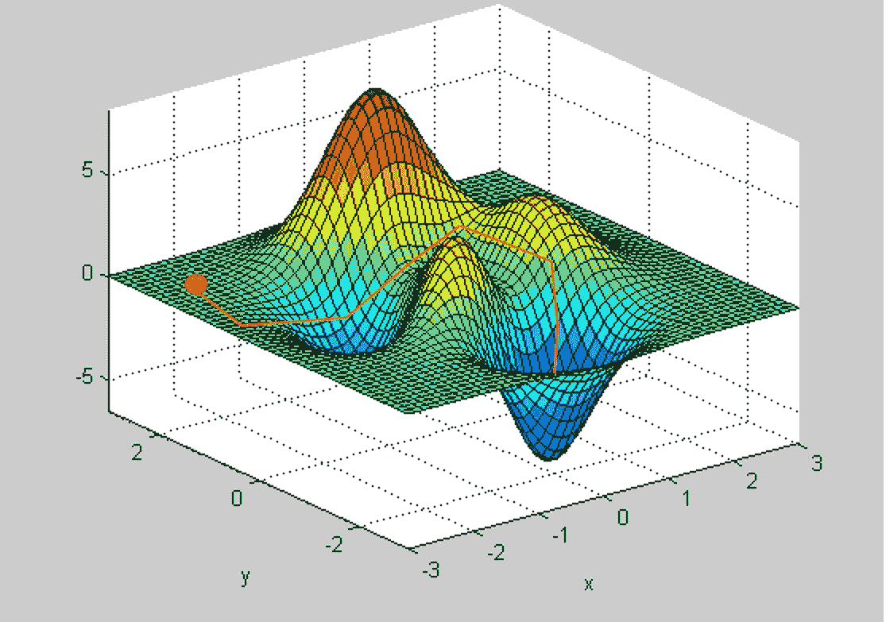
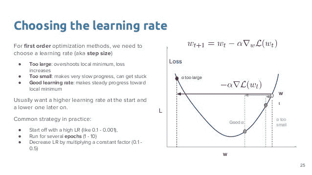

# 梯度下降:神经网络如何学习

> 原文：<https://medium.datadriveninvestor.com/gradient-descent-how-neural-networks-learns-ce79d99d7771?source=collection_archive---------8----------------------->

*在本文中，我们将了解神经网络中的梯度下降。我们将介绍基本原理及其工作原理。所以让我们先了解一下。*

> **梯度下降**是一种优化算法，用于通过沿梯度负值定义的最陡下降方向迭代移动来最小化某个函数。在机器学习中，我们使用梯度下降来更新模型的参数。参数是指线性回归中的系数和神经网络中的权重。

在成本函数的上下文中考虑三维图形。我们的目标是从右上角的山(高成本)移动到左下角的深蓝色的海(低成本)。箭头表示从任意给定点开始的最陡下降方向(负梯度)——尽可能快地降低成本函数的方向

从山顶开始，我们沿着负梯度指定的方向开始第一步下坡。接下来，我们重新计算负梯度(传递新点的坐标),并在它指定的方向上再走一步。我们迭代地继续这个过程，直到我们到达图表的底部，或者到达我们不能再向下移动的点——局部最小值。

# **学习速度:**

> 达到最小值或底部所需的步长称为**学习速率**。随着学习速度的提高，我们每一步可以走更多的路，但是我们有可能会越过最低点，因为山坡的坡度是不断变化的。由于学习率很低，我们可以自信地向负梯度的方向前进，因为我们经常重新计算它。低学习率更精确，但是计算梯度很费时间，所以我们要花非常长的时间才能追根究底。

# **成本函数**

> 一个**损失函数(误差函数)/成本函数**告诉我们，我们的模型对于给定的一组参数的预测“有多好”。成本函数有自己的曲线和自己的梯度。这条曲线的斜率告诉我们如何更新我们的参数，使模型更加准确。

1.  **向哪个方向下降(考虑前两个图)？**
2.  **下降多少？步长应该是多少？**

最初，我们采取大的步骤，逐渐地，我们开始一小步一小步地达到全局最小值。如果我们不随时间改变步长，我们可能会超过全局最小值，我们的模型可能永远不会收敛。因此，我们需要使用自适应学习速率，而不是使用恒定的学习速率，以便我们能够根据条件改变步长。梯度下降的味道很多，我们就讨论其中的几种吧。

# **批量梯度下降(BGD)**

在批量梯度下降中，我们在一次迭代中处理整个训练数据集。一旦一个历元完成，权重就被更新。

# **随机梯度下降(SGD)**

在随机梯度下降中，我们在每次迭代中处理来自训练数据集的单个观察值(而不是整个数据集)。我们计算误差、梯度和新权重，并针对训练数据集中的每个观察值不断更新模型。

# **小批量梯度下降(MBGD)**

在小批量梯度下降中，我们在每次迭代中处理训练数据集的一个小子集。换句话说，我们可以说这是 BGD 和 SGD 之间的妥协。

注意:批量大小是一个非常重要的超参数。它可能因数据集而异。因此，决定批量是非常关键的一步。

# **新币的变种**

1.基于动量(内斯特罗夫动量)

2.基于自适应学习率(Adagrad、AdaDelta、RMSprop)

3.动量和自适应学习率的组合(Adam)

# **气势**

动量有助于在相关方向上加速 SGD。所以，考虑每个参数的动量是个好主意。它具有以下优点:

1.避免局部极小值:由于动量增加了速度，因此增加了步长，优化器将不会陷入局部极小值。

2.更快的收敛:动量使得收敛更快，因为它由于获得的速度而增加步长。

# **内斯特罗夫势头**

它找出当前的动量，并在此基础上近似下一个位置。然后，它计算梯度 w.r.t 下一个近似位置，而不是计算梯度 w.r.t 当前位置。这个东西可以防止我们走得太快，并提高响应速度，从而显著提高 SGD 的性能。

# **阿达格拉德**

它主要关注自适应学习速率，而不是动量。

在标准 SGD 中，学习率总是不变的。这意味着，不管坡度如何，我们都必须以相同的速度前进。这在现实生活中似乎不切实际。如果我们知道应该减速还是加速，会发生什么？如果我们知道应该在这个方向加速，在那个方向减速，会发生什么？使用标准 SGD 是不可能的。

Adagrad 不断更新学习率，而不是使用恒定的学习率。它累加所有梯度的平方和，并使用它来归一化学习率，因此现在学习率可以根据过去梯度的表现而变小或变大。

它使学习率适应参数，对与频繁出现的特征相关联的参数执行较小的更新(即，低学习率)，对与不频繁出现的特征相关联的参数执行较大的更新(即，高学习率)。因此，它非常适合处理稀疏数据。

# **AdaDelta 和 RMSprop(均方根 prop)**

AdaDelta 和 RMSprop 是 Adagrad 的扩展。

正如在 Adagrad 部分所讨论的，Adagrad 累加所有梯度的平方和，并使用它来归一化学习速率。因此，阿达格拉德遇到了一个问题。问题是阿达格勒的学习率持续下降，在某一点上学习几乎停止。

为了处理这个问题，AdaDelta 和 RMSprop 衰减过去累积的梯度，因此只考虑过去梯度的一部分。现在，我们不考虑所有过去的梯度，而是考虑移动平均。

# **亚当(自适应矩估计)**

Adam 是最好的梯度下降优化器，被广泛使用。它利用动量和适应性学习的力量。换句话说，亚当是有动量的 RMSprop 或 AdaDelta。

首先，梯度计算如下:

Gradient in RMSprop

然后，权重和偏差矩阵更新如下:

Weight and bias update in RMSprop

注意*β2*是一个新的超参数(不要与动量的*β*相混淆)。另外，*ε*是一个非常小的值，以防止被 0 除。

因此，结合动量和 RMSprop，Adam 引入了四个超参数:

*   学习率*α*
*   *β*来自动量(通常为 0.9)
*   来自 RMSprop 的 *beta2* (通常为 0.999)
*   *ε*(通常为 1e-8)

如上所述，您通常不需要调整 *beta* 、 *beta2* 和 *epsilon* ，因为上面列出的值通常会工作得很好。为了加速训练，只需要调整学习速率。

**结论:**上述大部分梯度下降方法已经在 TensorFlow、Keras、Theano、Caffe 等流行的深度学习框架中实现。然而，Adam 是目前推荐使用的默认算法，因为它利用了动量和自适应学习特性。

> 请注意，更好的方法只不过是更快的方法。给定更多的时期，其他方法可以给出更好的准确度分数。不过，这个练习的目的是评估每种方法的速度，Adam 显然是赢家。

# **局部和全局最小值**

如上所述，梯度下降优化器的任务是找出参数的最佳权重。但有时，它可能会找到小于最佳值的权重，从而导致模型不准确。理想情况下，我们的 SGD 应该达到全局最小值，但有时它会陷入局部最小值，并且很难知道我们的 SGD 是处于全局最小值还是陷入局部最小值。

**如何避免局部极小？**

局部最小值是梯度下降的一个主要问题。超参数调整在避免局部极小值方面起着至关重要的作用。这个问题没有通用的解决方案，但是我们可以使用一些方法来避免局部极小值。

1.增加学习率:如果算法的学习率太小，那么 SGD 更有可能陷入局部极小值。

2.在更新权重时添加一些噪声:在权重中添加随机噪声有时也有助于找出全局最小值。

3.分配随机权重:使用随机起始权重进行重复训练是避免这个问题的流行方法之一，但是它需要大量的计算时间。

4.使用大量隐藏层:层中的每个隐藏节点以不同的随机起始状态开始。这允许每个隐藏节点收敛到网络中的不同模式。参数化该大小允许神经网络用户潜在地在单个神经网络中尝试数千个(或数百亿个)不同的局部最小值。

5.最重要的一点:使用基于动量和自适应学习的 SGD:如上所述，不要使用传统的梯度下降优化器，而是尝试使用 Adagrad、AdaDelta、RMSprop 和 Adam 等优化器。Adam 使用动量和自适应学习速率来达到全局最小值。

有时局部最小值和全局最小值一样好

> 通常，并不总是需要达到真正的全局最小值。通常认为大多数局部最小值具有接近全局最小值的值。有很多论文和研究表明，有时达到全局最小值并不容易。因此，在这些情况下，如果我们设法找到一个和全局最小值一样好的最优局部最小值，我们应该使用它。

感谢阅读！将来我也会写更多的****文章**。 [**跟随**](https://medium.com/@vijay_choubey) me 上 [**中**](https://medium.com/@vijay_choubey) 了解他们。我也是一名自由职业者，如果有一些数据相关项目的自由职业工作，请随时通过 [**Linkedin**](https://www.linkedin.com/in/vijay-choubey-3bb471148/) 联系。没有什么比做真正的项目更好的了！**

# **如果你喜欢这篇文章，请鼓掌！**