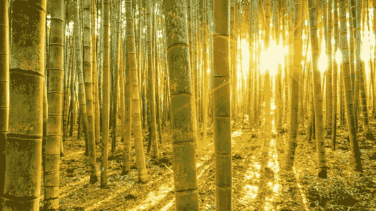
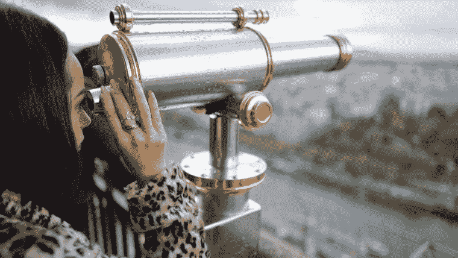

# 日冕时代的高中毕业。父母的视角

> 原文：<https://medium.datadriveninvestor.com/graduating-from-high-school-in-the-time-of-corona-a-parents-perspective-7184788aeee5?source=collection_archive---------12----------------------->

Graduating from high school in the time of Corona. A parent’s perspective. Photo by @freepik via freepik.com

# 当你的孩子高中毕业时，21 世纪为人父母的挑战

2020 年是日冕之年，也是我的大女儿玛雅高中毕业的一年。作为父母，最大的挑战是我们必须引导和准备我们的孩子进入一个与我们成长的世界截然不同的世界。然而，作为父母，你仍然面临着激励、支持和引导孩子的挑战，并让他们为一个混乱、不确定、充满惊喜和机遇的世界做好准备。

在她离开家之前，我有很多话想对她说。世界是复杂的。事情并不总是像它们看起来的那样。学会在信息的海洋中游泳，有时是在无信息的海洋中。不要急于下判断。试着辨别，连接这些点。正确看待事物。有很多话要说，为了简洁明了，我给她写了一封公开信。

Maya Reed. Class of 2020\. A Memorable Year

***活也要活*** *活得充实而勇敢，
活得明白人性，
认识自己，认识自己的真正本质。*

*起床，打扮，展示，
每天尽你所能，
直到你更了解，
然后，当你更了解，
做得更好。*

*把你的身体当成一座庙宇，
每天都去照料它，
滋养它，
崇拜它。*

我知道早年可能充满泪水，
但我知道你生来就是要面对那些恐惧的，
我会永远在这里为你加油。

你有这个能力吗？有自己的想法，有进入状态的能力。

*祝你有清晰的视野，
以便你能做出好的决定，
而不被优柔寡断所麻痹。*

*要有清晰的视觉，
能不能掌握自己的直觉？
并把它当作弹药。*

*所以，去闪耀你独特而自然的光芒吧，
尽可能的明亮和强烈，
成为非凡的人！
成为你。*

***乔安妮·里德***

# 高中毕业后，你长大后想做什么？

你长大后想做什么是一个困难的问题，需要仔细思考。高中毕业后成为一名医生、兽医、工程师、律师或科学家都是很好的选择，但是如果我说你应该考虑所有这些，但也要成为一名作家呢？你人生故事的作者。

人们生活在他们想讲述的故事中。你的生活就是你的故事，你的使命就是尽你所能写出最好的故事，并在此过程中经历许多冒险。你们都在寻找自己的目标和释放自己全部潜力的旅途中。

在你所做的事情上取得成功应该是你长期计划的一部分。但是你如何定义成功呢？这是一个流动的概念。成功对不同的人有不同的意义。但对我来说，成功包含三个关键因素:

1.  ***成功是冰山*** 。当你看成功人士时，你看到的往往只是表面；自信、财富、美貌、关系、资历。通常，你看不到的是带他们去那里的东西:坚持、失败、牺牲、失望、努力和奉献。托马斯·爱迪生说过:“*天才是 1%的灵感加 99%的汗水*，”别忘了，不要害怕流汗。
2.  ***成功是一座花园*。**一切从一个想法开始。*你的心灵是一座花园，你的思想是种子，你可以种花，也可以种籽在你的头脑中种下一颗种子，好好照顾它，朝着你的目标稳步前进，并且足够坚强，不要让挫折打败你实现你的目标。*
3.  成功在于克服逆境。没有一段旅程会完全一帆风顺或完全按计划进行。会有起伏和意想不到的转折，你会遇到困难。当事情变得有点棘手时，你会怎么做？嗯，我建议你接受玛娅·安杰洛的建议。

*“你可能会遇到很多失败，但你一定不会被打败。事实上，可能需要遭遇失败，这样你才能知道你是谁，你能从什么中崛起，你还能如何走出困境。”
–****玛娅·安杰洛***

# 讲故事时间

从前，有一个中国农民；这位农民正努力养家糊口。他对家人美好未来的希望和憧憬，寄托在几粒竹子种子里。他决定挖一个又一个洞来播种，然后他开始日复一日地照料这些种子，给种子浇水，给土地施肥。

这个农民决定在竹子周围种植其他作物来养活他的家人，但是他真正的希望还是在竹子上。整整一年过去了…什么也没有。尽管如此，农民继续每天给种子浇水和施肥。又一年过去了…仍然一无所获。他的邻居嘲笑他，他们嘲笑他的远见和梦想。他开始质疑自己，怀疑爬进了他的脑海。

又一年过去了…仍然一无所获。三年来，他为自己的竹梦倾注了大量的精力、精力和希望，却没有任何收获。一天，他站在现场，沮丧地哭了。贫瘠的土地似乎在嘲笑他，但风在他耳边低语着希望，所以农民爬起来，继续给种子浇水和施肥。又一年过去了……但还是一无所获。

五年过去了，我们的农民累了。他厌倦了搬运水桶和喂种子。他厌倦了日复一日看不到任何结果。绝望动摇了他的灵魂，泪水充满了他的眼睛，他回到家，感觉被打败了。但是，农民最黑暗的时刻就在第二天黎明前，奇迹发生了。农民看到绿色的嫩芽从地里冒出来；他无法抑制自己的喜悦，跑过村庄，与家人分享这个消息。在 6 周内，竹子会长到 90 英尺高！

***故事的寓意***

*如果农民在那五年里停止给种子浇水和施肥，竹子就会死在地里，见不到阳光。*

如果你有一个愿景和梦想，你需要日复一日的训练来实现你的梦想，即使你不能马上看到结果。

无视那些告诉你这不可能的人。学会拒绝自己的怀疑和恐惧。没有理由相信的时候，要学会有信心。
好事需要时间。面对逆境，你需要耐心、奉献、毅力和勇气。

# 生活可能是一场斗争

实现梦想的旅程不会完美。你会遇到挫折、失望、障碍和困难。在这些时刻，不要绝望，而是努力寻找解决问题的方法和一条清晰的道路。处于混乱状态会增加不必要的痛苦和折磨，但是处于清晰状态会带来希望、快乐和幸福。

你如何发现清晰？

1.  第一件事是[认识自己](https://joanne-shamping.medium.com/do-you-know-who-you-are-the-dunning-kruger-effect-explained-97996b8ba092)。根据古希腊人的说法，所有智慧和清晰的源泉是了解你自己。你需要知道你的优势和劣势在哪里，这样你就可以利用你的优势，改善你的劣势。
2.  第二件事是[理解人性](https://joanne-shamping.medium.com/why-people-dot-the-things-they-do-afe837e75fc1)以及人们为什么做他们所做的事情。能够做出好的决策，需要你预测未来，准确感知自己的现状，洞察周围人的心思。
3.  第三件事是练习[保持安静的艺术](https://medium.com/mindfully-speaking/the-art-of-being-still-5071e1ac396)如果你的头脑处于持续的激动状态，被无意识的分心所占据，你将不会知道你是谁。独处的时间可以让你更好地适应你的直觉。静止意味着在世界围绕你旋转时保持稳定。静止可以激发新的想法，使观点变得敏锐，并照亮心灵。

如果你做了这三件事，你会发现清晰。记住，你的头脑就像水一样。当它变得激动时，就很难看清了。但是如果你让它平静下来，答案就会变得清晰。

# 是什么造就了一个伟大的故事？

那么，*你长大后想做什么*？如果你想让你的生活成为一个宏伟的故事，你需要清晰，因为清晰会让你的思想、情绪和行动彼此一致。好的故事包括乐趣、欢乐和笑声，但也有一些戏剧、眼泪和悲伤。人们喜欢超级英雄做出精彩事迹的故事。努力成为自己的英雄，不是穿着斗篷，从一栋楼跳到另一栋楼试图拯救世界，而是每天成为一个更好的人，把自己的光芒照耀到这个世界。所以，我亲爱的女儿们，我祝你们旅途好运，并希望你们写出有史以来最好的故事。

Joanne Reed The Author
Author of “This Is Your Quest”. You can’t buy happiness but you can buy books. Your mission, should you wish to accept it is to experience happiness