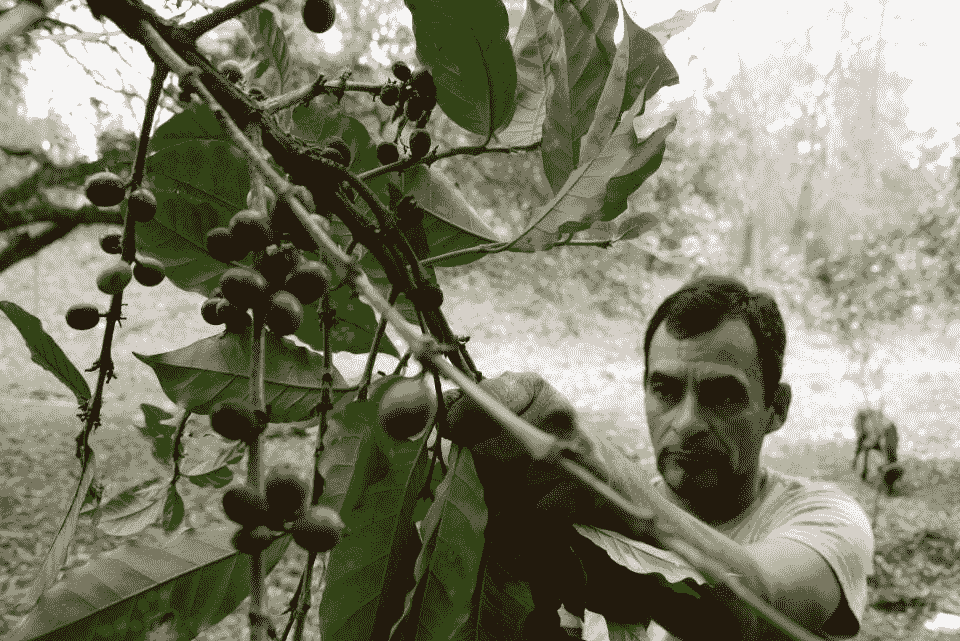

# GrainChain 在 Symbiont 的区块链上走向全球。小农场主正在报名。

> 原文：<https://medium.datadriveninvestor.com/grainchain-goes-global-on-symbionts-blockchain-small-farmers-are-signing-up-3be6abd413cb?source=collection_archive---------20----------------------->

A farmer watches coffee beans affected by the roya fungus in a plantation in Tegucigalpa, on May 22, 2014\. The Central American coffee sector — with state assistance — needs to act without delay to stop the roya disease, which in 2013 only caused a USD 1200 million loss. AFP PHOTO/Orlando SIERRA. (Photo credit should read ORLANDO SIERRA/AFP via Getty Images)

3 月初，GrainChain 完成了 820 万美元的首轮融资，并宣布将在墨西哥、洪都拉斯和美国开放其区块链业务网络。

来自洪都拉斯等新兴经济体的 12，000 名新成员已注册并等待在 2020 年加入该系统。Grainchain 的服务加快了对农民和供应商的农业结算付款，同时向买家提供即时可用的商品

GrainChain 的首席执行官兼创始人路易斯·马西亚斯(Luis Johnson)一直在向他的网络中添加新成员，现在他与美国的 1，284 名成员、墨西哥的 870 名成员和洪都拉斯的 800 名成员交易 24 种不同的干谷物商品。"我们帮助小农户避开中间商，从他们的作物中赚取更多。"马西亚斯先生说。“我们的支付轨道还可以覆盖美国所有的商业银行。”

小农场主面临的一个问题是，他们所报的价格可能不是他们最终认为的报酬。几个变量与它们的供应链相互作用，谷物的质量变得易于解释和未知的风险。例如，由于运输限制，一个农民可能有一两个谷物升降机。另一个例子，一个农民的报价可以改变，因为他不能在争端中执行他的原始价格。

DC 华盛顿——4 月 17 日:前美国众议员克里斯·考克斯(共和党)(共和党)在……[+]向媒体成员发表讲话

Getty Images

美第奇风险投资公司总裁兼 Overstock 首席执行官乔纳森·约翰逊说:“农民知道他们会得到报酬。”Johnson 先生认为这对 GrainChain 成员来说是一种利益和竞争优势，他们不仅受益于区块链确保过渡信任和付款记录的能力，而且还获得了 GrainChain 的物流工具。

Medici Ventures 领导了 GrainChain 的最新一轮融资。

GainChain 在试运行期间完成了 350，000 笔已执行交易，并为全球农民处理了超过 130 亿英镑(约 590 万公吨)的干收益。作为规模比较，根据 Tradingeconomics.com 的数据，美国在 2017 年生产了超过 4.4 亿公吨的谷物。这可能是在拿苹果和橙子做比较，但它提供了一个粗略的基准，说明马西亚斯的经营已经在一个小行业中站稳了脚跟。

 [## 数字货币、区块链和货币的未来|数据驱动的投资者

### “区块链”、“加密货币”、“令牌化”，以及现在的“央行数字货币”已经成为…

www.datadriveninvestor.com](https://www.datadriveninvestor.com/2020/02/18/digital-currencies-blockchain-and-the-future-of-money/) 

根据今天的新闻稿，GrainChain 通过将其运营转移到共生体企业区块链平台 Assembly TM，提高了其业绩规模。《Hyperledger Fabric》前情提要，GrainChain 决定搬到 Symbiont 的网络上定居。

GrainChain 的商业愿景是为农业经济提供更好的技术，有效地为小农提供与大农场运营相同的工具。“GrainChain 使用智能合同来加速低收入农民的付款，这对于陷入困境的农业企业来说可能至关重要。”

“我们的使命一直是帮助支持世界各地的农民，”GrainChain 首席执行官兼创始人路易斯·马西亚斯评论道。“通过将农业供应链引入区块链科技，我们正在帮助生态系统中的每一个参与者——从农民到银行家到谷物升降机——获得更公平的价值、更快的支付和更大的参与者群体。我们不能被技术所束缚——这就是我们转向共生体网络的原因。共生体是区块链引擎，将有助于推动我们的全球愿景。”

GrainChain 最近完成了一轮 820 万美元的融资，由 Overstock.com(NASDAQ:OSTK)在区块链的全资子公司 Medici Ventures 牵头，该公司也投资了 Symbiont。

…阅读更多内容

*最初发表于*[*【https://www.forbes.com】*](https://www.forbes.com/sites/robertanzalone/2020/03/27/grainchain-goes-global-on-symbionts-blockchain-small-farmers-are-signing-up/)*。*