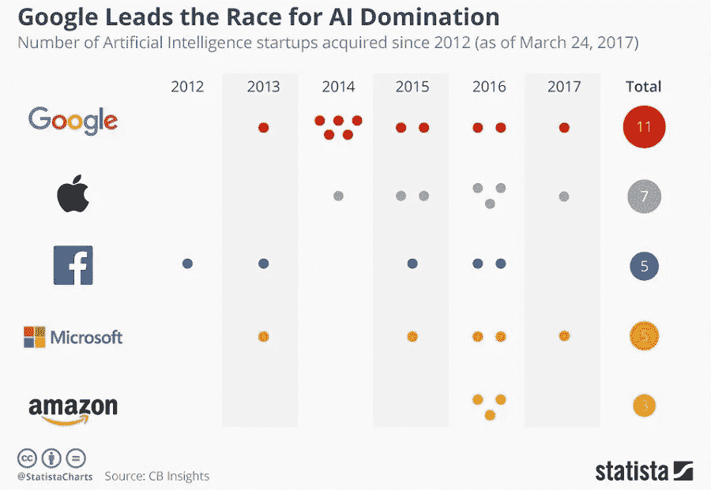
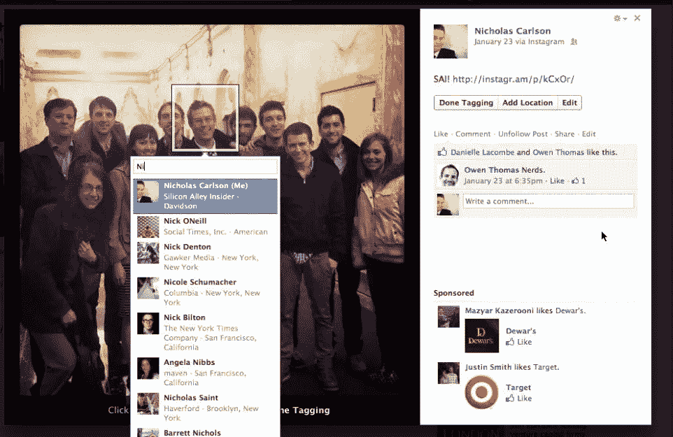
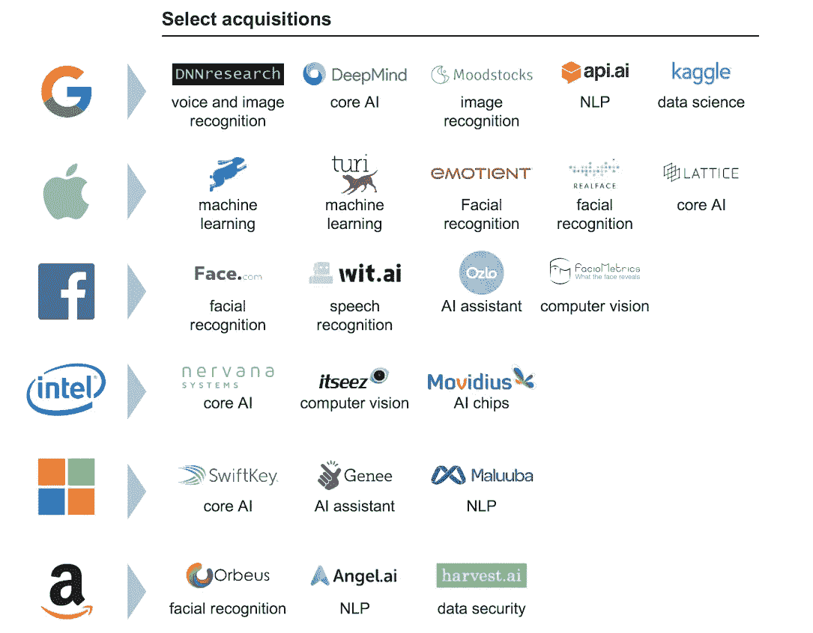
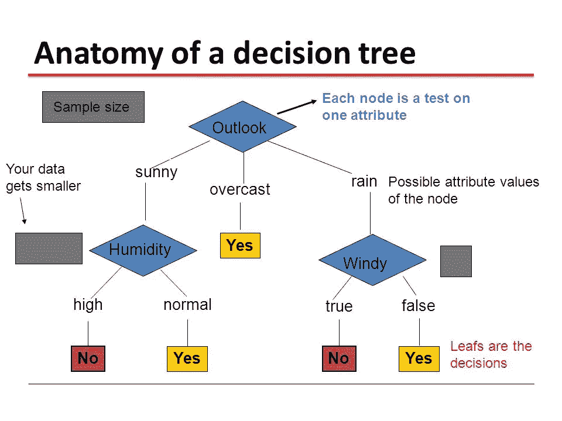
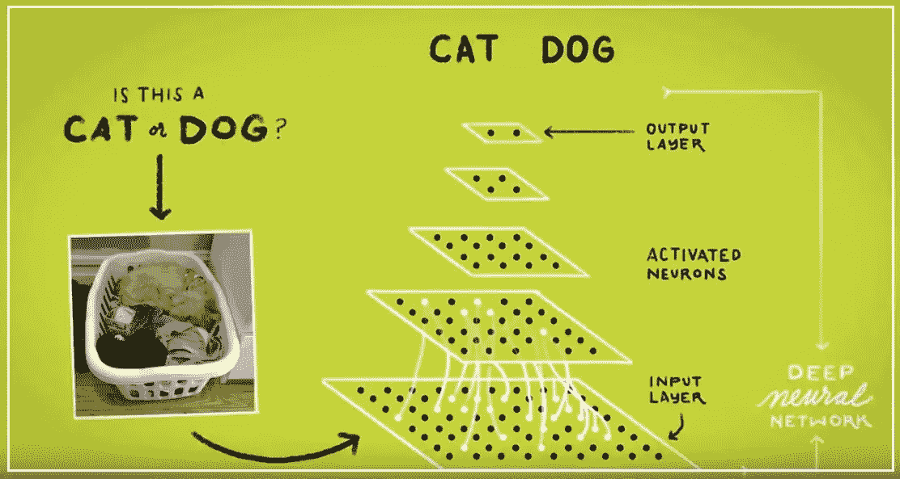

# 机器学习入门

> 原文：<https://medium.datadriveninvestor.com/grandma-the-machines-are-taking-over-26149b96ecff?source=collection_archive---------4----------------------->

## 你应该知道的一切

Google is emphasizing that it is indeed a AI/ML dominated company.

## **机器学习简介:**

机器学习(ML)由计算机算法组成。算法是以程序方式解决特定问题的一组规则或步骤。把它看作是获得理想结果的秘诀。你得到的不是香蕉面包，而是新鲜出炉的数据和信息饼干。算法允许计算机从数据中学习。它是自主的，有了它，计算机可以进行预测和决策。机器学习计算机可以在没有程序员告诉它做什么的情况下运行。程序员是计算机程序的重要组成部分，因为计算机需要指令。然而，在机器学习计算机中，它可以自行改变和改进算法。

## 机器学习的例子:

*   感恩节后的第二天，你妈妈缠着你在脸书上传照片。社交媒体平台使用面部识别技术来识别您的家庭成员。它很容易识别亲属与一个广场，以突出标记功能。嘣。照片现在可以和家人分享了。

*   漫长的一天，你只想在网飞大吃一顿。手里拿着中餐，你累了，不想再做一个决定。网飞会跟踪你看了什么，并建立一个推荐列表。它根据用户的喜好推荐电影或电视节目。你立刻就有了一个精选的列表。

机器学习是计算机科学的一个领域——研究和使用计算机。这是一个持续快速增长和发展的领域。了解历史和机器学习是必须的，就像吃蔬菜一样！这是因为机器学习最终将影响大多数甚至可能所有行业。它将像你的智能手机和社交媒体一样成为日常生活的一部分。

## 这篇文章的目标是引导你了解 ML 的内部和外部运作。你已经一直在用它了。它绝对不会去任何地方。要真正欣赏这项技术，了解世界是如何变化的，你应该知道它是什么。

机器学习来自人工智能(AI)的子领域。机器学习的目标是分析数据的结构，并将数据拟合到模型中。这些模型有助于数据科学家和 ML 工程师理解和使用数据。

## 机器学习与传统计算有何不同？

将传统计算视为程序员通常编写和编码程序的方式。这种情况下的算法是一组带有明确指令的程序。计算机用它来计算数据或解决问题，以获得想要的结果。

 [## 深度学习用 7 个步骤解释-更新|数据驱动的投资者

### 在深度学习的帮助下，自动驾驶汽车、Alexa、医学成像-小工具正在我们周围变得超级智能…

www.datadriveninvestor.com](https://www.datadriveninvestor.com/2019/01/23/deep-learning-explained-in-7-steps/) 

记住 ML 算法从数据输入中学习。如果需要，计算机通过改变或调整算法来训练自己。当计算机分析数据时，它使用统计分析。此时，计算机可以输出落在一定范围内的值。ML 允许计算机很容易地从样本数据中建立模型。这就是基于数据输入的自动化决策过程成为可能的原因。曼梯·里是这一过程的推动者。

## 当我们说“智能”时，我们指的是什么？

首先，让我们弄清楚一些事实。ML 和人类的智力不一样。计算机科学家将人工智能定义为机器展示的智能。也被称为机器智能。人工智能计算机或人工智能程序是“智能代理”:任何感知其环境并采取行动以最大化其成功实现目标的机会的设备。

## 机器学习的起源和里程碑

*   1950 年:艾伦·特纳首次推出“图灵测试”它通过欺骗人类让计算机也是人类来测试计算机的真正智能。
*   **1952 年:** Arthur Samuel 在 IBM 创建了第一个计算机学习程序。这个节目包括跳棋游戏。在游戏尝试之后，电脑会改进它的动作。它会想出获胜的策略和电影。
*   **1967:** 计算机通过 k“最近邻”算法开始识别一个基本模式。
*   20 世纪 90 年代 : ML 转向数据驱动的方法。计算机程序将研究大量数据。由此，计算机从中得出结论，或者开始从数据输入中学习。
*   **2006:** 深度学习(DL)诞生，由 Geoffrey Hinton 命名。DL 使用允许计算机识别和区分图像和视频中的对象和文本的算法。
*   **2014:** 脸书开发的 DeepFace。这是一种算法，允许计算机像人类一样区分或验证照片上的人。
*   **2015:** 亚马逊开发自己的 ML 平台。这改变了电子商务和消费者购物的方式。
*   更多历史日期——伯纳德·马尔的《机器学习简史》

Number of AI startups acquired by major players.

## 机器学习方法

监督学习和非监督学习是最广泛使用的两种 ML 方法。**监督学习**:算法基于示例输入数据接受训练。输出数据被人类标记和分析**无监督学习**:算法使用未标记的输入数据。该算法处理数据以找到共同特征。

## 监督学习:

*   计算机接收具有标签的示例输入。标签是算法期望输出的指令。这样做的原因是为了让算法“学习”该算法自动将实际输出与“训练”输出进行比较，以发现错误。当出现错误时，算法会相应地修改模型。监督学习是一种使用模式来预测更多未标记数据的标签值的方法。
*   例如，一种算法接收带有标签为配饰的帽子图像和标签为服装的服装图像的数据。计算机根据这些数据进行训练。监督学习算法应该能够根据其标记输入来区分未标记图像。因此，根据该算法，无标签的帽子变成配件的图像，而无标签的服装变成服装的图像。

## 常见用途

> 输入历史数据来预测未来事件
> 
> 你可以利用股市数据来寻找可能发生的波动。
> 
> 在电子邮件中，垃圾邮件被移到一个单独的文件夹，这样它就不会和你想要的相关邮件混在一起了。

## 无监督学习

*   该算法没有经过“正确”输入的训练，因此这些算法可以查看更复杂的数据。它可以处理更广泛的数据，并理解其模糊性。这样，算法可以通过以某种方式组织它来创造某种意义。通过这种类型的数据集，模式变得不受欢迎。
*   原始数据的分类对于无监督学习来说是一个巨大的优势。

## 多畜共牧

> 用于事务性数据。
> 
> 它可以检测异常，因此可以发现欺诈性的信用卡购买。
> 
> 它可以推荐下一步购买什么产品，如亚马逊、丝芙兰
> 
> 未标记的猫的照片可以用作算法的输入数据，以将照片标记为猫。

## 常见的算法方法

为了理解算法，需要定义一些统计概念的概述。ML 非常类似于计算统计学，理解它可以让你相应地使用必要的算法。

*   用于分析
    定量变量之间关系的常用技术是相关和回归。
*   相关性:“是两个变量之间关联的一种度量，这两个变量既不是相依的，也不是独立的”
*   回归:“在基本水平上”用于检查一个因变量和一个自变量之间的关系。因为回归统计可用于在自变量已知的情况下预测因变量，所以回归可实现预测功能。”
*   丽莎·塔利亚费里的[《机器学习导论》](https://www.digitalocean.com/community/tutorials/an-introduction-to-machine-learning)中的定义

## k 近邻

k 最近邻存储所有可用的输入。然后，它根据共性区分新数据或案例。它的一般用途是根据相邻数据点的接近程度对数据点进行分类。

该算法通过在与给定的“看不见的”观察最相似的情况中形成多数共识来工作。共同特征或相似性是数据点之间的距离度量。这被认为是“懒惰学习”,因为直到一个查询被提供给算法，分类才发生。

## k 近邻的特征

*   使用方便
*   灵活性
*   处理多类案件
*   在大量数据的情况下，实现是有效的

## 不足之处

*   计算成本很高。每个查询的计算必须与所有训练样本进行比较。
*   k，必须首先定义最近邻的数量—需要值
*   数据存储管理
*   确定有意义的距离函数

## **决策树学习**

决策树是概述对数据的观察的模型。该模型可以得出关于数据目标值的结论。该模型直观地表示决策，并显示决策过程。这种类型的学习展示了一个白盒模型，因为它补充了人类的决策过程。

> 决策树学习的目标是创建一个基于输入变量预测目标值的模型。[*(《机器学习概论》)*](https://www.digitalocean.com/community/tutorials/an-introduction-to-machine-learning)

## 决策树学习的特征

*   完美的视觉表现，易于理解和分析
*   参数包括数字和分类特征
*   “几乎不需要数据预处理:不需要一次性编码、虚拟变量等等”([决策树学习，O'Reilly](https://www.oreilly.com/library/view/machine-learning-with/9781787121515/697c4c5f-1109-4058-8938-d01482389ce3.xhtml) )
*   非参数模型:数据的形状不是预先确定的
*   快速推理
*   特征选择自动发生。无关紧要的特征不会影响结果。

## 不足之处

*   过度拟合:在决策树模型中，随着更多的数据进入，新的节点会生成。这棵树变得更加复杂，也变得更加难以解释。当新的看不见的数据成为树的一部分时，它可能会失去泛化能力。
*   不稳定:当新的数据点进入时，整个树重新生成。这会导致重新计算所有节点并重新创建新节点。
*   不适合大型数据集。大量的数据导致复杂的树，难以阅读或分析以做出概括。

## 深度学习

深度学习(DL)是最有趣的，因为它模仿了人类大脑如何将声音和光线刺激处理成听觉和视觉。DL 结构模仿人脑的生物神经网络。这是人工神经网络，有不同的层次。这些层由硬件和 GPU 组成。由于 GPU，它才变得实用。DL 可以计算大量数据，可以在一些认知任务上击败人类。正因为如此，DL 进一步推动了人工智能的发展。

## 它是如何工作的？

神经网络的隐含层决定了数据的输出层。当输出数据经过隐藏图层中提取或变换要素的图层时，会出现输出数据。DL 可以使用无监督或有监督的学习方法。

## 需要了解的重要编程语言

为了用 ML 实现算法，你需要一种编程语言来为 ML 程序编码。下面的语言被广泛用于使 ML 程序有用。

1.  **Python:** 可读语法，一种脚本语言，具有强大的预处理和简化数据的能力
2.  **Java:** 企业编程的理想选择，广泛用于网络安全
3.  **R:** 统计计算，开源，主要用于数据科学
4.  C++: 在游戏或机器人应用程序中创建 ML 程序的首选语言

## 结论

> AI 不会让我夜不能寐。几乎没有人在研究有意识的机器。深度学习算法，或谷歌搜索，或脸书个性化，或 Siri，或自动驾驶汽车或沃森，这些与意识机器的关系就像烤面包机与下棋计算机的关系一样。-拉米兹·纳姆

我不认为机器会接管。我们会没事的。我更担心程序员输入算法的数据类型——我认为人类的偏见比其他任何东西都更可怕。人的偏见最终会影响他人，它可能是积极的，也可能是消极的。*其他人呼吁监管第三方监控和审计算法，建立可以检测偏见的替代系统，并将道德审查作为数据科学项目规划的一部分* [(“机器学习简介”](https://www.digitalocean.com/community/tutorials/an-introduction-to-machine-learning))。

## 要审查的问题:

*   定义机器学习。
*   ML 中的一些关键日期和里程碑是什么？
*   ML 和传统计算有什么不同？
*   举两个机器学习在现实世界中使用的例子。
*   什么是有监督和无监督学习？
*   说出一些常见的算法方法，并从概念上解释它们。
*   机器学习用的编程语言有哪些？

## 要了解更多信息:

[“机器学习导论”，作者 Lisa Tagliaferri](https://www.digitalocean.com/community/tutorials/an-introduction-to-machine-learning)

[什么是神经网络？](https://www.youtube.com/watch?v=aircAruvnKk)

[机器学习和人工智能](https://www.youtube.com/watch?v=z-EtmaFJieY)

[什么是机器学习？](https://www.youtube.com/watch?v=WXHM_i-fgGo)