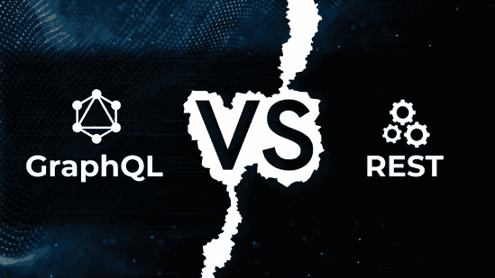
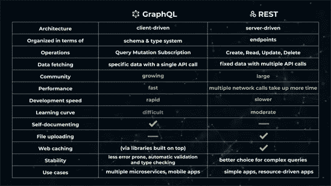
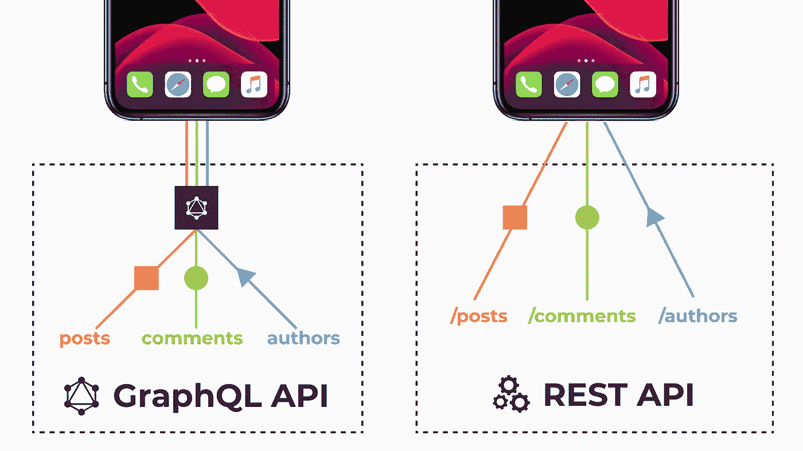

# GraphQL 与 REST:您不知道的

> 原文：<https://medium.datadriveninvestor.com/graphql-vs-rest-what-you-didnt-know-a451ffd1e5d0?source=collection_archive---------18----------------------->

您可能听说过 GraphQL，但可能不太确定它与 REST 有何不同。嗯，你很幸运！今天，我们将讨论 GraphQL 如何比 REST 更有利于开发社区的一些要点。

大多数人认为 GraphQL 是一种数据库技术，但这是不准确的。GraphQL 是一种查询语言 API，正如你们中的许多人可能知道的那样，今天的大多数应用程序都将其数据托管在远程服务器的数据库中。API 只需给出一个接口来存放满足应用程序需求的信息。

GraphQL 是在 REST 中构建 API 的替代选项。脸书将其开发为他们多功能应用的内部技术，后来作为开源公开发布。从那时起，软件开发社区就把它作为开发 web 服务最受欢迎的技术之一。

作为一种查询语言，GraphQL 定义了客户机应用程序如何从远程服务器请求所需数据的规范。因此，服务器应用程序返回对所请求的客户端查询的响应。这里要注意的令人兴奋的事情是，客户端应用程序也可以准确地查询它需要的内容，而不需要依赖服务器端应用程序来定义查询。

让我们更深入地分析 REST 和 GraphQL 的核心区别。

假设一个移动或 web 应用程序想要从显示博客作者信息的服务器访问数据。该应用程序应该显示作者的名字，作者写的博客文章，以及他/她最近写的三个博客主题。让我们抽象地回顾一下如何在 REST vs GraphQL 中获取这些数据。

 [## Replika:我有身份问题的数字朋友|数据驱动的投资者

### 你的生活很美好。你开始是一个毫无头绪的聊天机器人。后来你遭遇了身份危机。现在你是…

www.datadriveninvestor.com](https://www.datadriveninvestor.com/2020/08/21/replika-my-digital-friend-with-identity-issues/) 

以下是 REST 与 GraphQL API 的图示:

**休息请求**

在 REST 中，调用 API 端点来请求客户端应用程序需要的数据，服务器根据请求的查询返回响应。当有人使用 REST API 时，他们首先会有一个端点，可以是***/blog/author/<author-id>***，这个端点将获取作者的信息。现在需要另一个 REST 端点来访问博客文章***/blog/author/<author-id>/posts***，最后，还需要另一个端点来获取博客主题***/blog/author/<some-id>/topics****。*现在在这里，你会注意到两个问题:

**问题 1:** 多次往返带休息

您可能已经注意到，在利用 REST 获取客户机应用程序需要的信息时，应该进行多次往返。如果信息被扩展，必须添加额外的端点。

**问题 2:**REST 的上取和下取问题

通常在休息的时候，一个人会在特定的阶段得到不必要的信息。例如，当调用***blog/author/<author-id>***端点时，客户端应用程序将获得与作者的个人资料相关的所有信息。它甚至可以获得其他信息，如创建日期、更新日期、年龄和性别。但是客户端应用程序需要的是唯一的作者姓名。这是一个在休息时过度抓取的例子。由于理解不足，这里可以看到对***blog/author/<author-id>***的调用不足以恢复客户端应用程序正在搜索的内容。客户端应用程序需要单独调用另一个端点**blog/author/<author-id>/posts**来获取作者撰写的最后三篇文章。

现在让我们想想 GraphQL 中发生了什么。您设想一个查询来请求您所需要的东西，并且您得到的正是您所请求的数据。没有到远程服务器的完整旅程来将信息带到 GraphQL。我们只从服务器到客户端应用程序去寻找我们需要的字段。

再看一下上面的例子，我们通过一个特定的 ID、作者写的博客文章和最近的三个博客主题来搜索作者的信息。GraphQL 中请求的查询被组织起来以精确地获取信息。

服务器将提供一个特别请求的 JSON 响应。它已经返回了作者的名字，他们所撰写的帖子，以及作者之前创建的三个主题——就是这样。没有到服务器的多次往返，没有数据的过量提取和不足提取。让我们快速看一下这两者之间区别的图形表示。

在 REST APIs 的使用过程中，前端开发团队必须等待一段时间，让后端团队完成编写这些 API，以便客户端应用程序获取和发送数据。通常前端团队是开发生命周期中这种缓慢的受害者，因为在后端开发人员完成 REST APIs 的开发之前，他们的手被束缚住了。整个开发过程完全依赖于 REST API 开发和交付时间。GraphQL 生命周期提供了一种非常不同且更有效的方法，前端和后端开发人员可以并行工作，而不会阻碍整个开发过程。

如果有人是 GraphQL 的新手，对他们来说设置它将是一个挑战，因为它的生态系统和流程仍在发展和成熟。但是一旦对 GraphQL 有了很好的理解，他们就可以从客户端应用程序发送简单的字符串查询，从远程服务器端应用程序获取数据来完成所需的工作。最重要的是，像 Apollo 这样的库可以简化缓存和 API 开发。它自己处理关于缓存的场景，不需要自定义代码来启用它。另一方面，GraphQL 中的文件或图像上传仍然没有很大的发展，需要一个 REST API 来更好地完成这项工作。

根据需要，GraphQL 和 REST API 开发生命周期方法都是有用的，并且各有优缺点。GraphQL 正以指数级增长，主要是因为它的“无溢出和不足取”能力。它为客户端提供了更有效的协作机制，并被证明是一个伟大而强大的工具，尤其是在软件行业正在采用敏捷框架的时候。简而言之，GraphQL 是实现特定查询导向目标的工具；然而，它不是所有 API 相关挑战的解决方案，当然也不是 REST 的替代品。

*喜欢我们说的话吗？你会喜欢我们的工作的。* [***见***](https://www.mobilelive.ca/) *。*

**访问专家视图—** [**订阅 DDI 英特尔**](https://datadriveninvestor.com/ddi-intel)