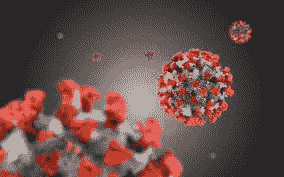
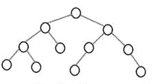
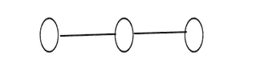
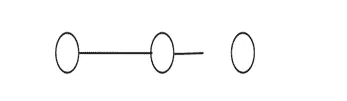

# DSA 在模拟和监测冠状病毒中的实际应用。

> 原文：<https://medium.datadriveninvestor.com/graphs-trees-in-real-world-df24ef23b358?source=collection_archive---------5----------------------->

我相信每一个初学计算机科学的学生都曾经想知道为什么我们要在图中寻找最短路径或者树有什么用，我们要用循环链表来玩约瑟夫环吗？

因此，本文以新冠肺炎为例，讨论了数据结构和算法在现实世界中的重要性。

目前爆发的冠状病毒-急性呼吸道疾病称为新冠肺炎已经导致了大流行。冠状病毒是一个大问题的主要原因是因为它的传播可以用树来模拟。

在世界采取封锁措施之前，估计表明每个感染者会感染两到四个人。

在传染病的研究中，这个数字被称为 R0(R-零)，这是一个表示传染病传染性的数学符号。例如，如果一种疾病的 R0 为 15，那么一个患有这种疾病的人将会把它传染给平均 15 个人。

 [## 公平算法|数据驱动的投资者

### 许多人都有算法偏见。软件工程师关心算法偏差，因为我们关心…

www.datadriveninvestor.com](https://www.datadriveninvestor.com/2020/02/22/algorithms-for-fairness/) 

根据疾病的 R0 值，疾病的传播或衰退有三种可能性:

*如果 R0 小于 1，则每个现有感染导致的新感染少于一个。在这种情况下，疾病最终会消亡。*

*如果 R0 等于 1，每一个现有的感染引起一个新的感染。这种疾病将保持存活和稳定，但不会爆发。*

*如果 R0 大于 1，则每个现有感染导致一个以上的新感染。疾病会传播，可能会爆发或流行。*

重要的是，疾病的 R0 值仅适用于人群中的每个人都完全容易感染该疾病的情况，例如在新冠肺炎，没有人接种疫苗，没有人以前患过该疾病，并且没有办法控制疾病的传播。

在我们的模型中，R0 是树中每个节点的平均子节点数。这意味着——我们树中的每个节点(平均)有两到四个孩子。

如果你对树木有任何深度的研究，你知道这将变得非常大，非常快。

全球卫生组织的早期目标是将 R0 降至 1 左右(或更低)。如果 R0= 1，那么我们树中的每个叶节点现在都成为一个链表的头。每个人都确切地感染了另外一个人，就像(单独的)链表引用了链表中的下一个节点一样。

如果 R0< 1，那么在某一点上，一个人不会感染其他人，并且感染线(对于那片叶子)被打破。我们可以在代码中建模，但是让节点指向一个空引用，这意味着它是链表中的最终节点。

“解决”冠状病毒情况的一种方法是改变病毒的行为，以便它可以通过一组(最终是有限的)链表而不是一棵树来建模。

我不是医学专家。我在这里只是想让你意识到，树、图和链表不仅在 FAANG 访谈中使用，而且在建模和解决现实世界的现象中也非常有用。