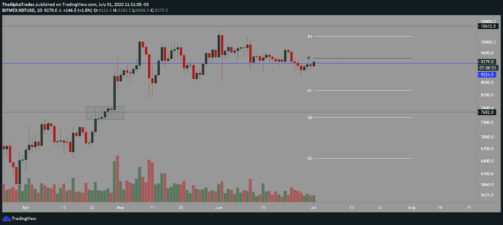
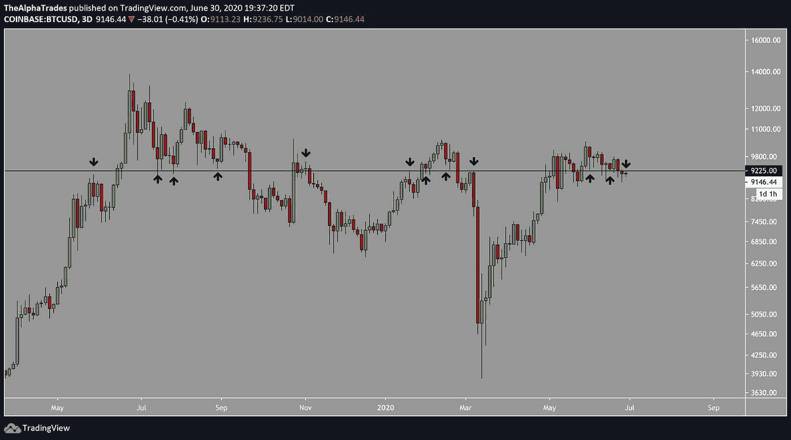
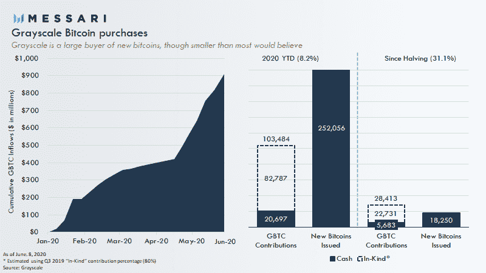

# 随着比特币进入新的季度，灰度刺激了交易者

> 原文：<https://medium.datadriveninvestor.com/grayscale-hypes-traders-as-bitcoin-enters-a-new-quarter-1602f12b2bb2?source=collection_archive---------16----------------------->

## 随着谣言的发酵，BTC 继续前进…板球，板球。

Me IRL reading the news; Image by memyselfaneye from Pixabay

## 四个要点:

1.  当我不耐烦地等待西联汇款的电报时，数字美元谈判再次困扰美国国会。伙计们，这里看不到用例(注意:检测到大量讽刺)。Paxos 首席执行官 Charles Cascarilla 的证词[同意](https://www.banking.senate.gov/imo/media/doc/Cascarilla%20Testimony%206-30-201.pdf)我尖刻的评论，指出银行转账结算延迟一周。
2.  在达斯·鲍威尔承诺出台更多刺激措施的背景下，标准普尔 500 指数继续上涨，V 型复苏给 BTC 空头留下了…宿怨。
3.  **PayPal** [**与神奇的互联网货币**](https://cointelegraph.com/news/paypal-dabbling-in-crypto-could-make-btc-a-mainstream-payment-option) 调情，但这样做是通过第三方来维护关系。
4.  **陷入争议**——USDT 的隐藏量继续增长，让许多人想知道，“是有人在等待密码市场的突破，还是主导的稳定币有一些未知的用例 Ryan Watkins 在推特上说:“USDT 最近超过了 100 亿美元。加密美元化继续前进。……”

这是新的一个月的开始，也是新的一个季度的开始。这是每周比特币分析视频的伴侣。咖啡因太多，读不下去？跳到文章底部看完整视频。否则，我会在这篇文章中加入相关的时间戳。

 [## 加密货币行业是死是活？数据驱动的投资者

### 九月初，我们在 X-Order 内部就代币市场的未来进行了一场辩论。有趣的是，我们的观点是…

www.datadriveninvestor.com](https://www.datadriveninvestor.com/2019/12/12/will-the-cryptocurrency-industry-be-dead-or-alive/) 

# 比特币的鹰眼图([时间戳:6:25](https://youtu.be/4IHGhauiWK0?t=385) )

如果你只是来看新闻的，你可以跳过这一部分。否则，就到了脑洞大开的时候了。

每当比特币的价格高于月开盘价或周开盘价时，它往往是看涨的。要了解更高时间段的开盘标志为何至关重要的历史原因，请查看 [**时间戳 7:15**](https://youtu.be/4IHGhauiWK0?t=437) 。

Trading BTC weekly and monthly open levels.

我们的分析师 Amol 已经做空比特币数周，但在 8863 点削减了 25%的头寸。这提供了一个缓冲，以防本月初的牛市最终阻止他的交易。

如果你是日内交易者，了解如何减仓是非常重要的。幸运的是，[有一个针对那个](https://www.udemy.com/course/trading-basics-cryptocurrency/)的课程。

# 旋转到七月([时间戳:16:14](https://youtu.be/4IHGhauiWK0?t=974) )

7 月份在 9400 点附近出现了一个新的支点，根据比特币基地 3 日图，这个支点与一个关键的支撑阻力区重合。坚持逐层交易，你就成功了。

New daily pivot on BTC; Source: Alpha Trades

Support and resistance levels in BTC; Source: Alpha Trades

# 意见

@GrayscaleInvest 对比特币有着无法满足的渴望，但这对资产的价格意味着什么呢？CryptoTwitter 敦促我们戴上锡纸帽。TL；dr:一条非常有耐心的鲸鱼可能正在利用格雷的锁定期膨胀的 GBTC 美元溢价和现货或期货市场之间的差异。这是一个不成熟的理论，所以我们需要帮助来思考这个理论。

Grayscale has only bought 31% of all new bitcoins mined since the halving

# 印度的年轻人热衷于这种秘密的东西。

印度 75%的年轻人在区块链相关的交易所和新兴银行交易或持有加密货币。这并不令人兴奋，除非你[明白什么是“新”银行](https://bfsi.eletsonline.com/neo-banks-to-be-pivotal-in-digital-india/#:~:text=Neo%2DBank%20is%20essentially%20100,burden%20of%20a%20physical%20network.)，但本质上它是一个 100%的数字银行，这意味着它没有分支机构。有点像香蕉树…更像灌木，但你明白了。

那么这个重要吗？或许，考虑到如今年轻人对零售交易的大肆宣传。是永久的吗？可能更多的是潮起潮落，因为炒作是周期性的，很多势头是新冠肺炎封锁的结果(想想:无聊、沮丧的年轻人用智能手机)。

# 和我们一起聊聊市场

*我们正在寻找客人，所以如果你想顺便聊聊市场和经济，我们邀请你到* [*加入不和*](https://bit.ly/AlphaTradesDiscord) *并给任何一位管理员发送消息。如果我们有一个爆炸在一起，我们也会在我们的分销渠道中突出你。*

# 想免费试用 Advantage 两天吗？

[订阅 Discord 服务器](https://bit.ly/2KJ1oor)学习技术分析以及如何投资获利。询问 2 天的高级会员试用！

# 放弃

Alpha Trades，LLC 提供的信息不用于制定任何财务决策，也不是购买、持有和/或销售特定产品、数字资产或 ICO 的请求或建议。

访问我们的完整服务条款:[https://bit.ly/3faVeeV](https://bit.ly/3faVeeV)

## 访问专家视图— [订阅 DDI 英特尔](https://datadriveninvestor.com/ddi-intel)