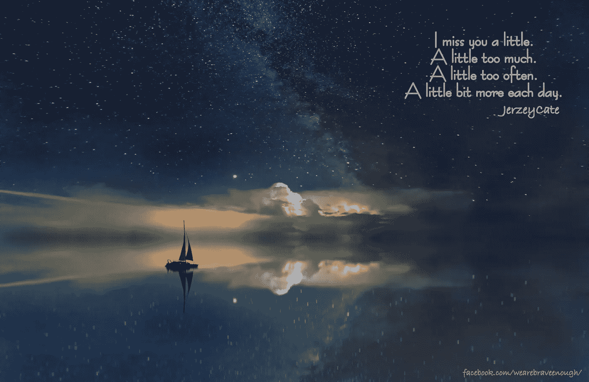

# 悲伤没有假期…

> 原文：<https://medium.datadriveninvestor.com/grief-takes-no-holiday-6d1376b60c3d?source=collection_archive---------15----------------------->

在我母亲去世后，我才开始理解真正的悲伤
我感受到了悲伤，深深的悲伤
这是一种完全不同的动物
悲伤可以有各种形式
有时它是轻微的
瞬间的
其他时候它感觉像要把你整个吞下去
把你吐出来
然后再把你吞下去

失去父母是不一样的
已经过去几年了，但我仍在努力寻找话语
我告诉你这个
* *这是无法理解的
* *这是无法形容的
* *这是无法逃避的
* *它不会消失

即使在久病之后安详地死去，这也是一种痛苦的分离
母亲的去世更像是一次截肢
据旅途中的朋友说，嚎叫声最终减弱为低沉的吼声，随后被大声的叹息所取代
他们承诺虽然更悲伤，永远改变了，但最终我会继续我的生活

这种程度的痛苦对门外汉来说是不可理解的
它改变了一切
醒来，有那么一瞬间，忘记了你心灵的一部分已经不在这里了……
然后记起
你是谁的一部分
你来自哪里的一部分
已经一去不复返
不会有新的记忆
你的机会很快就会到来
不可避免地，它会影响我们所有人

自从妈妈去世后，我开始对失去父母的痛苦有了更多的了解。今天我意识到我知道的是多么少。那天，我的一部分和她一起回家了。 顽固地拒绝治愈曾经席卷我的悲伤已经减轻了一点儿对我母亲的记忆变得模糊不清这些天，有时悲伤的消逝看起来就像它冲进我的前门时一样可怕

悲伤就像海洋中的波浪
有些日子平静安详
表面下温柔的隆隆声
其他日子无情
愤怒
决心要把你拖下水
决心要摧毁它前进道路上的任何东西

悲伤，对我来说，就像与暗流搏斗你的头冲破了波浪你喘着气逃脱了海洋的控制 T42 被打得喘不过气来身体颤抖战斗结束感激活着你擦去眼中的盐向岸边游去海浪从后面打你把你击倒把你拖下战斗重新开始

我在海洋中找到慰藉
闻它，听它，看它
我的肩膀从紧绷的位置滑落
当我的大脑关闭时，有一声叹息
我的灵魂得到了补充
我找到了平静
今天我在逆流中
祈祷我能逃离足够长的时间来喘口气

 [## 健身房 10 年的 10 条人生经验|数据驱动的投资者

### 走错一步，他们就会掉下去。两位登山者优雅地回到了地面。他们在那里…

www.datadriveninvestor.com](https://www.datadriveninvestor.com/2020/02/03/10-life-lessons-from-10-years-in-the-gym/) 

## 访问专家视图— [订阅 DDI 英特尔](https://datadriveninvestor.com/ddi-intel)