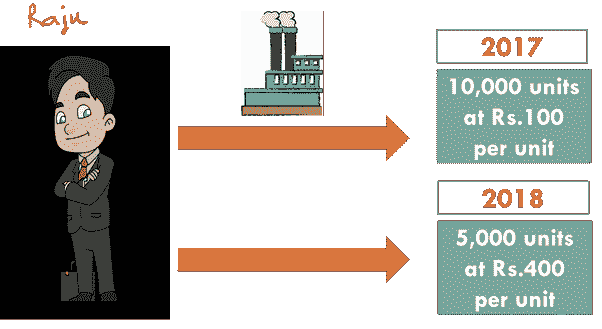

# 国内生产总值，为外行人解释

> 原文：<https://medium.datadriveninvestor.com/gross-domestic-product-gdp-explained-for-layman-bfc7eb1efb8c?source=collection_archive---------3----------------------->

## 初学者应该知道的一切。

Photo by [Robert Anasch](https://unsplash.com/@diesektion?utm_source=medium&utm_medium=referral) on [Unsplash](https://unsplash.com?utm_source=medium&utm_medium=referral)

你一定在商业频道或报纸上无数次听说过这个术语。

在这篇文章中，我真诚地试图让一个门外汉明白 GDP 到底代表什么。

你能回答这个吗？

一把椅子和一张桌子总共是多少？听起来很奇怪，对吧？

好的，你能回答这个问题吗？

Rs 的总数是多少？400(一把椅子的价值)卢比。1000(一个表的值)？

应该是 Rs。1400.这是一个简单的问题。

你看，当我让你添加两件商品(一把椅子和一张桌子)时，你没能做到。但是当我让你把数字加起来时，你做得很容易。

为了使事物具有可比性，我们需要一个共同的单位，因此我们必须将商品和服务转换成它们的货币价值。

这就是我们如何计算一个国家的总产量。

[*(Image credited to Business Today)*](https://www.google.com/search?q=gdp&sxsrf=ALeKk01pl763Elmnl8lOh37MG9CgG0ug_A:1593517436336&source=lnms&tbm=isch&sa=X&ved=2ahUKEwjVyfGFu6nqAhUCwzgGHRaMA-oQ_AUoA3oECBEQBQ&biw=1280&bih=561#imgrc=NupAsBmJnL7ybM)

国内生产总值是一年内在一个国家境内生产的所有成品和服务的货币价值。

**总值**意味着我们考虑的是不扣除折旧的货物数量。

所以我们有-毛=净+折旧。

*例子-* 我购买了一件价值卢比的家具。10，000 卢比，贬值了 1，000 卢比。因此，*净值*应为卢比。9000，而*总值*应为卢比。10,000.

**国内**用最简单的语言来说就是国内的意思。这必须与包括*来自国外的净要素收入*的国民收入相区别。国民收入仅包括正常居民的收入(无论其收入在何处)，而国内收入包括居民和非居民的收入(但在该国国内领土范围内)。

所以我们有-国民=国内+国外的净要素收益。

考虑到印度国内生产总值的计算，下面给出了一些例子。

*例 1-* 克里斯·盖尔在[印度超级联赛](https://en.wikipedia.org/wiki/Indian_Premier_League)期间获得的收入应计入国内收入(因为是在印度获得的)。然而，这不会包括在国民收入中，因为它不是由居民赚取的。

*例 2-* 塔塔汽车公司(一家印度公司)通过在中国销售汽车获得的收入将不包括在国内收入中(因为它不是在印度获得的)。然而，这将包括在国民收入中，因为它是由在印度注册的国内公司赚取的。

**乘积**表示*乘以*。

简单地说，我一年做了 100 把椅子，每把椅子的价格是卢比。400.因此，我对国家 GDP 的总贡献将是 100 和 400 的乘积，即 40，000 卢比。

**什么是实际 GDP 和名义 GDP？**

“Raju”是一家制造商，2017 年他制造了价值 10，000，000 卢比的商品。

在接下来的一年，2018 年，他制造了价值 20，000，000 卢比的商品。

现在，如果我们分析这些数字并进行比较，我们会初步得出结论:Raju 对国家 GDP 的贡献更大，他的贡献从 100 万卢比翻了一番，达到 200 万卢比。

*但是*，这里有一个陷阱。

我来告诉你 2017 年和 2018 年的细节。

(created by author using MS Powerpoint)

1.  2017 年，Raju 制造了 1 万台。每件的价格是卢比。100.因此，对国内生产总值的贡献为 100 万卢比。
2.  2018 年，Raju 制造了 5000 台。每件的价格是 400 卢比。因此，对 GDP 的贡献是 400 卢比。20 万卢比。

现在，通过比较 2017 年和 2018 年的数字，我们可以清楚地得出两点结论:

1.  **产量下降:**2018 年产量只有 2017 年产量的一半。
2.  **涨价:**从 2017 年到 2018 年，单位价格从 100 卢比到 400 卢比，翻了 4 倍。

因此，Raju 的表现从 2017 年到 2018 年有所改善的初步结论是错误的。

事实上，

1.  产量下降实际上不是增长的迹象，而是放缓的迹象。
2.  价格上涨是危险的，因为这是通货膨胀的迹象。

因此，总而言之，当我们比较两年的数字时，由于价格上涨，这些数字可能具有欺骗性。因此，在真正意义上，当我们保持价格不变时，我们将能够评论经济是否在增长。在这种情况下，影响 GDP 的唯一因素是商品生产和服务提供。

因此，我们有两个不同的概念:**实际 GDP** 和**名义 GDP** 。

1.  实际国内生产总值:在这里，价格保持不变。顾名思义，GDP 有助于我们理解经济是否真的在向前发展和增长。通常考虑一个基准年，每年的价格保持在基准年的水平。在前面讨论的例子中，实际 GDP 应为 50 万卢比(5000 单位乘以每单位 100 卢比)。也就是说，拉朱的贡献下降了。
2.  **名义 GDP:** 此处价格为当前市场价格。*‘名义上的’*GDP 顾名思义，就是名义上的 GDP 即仅仅为了它而计算。如前所述，它可能具有欺骗性。在讨论的例子中，名义 GDP 为 200 万卢比。